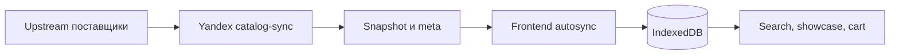

# Ограничения и не-цели

::: tip Статус: проверено по коду
Границы сверены с auth/session, App mode, cart, catalog sync, supplier paths и
операционными страницами. Неизвестные бизнес-требования не заменены догадками.
:::

## Как читать этот список

**Ограничение** — подтверждённое свойство текущей реализации. **Не-цель** —
возможность, которой production-код сейчас не предоставляет. Это не обещание
будущей реализации и не автоматическая оценка качества решения.

## Граница безопасности

### Client-only auth

Auth проверяет HMAC verifier в браузере, хранит локальную session и управляет
React workspace. Он не выдаёт server token и не ограничивает доступ к Yandex
API/Object Storage. Пользователь с контролем над браузером может обойти route
guards.

Следствия:

- verifier доступен в JS bundle и допускает offline-перебор;
- AES-GCM обёртка пароля от fingerprint уменьшает случайную утечку plaintext,
  но не является hardware-backed secret;
- logout удаляет auth-ключи из общего для origin localStorage и сбрасывает
  React workspace вызвавшей вкладки, но не отзывает серверную сессию; отдельной
  auth-синхронизации вкладок через storage/BroadcastChannel нет;
- XSS получает доступ к данным origin, включая localStorage.

Основное объяснение и threat boundary:
[Клиентская модель auth](/04-auth/client-auth-model).

### Не-цели auth

- OAuth/OIDC, JWT, refresh tokens;
- серверные роли, IAM и audit trail сотрудников;
- межустройственный или централизованный revoke;
- защита cloud endpoints силами frontend session.

## Local-first данные

### Каталог

Каталог хранится в IndexedDB отдельно для каждого `storeId`. После первого
успешного snapshot поиск работает без прямых запросов к поставщикам. До первого
успешного sync локальный каталог может быть пуст.

Ограничения:

- browser quota и пользовательская очистка site data могут удалить каталог;
- один и тот же origin разделяет storage между вкладками;
- версии сравниваются лексикографически и требуют единого формата
  `YYYY-MM-DDTHH:mm:ss+03:00`;
- browser wire validator не сверяет `snapshot.storeId` с workspace: корректный
  route обязан обеспечить cloud/API слой;
- snapshot применяется целой транзакцией; частичный frontend commit не
  допускается.

### Корзина

Корзина — envelope v3 в localStorage namespace `accountId + storeId`.
BroadcastChannel/storage events дают eventual consistency между вкладками.
Reconciliation обновляет или удаляет строки после нового snapshot.

Не-цели корзины:

- серверное резервное копирование;
- синхронизация между устройствами;
- checkout, оплата и создание заказа;
- бесконечный объём: действует quota localStorage;
- удаление корзины при обычном logout — наоборот, logout делает flush/detach.

## Cloud и поставщики

Production frontend не обращается к пяти upstream API при каждом поиске.
Cloud sync загружает и нормализует данные заранее. Пустой или упавший upstream
не считается доказательством отсутствия товаров: server pipeline сохраняет
materialized previous category через `keepPrevious`/предыдущий payload.

`src/services/suppliers/supplierOrchestrator.js` и browser request adapters
сохранены как **legacy/dev path**. Общие transformers остаются **active**,
потому что cloud catalog-sync переиспользует их.

Supplier proxy — отдельная cloud boundary с allowlist/SSRF-защитой. Основной
catalog-sync загружает upstream своим server path; наличие proxy не означает,
что production UI делает live supplier search.

## Deployment

- Frontend собирается Create React App и публикуется как GitHub Pages SPA.
- Router работает с basename; deep-link recovery зависит от Pages deployment
  helpers.
- Документация собирается отдельно VitePress и не входит в frontend bundle.
- Env со знаком `REACT_APP_*` попадает в клиентскую сборку и не подходит для
  секретов.
- Расписания cloud Timer и фактическая IAM/Object Storage policy задаются вне
  React-кода.

## UI и состояние

- Панели шин, дисков и корзины смонтированы одновременно внутри staff shell;
  `hidden`/`inert` переключают видимость, сохраняя локальное состояние.
- Client mode только скрывает служебное представление и не меняет auth-права.
- Тема имеет два значения (`light`/`dark`) и не подписывается на изменение
  system preference после mount.
- Demo недоступно: `isDemo = false`, `/demo` и JSON provider не реализованы.
- Disabled nav items и «Личный кабинет» — UI stubs, не активные функции.

## Не является обещанной целью

В репозитории нет подтверждённого плана или готового контракта для:

- полноценного интернет-магазина;
- server-side auth/cart;
- live browser aggregation поставщиков;
- demo route;
- датчиков, примерки, шиномонтажа, хранения шин;
- личного кабинета;
- автоматического offline-first install/PWA.

Их можно проектировать отдельно, но нельзя описывать как существующий
production flow без кода, тестов и решения о границах.

## Неизвестно

Из репозитория нельзя доказать:

- реальные production credentials, IAM policy и bucket ACL;
- SLA/retention snapshot и операционные договорённости с поставщиками;
- лимиты browser storage на устройствах магазина;
- полный список production магазинов и пользователей;
- целевую продуктовую roadmap для disabled элементов.

Эти сведения должны оставаться явно неизвестными до появления внешнего
источника истины.

## Связанные страницы

- [Продукт и пользователи](/00-overview/product-and-users)
- [Архитектурные границы](/02-architecture/architectural-boundaries)
- [Граница браузера и Yandex Cloud](/02-architecture/browser-yandex-boundary)
- [Client-only auth](/04-auth/client-auth-model)
- [Жизненный цикл каталога](/06-catalog-sync/catalog-lifecycle)
- [Домен корзины](/09-cart/cart-domain-and-storage)
- [ADR](/adr/)
