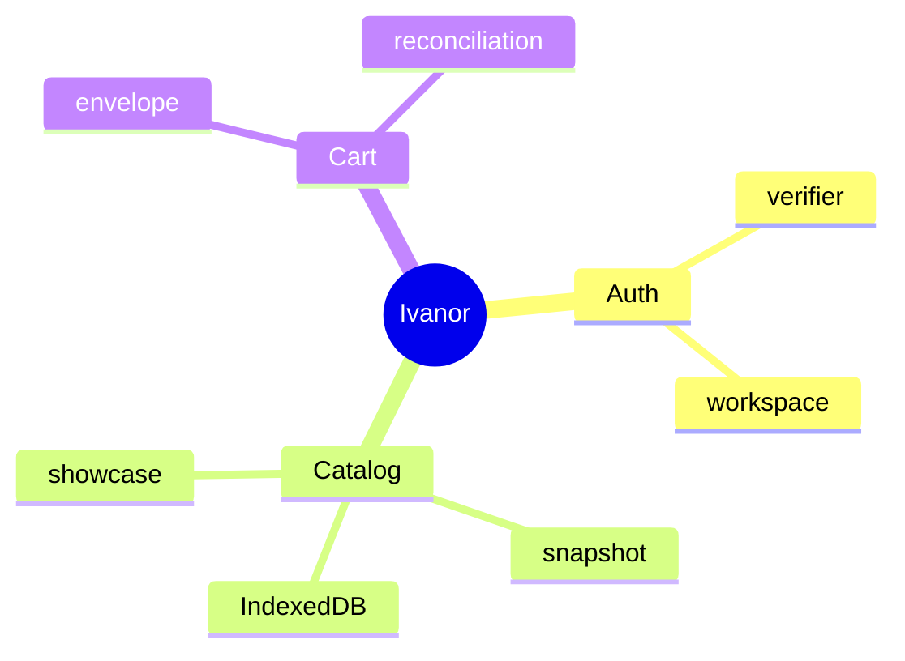

# Глоссарий

::: tip Статус: проверено по коду
Единые определения терминов Ivanor. Алфавитный порядок.
:::

## A

**accountId** — SHA-256 hex от normalized login; ключ namespace корзины и `STORE_MAP`. Файл: `src/auth/crypto.js`.

**ADR** — Architecture Decision Record; см. [adr/](/adr/).

**appLog** — структурированный console logger с кодами ошибок. Файл: `src/utils/appLog.js`.

**applyCatalogSnapshot** — атомарная запись wire-snapshot в IndexedDB. Frontend: `catalogSyncService` + `catalogIdbSession`.

**autosync** — фоновая проверка meta/snapshot без UI-кнопки. Host: `CatalogSyncHost`.

## C

**catalogDataVersion** — счётчик в AppShell; bump заставляет поиск/showcase перечитать IDB.

**client mode** — UI режим скрытия B2B цен; `AppShellContext.clientMode`.

**client-only auth** — проверка пароля HMAC в браузере без server session. [ADR-001](/adr/001-client-only-auth).

**CORS proxy** — Yandex `supplier-proxy` или dev `setupProxy.js`.

## D

**discs** — доменная категория дисков в IDB. URL маршрут: `/wheels`.

**dual-mount** — обе панели поиска смонтированы; неактивная `hidden`+`inert`. [ADR-006](/adr/006-dual-mount-catalog).

## E

**envelope v3** — формат корзины в localStorage с revision и items. Файл: `cartStorage.js`.

## F

**facet** — агрегированные options для Select фильтров из IDB cursor.

**fingerprint** — строка устройства для wrap/unwrap пароля.

## I

**IndexedDB `CatalogDatabase.<safeStoreId>`** — локальная БД каталога отдельного магазина; `safeStoreId = encodeURIComponent(resolveCatalogStoreId(storeId))`. Внутри stores `tires`, `discs`, `metadata`. [ADR-002](/adr/002-indexeddb-catalog).

**Ikon** — бренд с отдельной логикой promo/showcase.

## K

**keepPrevious** — команда snapshot: сохранить предыдущие items при fail/empty upstream.

## M

**meta.json** — cloud объект с version, slot, supplier status.

## R

**reconciliation** — сверка строк корзины с актуальным каталогом после snapshot.

**replace** — команда snapshot: полная замена category items поставщика.

## S

**showcase** — автовитрина до первого поиска; seeded shuffle per version.

**snapshot** — версионированный JSON каталога всех поставщиков в Object Storage. [ADR-003](/adr/003-snapshot-sync).

**storeId** — идентификатор магазина; изоляция IDB и cart namespace.

**supplier** — upstream источник (shinservice, semisotnov, …).

## V

**verifier** — HMAC digest списка пользователей в `REACT_APP_AUTH_VERIFIER`.

**version gate** — сравнение meta.version с local перед download snapshot.

## W

**wire schema** — JSON формат snapshot/meta между cloud и browser.

**workspace** — `{ login, accountId, storeId }` после входа.

**Web Locks** — координация writer autosync между вкладками.

## Карта терминов

## Связанные страницы

- [Обзор проекта](/00-overview/project-overview)
- [Ограничения](/00-overview/constraints-and-non-goals)
- [Справочник кода](/13-code-reference/)
