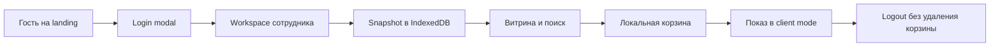

# Продукт и пользователи

::: tip Статус: проверено по коду
Роли и доступные действия сверены с landing, routes, site config, поиском,
корзиной и текущими planned/disabled элементами.
:::

## Что такое Ivanor

Ivanor — браузерное рабочее место для подбора шин и дисков в магазине.
Сотрудник входит, работает с локальной копией каталога выбранного магазина,
подбирает позиции и собирает корзину, которую можно показать клиенту без
служебных цен.

Приложение не является интернет-магазином полного цикла: в коде нет checkout,
онлайн-оплаты, серверного заказа или личного кабинета. Корзина остаётся
локальной подборкой в браузере.

## Пользователи

### Гость

Гость видит landing на `/`: единый каталог под магазин (поиск, WhiteLabel, доукомплектация, устройства), кнопку входа и **«Посмотреть демо»** (`/demo`). Первый слайд повторяет slide 1 колоды в `presentation/`: кадр главной в рамке монитора и тот же overlay-текст (`SITE_BRAND`, поставщики и цены в одном окне). Второй слайд повторяет slide 2 колоды: kicker «Меньше рутины», заголовок про один запрос, три пункта, примечание и кадр `slide-02-search-compare.png`. Третий слайд повторяет slide 3 колоды: монитор с кадром карточки диска (`slide-04-discs.png`), overlay WhiteLabel и callout со стрелкой на логотип магазина. Четвёртый слайд повторяет slide 4 колоды: kicker «Оптимальные решения», тот же заголовок и две пары карточек (проблема слева с красным бордером, решение справа с зелёным). Пятый слайд повторяет slide 5 колоды: kicker «С любого устройства», тот же заголовок и примечание про заказ с любого устройства и кадр `slide-05-devices.png`; сцена та же stacked-вёрстка, что у второго слайда. Шестой слайд повторяет CTA колоды: kicker «Проверка перед решением», заголовок «Проверьте каталог на реальном запросе вместе с командой», «Открыть демо» (`/demo`), карточки Telegram (`SITE_TELEGRAM`) и телефона (`SITE_PHONE.ctaDisplay`). Колонка лендинга совпадает с каталогом и шапкой (`min(100%, 1380px)` и те же inline-отступы); фон оболочки — `$color-surface`, как у шапки, и виден по бокам. Секции лендинга прокручиваются как слайды: колесо, жест и стрелки останавливают экран на следующей секции. При `prefers-reduced-motion` остаётся обычный скролл. На `/` шапка без категорийного nav (`SITE_NAV_ITEMS`) и без `SiteFooter`; бренд и телефон — продуктовые константы `src/config/site.js` (`SITE_BRAND`, `SITE_PHONE`). На `/demo*` те же константы, но nav и footer остаются. Имя и телефон магазина читаются из профиля `storeId` только в staff-оболочке каталога после входа. Защищённый staff URL перенаправляет гостя на query-modal `/?login=1`. На `/demo*` «Войти»/«Выйти» скрыты.

Client-only auth — UI gate, а не серверная security-граница. Подробности:
[Клиентская модель авторизации](/04-auth/client-auth-model).

### Сотрудник магазина

После успешного входа для login создаётся workspace:
`{ login, accountId, storeId }`. `SiteHeader` и `SiteFooter` на маршрутах каталога читают витринный профиль по `workspace.storeId` (`src/config/stores.js`): отображаемое имя и телефон магазина. Лендинг этот объект не получает. Сотруднику доступны:

- витрина и поиск шин на `/tyres`;
- витрина и поиск дисков на `/wheels`;
- локальная корзина на `/basket`;
- manager/client mode;
- автоматическое обновление каталога выбранного `storeId`.

### Клиент рядом с сотрудником

Клиент не имеет отдельного аккаунта или маршрута. Сотрудник включает client
mode на том же экране: UI скрывает служебные/B2B-данные, но состояние корзины и
catalog workspace не меняются. Это presentation mode, не новая роль
авторизации.

## Основной путь



1. `LandingPage` формирует безопасный login target с возвратом на `/tyres`.
2. `AuthProvider` проверяет локальный verifier и создаёт workspace.
3. `AppShellProvider` активирует IndexedDB namespace магазина.
4. `CatalogSyncHost` проверяет cloud meta/snapshot.
5. Поисковые компоненты читают только IndexedDB, а не upstream API.
6. `AddToCartControl` перед добавлением повторно читает актуальную запись.
7. Logout делает flush/detach и сохраняет persisted cart.

Детальная карта из пользовательских историй находится на странице
[Основные сценарии](/00-overview/user-scenarios).

## Откуда берутся данные

Production-путь каталога:

```text
upstream поставщиков
  → Yandex catalog-sync
  → snapshot/meta
  → frontend autosync
  → IndexedDB выбранного storeId
  → showcase/search/cart reconciliation
```

Браузер не опрашивает пять поставщиков при каждом поиске. Сохранённый
`supplierOrchestrator` относится к legacy/dev browser path и не подключён к
основному runtime UI.

## Что активно

| Возможность | Статус | Подтверждение |
| --- | --- | --- |
| Landing и query-modal входа | **Active** | `LandingPage`, `LoginPage`, `App.js` |
| Поиск шин и дисков | **Active** | SearchParameters + IndexedDB queries |
| Showcase до первого поиска | **Active** | `CatalogShowcase`, showcase domain |
| Local-first корзина | **Active** | `CartContext`, envelope v3 |
| Client/manager mode | **Active** | `ModeToggle`, `AppShellContext` |
| Cloud snapshot autosync | **Active при `REACT_APP_CATALOG_API_BASE` или fallback `REACT_APP_CORS_PROXY`** | `CatalogSyncHost` |
| Прямой browser load поставщиков | **Legacy/dev** | `supplierOrchestrator`, нет runtime caller |

## Что пока не является функцией продукта

| Элемент | Фактический статус |
| --- | --- |
| «Посмотреть демо» | **Active** — `/demo`, frozen snapshot, без live autosync |
| «Датчики давления» | Disabled nav item |
| «Примерка дисков», «Шиномонтаж», «Хранение шин» | Disabled nav items |
| «Личный кабинет» | Disabled footer action для вошедшего пользователя |
| Серверная корзина/заказ | Не реализованы |
| Роли и права сотрудников | Не реализованы client-only auth |

Слово **«Планируется»** здесь означает отсутствие active production-пути, а не
скрытую или недокументированную возможность.

## Состояние и хранение

| Данные | Владелец | Persistence |
| --- | --- | --- |
| Auth workspace | `AuthProvider` | локальная session в localStorage |
| Каталог магазина | `catalogIdbSession` | IndexedDB per `storeId` |
| Корзина | `CartProviderCore` | localStorage per account/store |
| Manager/client mode | `AppShellProvider` | localStorage |
| Фильтры и результаты | SearchParameters | React state до remount |
| Appearance | `Root` | localStorage + initial system preference |

## Ошибки, которые видит пользователь

- Неверный пароль остаётся в login modal.
- Ошибка поиска отображается рядом с результатами; stale async-ответ
  отбрасывается.
- Пустой каталог показывает empty state и не превращается в фальшивые товары.
- Ошибка фонового sync не блокирует работу с предыдущим успешным snapshot;
  подробности идут в `appLog`.
- Ошибка fresh read не добавляет stale товар в корзину.

## Неизвестно

Репозиторий не подтверждает реальные организационные роли пользователей,
политику выдачи учётных данных, полный mapping production `accountId → storeId`
и бизнес-процесс после формирования корзины. Документация не должна
домысливать эти сведения.

## Связанные страницы

- [Обзор проекта](/00-overview/project-overview)
- [Основные пользовательские сценарии](/00-overview/user-scenarios)
- [Ограничения и не-цели](/00-overview/constraints-and-non-goals)
- [Архитектурные границы](/02-architecture/architectural-boundaries)
- [Корзина и режим клиента](/10-ui/basket-and-client-mode)
