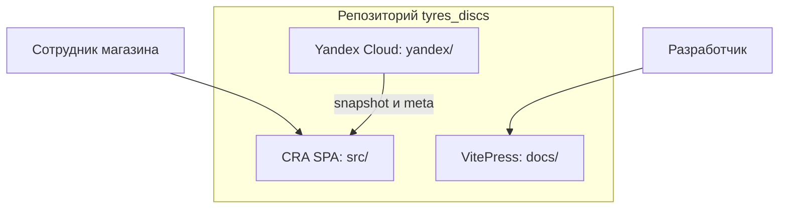

# Обзор проекта

::: tip Статус: проверено по коду
Страница описывает фактическую архитектуру на 24 августа 2026 года. Планы и legacy-код помечены отдельно.
:::

## Назначение

Эта страница даёт начинающему разработчику цельную картину Ivanor: что делает приложение, из каких частей состоит репозиторий и как данные доходят от поставщиков до экрана сотрудника магазина. Подробности отдельных подсистем живут на следующих страницах архитектурного ядра.

## Простыми словами

**Ivanor** — это веб-приложение для работы с каталогом шин и дисков. Сотрудник магазина входит в систему, ищет товары, смотрит витрину до первого поиска и собирает корзину для клиента.

Важная особенность: браузер **не опрашивает** API пяти поставщиков при каждом поиске. Облачная функция в Yandex Cloud заранее собирает прайсы, нормализует их и кладёт готовый **snapshot** (снимок каталога) в Object Storage. Браузер периодически проверяет версию этого снимка и, если она новее, скачивает snapshot и сохраняет товары в **IndexedDB** — локальную базу данных браузера.

Авторизация и корзина живут в браузере. Это **осознанное ограничение** текущей архитектуры, а не случайный пробел.

## Три контура репозитория

В одном репозитории живут три независимых «мира»:

| Контур | Где лежит | Зачем нужен |
| --- | --- | --- |
| Frontend SPA | `src/`, `public/` | Интерфейс на React и Ant Design; запускается через Create React App |
| Yandex Cloud | `yandex/` | Создание snapshot и CORS-прокси к поставщикам |
| Учебник | `docs/` | VitePress-документация; не входит в production-сборку приложения |

## Что видит пользователь

1. **Гость** открывает лендинг (`/`) и может вызвать модальное окно входа через `?login=1`.
2. После входа приложение переводит его на `/tyres` — поиск шин.
3. Диски открываются по маршруту `/wheels` (в доменной модели категория называется `discs`).
4. Корзина доступна на `/basket`.
5. Переключатель **режима клиента** скрывает B2B-цены и имена поставщиков, когда сотрудник показывает экран покупателю.

Подробная карта сценариев: [Карта основных пользовательских сценариев](/00-overview/user-scenarios).

## Как устроен поток каталога

Кратко — от поставщика до карточки товара:

1. Таймер Yandex Cloud вызывает функцию `catalog-sync`.
2. Функция последовательно загружает данные пяти поставщиков и пропускает их через **transformers** — функции преобразования «сырого» формата в единую модель товара.
3. Результат пишется в Object Storage как `snapshot.json` и `meta.json`.
4. Браузер через API Gateway читает meta, сравнивает версию и при необходимости скачивает snapshot.
5. Snapshot применяется одной транзакцией IndexedDB.
6. Поиск, showcase и сверка корзины читают уже локальные данные.

Полный разбор: [Главные потоки данных](/02-architecture/end-to-end-data-flow).

## Подсистемы на карте

Внутри frontend и cloud выделяются 13 подсистем. Их границы и ответственность описаны на странице [Архитектурные границы](/02-architecture/architectural-boundaries). Здесь достаточно запомнить главные:

| Подсистема | Роль одной фразой | Ключевые пути |
| --- | --- | --- |
| Auth | Client-only вход и workspace | `src/auth/` |
| AppShell | Режим UI, версии каталога, dual-mount | `src/app/` |
| Catalog Sync | Проверка и применение snapshot | `src/services/catalogSync/` |
| IndexedDB | Локальный каталог по `storeId` | `src/services/catalogIdb/` |
| Search / Showcase | Формы поиска и автовитрина | `src/components/*Search*`, `src/catalog/` |
| Cart | Корзина в localStorage + сверка | `src/cart/` |
| Cloud catalog-sync | Сборка snapshot | `yandex/catalog-sync/` |
| Supplier proxy | Прокси картинок и legacy-маршрутов | `yandex/supplier-proxy/` |

## Фактическое поведение

- Стек frontend: React 19, Ant Design 5, react-router-dom 6, Create React App 5.
- Production SPA публикуется на GitHub Pages (`npm run deploy`); документация собирается отдельно (`npm run docs:build`).
- Основной runtime каталога — cloud snapshot → IndexedDB, а не live-опрос поставщиков из UI.
- Авторизация — локальный gate в браузере; облачные endpoints каталога не проверяют пользовательскую сессию.
- `isDemo(pathname)` открывает `/demo*` без staff session; `/tyres` по-прежнему требует вход.

## Планируется и legacy

| Статус | Что | Где |
| --- | --- | --- |
| **Active** | Публичное демо `/demo*` + frozen snapshot | `DemoCatalogHost`, `public/demo/` |
| **Планируется** | Пункты навигации «Датчики», «Примерка» и др. | `src/config/site.js` (`disabled: true`) |
| **Legacy / unused** | `supplierOrchestrator.js` — frontend-оркестратор поставщиков | `src/services/suppliers/supplierOrchestrator.js` (не импортируется runtime UI) |
| **Упомянуто, кода нет** | `yandex/saas-api/` | встречается в README, директории в репозитории нет |

## Неизвестно

- Фактические production-значения `REACT_APP_*`, ID Cloud Functions и имя bucket в проде.
- Созданы ли Timer triggers в Yandex Cloud именно с cron из README/кода.
- Есть ли в Object Storage актуальный snapshot до первого успешного sync.

Эти сведения нельзя восстановить только из исходников без доступа к облачному кабинету и production env.

## Связанные страницы

- Далее: [Системный контекст](/02-architecture/system-context)
- [Карта пользовательских сценариев](/00-overview/user-scenarios)
- [Структура директорий](/02-architecture/repository-layout)
- [Продукт и пользователи](/00-overview/product-and-users) — заготовка с продуктовым акцентом
- [Глоссарий](/00-overview/glossary)
