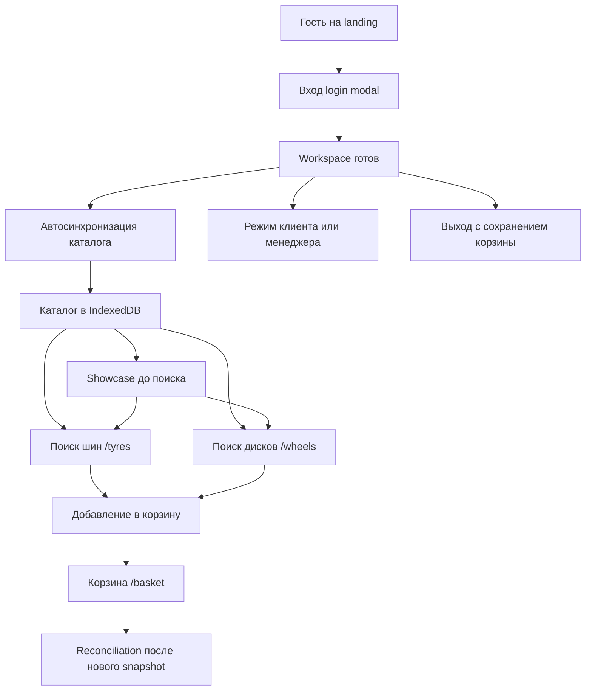

# Карта основных пользовательских сценариев

::: tip Статус: проверено по коду
Индекс сценариев построен по фактическим маршрутам и потокам runtime. Детальная реализация каждого шага раскрывается в модульных страницах.
:::

## Назначение

Дать начинающему разработчику **карту пользовательских историй**: что делает сотрудник магазина и какой код отвечает за каждый сюжет. Это вход в модульные разделы, а не повтор их алгоритмов.

## Простыми словами

Сценарий — это цепочка «действие человека → вызовы в коде → результат на экране». Ivanor удобно изучать именно сценариями: вход, синхронизация каталога, поиск, витрина, корзина, смена режима.

Ниже — общая карта и таблица из 28 сценариев со ссылками «куда читать дальше».

## Общая карта сценариев

## Сквозные учебные истории

Четыре длинные истории связывают архитектурное ядро с детальными разделами:

| История | Коротко | Архитектура | Детали |
| --- | --- | --- | --- |
| Вход и workspace | Гость → login → storeId | [Граница браузера/Cloud](/02-architecture/browser-yandex-boundary) | [Клиентская auth](/04-auth/client-auth-model), [session/workspace](/04-auth/session-crypto-workspace) |
| Поставщик → snapshot → IDB | Timer → snapshot → autosync | [Потоки данных](/02-architecture/end-to-end-data-flow) | [Yandex sync](/06-catalog-sync/yandex-catalog-sync), [frontend autosync](/06-catalog-sync/frontend-autosync) |
| Форма → запрос → showcase | Фильтры, поиск, витрина | [Frontend-слои](/02-architecture/frontend-layers) | [Поиск](/08-search-showcase/tire-and-disc-search), [showcase](/08-search-showcase/showcase-selection) |
| Каталог → корзина → reconciliation | Read-before-add и сверка | [Владение состоянием](/02-architecture/state-ownership) | [Корзина](/09-cart/cart-domain-and-storage), [reconciliation](/09-cart/catalog-reconciliation) |

## Таблица из 28 сценариев

| # | Сценарий | Что происходит | Куда смотреть в коде | Страницы |
| --- | --- | --- | --- | --- |
| 1 | Первый запуск гостем | Landing на `/`, без каталога | `LandingPage.jsx`, `HomeRoute` | [Маршруты](/03-routing-shell/routes-and-login-modal), [Продукт](/00-overview/product-and-users) |
| 2 | Защищённый URL и вход | `/tyres` → `/?login=1` → возврат | `RequireAuth`, `LoginPage`, `paths.js` | [Маршруты](/03-routing-shell/routes-and-login-modal), [Auth](/04-auth/client-auth-model) |
| 3 | Восстановление сессии | Reload поднимает session из localStorage | `session.restore`, `AuthContext` | [Session/crypto](/04-auth/session-crypto-workspace) |
| 4 | Смена workspace/store | Active IDB store и async generation меняются | `AppShellContext`, `catalogIdbSession` | [Владение состоянием](/02-architecture/state-ownership), [Lifecycle IDB](/05-catalog-storage/lifecycle-and-migration) |
| 5 | Выход с сохранением корзины | Flush/detach/invalidate/logout | `useLogout.js` | [Гонки и выход](/04-auth/races-and-logout) |
| 6 | Sync при старте | Проверка meta после готовности workspace | `CatalogSyncHost`, `checkAndSyncCatalog` | [Autosync](/06-catalog-sync/frontend-autosync) |
| 7 | Sync по расписанию / visibility / online | Дополнительные триггеры проверки версии | `CatalogSyncHost` | [Autosync](/06-catalog-sync/frontend-autosync) |
| 8 | Несколько вкладок sync | Один writer через Web Locks + notify | `catalogSyncLock`, `catalogSyncChannel` | [Locks и channels](/06-catalog-sync/locks-and-channels) |
| 9 | Поиск шин | Form → filters → IDB → карточки | `TiresSearchParameters`, `searchFormFilters` | [Поиск](/08-search-showcase/tire-and-disc-search) |
| 10 | Поиск дисков | Route `/wheels`, domain `discs` | `DiscsSearchParameters` | [Поиск](/08-search-showcase/tire-and-disc-search), [Dual-mount](/03-routing-shell/dual-mount-catalog) |
| 11 | Пустой результат / ошибка / stale | Сохранение предыдущего UI при гонке | race refs в SearchParameters | [Async race guards](/08-search-showcase/async-race-guards) |
| 12 | Showcase до поиска | Автовитрина по snapshot version | `getCatalogShowcase`, `CatalogShowcase` | [Showcase](/08-search-showcase/showcase-selection) |
| 13 | Добавление в корзину | Read-before-add из IDB | `AddToCartControl`, `CartContext` | [Корзина](/09-cart/cart-domain-and-storage), [UI каталога](/10-ui/catalog-components) |
| 14 | Количество и удаление | Commit envelope v3 | `BasketPage`, cart mutations | [Корзина](/09-cart/cart-domain-and-storage) |
| 15 | Корзина между вкладками | BroadcastChannel / storage ping | `cartSync.js` | [Миграция и вкладки](/09-cart/migration-and-multitab) |
| 16 | Миграция legacy-корзины | Старые отдельные ключи → тихий merge в envelope v3 или discard | `legacyCartMigration.js`, `CartContext.jsx` | [Миграция и вкладки](/09-cart/migration-and-multitab) |
| 17 | Reconciliation | После нового snapshot обновить строки | `CartReconciliationHost` | [Reconciliation](/09-cart/catalog-reconciliation) |
| 18 | Частичный сбой поставщика | `keepPrevious` вместо purge | `snapshotCommands.js` | [Snapshot protocol](/06-catalog-sync/snapshot-protocol-validation), [Cloud sync](/06-catalog-sync/yandex-catalog-sync) |
| 19 | Client/manager mode и тема | Скрыть B2B; переключить appearance | `ModeToggle`, `AppShell`, `appearance.js` | [Корзина и client mode](/10-ui/basket-and-client-mode), [Тема](/10-ui/theme-and-shell-components) |
| 20 | Диагностика по appLog | Безопасный код ошибки в консоли | `src/utils/appLog.js` | [Логи](/12-operations/logging-and-diagnostics) |
| 21 | Переключение темы | `ThemeSwitch` → Root → DOM, localStorage и Ant tokens | `ThemeSwitch`, `appearance.js`, `src/index.js` | [Тема и оболочка](/10-ui/theme-and-shell-components) |
| 22 | Поиск по названию в готовой выдаче | Input → debounce 600 ms → client-side filter массива | `PaginatedCardsList` | [Сквозной поиск](/08-search-showcase/end-to-end-flow), [UI каталога](/10-ui/catalog-components) |
| 23 | Изменение числа карточек на странице | Выбор 20/40/60/80/100 сохраняется между открытиями | `PaginatedCardsList`, `ivanor-catalog-items-per-page` | [UI каталога](/10-ui/catalog-components) |
| 24 | Bootstrap пустого IndexedDB | Пустой каталог заставляет скачать snapshot даже при равной meta version | `checkAndSyncCatalog`, `isCatalogEmpty` | [Autosync](/06-catalog-sync/frontend-autosync) |
| 25 | Закрытие login modal | Query удаляется, return path проходит open-redirect guard | `resolveLoginDismissPath`, `isSafeRelativePath`, `LoginPage` | [Маршруты](/03-routing-shell/routes-and-login-modal) |
| 26 | Quota/error при записи корзины | Runtime не меняется, пишется безопасный `storage.quota_exceeded`/`cart.persist_failed` | `CartContext`, `appLog` | [Домен корзины](/09-cart/cart-domain-and-storage), [Логи](/12-operations/logging-and-diagnostics) |
| 27 | Клик по бренду | Сбрасывает search-panel keys и ведёт staff на `/tyres`, гостя на `/`, демо на `/demo/tyres` | `AppShellContext.handleBrandClick`; callers `SiteHeader`, `SiteFooter` | [AppShell](/03-routing-shell/app-shell-state), [Тема и оболочка](/10-ui/theme-and-shell-components) |
| 28 | Публичное демо | `/demo` без пароля, frozen snapshot, шторка только с %, без live autosync | `DemoCatalogHost`, `demoWorkspace`, `appMode.isDemo` | [Маршруты](/03-routing-shell/routes-and-login-modal), [ADR-009](/adr/009-demo-url-frozen-snapshot) |

## Минимальный «счастливый путь» новичка

Если нужно провести приложение руками один раз:

1. Открыть приложение гостем → сценарий 1.
2. Войти → сценарии 2–3.
3. Дождаться sync (или понять, почему он не настроен в env) → сценарии 6–7.
4. Посмотреть showcase → сценарий 12.
5. Найти шины, добавить в корзину → сценарии 9 и 13.
6. Открыть `/basket`, переключить client mode → сценарии 14 и 19.
7. Выйти и убедиться, что корзина сохранилась → сценарий 5.

## Что ещё не сценарий продукта

| Наблюдение | Статус |
| --- | --- |
| Пункты nav «Датчики», «Примерка», … | `disabled: true` |
| Live-опрос пяти поставщиков из UI | Не основной runtime; orchestrator unused |

## Связь с архитектурным ядром

Читать сценарии удобно после:

1. [Обзор проекта](/00-overview/project-overview)
2. [Системный контекст](/02-architecture/system-context)
3. [Владение состоянием](/02-architecture/state-ownership)
4. [Главные потоки данных](/02-architecture/end-to-end-data-flow)

Затем возвращайтесь к этой карте как к оглавлению историй.

## Фактическое поведение

- Login — query-modal (`?login=1`), а не отдельный protected route `/login` (тот редиректит на modal).
- Диски в URL — `/wheels`, в данных — `discs`.
- Dual-mount сохраняет обе панели каталога в DOM.
- Корзина при logout сохраняется.

## Неизвестно

- Полный набор реальных storeId/account mapping в production env.
- Поведение конкретного пользователя при отсутствии snapshot в bucket до первого cloud sync.

## Связанные страницы

- Назад: [Граница браузера и Yandex Cloud](/02-architecture/browser-yandex-boundary)
- [Обзор проекта](/00-overview/project-overview)
- [Продукт и пользователи](/00-overview/product-and-users)
- [План документации](/documentation-plan) — исходный список сценариев в разделе 12
