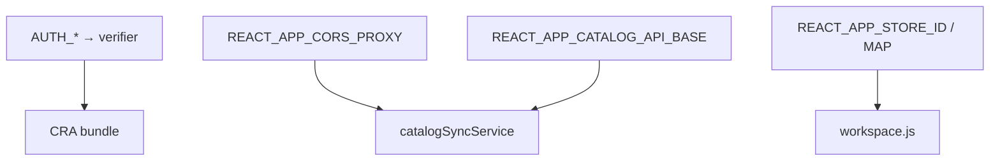

# Переменные окружения

::: tip Статус: проверено по коду
Имена переменных из `.env.example` и `yandex/catalog-sync/.env.example`. **Значения и секреты не приводятся.**
:::

## Где задавать

| Файл | Когда |
| --- | --- |
| `.env` | локальная разработка (копия из `.env.example`) |
| `.env.development.local` | генерируется prestart (verifier) |
| `.env.production.local` | генерируется prebuild (verifier) |
| Cloud Function env | Yandex Console для catalog-sync |

## Авторизация (build-time, **без** `REACT_APP_`)

| Переменная | Назначение |
| --- | --- |
| `AUTH_LOGIN` | Один пользователь (email) |
| `AUTH_PASSWORD` | Пароль для пары выше |
| `AUTH_USERS` | CSV `email:password,...` — приоритетнее пары |

Результат pre-hook: `REACT_APP_AUTH_VERIFIER` (HMAC-дайджесты, comma-separated).

::: danger
Не используйте префикс `REACT_APP_` для паролей — они попадут в клиентский bundle.
:::

## Frontend: gateway и catalog sync

| Переменная | Назначение |
| --- | --- |
| `REACT_APP_CORS_PROXY` | Origin API Gateway **без** `/v2` |
| `REACT_APP_CORS_PROXY_DEBUG` | `1` → `&debug=1` в proxy-запросах |
| `REACT_APP_CATALOG_API_BASE` | Отдельный base для catalog meta/snapshot; если пуст — fallback на `CORS_PROXY` |
| `REACT_APP_STORE_ID` | Default storeId для workspace |
| `REACT_APP_STORE_MAP` | JSON map accountId/login → storeId |

Без `REACT_APP_CATALOG_API_BASE` / `REACT_APP_CORS_PROXY` autosync **выключен** (`isCatalogSyncConfigured` → false).

Для локального сравнения с GitHub Pages (`npm run start:prod`) задайте те же имена `REACT_APP_*` (CORS/catalog/store), что вшиваете в Pages-сборку. Значения — только в локальных env-файлах, не в docs. См. [Dev vs production](/01-getting-started/dev-production-deploy).

## Frontend: URL поставщиков (legacy/dev path)

Используются supplier adapters и dev proxy, **не** production autosync:

| Переменная | Поставщик |
| --- | --- |
| `REACT_APP_SHINSERVICE_TYRES_URL` | Шинсервис шины |
| `REACT_APP_SHINSERVICE_DISCS_URL` | Шинсервис диски |
| `REACT_APP_SEMISOTNOV_TYRES_URL` | Semisotnov |
| `REACT_APP_SEMISOTNOV_DISCS_URL` | Semisotnov |
| `REACT_APP_4TOCHKI_TYRES_URL` | 4tochki |
| `REACT_APP_SHINASU_URL` | Shina.su |
| `REACT_APP_VERSHINA_TYRES_URL` | Vershina |
| `REACT_APP_VERSHINA_DISCS_URL` | Vershina |

Development: относительные `/api/...` → `src/setupProxy.js`.  
Production: полные https URL + `REACT_APP_CORS_PROXY`.

## Cloud Function catalog-sync

| Переменная | Назначение |
| --- | --- |
| `STORE_ID` | Идентификатор магазина |
| `CATALOG_BUCKET` | Object Storage bucket |
| `AWS_ACCESS_KEY_ID` | SA key для S3 API |
| `AWS_SECRET_ACCESS_KEY` | SA secret |
| `AWS_REGION` | `ru-central1` |
| `S3_ENDPOINT` | `https://storage.yandexcloud.net` |
| `SHINSERVICE_TYRES_URL`, … | Прямые upstream URL (без `/api`) |
| `UPSTREAM_TIMEOUT_MS` | Таймаут fetch (optional) |

## supplier-proxy (Cloud)

| Переменная | Назначение |
| --- | --- |
| `ALLOWED_HOSTS` | CSV или JSON allowlist |
| `UPSTREAM_TIMEOUT_MS` | Таймаут |
| `MAX_REDIRECTS` | Лимит редиректов |

## Диаграмма зависимостей

## Связанные страницы

- [Установка](/01-getting-started/install-and-scripts)
- [Dev vs production](/01-getting-started/dev-production-deploy)
- [Client auth](/04-auth/client-auth-model)
- [Frontend autosync](/06-catalog-sync/frontend-autosync)
