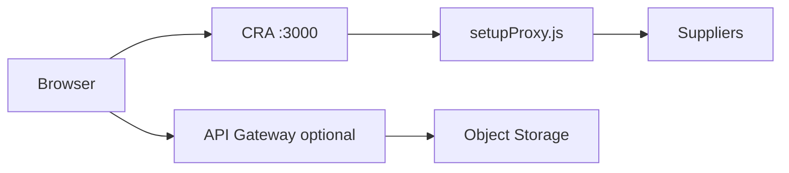

# Сборка, development и production

::: tip Статус: проверено по коду
Сравнение dev proxy, API Gateway и CRA build.
:::

## Development

| Аспект | Поведение |
| --- | --- |
| Сервер | `react-scripts start`, port 3000 |
| Basename | `/tyres_discs` (`PUBLIC_URL`) |
| Supplier fetch | `/api/*` → `setupProxy.js` → upstream |
| Catalog sync | Требует env gateway URL; читает `/v2/catalog/...` |
| Auth verifier | `.env.development.local` от prestart |



## Production build

```bash
npm run build
```

| Шаг | Результат |
| --- | --- |
| `prebuild` | verifier в `.env.production.local` |
| `build` | статика в `build/` |
| env at build time | `REACT_APP_*` вшиваются в JS |

Проверка локально:

```bash
npx serve -s build -l 3000
```

Открывайте с basename: `/tyres_discs`.

## Production runtime (GitHub Pages)

| Аспект | Поведение |
| --- | --- |
| Hosting | GitHub Pages, `homepage` URL |
| Supplier fetch | Полные URL + `REACT_APP_CORS_PROXY/v2?url=...` |
| Catalog | autosync через Gateway `/v2/catalog/{storeId}/meta|snapshot` |
| Backend auth | **нет** |

См. [GitHub Pages](/12-operations/github-pages) и [Yandex runbook](/12-operations/yandex-runbook).

## Deploy приложения

```bash
npm run deploy
```

Последовательность: `predeploy` (build + 404.html + .nojekyll) → `gh-pages -d build`.

## Deploy документации

Документация локальная; для CI/hosting:

```bash
npm run docs:build
# артефакт: docs/.vitepress/dist
```

## Yandex Cloud deployment

1. Object Storage bucket
2. Cloud Function `catalog-sync` + Timer triggers
3. API Gateway (`apigw.yaml`) — proxy + catalog routes
4. Env на функции и фронте (`REACT_APP_CORS_PROXY`)

Подробно: [Yandex runbook](/12-operations/yandex-runbook), [Cloud sync](/06-catalog-sync/yandex-catalog-sync).

## Связанные страницы

- [Конфигурация](/01-getting-started/configuration)
- [GitHub Pages](/12-operations/github-pages)
- [Supplier proxy](/07-suppliers/supplier-proxy)
- [Изменение catalog sync](/14-development/change-catalog-sync)
