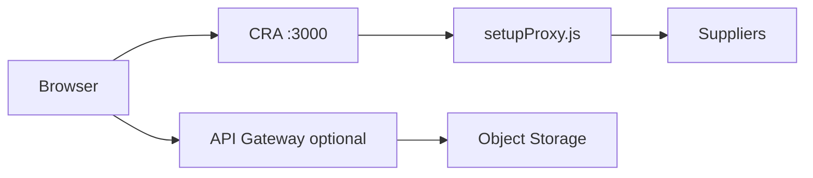

# Сборка, development и production

::: tip Статус: проверено по коду
Сравнение dev proxy, API Gateway и CRA build. Локальный production preview ≈ GitHub Pages по runtime.
:::

## Когда какой режим

| Цель | Команда | Что получаете |
| --- | --- | --- |
| Обычная разработка UI, hot reload | `npm start` | CRA dev: StrictMode, `setupProxy`, отдельный IndexedDB origin |
| Проверить поиск/sync «как на Pages» | `npm run start:prod` | Production-бандл + статика с basename из `homepage` (корень домена) |
| Уже есть `build/` — только раздать | `npm run preview:prod` | То же без повторной сборки |

`npm start` **не** обязан совпадать с github.io по **скорости** «Найти»: другой origin → другая IndexedDB, холодный hydrate, очередь за `applyCatalogSnapshot`. Кнопка одна; медленнее — окружение.

Вечный spinner на `npm start` при живом `preview:prod` — **не** «просто другая IDB». В development `React.StrictMode` прогоняет effects `setup → cleanup → setup`; поисковые панели обязаны в setup возвращать `mountedRef.current = true`. См. [гонки](/08-search-showcase/async-race-guards) и [troubleshooting](/14-development/troubleshooting).

Локальный preview **не** шарит IndexedDB с Pages (`localhost` ≠ `*.github.io`). После первого успешного catalog sync поиск ведёт себя как на Pages (тот же бандл и production-путь к Gateway).

## Development

| Аспект | Поведение |
| --- | --- |
| Сервер | `react-scripts start`, port 3000 |
| Basename | пустой / корень (`PUBLIC_URL` из `homepage`) |
| Supplier fetch | `/api/*` → `setupProxy.js` → upstream |
| Catalog sync | Требует env gateway URL; читает `/v2/catalog/...` |
| Auth verifier | `.env.development.local` от prestart |



## Production build

```bash
npm run build
```

| Шаг | Результат |
| --- | --- |
| `prebuild` | verifier в `.env.production.local` |
| `build` | статика в `build/` |
| env at build time | `REACT_APP_*` вшиваются в JS |

Задайте те же **имена** `REACT_APP_*` (CORS/catalog/store), что для Pages, в `.env` / `.env.production` / `.env.production.local` **до** `build`. Значения и секреты в docs не приводятся — см. [Конфигурация](/01-getting-started/configuration) и `.env.example`.

## Локальный production preview (Pages-like)

Один шаг (build + раздача):

```bash
npm run start:prod
```

Или по частям:

```bash
npm run build
npm run preview:prod
```

Откройте `http://127.0.0.1:5000/` (порт: `PORT` или аргумент скрипта, по умолчанию 5000). Скрипт сам открывает браузер; терминал нужно **оставить открытым**. На Windows лучше `127.0.0.1`, не `localhost` (`localhost` часто резолвится в `::1`). Basename берётся из pathname `homepage` в `package.json` (для `https://silverytyres.pro` — корень).

| Аспект | Поведение |
| --- | --- |
| Сервер | `scripts/serve-prod-preview.js` (Node http, без CRA) |
| Basename | как `homepage` / Pages (сейчас корень) |
| Supplier / catalog | Production: Gateway `/v2...`, **без** `setupProxy` |
| SPA deep links | fallback на `index.html` (роль Pages `404.html`) |

Для текущей apex-сборки подойдёт и `npx serve -s build`. Скрипт `preview:prod` всё равно предпочтителен: тот же basename, что у production, и SPA fallback как у Pages.

## Production runtime (GitHub Pages)

| Аспект | Поведение |
| --- | --- |
| Hosting | GitHub Pages, `homepage` URL |
| Supplier fetch | Полные URL + `REACT_APP_CORS_PROXY/v2?url=...` |
| Catalog | autosync через Gateway `/v2/catalog/{storeId}/meta|snapshot` |
| Backend auth | **нет** |

См. [GitHub Pages](/12-operations/github-pages) и [Yandex runbook](/12-operations/yandex-runbook).

## Deploy приложения

```bash
npm run deploy
```

Последовательность: `predeploy` (build + 404.html + .nojekyll) → `gh-pages -d build`.

## Deploy документации

Документация локальная; для CI/hosting:

```bash
npm run docs:build
# артефакт: docs/.vitepress/dist
```

## Yandex Cloud deployment

1. Object Storage bucket
2. Cloud Function `catalog-sync` + Timer triggers
3. API Gateway (`apigw.yaml`) — proxy + catalog routes
4. Env на функции и фронте (`REACT_APP_CORS_PROXY`)

Подробно: [Yandex runbook](/12-operations/yandex-runbook), [Cloud sync](/06-catalog-sync/yandex-catalog-sync).

## Связанные страницы

- [Конфигурация](/01-getting-started/configuration)
- [GitHub Pages](/12-operations/github-pages)
- [Supplier proxy](/07-suppliers/supplier-proxy)
- [Изменение catalog sync](/14-development/change-catalog-sync)
