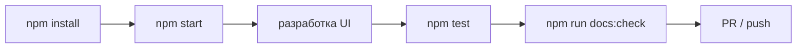

# Установка и команды

::: tip Статус: проверено по коду
Команды сверены с `package.json` и `scripts/generate-auth-verifier.js`.
:::

## Требования

- Node.js 18+ (рекомендуется LTS)
- npm (идёт с Node)
- Git

## Установка

```bash
git clone <repository-url>
cd tyres_discs
npm install
```

При первом `npm start` или `npm run build` сработает **pre-hook** генерации auth verifier.

## Запуск приложения (CRA — development)

```bash
npm start
```

| Шаг | Что происходит |
| --- | --- |
| `prestart` | `node scripts/generate-auth-verifier.js development` |
| `start` | dev-server на `http://localhost:3000` |

Basename приложения: `/tyres_discs` (из `homepage` в `package.json` → `PUBLIC_URL`).

Для UI и hot reload — `npm start` (включён `React.StrictMode`). Если «Найти» крутится без конца, а `preview:prod` ок — это не «нет каталога», см. [Troubleshooting](/14-development/troubleshooting). Чтобы локально гонять **тот же production-путь**, что на GitHub Pages (поиск после sync, без StrictMode/dev proxy), см. ниже и [Сборка и deploy](/01-getting-started/dev-production-deploy).

## Production preview (как GitHub Pages)

Перед сборкой задайте те же `REACT_APP_*` (CORS/catalog/store), что для Pages — без секретов в docs; см. [Конфигурация](/01-getting-started/configuration).

```bash
npm run start:prod
# или: npm run build && npm run preview:prod
```

Откройте `http://127.0.0.1:5000/tyres_discs/` (скрипт обычно открывает браузер сам). Терминал не закрывайте.

| Script | Что делает |
| --- | --- |
| `start:prod` | `build` + раздача `build/` с basename |
| `preview:prod` | только раздача уже собранного `build/` |

IndexedDB на `localhost` **не** общий с `github.io`. После первого sync поведение «Найти» совпадает с Pages по runtime-пути.

## Запуск документации (VitePress)

```bash
npm run docs:dev      # http://localhost:5173
npm run docs:build    # production build → docs/.vitepress/dist
npm run docs:gate     # проверка: код и docs/ менялись вместе
npm run docs:check    # gate + build (рекомендуется перед PR)
npm run docs:preview  # preview build → http://localhost:4173
```

Перед pull request выполняйте `npm run docs:check`. Если код менялся без документации, добавьте в описание PR строку `docs-not-needed: <причина>` или обновите соответствующие страницы в `docs/`.

Документация **не** публикуется вместе с GitHub Pages приложения.

## npm scripts

| Script | Назначение | Side effects |
| --- | --- | --- |
| `prestart` | HMAC verifier для development | пишет `.env.development.local` |
| `start` | CRA dev server | hot reload |
| `prebuild` | HMAC verifier для production | пишет `.env.production.local` |
| `build` | Production bundle → `build/` | |
| `preview:prod` | Статика `build/` на `:5000` с `/tyres_discs` | нужен готовый `build/` |
| `start:prod` | `build` + `preview:prod` | Pages-like локально |
| `test` | Jest watch mode | |
| `test:ci` | Jest single run (CI) | |
| `docs:dev` | VitePress dev | |
| `docs:build` | VitePress build + link check | |
| `docs:gate` | Проверка синхронизации кода и `docs/` | читает git diff |
| `docs:check` | `docs:gate` + `docs:build` | для PR и CI |
| `docs:preview` | Preview docs build | |
| `predeploy` | build + `404.html` + `.nojekyll` | |
| `deploy` | gh-pages publish `build/` | push to gh-pages branch |
| `eject` | CRA eject (не использовался) | необратимо |

## Pre-hook авторизации

`scripts/generate-auth-verifier.js` читает `AUTH_USERS` или `AUTH_LOGIN`/`AUTH_PASSWORD` и записывает **только** `REACT_APP_AUTH_VERIFIER` в `.env.*.local`. Пароли в bundle не попадают.

См. [Конфигурация](/01-getting-started/configuration) и [Client auth](/04-auth/client-auth-model).

## Типичный рабочий день



## Связанные страницы

- [Конфигурация](/01-getting-started/configuration)
- [Сборка и deploy](/01-getting-started/dev-production-deploy)
- [Тестирование](/11-testing/test-strategy)
- [Troubleshooting](/14-development/troubleshooting)
