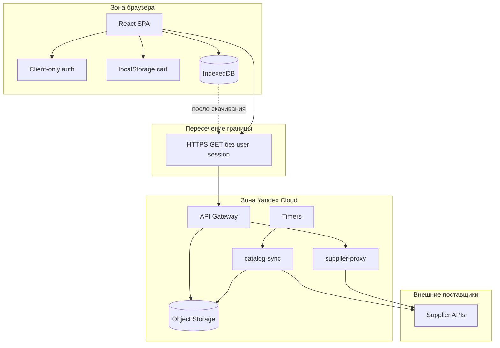

# Граница браузерного приложения и Yandex Cloud

::: tip Статус: проверено по коду
Страница фиксирует доверительную границу и контракты HTTP по коду/конфигам репозитория. Production-секреты и фактический статус облачных ресурсов помечены как неизвестные.
:::

## Назначение

Явно разделить, **что происходит только в браузере**, что — только в Yandex Cloud, и какие данные пересекают эту границу. Это критично для безопасности и для понимания, почему «логин в SPA» не защищает Object Storage.

## Простыми словами

Представьте два кабинета:

- **Кабинет браузера** — интерфейс, локальный вход, корзина, копия каталога.
- **Кабинет облака** — сбор прайсов по расписанию и выдача готовых файлов каталога.

Между кабинетами стоит **API Gateway**. Через него браузер забирает meta/snapshot и иногда проксирует картинки. Пользовательский пароль через эту дверь **не проходит**.

## Диаграмма границы

## Что остаётся в браузере

| Данные / поведение | Где | Пересекает cloud? |
| --- | --- | --- |
| Логин, HMAC-проверка, AES-GCM секрет | `src/auth/` + localStorage | Нет |
| Workspace mapping | `src/auth/workspace.js` + env build-time | Нет (только локальный выбор `storeId`) |
| Корзина envelope v3 | `src/cart/` + localStorage | Нет |
| UI guards маршрутов | `RequireAuth`, `BasketGuard` | Нет |
| Локальный каталог | IndexedDB | Да, но только как **копия** скачанного snapshot |
| Тема, client mode | localStorage | Нет |

## Что остаётся в Yandex Cloud

| Данные / поведение | Где | Видит браузер? |
| --- | --- | --- |
| Прямые URL и креды upstream поставщиков | env Cloud Function | Нет (не должны попадать в SPA) |
| Сборка snapshot / partial success | `runSync.js`, `snapshotCommands.js` | Только результат в snapshot/meta |
| Object Storage объекты | `stores/{storeId}/*.json` | Да, через публичные GET маршруты Gateway |
| Allowlist и SSRF-защита proxy | `supplier-proxy/index.js` | Косвенно, через ответы proxy |
| Timer triggers | конфигурация YC | Нет |

## HTTP-контракты на границе

| Запрос браузера | Куда | Auth пользователя |
| --- | --- | --- |
| `GET /v2/catalog/{storeId}/meta` | Gateway → Object Storage | Нет |
| `GET /v2/catalog/{storeId}/snapshot` | Gateway → Object Storage | Нет |
| `GET /v2?url=...&purpose=image\|price` | Gateway → supplier-proxy | Нет |
| `GET /v2/b2b\|z34\|vershina/...` | Gateway → HTTP upstream | Нет |
| `GET /v2/metrics/load?...` | Gateway → supplier-proxy | Нет |

База URL на frontend берётся из `REACT_APP_CATALOG_API_BASE` или `REACT_APP_CORS_PROXY` (`catalogSyncService.js`, `fetchSupplier.js`). Значения env в документацию не выносятся.

## Client-only auth: следствие для границы

**Фактическое поведение:**

- SPA может спрятать экраны от неавторизованного UI-состояния.
- Gateway/Object Storage в описанной конфигурации отдают каталог без проверки login/session.
- Значит, защита прайса на уровне «только сотрудник после входа» **не обеспечивается** облаком.

Это нужно помнить при любых заявлениях о безопасности. Для усиления границы потребовались бы серверная auth, подписанные URL или закрытый bucket policy — сейчас этого в коде нет.

## Dev vs production на границе

| Режим | Как браузер достигает поставщиков/каталога |
| --- | --- |
| Development (`npm start`) | `src/setupProxy.js` проксирует `/api/*` на upstream; catalog sync всё равно ожидает настроенный cloud/base URL |
| Production | Только Gateway `/v2...`; legacy маршруты без `/v2` закрыты 403 |

Не смешивайте эти схемы в голове: локальный `/api/shinservice` ≠ production `/v2?url=...`.

## Deploy-граница

| Артефакт | Как попадает в runtime | Автоматизация в репо |
| --- | --- | --- |
| SPA | `npm run deploy` → GitHub Pages | npm script, вручную |
| Docs | `npm run docs:build` | локально/по необходимости; не вместе с Pages приложения |
| supplier-proxy / Gateway | `yandex/supplier-proxy/deploy.ps1` | ручной PowerShell |
| catalog-sync | `yandex/catalog-sync/deploy.ps1` | ручной PowerShell |
| CI | `.github/workflows/test.yml` | только frontend tests |

Terraform/GitHub Actions deploy в Yandex Cloud в репозитории **отсутствуют**.

## Фактическое поведение

- CORS на Gateway в spec открыт широко (`origins: *` для описанных методов).
- supplier-proxy ограничивает хосты allowlist и проверяет redirects.
- catalog-sync ходит к поставщикам **напрямую** (без browser CORS), используя env CF.
- Frontend autosync выключен, если не сконфигурирован base URL (`isCatalogSyncConfigured`).

## Планируется / отсутствует

- Серверная пользовательская auth — **не цель** текущей архитектуры.
- `yandex/saas-api/` упомянут в README, исходников нет.
- Автоматический cloud deploy из CI — нет.

## Неизвестно

- Реальные ID функций, service account bindings и bucket name в проде.
- Включены ли Timer triggers и с каким cron.
- Используется ли отдельный `REACT_APP_CATALOG_API_BASE` или тот же host, что и CORS proxy.
- Применяются ли на практике fallback HTTP-маршруты `catalog-sync.handler` для чтения snapshot.

## Опасные места при изменении

1. Любая «защита маршрутом React» не закрывает Object Storage.
2. Расширение allowlist proxy без SSRF-проверок опасно.
3. Попадание upstream credentials в frontend env — нарушение границы.
4. Смена ключей `stores/{storeId}/...` ломает и Gateway, и sync, и браузер одновременно.

## Связанные страницы

- Назад: [Главные потоки данных](/02-architecture/end-to-end-data-flow)
- Далее: [Карта пользовательских сценариев](/00-overview/user-scenarios)
- [Системный контекст](/02-architecture/system-context)
- [Клиентская модель авторизации](/04-auth/client-auth-model)
- [Конфигурация](/01-getting-started/configuration)
- [Yandex runbook](/12-operations/yandex-runbook)
- [Ограничения и не-цели](/00-overview/constraints-and-non-goals)
