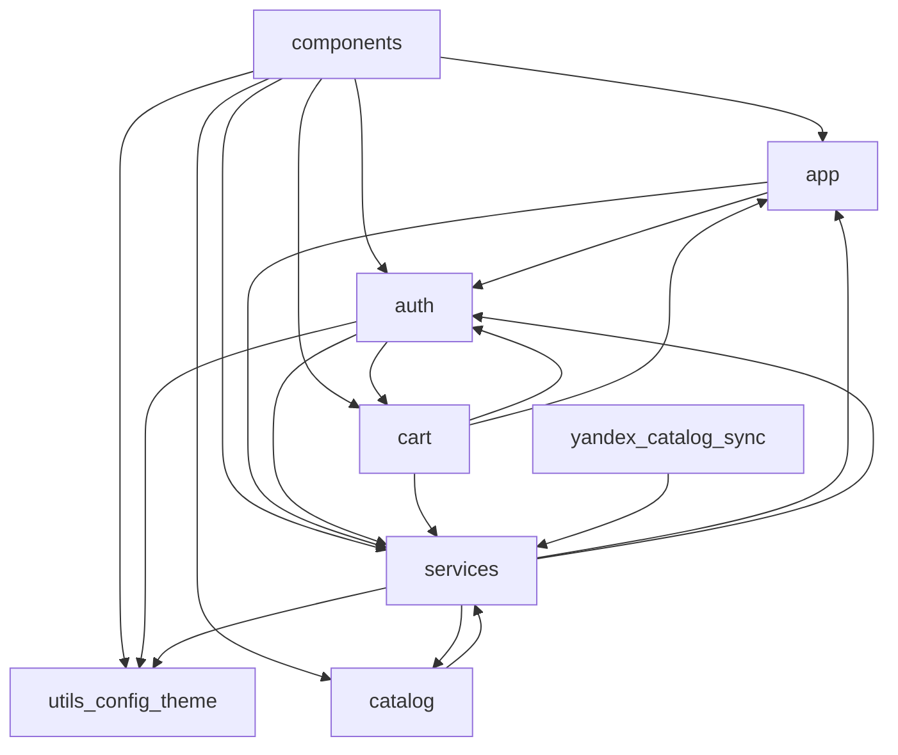

# Карта зависимостей

::: tip Статус: проверено по коду
Страница фиксирует фактическое направление импортов между верхнеуровневыми модулями и известные циклы. Это не желаемая целевая схема.
:::

## Назначение

Показать, **кто от кого зависит** на уровне директорий `src/` и `yandex/`. Цель — помочь понять безопасное место для нового кода и увидеть хрупкие связи до рефакторинга.

## Простыми словами

Зависимость «A → B» означает: файл из A импортирует символы из B. Если A зависит от B, то изменение B может сломать A.

Хорошая карта зависимостей похожа на односторонние стрелки сверху вниз. Цикл (A ↔ B) усложняет понимание и тестирование: нельзя объяснить один модуль без другого.

## Ожидаемое направление

```text
components → app | auth | cart | catalog | services | utils | config | theme
app        → auth | services
auth       → utils | (orchestration: cart, services при logout)
cart       → auth | services | utils
catalog    → services   # фактически, не идеально
services   → utils | catalog/core helpers | (hosts → app/auth)
yandex/catalog-sync → src/services/suppliers transformers
```

## Диаграмма направления зависимостей



Стрелки `CatalogMod ↔ Svc` и `Svc → AppMod/AuthMod` — реальные пограничные связи, а не «так задумано в учебнике».

## Таблица модуль → модуль

| From | To | Типичная причина |
| --- | --- | --- |
| `components/` | `app/`, `auth/`, `cart/` | Hooks Context и навигация |
| `components/` | `catalog/` | Mapping фильтров, showcase facade |
| `components/` | `services/` | Прямые вызовы IndexedDB |
| `app/` | `auth/` | Workspace и authentication flags |
| `app/` | `services/` | Active store IDB + catalog channel |
| `cart/` | `auth/` | Namespace корзины по account/store |
| `cart/` | `services/` | `readCartCatalogItems`, store namespace |
| `auth/` | `cart/`, `services/` | Logout: flush, detach, invalidate IDB |
| `catalog/showcase` | `services/` | Загрузка кандидатов из IDB |
| `services/catalogIdb` | `catalog/core` | Helpers для showcase candidates |
| `catalog/core` | `services/suppliers/shared` | `deriveModelFromTitle` |
| `yandex/catalog-sync` | `src/services/suppliers/*` | Общие transformers |

## Важные циклы и связности

### 1. `catalog` ↔ `services`

```text
getCatalogShowcase
  → indexedDBService / catalogIdbSession
    → catalogIdbQueries
      → catalog/core/mergePreferredShowcaseCandidates
        → resolveCatalogModel
          → services/suppliers/shared/deriveModel.js
```

**Зачем это возникло:** domain-логика витрины и persistence каталога тесно связаны.  
**Чем опасно:** трудно менять IDB API, не задевая showcase, и наоборот.

### 2. Host в `services` зависит от `app` и `auth`

`CatalogSyncHost.jsx` — React-компонент. Он читает workspace/shell и запускает sync. Формально это UI/orchestration, лежащий в infra-директории.

### 3. `auth` ↔ `cart` при logout

Не классический import-cycle на загрузке модулей во всех путях, но сильная оркестрационная связность: выход из аккаунта обязан корректно завершить корзину и сессию IDB.

### 4. Cloud → frontend transformers

`yandex/catalog-sync/src/suppliers/transforms.js` реэкспортирует функции из `src/services/suppliers/*/transformers.js`.

**Плюс:** один алгоритм нормализации.  
**Минус:** cloud-сборка чувствительна к путям frontend-дерева.

## Unused и legacy зависимости

| Модуль | Статус | Комментарий |
| --- | --- | --- |
| `src/services/suppliers/supplierOrchestrator.js` | Unused в runtime UI | Нет импортов из App/компонентов |
| Supplier `request.js` адаптеры | Active на server path; legacy на browser path | Server использует через `loadAll`; UI-оркестратор не подключён |
| Dev `setupProxy.js` | Active только в `npm start` | Не часть production dependency graph |

## Практическое правило для нового кода

1. UI-компонент может вызывать Context и domain; по возможности не разрастайте прямые вызовы IDB без нужды.
2. Domain (`catalog/`) не должен начинать зависеть от JSX-компонентов.
3. Services не должны импортировать страницы из `components/`.
4. Cloud может зависеть от transformers, но не от React Context.
5. Если нужен новый Host — осознанно решите, жить ему в `app/` или `services/`, и зафиксируйте это в PR/ADR.

## Фактическое поведение

- Доминирующее направление сверху вниз соблюдается для большинства UI → Context → services связей.
- Цикл `catalog ↔ services` и React-host в services — подтверждённые исключения.
- README про «пять поставщиков в браузере» **не** отражает текущий runtime dependency path.

## Неизвестно

- Будет ли цикл `catalog ↔ services` разорван отдельным рефакторингом.
- Появится ли явный слой `hooks/` или `application/` для orchestration hosts.

## Связанные страницы

- Назад: [Frontend-слои](/02-architecture/frontend-layers)
- Далее: [Владение состоянием](/02-architecture/state-ownership)
- [Архитектурные границы](/02-architecture/architectural-boundaries)
- [Transformers](/07-suppliers/transformers)
- [Yandex catalog-sync](/06-catalog-sync/yandex-catalog-sync)
