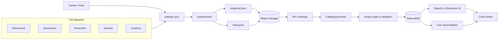
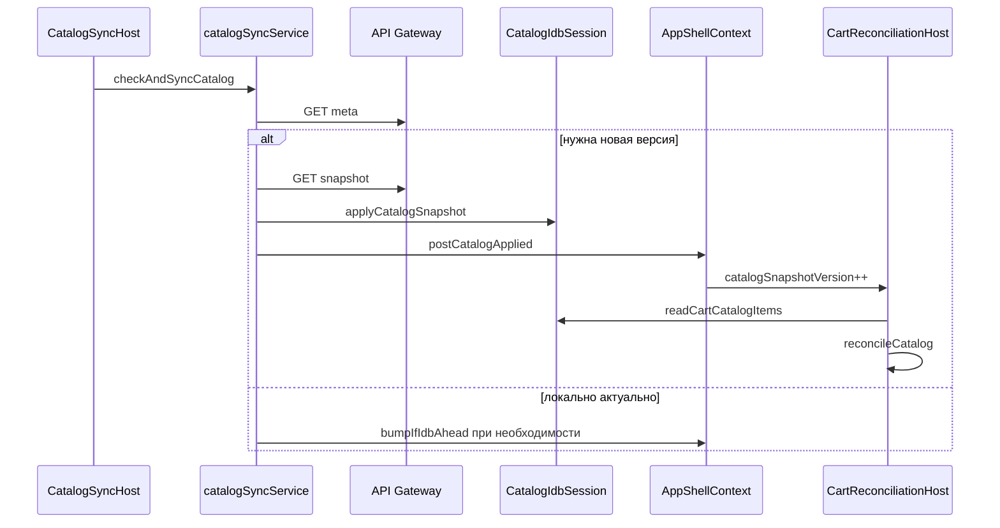

# Главные потоки данных

::: tip Статус: проверено по коду
Страница описывает канонические сквозные потоки. Детали autosync, snapshot-команд и поиска раскрываются в модульных разделах по ссылкам.
:::

## Назначение

Показать, **как данные движутся** от внешних поставщиков до UI и корзины, и кто вызывает кого на каждом шаге. Это карта потоков, а не дублирование всех алгоритмов подсистем.

## Простыми словами

Есть четыре главных «сюжета» данных:

1. **Каталог** собирается в облаке и поселяется в IndexedDB.
2. **Сессия** создаётся в браузере и открывает workspace.
3. **Поиск/витрина** читают локальный каталог и показывают карточки.
4. **Корзина** хранит выбранные позиции и сверяется с новым каталогом.

Понимание этих сюжетов важнее запоминания имён файлов.

## Диаграмма: путь каталога от поставщиков до UI

## Поток A. Сборка snapshot в облаке

### Кто кого вызывает

1. Timer (или ручной invoke) → `handler` (`yandex/catalog-sync/src/handler.js`).
2. `handler` → `runCatalogSync` (`runSync.js`).
3. `runCatalogSync` → `loadAllSuppliersData` (`suppliers/loadAll.js`) — порядок: shinservice → semisotnov → fourtochki → shinasu → vershina.
4. Для каждого поставщика: fetch raw → `transforms.js` → frontend transformers.
5. `buildSnapshotSuppliers` / `resolveCategoryCommand` (`snapshotCommands.js`) выбирают `replace` | `keepPrevious` | `purge`.
6. `storage.js` пишет `stores/{storeId}/snapshot.json` и `meta.json`.

### Зачем так

Поставщики отдают разные форматы (JSON, XML, Excel). Transformers приводят их к одной модели. Snapshot избавляет браузер от тяжёлых и хрупких прямых запросов.

### Важное ограничение

Пустой или упавший upstream **не** означает автоматический `purge`. Часто выбирается `keepPrevious`, чтобы не стереть витрину из-за временного сбоя.

## Поток B. Автосинхронизация в браузере

### Кто кого вызывает

1. `WorkspaceHosts` монтирует `CatalogSyncHost`, когда workspace готов.
2. Триггеры: старт, слоты расписания (+10 мин к серверным), `visibilitychange`, `online`.
3. `checkAndSyncCatalog` берёт exclusive lock (`withCatalogSyncLock`).
4. `GET /v2/catalog/{storeId}/meta` через `REACT_APP_CATALOG_API_BASE` или `REACT_APP_CORS_PROXY`.
5. Если версия новее или локально пусто → `GET .../snapshot`.
6. `validateAndNormalizeCatalogSnapshot` → `indexedDBService.applyCatalogSnapshot`.
7. `postCatalogApplied` → AppShell bump versions → UI refresh / reconciliation.

### Зачем version gate

Без сравнения версий браузер зря качал бы огромный snapshot. Gate экономит трафик и защищает от отката на более старую версию.

Подробности: [Автосинхронизация frontend](/06-catalog-sync/frontend-autosync), [Протокол snapshot](/06-catalog-sync/snapshot-protocol-validation).

## Поток C. Вход и workspace

1. UI (`LoginPage`) → `AuthContext.signIn`.
2. `session.login` проверяет HMAC verifier и сохраняет обёрнутый секрет.
3. `createWorkspace` вычисляет `accountId` и `storeId`.
4. AppShell ставит active IndexedDB store.
5. Cart читает envelope для пары account/store.
6. Запускаются CatalogSyncHost и CartReconciliationHost.

Без workspace нет изоляции каталога и корзины между магазинами/аккаунтами.

## Поток D. Поиск и showcase

### Поиск

1. Пользователь заполняет Ant Design Form в `TiresSearchParameters` / `DiscsSearchParameters`.
2. Values → `mapTireFormValuesToSearchFilters` / `mapDiscFormValuesToSearchFilters`.
3. `searchTires` / `searchDiscs` (через IDB session/queries).
4. Результат → local state → `PaginatedCardsList` → карточки.

Race guards (`requestId`, workspace key) отбрасывают устаревшие ответы, если пользователь быстро меняет фильтры или store.

### Showcase до первого поиска

Пока `searchResults === null`, показывается `CatalogShowcase` → `getCatalogShowcase` → candidates из IDB → scoring/builders → полки и чипы размеров.

## Поток E. Корзина и reconciliation

### Добавление

1. `AddToCartControl` читает актуальный товар из IDB (`readCartCatalogItems`) — **read-before-add**.
2. `CartContext.addItem` → commit envelope → publish cart sync.

### После нового snapshot

1. AppShell обновляет `catalogSnapshotVersion`.
2. `CartReconciliationHost` читает ссылки товаров корзины из IDB.
3. `reconcileCartItems` обновляет/помечает строки относительно нового каталога.

Зачем: цена, наличие и sellability могли измениться, пока позиция лежала в корзине.

## Sequence: sync → UI → cart

## Что не является основным потоком

| Путь | Статус | Комментарий |
| --- | --- | --- |
| `supplierOrchestrator` в браузере | Unused в runtime UI | Не документировать как текущий способ заполнения каталога |
| Dev `/api/*` через `setupProxy.js` | Только local `npm start` | Не путать с production `/v2` |
| Прямое чтение meta/snapshot через CF handler | Fallback в коде | Основной путь в `apigw.yaml` — Gateway → Object Storage |

## Фактическое поведение

- Серверные слоты sync: 08:00, 09:30, 12:00, 15:00 МСК.
- Браузерные проверки ориентированы на +10 минут к этим слотам, плюс start/visibility/online.
- Transformers общие для cloud и frontend code path.
- Route дисков — `/wheels`, domain category — `discs`.

## Неизвестно

- Есть ли в production уже записанный snapshot для конкретного `storeId`.
- Фактический base URL Gateway в пользовательском окружении (в репозитории есть примеры в verify-скриптах, но это не гарантия всех деплоев).

## Связанные страницы

- Назад: [Владение состоянием](/02-architecture/state-ownership)
- Далее: [Граница браузера и Yandex Cloud](/02-architecture/browser-yandex-boundary)
- [Системный контекст](/02-architecture/system-context)
- [Автосинхронизация frontend](/06-catalog-sync/frontend-autosync)
- [Поиск шин и дисков](/08-search-showcase/tire-and-disc-search)
- [Сверка с каталогом](/09-cart/catalog-reconciliation)
