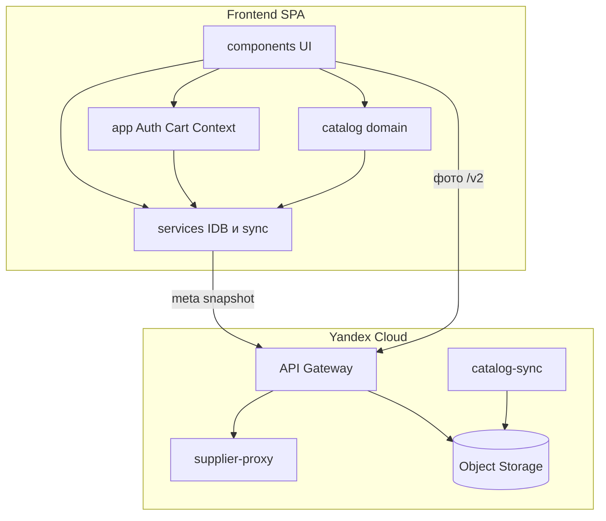

# Frontend-слои

::: tip Статус: проверено по коду
Страница описывает фактические слои SPA и порядок React-провайдеров. Чистая идеальная схема слоёв не подменяет код.
:::

## Назначение

Объяснить, как устроен frontend «слоями»: от точки входа и Context до UI, domain-логики и инфраструктурных сервисов. Отдельно показано дерево провайдеров — кто обязан быть снаружи или внутри кого.

## Простыми словами

Слой — это группа модулей с похожей ролью:

- **UI** рисует экраны и ловит клики;
- **Shell / Context** держит общее состояние сессии и режима;
- **Domain** считает витрину и превращает поля формы в фильтры;
- **Services** ходят в IndexedDB и скачивают snapshot;
- **Utils / Config** помогают всем остальным.

Если UI напрямую знает слишком много про хранилище — граница слоя размыта. В Ivanor такое местами есть; ниже это отмечено честно.

## Слои сверху вниз

| Слой | Что входит | Примеры путей |
| --- | --- | --- |
| Bootstrap | CRA entry, Ant Design, тема | `src/index.js`, `src/theme/appearance.js` |
| Routing & Shell | Router, guards, AppFrame, AppShell | `src/App.js`, `src/app/` |
| Auth Context | Вход, restore, workspace | `src/auth/` |
| Cart Context | Корзина и commit | `src/cart/` |
| UI pages / shared | Страницы и карточки | `src/components/` |
| Domain catalog | Showcase, search mapping, core helpers | `src/catalog/` |
| Services | IDB, sync, suppliers | `src/services/` |
| Utils / Config | fetch, logging, site config | `src/utils/`, `src/config/` |

## Дерево провайдеров

Порядок монтирования важен: внутренний провайдер может читать внешний, но не наоборот.

```text
src/index.js
└─ ConfigProvider + AntdApp
   └─ App (src/App.js)
      └─ BrowserRouter
         └─ AuthProvider
            └─ AppShellProvider
               └─ CartProvider
                  ├─ CatalogSyncHost
                  ├─ CartReconciliationHost
                  └─ AppRoutes / AppFrame
```

| Узел | Файл | Зачем на этом уровне |
| --- | --- | --- |
| `ConfigProvider` | `src/index.js` | Тема и локаль Ant Design до любого UI |
| `BrowserRouter` | `src/App.js` | Нужен `AppShellProvider` (location/navigate) |
| `AuthProvider` | `src/auth/AuthContext.jsx` | Workspace и `isReady` для shell/cart/hosts |
| `AppShellProvider` | `src/app/AppShellContext.jsx` | Режим UI и версии каталога |
| `CartProvider` | `src/cart/CartContext.jsx` | Корзина после появления auth workspace |
| `CatalogSyncHost` | `src/services/catalogSync/CatalogSyncHost.jsx` | Side-effect host, без собственного UI |
| `CartReconciliationHost` | `src/cart/CartReconciliationHost.jsx` | Сверка корзины после нового snapshot |

Подробный разбор порядка, зависимостей и lifecycle Context-дерева приведён на странице [Запуск frontend и дерево Provider](/02-architecture/frontend-provider-tree).

## Диаграмма: frontend и облачная часть



## Кто кого вызывает на типичном экране поиска

1. `AppFrame` рендерит `TiresSearchParameters` или `DiscsSearchParameters`.
2. Компонент читает `useAppShell()` (версии каталога) и `useAuth()` (workspace).
3. Form values проходят через `src/catalog/search/searchFormFilters.js`.
4. Запрос уходит в `indexedDBService` → `catalogIdbSession` / queries.
5. Результат остаётся в локальном state поискового компонента.
6. `AddToCartControl` читает актуальные товары из IDB и вызывает `useCart().addItem`.

## Где слой размыт

| Место | Что происходит | Почему важно |
| --- | --- | --- |
| SearchParameters → `indexedDBService` напрямую | UI ходит в persistence без промежуточного hook-слоя | Быстрее реализовать, сложнее тестировать изоляцию |
| `getCatalogShowcase` → IDB | Domain facade зависит от services | Domain не полностью «чистый» |
| `CatalogSyncHost` в `services/` | React host среди сервисов | Нарушает идею «services без UI» |
| `AppShellContext` подписывается на catalog channel | Shell знает про sync-события | Удобно для bump версий, связывает слои |

Это **текущее** состояние, а не целевая «идеальная» схема.

## Dual-mount как особенность shell-слоя

`AppFrame` держит панели шин и дисков смонтированными одновременно. Неактивная панель скрыта через `hidden` + `inert`, но не размонтируется. Это ускоряет переключение `/tyres` ↔ `/wheels` и требует race/catch-up логики в поисковых компонентах.

Детали: [Две панели каталога](/03-routing-shell/dual-mount-catalog).

## Фактическое поведение

- `AppShellProvider` обязан быть внутри `BrowserRouter`.
- Hosts синхронизации и reconciliation монтируются только при готовом workspace (`WorkspaceHosts` в `src/App.js`).
- UI блокируется `AppReady`, пока `auth.isReady` не станет true.
- `sessionStorage` в `src/` не используется.

## Планируется

- Demo mode в `appMode.js` / `App.js` — phase 3, сейчас `isDemo = false`.
- Отдельный промежуточный hooks-слой над IndexedDB для UI — в коде как стандарт не выделен.

## Связанные страницы

- Назад: [Структура директорий](/02-architecture/repository-layout)
- Далее: [Карта зависимостей](/02-architecture/dependency-map)
- [Дерево провайдеров](/02-architecture/frontend-provider-tree)
- [Владение состоянием](/02-architecture/state-ownership)
- [Состояние AppShell](/03-routing-shell/app-shell-state)
