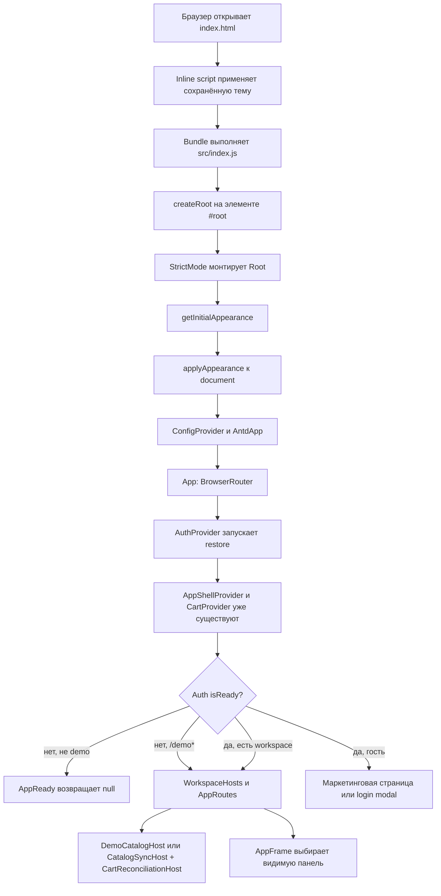
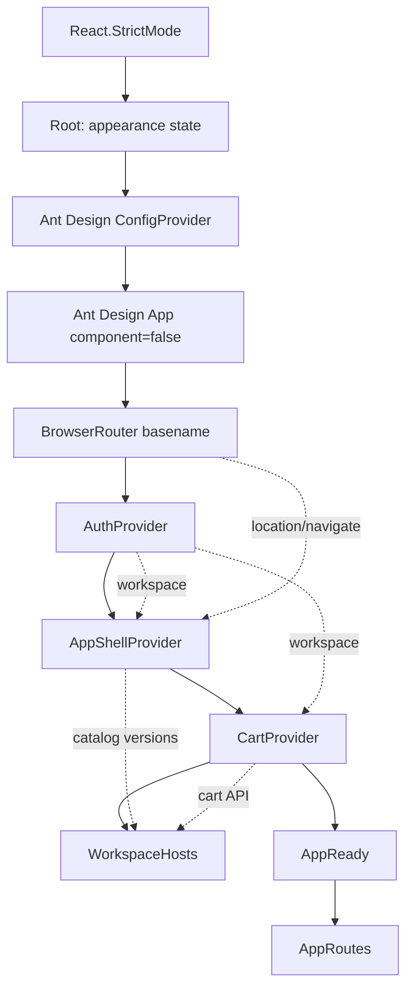
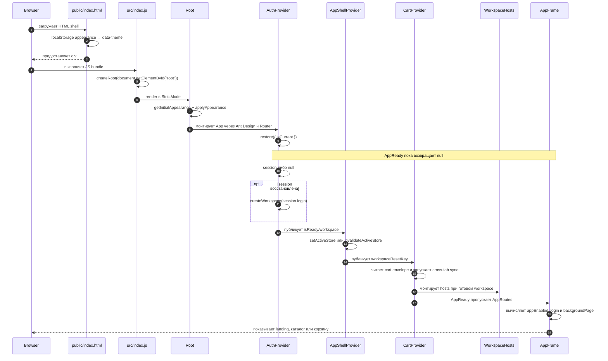

# Запуск frontend и дерево Provider

::: tip Статус: проверено по коду
Страница сверена с entry point, `App`, Context-провайдерами, host-компонентами и тестами. Frontend собирается **Create React App** (`react-scripts`); VitePress собирает только этот учебник.
:::

## Зачем нужен этот раздел

После открытия сайта браузер не «запускает `App.js`» напрямую. Он загружает HTML и bundle, bundle выполняет `src/index.js`, а уже тот создаёт React root. Затем несколько внешних Provider последовательно дают внутренним компонентам тему, Router, авторизацию, shell-состояние и корзину.

Порядок Provider является исполняемым контрактом: `AppShellProvider` вызывает Router hooks и `useAuth`, а `CartProvider` вызывает `useAuth`. Если переставить их выше источника зависимостей, приложение завершится ошибкой hook или потеряет нужный Context.

## Исходники

- [`public/index.html`](https://github.com/iscander-b10/tyres_discs/blob/main/public/index.html) — HTML shell, `#root` и ранняя установка сохранённой темы.
- [`src/index.js`](https://github.com/iscander-b10/tyres_discs/blob/main/src/index.js) — entry point, тема и внешние Ant Design Provider.
- [`src/App.js`](https://github.com/iscander-b10/tyres_discs/blob/main/src/App.js) — Router, доменные Provider, host-компоненты и маршруты.
- [`src/theme/appearance.js`](https://github.com/iscander-b10/tyres_discs/blob/main/src/theme/appearance.js) — чтение, применение и сохранение темы.
- [`src/auth/AuthContext.jsx`](https://github.com/iscander-b10/tyres_discs/blob/main/src/auth/AuthContext.jsx) — восстановление сессии и создание workspace.
- [`src/app/AppShellContext.jsx`](https://github.com/iscander-b10/tyres_discs/blob/main/src/app/AppShellContext.jsx) — режим интерфейса, версии каталога и навигационная память.
- [`src/cart/CartContext.jsx`](https://github.com/iscander-b10/tyres_discs/blob/main/src/cart/CartContext.jsx) — корзина текущих `accountId` и `storeId`.
- [`src/services/catalogSync/CatalogSyncHost.jsx`](https://github.com/iscander-b10/tyres_discs/blob/main/src/services/catalogSync/CatalogSyncHost.jsx) — фоновая синхронизация каталога.
- [`src/cart/CartReconciliationHost.jsx`](https://github.com/iscander-b10/tyres_discs/blob/main/src/cart/CartReconciliationHost.jsx) — сверка корзины с новой версией каталога.

## Flowchart запуска



## Provider-композиция



Порядок подключения:

1. `React.StrictMode` помогает обнаруживать небезопасные side effects в development. В частности, mount-effect может пройти цикл setup → cleanup → setup; эффекты обязаны корректно очищать listeners, timers и незавершённые операции. Поисковые панели в setup снова ставят `mountedRef.current = true` — иначе «Найти» на `npm start` не settle’ит, а production-бандл выглядит исправным.
2. `Root` владеет темой.
3. `ConfigProvider` передаёт русскую locale, theme tokens и CSS-класс tooltip компонентам Ant Design.
4. `AntdApp component={false}` создаёт контекст для notification/message/modal API без дополнительного DOM-контейнера.
5. `BrowserRouter` создаёт `location`, `navigate`, `Routes`, `Link` и `NavLink`.
6. `AuthProvider` восстанавливает сессию и публикует workspace.
7. `AppShellProvider` читает Router и Auth Context; переключает IndexedDB namespace и публикует shell API.
8. `CartProvider` читает Auth Context и загружает корзину workspace.
9. `WorkspaceHosts` монтирует невизуальные bridge только для готового workspace: staff — `CatalogSyncHost`, демо — `DemoCatalogHost`, плюс `CartReconciliationHost`.
10. `AppReady` не пропускает staff-маршруты до завершения `restore`; на `/demo*` не ждёт restore.

## Sequence diagram открытия страницы



## `Root`

**Путь:** [`src/index.js`](https://github.com/iscander-b10/tyres_discs/blob/main/src/index.js)  
**Сигнатура:** `function Root()`  
**Props:** нет.  
**Возвращает:** дерево `ConfigProvider → AntdApp → App`.

### Назначение и причина существования

`Root` держит тему выше `App`, чтобы Ant Design tokens и прикладной интерфейс обновлялись одной транзакцией. Router и доменные Context не должны владеть визуальной настройкой документа.

### Состояние и side effects

- `appearance`: начальное значение вычисляется лениво через `getInitialAppearance()`.
- В initializer сразу вызывается `applyAppearance(initial)`, чтобы CSS-атрибуты документа появились до первого отображения приложения.
- Effect повторно применяет тему после изменения `appearance`.
- `handleAppearanceChange(nextAppearance)` игнорирует повторное значение; иначе запускает `runAppearanceTransition`, применяет DOM-тему и синхронно фиксирует React state через `flushSync`.

### Кто вызывает и что вызывается внутри

`createRoot(...).render()` монтирует `Root`. Внутри вызываются appearance helpers, `getAntdTheme`, Ant Design Provider и `App`.

### Пошаговый алгоритм

1. До React inline IIFE из `public/index.html` читает только сохранённые `'dark'`/`'light'` и ставит `data-theme`. Это уменьшает вспышку неверной темы до загрузки bundle.
2. `Root` повторно определяет persisted appearance, а при его отсутствии учитывает `prefers-color-scheme`.
3. Применить CSS-тему к документу и записать нормализованное значение в storage.
4. Создать Ant Design config с `ru_RU`.
5. Передать `appearance` и callback в `App`.
6. При переключении темы не запускать работу, если значение не изменилось.
7. Для реального изменения синхронизировать DOM и React state внутри transition.

### Практический пример

Пользователь выбирает тёмную тему. `ThemeSwitch` вызывает `onAppearanceChange('dark')`; `Root` применяет атрибуты документа, обновляет Ant Design tokens и передаёт новое значение обратно в header.

### Связанные тесты и опасные изменения

Отдельного unit-теста `Root` нет. Контракт темы частично изолирован в helpers, но интеграция `flushSync`/View Transition тестом не закрыта. Нельзя переносить `ConfigProvider` внутрь отдельной страницы: порталы Ant Design и login modal должны получать ту же тему. Нельзя удалять проверку равенства без причины — повторный transition создаёт ненужную синхронную перерисовку.

## `App`

**Путь:** [`src/App.js`](https://github.com/iscander-b10/tyres_discs/blob/main/src/App.js)  
**Сигнатура:** `function App({ appearance = 'light', onAppearanceChange })`  
**Вход:** тема и callback из `Root`.  
**Возвращает:** Router и доменное дерево Provider.  
**Локальное состояние:** отсутствует.  
**Side effects:** непосредственно отсутствуют; их выполняют дочерние Provider и hosts.

`App` существует как composition root: здесь виден порядок инфраструктурных зависимостей. Его вызывает только `Root`. Внутри он создаёт `BrowserRouter`, `AuthProvider`, `AppShellProvider`, `CartProvider`, `WorkspaceHosts`, `AppReady` и `AppRoutes`.

Пример:

```jsx
<App appearance="dark" onAppearanceChange={setAppearance} />
```

Типичная ошибка — использовать `AppRoutes` без Router либо переставить `AppShellProvider` выше `BrowserRouter`/`AuthProvider`. `useLocation`, `useNavigate` или `useAuth` тогда не найдут Provider.

## `AuthProvider`

**Путь:** [`src/auth/AuthContext.jsx`](https://github.com/iscander-b10/tyres_discs/blob/main/src/auth/AuthContext.jsx)  
**Сигнатура:** `AuthProvider({ children })`  
**Публикует:** `{ isAuthenticated, workspace, login, isReady, isWorkspaceReady, signIn, logout }`.

### Механизм

1. Начинает с `isReady=false`, `workspace=null`.
2. Mount-effect увеличивает `generationRef` и вызывает `restore({ isCurrent })`.
3. Если session есть и generation ещё актуальна, создаёт workspace по login.
4. При ошибке пишет структурированный `auth.infra_failed`, очищает session и workspace.
5. В `finally` выставляет `isReady=true`, но только для актуального поколения.
6. `signIn(email, password)` создаёт новое поколение, вызывает session login, затем `createWorkspace`.
7. `logout()` инвалидирует незавершённые операции, очищает session и workspace.

Generation guard не даёт позднему `restore` перезаписать новый вход и не даёт завершившемуся после logout запросу вернуть пользователя в сессию.

**Тест:** [`src/auth/AuthContext.test.jsx`](https://github.com/iscander-b10/tyres_discs/blob/main/src/auth/AuthContext.test.jsx) проверяет поздний restore, logout во время sign-in и два параллельных sign-in.

**Опасное изменение:** нельзя коммитить workspace после `await` без `isCurrent()`. Это вновь откроет race между restore, входом и выходом.

## `AppShellProvider`

**Путь:** [`src/app/AppShellContext.jsx`](https://github.com/iscander-b10/tyres_discs/blob/main/src/app/AppShellContext.jsx)  
**Сигнатура:** `AppShellProvider({ children })`  
**Зависит от:** `useAuth`, `useLocation`, `useNavigate`, IndexedDB и catalog channel.  
**Возвращает:** `AppShellContext.Provider`.

Подробный контракт полей, effects и функций разобран на странице [Состояние AppShell](/03-routing-shell/app-shell-state). В дереве важно, что Provider обязан находиться внутри Router и Auth.

## `CartProvider`

**Путь:** [`src/cart/CartContext.jsx`](https://github.com/iscander-b10/tyres_discs/blob/main/src/cart/CartContext.jsx)  
**Сигнатура:** `CartProvider({ children })`  
**Вход из Auth:** `workspace`, `isWorkspaceReady`.  
**Публикует:** строки корзины, readiness, CRUD, totals, flush/detach и reconciliation.

При смене workspace `CartProviderCore`:

1. закрывает прежний sync;
2. очищает runtime;
3. строит namespace по `accountId` и `storeId`;
4. читает envelope из `localStorage`, а при повреждённом чтении берёт пустой;
5. запускает cross-tab sync;
6. принимает только более новый envelope для текущего generation;
7. на cleanup закрывает канал.

**Тест:** [`src/cart/CartContext.test.jsx`](https://github.com/iscander-b10/tyres_discs/blob/main/src/cart/CartContext.test.jsx) проверяет persistence, namespace, sync и операции корзины.

**Опасное изменение:** нельзя делать `CartProvider` независимым от workspace, иначе данные разных аккаунтов или магазинов смешаются.

## `WorkspaceHosts`

**Путь:** [`src/App.js`](https://github.com/iscander-b10/tyres_discs/blob/main/src/App.js)  
**Сигнатура:** `function WorkspaceHosts()`  
**Возвращает:** `null`, пока workspace не готов; иначе keyed fragment. На `/demo*` — `DemoCatalogHost` вместо `CatalogSyncHost`; `CartReconciliationHost` всегда рядом.

`workspaceKey = accountId:storeId` заставляет React полностью перемонтировать оба host при смене workspace. Это простой boundary очистки timers, abort controllers, listeners и stale refs.

Практический пример: после перехода со `store-a` на `store-b` старый host cleanup отменяет fetch/timer, а новый начинает работу только для нового store. Переход staff ↔ `/demo` меняет `workspaceKey` на `demo:demo` и монтирует `DemoCatalogHost`.

Тесты: [`src/services/catalogSync/CatalogSyncHost.test.jsx`](https://github.com/iscander-b10/tyres_discs/blob/main/src/services/catalogSync/CatalogSyncHost.test.jsx), [`src/services/demoCatalog/DemoCatalogHost.test.jsx`](https://github.com/iscander-b10/tyres_discs/blob/main/src/services/demoCatalog/DemoCatalogHost.test.jsx) и [`src/cart/CartReconciliationHost.test.jsx`](https://github.com/iscander-b10/tyres_discs/blob/main/src/cart/CartReconciliationHost.test.jsx).

## `AppReady`

**Сигнатура:** `function AppReady({ children })`  
**Вход:** React children, `isReady` из Auth и pathname.  
**Результат:** на `/demo*` рисует children сразу (demo-workspace не ждёт restore); иначе `null` до завершения restore, затем `children`.

Этот gate предотвращает ложный гостевой redirect: пока session восстанавливается, `isAuthenticated` временно false. Без gate открытие `/wheels` могло бы сначала отправить пользователя на login, а затем вернуть после restore.

Отдельного unit-теста gate нет; routing tests передают уже готовые auth fixtures. При изменении добавьте интеграционный тест «protected deep-link во время pending restore не редиректит».

## Где хранится состояние

| Состояние | Владелец | Persistence | Как доходит до детей |
| --- | --- | --- | --- |
| Тема | `Root` | appearance helper/localStorage/system preference | props → `App` → header; tokens через `ConfigProvider` |
| Auth readiness/workspace | `AuthProvider` | session helpers | `useAuth()` |
| Режим UI, версии, reset keys | `AppShellProvider` | часть в localStorage, часть только RAM | `useAppShell()` |
| Корзина | `CartProviderCore` | localStorage + cross-tab channel | `useCart()` |
| Текущий URL | `BrowserRouter` | address bar/history | Router hooks |
| Фильтры и результаты поиска | search components | только mounted component state | props и локальные hooks |

## Ошибки и крайние случаи запуска

- Нет `#root`: `createRoot(null)` завершится ошибкой. HTML-шаблон обязан содержать root.
- Запрещённый localStorage до React: inline script проглатывает исключение; окончательный выбор темы сделает `getInitialAppearance`.
- Сохранённой темы нет: inline script ничего не устанавливает, а `Root` выберет системную тёмную либо светлую тему.
- Повреждённая/недоступная тема или localStorage: appearance и shell helpers используют fallback.
- Ошибка restore: логируется, session очищается, приложение продолжает как guest.
- Pending restore: интерфейс маршрута временно не рисуется; специального spinner сейчас нет.
- Workspace отсутствует: sync hosts не монтируются, корзина не загружается, active IndexedDB store инвалидируется.
- Смена workspace: keyed hosts и reset keys не дают старым данным попасть в новую область.
- StrictMode development: эффекты могут запускаться повторно с cleanup между запусками; это не production double mount. Ref, который cleanup ставит в `false`, нужно вернуть в `true` в следующем setup (`mountedRef` поиска).
- Demo `/demo*` публикует workspace `demo` без restore; staff restore на `/` не блокирует демо-шторку.

## Checklist при изменении композиции

1. Компонент с Router hook остаётся внутри `BrowserRouter`.
2. Потребитель Auth остаётся внутри `AuthProvider`.
3. `AppReady` не переносится выше Auth и не удаляется без теста pending restore.
4. Workspace host сохраняет keyed remount.
5. Portal-компоненты остаются внутри Ant Design contexts.
6. Cleanup выдерживает StrictMode и смену workspace.
7. Запускаются routing, Auth, Cart и host tests.

## Связанные страницы

- [Маршруты и окно входа](/03-routing-shell/routes-and-login-modal)
- [Состояние AppShell](/03-routing-shell/app-shell-state)
- [Две смонтированные панели каталога](/03-routing-shell/dual-mount-catalog)
- [Владение состоянием](/02-architecture/state-ownership)
- [Клиентская модель авторизации](/04-auth/client-auth-model)
- [Домен и хранение корзины](/09-cart/cart-domain-and-storage)
- [Frontend-автосинхронизация](/06-catalog-sync/frontend-autosync)
