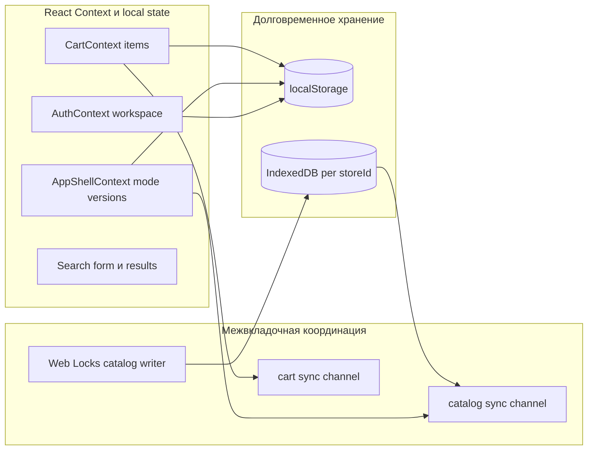

# Владение состоянием

::: tip Статус: проверено по коду
Таблица владельцев сверена с Context, IndexedDB, localStorage и cross-tab каналами. Страница описывает систему целиком; детали полей AppShell — на модульной странице.
:::

## Назначение

Ответить на вопрос новичка: **«Где живут данные и кто имеет право их менять?»** Без этого легко править UI, не понимая, почему соседняя вкладка или новый snapshot перезаписывает результат.

## Простыми словами

**Владелец состояния** — модуль, который:

1. хранит значение;
2. знает правила его изменения;
3. сообщает остальным, что значение обновилось.

В Ivanor состояние размазано по нескольким местам осознанно:

- React Context — для «живого» UI-состояния сессии;
- IndexedDB — для большого каталога;
- localStorage — для корзины, темы и зеркал версий;
- BroadcastChannel / Web Locks — для координации вкладок.

## Диаграмма основных владельцев

## Сводная таблица владельцев

| Область данных | Владелец | Где хранится | Кто меняет |
| --- | --- | --- | --- |
| Тема оформления | `Root` в `src/index.js` | React state + `ivanor-appearance` | ThemeSwitch / appearance helpers |
| Auth session | `AuthProvider` | Context + `auth.login.v1` / `auth.secret.v1` | `signIn`, `restore`, `logout` |
| Workspace (`accountId`, `storeId`) | `createWorkspace` + AuthContext | В session/workspace объектах после входа | Login/restore |
| Режим клиента/менеджера | `AppShellProvider` | Context + `ivanor-client-mode` | ModeToggle; для гостя forced client |
| Версии каталога для UI | `AppShellProvider` | `catalogDataVersion`, `catalogSnapshotVersion` | Sync apply, cross-tab notify, manual bump |
| Навигационная память shell | `AppShellProvider` | `lastCatalogPath`, reset keys | Router effects, continueSelection |
| Корзина | `CartProviderCore` | Context + `cart.staff.v3.{accountId}.{storeId}` | add/update/remove/clear/reconcile |
| Каталог товаров | `CatalogIdbSession` | IndexedDB `CatalogDatabase.<encodeURIComponent(storeId)>` | `applyCatalogSnapshot`, queries read-only для UI |
| Cloud mirror версии | `catalogSyncService` | `ivanor.catalog.cloudVersion.{storeId}` | После успешного sync |
| Формы и результаты поиска | SearchParameters | Component local state | Пользователь + async loaders |
| Showcase UI status | `CatalogShowcase` | Local state; cache в module `getCatalogShowcase` | Effects по version keys |
| Выбор строк на BasketPage | `BasketPage` | Local `Set` — **не** persists | Пользователь |

## Важные термины владения

| Термин | Значение |
| --- | --- |
| **workspace** | Контекст работы после входа: login + `accountId` + `storeId` |
| **accountId** | Идентификатор аккаунта (производный от login); участвует в ключе корзины |
| **storeId** | Идентификатор магазина/витрины; ключ изоляции IndexedDB |
| **catalogSnapshotVersion** | Версия применённого snapshot, важная для reconciliation и showcase seed |
| **catalogDataVersion** | Счётчик «данные каталога изменились» для перерисовки поиска/витрины |
| **envelope v3** | Формат сохранённой корзины в localStorage |

Не путайте:

- **облачную версию** из `meta.json` Object Storage;
- **локально применённую** версию в metadata IndexedDB;
- **UI-счётчики** версий в AppShell.

Это связанные, но разные роли.

## Кто уведомляет кого

### Каталог обновился

1. `checkAndSyncCatalog` применяет snapshot в IDB.
2. `postCatalogApplied` шлёт событие через `catalogSyncChannel`.
3. `AppShellProvider` увеличивает версии.
4. Search/Showcase перечитывают данные.
5. `CartReconciliationHost` сверяет строки корзины.

### Корзина изменилась в другой вкладке

1. `CartContext` пишет envelope в localStorage.
2. `cartSync` публикует событие в BroadcastChannel (или storage fallback).
3. Другие вкладки подтягивают envelope и обновляют Context.

### Выход из аккаунта

`useLogout` координирует несколько владельцев: flush корзины → detach sync → invalidate active IDB store → logout session → navigate home.

## Что не является владельцем

- **Cloud Function** не владеет браузерным состоянием: она только публикует snapshot/meta.
- **API Gateway** не хранит сессию пользователя.
- **Поисковый компонент** не владеет каталогом целиком: он владеет только своим UI-состоянием запроса.
- **`indexedDBService.js` facade** не отдельный store: это точка доступа к `CatalogIdbSession`.

## Фактическое поведение

- `sessionStorage` не используется в `src/`.
- Guest всегда видит `effectiveClientMode = true`.
- Корзина при logout сохраняется (политика подтверждена тестами `useLogout.cartPolicy`).
- Active IndexedDB store переключается вместе с `workspace.storeId`.

## Фактическое поведение (демо)

На `/demo*` владелец workspace — синтетический `DEMO_WORKSPACE` (`storeId=demo`). Каталог пишет `DemoCatalogHost` в IndexedDB `CatalogDatabase.demo`; корзина — envelope `cart.staff.v3.demo.demo`. Staff session на том же origin не читает и не пишет эти namespaces. Live `CatalogSyncHost` на demo-path не монтируется.

## Известные ограничения

- Client-only session в localStorage уязвима к XSS на том же origin.
- Multi-tab sync корзины и каталога опирается на BroadcastChannel с fallback; экзотические браузерные режимы могут деградировать.
- Выбранные строки на странице корзины теряются при перезагрузке — это local UI state.

## Связанные страницы

- Назад: [Карта зависимостей](/02-architecture/dependency-map)
- Далее: [Главные потоки данных](/02-architecture/end-to-end-data-flow)
- [Дерево провайдеров](/02-architecture/frontend-provider-tree)
- [Состояние AppShell](/03-routing-shell/app-shell-state)
- [Домен и хранение корзины](/09-cart/cart-domain-and-storage)
- [Схема IndexedDB](/05-catalog-storage/indexeddb-schema)
