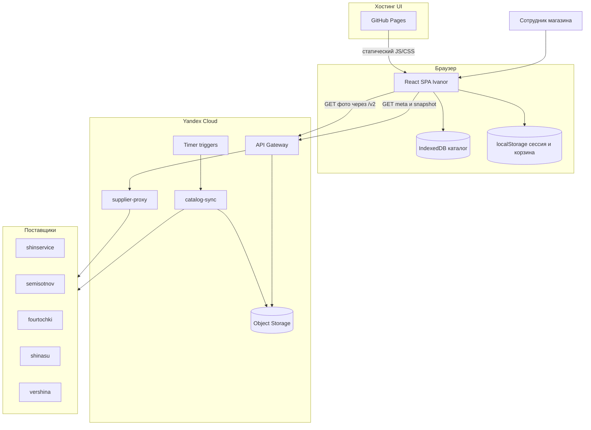

# Системный контекст

::: tip Статус: проверено по коду
Страница описывает внешних участников и границы Ivanor по фактическому коду и конфигам репозитория.
:::

## Назначение

Показать, **кто взаимодействует с системой снаружи** и какие доверительные границы уже существуют. Это C4-подобная контекстная страница: акторы и внешние системы, без детализации внутренних классов.

## Простыми словами

Представьте киоск в магазине. Сотрудник работает только с экраном приложения. За экраном есть:

- **статический сайт** на GitHub Pages — сам интерфейс;
- **облако Yandex** — готовит каталог и помогает загружать картинки;
- **пять поставщиков** — исходные прайсы шин и дисков;
- **браузерные хранилища** — IndexedDB и localStorage на устройстве сотрудника.

Прикладного backend с сессиями пользователей в текущей архитектуре нет. Это не ошибка: продукт построен как SPA плюс serverless-контур каталога.

## Участники системы

| Участник | Тип | Что делает |
| --- | --- | --- |
| Сотрудник магазина | Человек | Входит, ищет товары, собирает корзину, переключает режим клиента |
| Браузер | Runtime | Исполняет React SPA, хранит сессию, корзину и локальный каталог |
| GitHub Pages | Хостинг UI | Отдаёт статическую сборку CRA |
| API Gateway | Вход в Yandex Cloud | Маршруты `/v2/...` к Object Storage и Cloud Functions |
| catalog-sync | Cloud Function | По таймеру собирает snapshot |
| supplier-proxy | Cloud Function | Проксирует запросы к allowlist хостов поставщиков |
| Object Storage | Хранилище | `meta.json` и `snapshot.json` по `storeId` |
| Поставщики | Внешние API | Шинсервис, Семисотнов, Форточки, ШинаСу, Вершина |

## Диаграмма системного контекста

## Кто кого вызывает

### Со стороны браузера

1. Пользователь открывает SPA с GitHub Pages.
2. После входа `CatalogSyncHost` вызывает `checkAndSyncCatalog` (`src/services/catalogSync/catalogSyncService.js`).
3. Сервис делает `GET .../v2/catalog/{storeId}/meta`, при необходимости `GET .../snapshot`.
4. UI рендерит фото через `resolvePhotoUrl` / `resolveSupplierFetchUrl` (`src/utils/fetchSupplier.js`) → Gateway `/v2` или `/v2/{b2b|z34|vershina}`.

### Со стороны облака

1. Timer (или ручной invoke) вызывает `handler` в `yandex/catalog-sync/src/handler.js`.
2. `runCatalogSync` загружает поставщиков через `loadAllSuppliersData`, нормализует через transformers из `src/services/suppliers/*/transformers.js`.
3. Пишет `stores/{storeId}/snapshot.json` и `meta.json` в Object Storage (`yandex/catalog-sync/src/storage.js`).
4. API Gateway отдаёт эти объекты браузеру напрямую через `object_storage`-интеграцию (`yandex/supplier-proxy/apigw.yaml`).

## Границы ответственности

| Зона | Отвечает за | Не отвечает за |
| --- | --- | --- |
| Браузер SPA | UI, client-only auth, корзина, локальный каталог, поиск | Серверную проверку логина |
| catalog-sync | Сбор и версионирование snapshot | Отдачу UI и авторизацию пользователей |
| supplier-proxy | CORS/SSRF-ограниченный доступ к upstream | Бизнес-логику корзины и поиска |
| Object Storage | Хранение meta/snapshot | Валидацию прав пользователя |
| Поставщики | Исходные прайсы в своих форматах | Единую модель товара Ivanor |

Подробнее о доверительной границе: [Граница браузерного приложения и Yandex Cloud](/02-architecture/browser-yandex-boundary).

## Исходные файлы

- `src/App.js` — маршруты и оболочка SPA
- `src/index.js` — точка входа React
- `src/services/catalogSync/CatalogSyncHost.jsx` — триггеры автосинка
- `src/utils/fetchSupplier.js` — production-URL к Gateway
- `yandex/catalog-sync/src/handler.js` — вход Cloud Function sync
- `yandex/catalog-sync/src/runSync.js` — оркестрация загрузки
- `yandex/supplier-proxy/index.js` — CORS-прокси
- `yandex/supplier-proxy/apigw.yaml` — маршруты Gateway

## Фактическое поведение

- Основной путь каталога: Timer → catalog-sync → Object Storage → Gateway → браузер.
- Браузерный runtime **не** использует `supplierOrchestrator` для заполнения каталога.
- Auth credentials **не** отправляются на Yandex endpoints.
- Dev-proxy (`src/setupProxy.js`) — отдельная схема `/api/*` для локальной разработки; это не production Gateway.

## Планируется и legacy

- Legacy HTTP-маршруты без `/v2` в Gateway закрыты ответом 403 (`dummy` в `apigw.yaml`).
- Frontend `supplierOrchestrator.js` сохранён, но не входит в основную цепочку UI.
- Публичное демо `/demo*` — **active**: frozen snapshot, без live autosync. Disabled nav («Датчики», «Примерка») по-прежнему stubs.

## Неизвестно

- Реально развёрнуты ли Timer triggers и с какими выражениями cron.
- Совпадает ли production bucket с именами из `apigw.yaml` / `.env.example` (в репозитории есть расхождение имён).
- Используются ли fallback-маршруты `catalog-sync.handler` для meta/snapshot в проде, или только Gateway → Object Storage.

## Связанные страницы

- Назад: [Обзор проекта](/00-overview/project-overview)
- Далее: [Архитектурные границы](/02-architecture/architectural-boundaries)
- [Главные потоки данных](/02-architecture/end-to-end-data-flow)
- [Граница браузера и Yandex Cloud](/02-architecture/browser-yandex-boundary)
- [Yandex catalog-sync](/06-catalog-sync/yandex-catalog-sync) — детальная заготовка
- [Supplier proxy](/07-suppliers/supplier-proxy) — детальная заготовка
