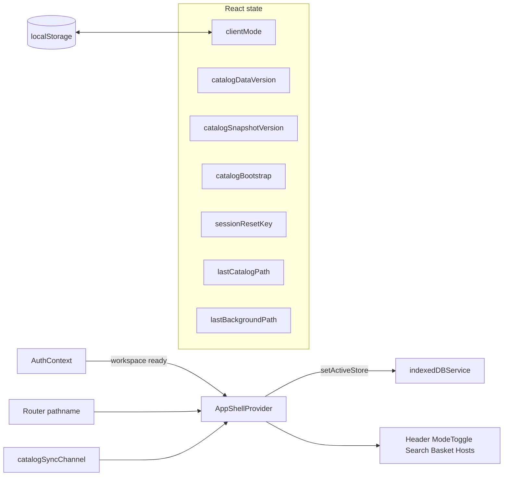
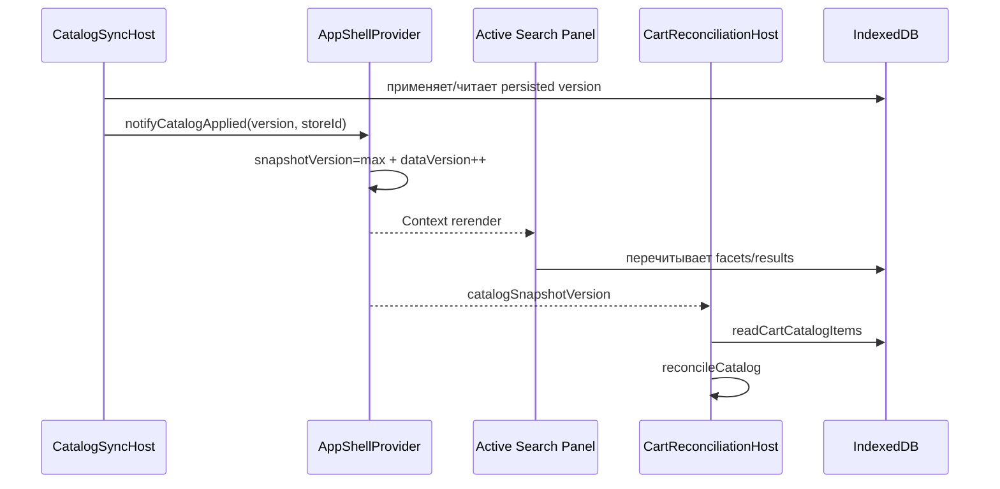

# Состояние AppShell и режимы приложения

::: tip Статус: проверено по коду
Контракт сверён с `AppShellContext`, `appMode`, потребителями Context, IndexedDB facade, catalog channel и связанными тестами.
:::

## Назначение

`AppShellProvider` — владелец состояния, которое относится ко всей оболочке, но не является ни авторизацией, ни содержимым корзины, ни локальным состоянием поисковой формы:

- режим клиента/менеджера;
- cold-start bootstrap каталога (`catalogBootstrap`) и полноэкранная шторка;
- монотонный сигнал изменения каталога;
- версия последнего применённого snapshot;
- ключи принудительного remount;
- память последней страницы каталога/фоновой поверхности;
- привязка IndexedDB facade к активному `storeId`;
- подписка на cross-tab событие «catalog applied».

Такое разделение сохраняет единственного владельца каждого типа данных: Auth владеет workspace, Cart — корзиной, search components — фильтрами, AppShell — координацией оболочки.

## Исходники и зависимости

- [`src/app/AppShellContext.jsx`](https://github.com/iscander-b10/tyres_discs/blob/main/src/app/AppShellContext.jsx)
- [`src/app/catalogBootstrap.js`](https://github.com/iscander-b10/tyres_discs/blob/main/src/app/catalogBootstrap.js)
- [`src/components/CatalogBootstrapOverlay/CatalogBootstrapOverlay.jsx`](https://github.com/iscander-b10/tyres_discs/blob/main/src/components/CatalogBootstrapOverlay/CatalogBootstrapOverlay.jsx)
- [`src/app/appMode.js`](https://github.com/iscander-b10/tyres_discs/blob/main/src/app/appMode.js)
- [`src/app/paths.js`](https://github.com/iscander-b10/tyres_discs/blob/main/src/app/paths.js)
- [`src/services/catalogSync/catalogSyncChannel.js`](https://github.com/iscander-b10/tyres_discs/blob/main/src/services/catalogSync/catalogSyncChannel.js)
- [`src/services/indexedDBService.js`](https://github.com/iscander-b10/tyres_discs/blob/main/src/services/indexedDBService.js)

## Два разных понятия «режим»

В коде есть два механизма, которые легко спутать:

| Механизм | Значение | Владелец | Текущее состояние |
| --- | --- | --- | --- |
| Доступность app surfaces | `canUseApp(isAuthenticated, pathname)` | `appMode.js` | auth **или** pathname `/demo*` |
| Представление цен/управления | `clientMode` | `AppShellProvider` | auth и демо могут переключать; guest на `/` forced client |

`isDemo(pathname)` не равен `clientMode`. Первый открывает каталог без staff-сессии на URL `/demo*`. Второй меняет представление цен внутри уже доступного приложения.

## `isDemo` и `canUseApp`

**Путь:** [`src/app/appMode.js`](https://github.com/iscander-b10/tyres_discs/blob/main/src/app/appMode.js)

### Контракты

```js
export function isDemo(pathname) {
  return isDemoPath(pathname);
}
export function canUseApp(isAuthenticated, pathname) {
  return Boolean(isAuthenticated) || isDemo(pathname);
}
```

- `isDemo(pathname)`: pure function, prefix `/demo`; не env и не константа модуля.
- `canUseApp(isAuthenticated, pathname)`: app доступно при сессии **или** demo-path.
- Вызывающие стороны: route guards, `HomeRoute`, `AppFrame`, `SiteHeader`.
- Запрещено `export const isDemo = true`: тогда `/tyres` открылся бы без пароля.

Пример: `canUseApp(false, '/tyres') === false`, `canUseApp(false, '/demo/tyres') === true`.

**Тест:** [`src/app/appMode.test.js`](https://github.com/iscander-b10/tyres_discs/blob/main/src/app/appMode.test.js), routing tests.

## `AppShellProvider`

**Сигнатура:** `AppShellProvider({ children })`  
**Вход:** React children; Auth Context; Router location/navigation; browser storage/channel; IndexedDB facade.  
**Возвращает:** `<AppShellContext.Provider value={value}>`.  
**Кто вызывает:** `App` внутри `AuthProvider` и `BrowserRouter`.

### Почему Provider находится именно здесь

- `useAuth()` требует внешний `AuthProvider`.
- `useLocation()` и `useNavigate()` требуют внешний Router.
- `CartProvider`, hosts, layout и каталоги ниже читают AppShell Context.

## Схема состояния



## Поля Context

| Поле | Тип и начальное значение | Кто меняет | Кто читает | Persistence |
| --- | --- | --- | --- | --- |
| `clientMode` | boolean; localStorage либо `false` | `setClientMode`, guest effect | ModeToggle, cards, basket/search UI | `ivanor-client-mode` |
| `setClientMode` | callback | consumer | ModeToggle | нет |
| `continueSelection` | callback | consumer вызывает | client-mode flows | нет |
| `handleBrandClick` | callback | brand link вызывает | header/footer | нет |
| `catalogDataVersion` | number, `0` | workspace switch, channel, manual bump | search/showcase | RAM |
| `catalogSnapshotVersion` | string, `''` | applied notification/channel | reconciliation/showcase | RAM |
| `bumpCatalogDataVersion` | callback | hosts/consumers | sync bridge | нет |
| `notifyCatalogApplied` | callback | `CatalogSyncHost` | sync host | нет |
| `catalogBootstrap` | `{ phase, progress, label, error?, waitForShowcase? }`; `phase`: `'idle' \| 'blocking' \| 'ready' \| 'error'`; старт `{ phase: 'idle', progress: 0, label: '' }` | `setCatalogBootstrap`, workspace layout reset | `CatalogBootstrapOverlay`, `CatalogShowcase`, `CatalogSyncHost` | RAM |
| `setCatalogBootstrap` | callback | `CatalogSyncHost` | sync host | нет |
| `registerCatalogBootstrapRetry` | `(fn) => unsubscribe` | `CatalogSyncHost` | sync host | нет |
| `retryCatalogBootstrap` | callback | overlay «Повторить» | overlay | нет |
| `notifyCatalogSurfaceReady` | callback | активная `CatalogShowcase` после settled полок | overlay wait | нет |
| `catalogSurfaceHold` | boolean | AppShell: cold-start wait | `CatalogResultsFade` в поисковых формах | нет |
| `sessionResetKey` | number, `0` | brand click | `AppFrame` keys | RAM |
| `workspaceResetKey` | string | производное от Auth | `AppFrame`, search | RAM |
| `lastBackgroundPath` | path, `/tyres` | pathname effect | сейчас production-consumer отсутствует | RAM |

`lastCatalogPath` не публикуется: это внутренняя память для `continueSelection`.

`lastBackgroundPath`, напротив, публикуется, но текущий production-код его не читает. Это подготовленный/остаточный контракт, а не действующий механизм login modal; удалять или задействовать его следует отдельным изменением с тестом.

## Инициализация `clientMode`

### `getInitialClientMode()`

**Сигнатура:** `function getInitialClientMode()`  
**Вход:** отсутствует; читает `window.localStorage`.  
**Выход:** boolean.  
**Side effect:** только чтение storage.  
**Fallback:** manager mode, то есть `false`.

Алгоритм:

1. Прочитать `ivanor-client-mode`.
2. Строку `'true'` преобразовать в `true`.
3. Строку `'false'` преобразовать в `false`.
4. Любое другое значение, отсутствие key или исключение storage заменить на `false`.

Функция передана в `useState` как lazy initializer, поэтому обычный production mount читает storage один раз. В development StrictMode initializer может вызываться повторно для проверки чистоты.

Практический пример: localStorage содержит `'true'`; auth user после readiness получает `clientMode=true`. Guest всё равно получает effective `true`, даже если сохранено `'false'`.

## Effects `AppShellProvider`

### 1. Переключение активного workspace и IndexedDB

**Trigger:** `[isWorkspaceReady, workspace]`  
**Тип:** `useLayoutEffect`, потому что active store должен смениться до обычных effects дочерних каталогов.

Алгоритм:

1. Вычислить `currentWorkspace`: готовый workspace либо `null`.
2. Записать его в `activeWorkspaceRef`.
3. Очистить dedup ref, `catalogSnapshotVersion` и `catalogBootstrap` (вернув idle).
4. Увеличить `catalogDataVersion`, чтобы consumers не использовали старые данные.
5. Если есть `storeId`, вызвать `indexedDBService.setActiveStore(storeId)`.
6. Иначе вызвать `invalidateActiveStore()`.
7. На cleanup инвалидировать старый store, только если ref всё ещё указывает на тот же workspace.

Последняя проверка не позволяет cleanup старого effect инвалидировать уже активированный новый workspace.

### 2. Память маршрута

**Trigger:** `[pathname]`

- `/tyres`, `/wheels` и те же страницы под `/demo` обновляют и `lastCatalogPath`, и `lastBackgroundPath`.
- `/basket` и `/demo/basket` обновляют только `lastBackgroundPath`.
- `/`, `/login` и неизвестный staff path не заменяют последнюю app surface.

Причина: «продолжить подбор» должно вернуть именно в последний каталог, а login modal может помнить более широкую фоновую поверхность, включая basket.

### 3. Guest forced client mode

**Trigger:** `[isAuthenticated, isReady, pathname]`

До завершения auth restore effect ничего не меняет. После readiness guest на маркетинговых URL принудительно получает внутренний `clientMode=true`. На `/demo*` переключатель менеджер/клиент работает и без staff session.

### 4. Persistence режима

**Trigger:** `[clientMode, isAuthenticated, isReady, pathname]`

После readiness сохраняется текущий mode для auth **или** demo-path; для guest на `/` — `true`. Ошибки localStorage проглатываются: приватный режим/запрет storage не должен ломать UI.

### 5. Cross-tab catalog applied

**Trigger:** `[bumpCatalogDataVersion, isWorkspaceReady, workspace]`

Подписка создаётся только для готового `workspace.storeId`. Callback:

1. сравнивает captured workspace по object identity с `activeWorkspaceRef`;
2. игнорирует уже обработанную version;
3. монотонно обновляет `catalogSnapshotVersion`;
4. увеличивает `catalogDataVersion`.

Cleanup возвращает unsubscribe из `subscribeCatalogApplied`.

## Публичные callbacks

### `setClientMode(value)`

**Вход:** следующее boolean-значение из Ant Design `Switch`.  
**Результат:** явного return нет.  
**Side effect:** обновление state, затем persistence effect.

Если нет ни сессии, ни demo-path, callback игнорирует запрошенное значение и фиксирует `true`. На `/demo*` и у auth user сохраняет `value`.

Пример: auth user вызывает `setClientMode(false)` и получает manager mode; guest вызывает то же, но Context продолжает публиковать `true`.

Опасная ошибка: публиковать raw `clientMode`, а не `effectiveClientMode`; тогда guest на первом render может увидеть manager prices до effect.

### `continueSelection()`

**Вход:** нет.  
**Результат:** нет.  
**Side effect:** Router navigation.

Если `lastCatalogPath === '/wheels'`, открывает `/wheels`; для любого другого значения использует `/tyres`. Это whitelist, а не произвольный redirect.

### `handleBrandClick()`

**Вход:** вызывается как React click handler; event не используется.  
**Результат:** нет.  
**Side effects:** state updates и navigation.

Алгоритм:

1. Увеличить `sessionResetKey`.
2. На `/demo*` сбросить памяти на `appHomePath` (`/demo/tyres`) и перейти туда.
3. Для auth user вне демо — памяти на `/tyres` и переход туда.
4. Для guest вне демо — переход на `/`.

Изменение React `key` в `AppFrame` принудительно размонтирует и заново монтирует обе поисковые панели, поэтому очищаются их локальные фильтры и результаты.

**Тест:** [`src/App.catalogDualMount.test.jsx`](https://github.com/iscander-b10/tyres_discs/blob/main/src/App.catalogDualMount.test.jsx) отдельно подтверждает reset по `sessionResetKey`.

### `bumpCatalogDataVersion()`

**Вход:** нет.  
**Выход:** нет.  
**Side effect:** `catalogDataVersion += 1`.

Это invalidation signal, а не версия snapshot. Несколько событий могут дать несколько increment; consumers должны воспринимать число как cache key/триггер перечитывания, а не бизнес-версию.

### `notifyCatalogApplied(version, storeId?)`

**Вход:** непустая сравнимая version и optional `storeId`; default берётся из active workspace ref.  
**Выход:** `true`, если событие принято; `false`, если оно невалидно или относится к другому store.  
**Side effects:** обновляет refs/state и вызывает bump.

Алгоритм:

1. Отклонить пустую version.
2. Отклонить вызов без активного workspace.
3. Отклонить несовпадающий `storeId`.
4. Запомнить version для dedup.
5. Обновить snapshot version только если новая строка больше текущей.
6. Увеличить data version.
7. Вернуть `true`.

Строковое сравнение корректно только при формате version с сохранением хронологического порядка. Нельзя без пересмотра заменить version на произвольные semver/UUID.

**Тест:** [`src/services/catalogSync/CatalogSyncHost.test.jsx`](https://github.com/iscander-b10/tyres_discs/blob/main/src/services/catalogSync/CatalogSyncHost.test.jsx) проверяет, что stale store не уведомляется, а текущий commit вызывает notify.

### Cold-start bootstrap

`catalogBootstrap` — единственный источник, должен ли пользователь видеть рабочий сайт. Владелец — AppShell, не витрина.

| `phase` | Шторка | Когда |
| --- | --- | --- |
| `idle` | нет | нет готового workspace, сброс при смене магазина, или идёт краткая проверка `isCatalogEmpty()` до решения cold/warm |
| `blocking` | да | каталог пуст (или IDB не удалось прочитать) и snapshot ещё не в IDB / ещё не прогрет |
| `ready` | нет | локальный каталог не пуст, либо cold-start snapshot уже применён |
| `error` | да, с текстом и «Повторить» | cold start не удался (offline, HTTP, validation, disabled) |

`CatalogSyncHost` **не** ставит `blocking` до ответа `isCatalogEmpty()`: иначе refresh с заполненным IDB мелькает шторкой. Пустой каталог получает `blocking` + `waitForShowcase: true`, качает **один** snapshot шин и дисков, затем прогревает RAM обеих категорий; непустой сразу переходит в `ready` без `waitForShowcase` и без единого кадра overlay, дальше синхронизируется тихо (слот, visibility, online). Stale store и abort не переводят phase в `error`. Ожидание lock на пустой базе — всё ещё `blocking`, не `error`.

Прогресс монотонный 0–99, пока phase не `ready`. Числа и подпись приходят из `catalogBootstrap.progress` / `label` (новые поля в AppShell не заводятся): meta ≈ 0–3%, download — основная доля, затем parse, apply и `warmup` («Готовим витрину», шины затем диски). Если `Content-Length` виден и согласован со stream, бар следует байтам; если нет — крупно показываются мегабайты, а бар идёт коридором ≈ 5–80%, без «N% от файла». Вторая вкладка с пустой IDB ждёт writer: label «Каталог загружается в другой вкладке», progress 0, не error. `setInterval` и откат процента запрещены; 100 появляется только на `ready` после commit и прогрева RAM.

`CatalogBootstrapOverlay` рендерится из `AppShellProvider` порталом на `document.body`. Это не Ant Design Modal: клик по маске и Escape не закрывают шторку. z-index (`--z-catalog-bootstrap`: 1300) выше хедера и ModeToggle. Фон `--color-overlay-gate` темнее `--color-overlay-strong`. Бар и крупный процент используют `--color-accent`, не `--color-cta`. Ошибка cold start показывается в шторке, кнопка «Повторить» вызывает `retryCatalogBootstrap`. Focus trap, `inert` на `#root` и `overflow: hidden` на `body` держатся, пока шторка смонтирована, включая 50ms exit.

**Снятие UI-шторки ≠ `phase: 'ready'`.** Sync-контракт прежний: warmup RAM, затем `notifyCatalogApplied`, затем `phase: 'ready'`. На cold start (`waitForShowcase`) overlay не unmount-ится по одному `ready`: активная `CatalogShowcase` должна стать settled (полки + чипы, не skeleton/`loading`). Тогда overlay гаснет opacity 50ms ease-out, и в тот же жест зона результатов проявляется целиком. Warm start (`ready` без `waitForShowcase`) overlay не открывал: `idle` → `ready` без кадра `blocking`. На `error` шторка остаётся. Скрытая dual-mount панель не становится `isActive` из-за шторки и не шлёт `notifyCatalogSurfaceReady`. На `/basket` ждать витрину не нужно: overlay уходит по `ready`.

**Тесты:** [`src/app/AppShellContext.test.jsx`](https://github.com/iscander-b10/tyres_discs/blob/main/src/app/AppShellContext.test.jsx), [`src/components/CatalogBootstrapOverlay/CatalogBootstrapOverlay.test.jsx`](https://github.com/iscander-b10/tyres_discs/blob/main/src/components/CatalogBootstrapOverlay/CatalogBootstrapOverlay.test.jsx), [`src/services/catalogSync/CatalogSyncHost.test.jsx`](https://github.com/iscander-b10/tyres_discs/blob/main/src/services/catalogSync/CatalogSyncHost.test.jsx), [`src/components/shared/CatalogShowcase/CatalogShowcase.bootstrap.test.jsx`](https://github.com/iscander-b10/tyres_discs/blob/main/src/components/shared/CatalogShowcase/CatalogShowcase.bootstrap.test.jsx).

## `useAppShell()`

**Сигнатура:** `export function useAppShell()`  
**Вход:** текущий React Context.  
**Выход:** объект AppShell API.  
**Ошибка:** синхронно бросает `Error('useAppShell must be used within AppShellProvider')`, если Provider отсутствует.

Причина явной ошибки — раннее обнаружение неправильной композиции вместо менее понятного `Cannot read properties of null`.

Пример:

```jsx
function CatalogVersionLabel() {
  const { catalogDataVersion } = useAppShell();
  return <span>Ревизия UI: {catalogDataVersion}</span>;
}
```

Отдельного теста guard нет. При добавлении consumers тестовый harness обязан предоставлять реальный или mock Provider.

## Как данные доходят до дочерних компонентов



React Context передаёт новое `value` всем consumers. `useMemo` сохраняет identity объекта, пока ни одно поле/dependency не изменилось. Callback-обёртки `useCallback` уменьшают лишние изменения Context value.

## Глобальное и локальное состояние

Глобальным в пределах React tree является только опубликованное Context value. `activeWorkspaceRef`, `lastAppliedVersionRef` и непубличный `lastCatalogPath` — внутреннее состояние Provider. Фильтры, request ids, результаты и pagination остаются локальными состояниями `TiresSearchParameters`/`DiscsSearchParameters`; AppShell не копирует их.

Это важно для KISS/SRP: оболочка выдаёт invalidation signal, а каждый каталог сам решает, когда и что перечитать.

## Ошибки и крайние случаи

- **localStorage недоступен:** mode получает fallback; приложение продолжает работать без persistence.
- **Guest до readiness:** forced mode не применяется преждевременно, чтобы restore auth user не затирал его сохранённый выбор.
- **Смена store во время async sync:** `storeId` и workspace identity отбрасывают stale event; bootstrap сбрасывается в idle, новый host снова ставит blocking, пока не проверит пустоту.
- **Cold start без сети или с HTTP/validation error:** phase `error`, текст и «Повторить» в шторке, не только в console. «Обновите страницу» не является основным выходом.
- **Повтор одной version из channel:** subscription callback делает dedup и не вызывает лишний bump. Прямой повторный `notifyCatalogApplied` всё равно bump-ит data version.
- **Два разных события без version:** `notifyCatalogApplied` отклоняет их; channel callback без version может сделать bump, если подписка его передаст.
- **Cleanup старого layout effect:** identity guard не инвалидирует новый active store.
- **Version меньше текущей:** snapshot state не откатывается, но принятый direct notify всё равно bump-ит data version.
- **Неизвестный последний catalog path:** `continueSelection` возвращает безопасный `/tyres`.
- **Нет Provider:** `useAppShell` падает сразу с диагностическим сообщением.

## Тестовое покрытие

| Контракт | Тест |
| --- | --- |
| Guest/auth guards косвенно используют `canUseApp` | [`src/App.routing.test.jsx`](https://github.com/iscander-b10/tyres_discs/blob/main/src/App.routing.test.jsx) |
| Inactive panel не читает IDB; catch-up; keep-alive; reset keys | [`src/App.catalogDualMount.test.jsx`](https://github.com/iscander-b10/tyres_discs/blob/main/src/App.catalogDualMount.test.jsx) |
| Bootstrap: idle, шторка, сброс при смене workspace, retry | [`src/app/AppShellContext.test.jsx`](https://github.com/iscander-b10/tyres_discs/blob/main/src/app/AppShellContext.test.jsx) |
| Sync host уведомляет только актуальный store/version; empty vs non-empty bootstrap | [`src/services/catalogSync/CatalogSyncHost.test.jsx`](https://github.com/iscander-b10/tyres_discs/blob/main/src/services/catalogSync/CatalogSyncHost.test.jsx) |
| Catalog channel фильтрует store и сообщения | [`src/services/catalogSync/catalogSyncChannel.test.js`](https://github.com/iscander-b10/tyres_discs/blob/main/src/services/catalogSync/catalogSyncChannel.test.js) |
| Search не коммитит stale async result | [`src/components/TiresSearchParameters/TiresSearchParameters.searchRace.test.jsx`](https://github.com/iscander-b10/tyres_discs/blob/main/src/components/TiresSearchParameters/TiresSearchParameters.searchRace.test.jsx), [`src/components/DiscsSearchParameters/DiscsSearchParameters.searchRace.test.jsx`](https://github.com/iscander-b10/tyres_discs/blob/main/src/components/DiscsSearchParameters/DiscsSearchParameters.searchRace.test.jsx) |

Прямого покрытия всех веток `continueSelection` / brand click / hook guard по-прежнему нет. Storage fallback и forced guest mode не выделены в отдельные тесты.

## Типичные ошибки при изменении

1. Перенести Provider выше Router/Auth и сломать hooks.
2. Сделать `catalogDataVersion` равным snapshot version и потерять события без новой version.
3. Удалить `useLayoutEffect`: дочерний обычный effect может обратиться к прежнему active store.
4. Сравнивать workspace только по `storeId`, забыв смену account.
5. Убрать `workspaceResetKey` из React keys и сохранить локальные результаты прежнего магазина.
6. Делать `setClientMode` доступным guest без forced value.
7. Добавить в Context всё состояние поисковых форм и создать чрезмерно широкий Provider.
8. Не возвращать unsubscribe/cleanup и получить дублированные channel callbacks в StrictMode.
9. Считать витрину владельцем cold-start и показать Empty «Каталог ещё загружается» вместо шторки AppShell.
10. Показать шторку на warm start (непустой IDB) — в том числе поставить `blocking` до `isCatalogEmpty()` — или toast на фоновый autosync.
11. Снимать overlay по одному `phase: 'ready'` на cold start и показать skeleton вспышкой.
12. Включить скрытую dual-mount панель (`isActive=true`) только чтобы дождаться витрины дисков.

## Связанные страницы

- [Запуск frontend и дерево Provider](/02-architecture/frontend-provider-tree)
- [Владение состоянием](/02-architecture/state-ownership)
- [Маршруты и окно входа](/03-routing-shell/routes-and-login-modal)
- [Две смонтированные панели каталога](/03-routing-shell/dual-mount-catalog)
- [Автосинхронизация frontend](/06-catalog-sync/frontend-autosync)
- [Блокировки и каналы](/06-catalog-sync/locks-and-channels)
- [Корзина и режим клиента](/10-ui/basket-and-client-mode)
- [ADR-009: публичное демо](/adr/009-demo-url-frozen-snapshot)
