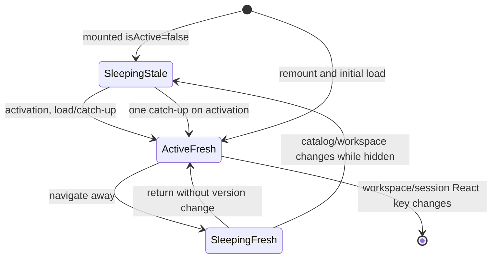
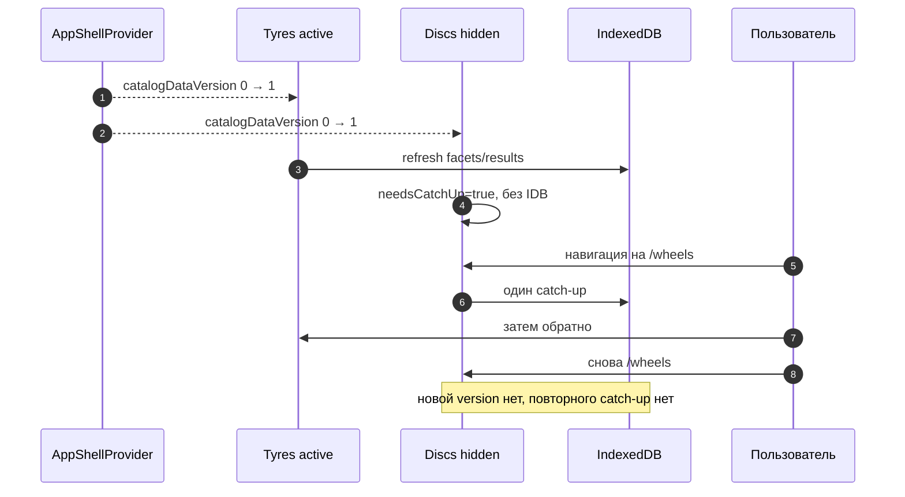

# Две смонтированные панели каталога

::: tip Статус: проверено по коду и тестам
Keep-alive, `hidden`/`inert`, `isActive`, catch-up, async race guards и reset keys сверены с обеими поисковыми панелями и интеграционным тестом.
:::

## Зачем панели остаются mounted

Переход `/tyres → /wheels → /tyres` не должен сбрасывать выбранные фильтры, результаты поиска и текущую страницу списка. Поэтому `AppFrame` одновременно держит в React tree:

- `TiresSearchParameters`;
- `DiscsSearchParameters`;
- `BasketPage`.

URL выбирает активную панель, но не создаёт её заново. Это keep-alive, реализованный обычным React render, без стороннего cache/router API.

Одного CSS `display: none` недостаточно: скрытый компонент продолжил бы effects и обращения к IndexedDB. Поэтому используются три согласованных сигнала:

1. `hidden` убирает панель из layout;
2. `inert` запрещает focus и interaction внутри;
3. `isActive={false}` приостанавливает прикладные загрузки и витрину.

## Исходники

- [`src/App.js`](https://github.com/iscander-b10/tyres_discs/blob/main/src/App.js)
- [`src/components/TiresSearchParameters/TiresSearchParameters.jsx`](https://github.com/iscander-b10/tyres_discs/blob/main/src/components/TiresSearchParameters/TiresSearchParameters.jsx)
- [`src/components/DiscsSearchParameters/DiscsSearchParameters.jsx`](https://github.com/iscander-b10/tyres_discs/blob/main/src/components/DiscsSearchParameters/DiscsSearchParameters.jsx)
- [`src/App.catalogDualMount.test.jsx`](https://github.com/iscander-b10/tyres_discs/blob/main/src/App.catalogDualMount.test.jsx)
- [`src/components/TiresSearchParameters/TiresSearchParameters.searchRace.test.jsx`](https://github.com/iscander-b10/tyres_discs/blob/main/src/components/TiresSearchParameters/TiresSearchParameters.searchRace.test.jsx)
- [`src/components/DiscsSearchParameters/DiscsSearchParameters.searchRace.test.jsx`](https://github.com/iscander-b10/tyres_discs/blob/main/src/components/DiscsSearchParameters/DiscsSearchParameters.searchRace.test.jsx)

## Схема lifecycle



## Монтирование в `AppFrame`

Для каталога шин:

```jsx
<div
  className="catalog-panel"
  hidden={backgroundPage !== 'tyres'}
  inert={isLoginOpen || backgroundPage !== 'tyres' ? true : undefined}
>
  <TiresSearchParameters
    key={`tires-${workspaceResetKey}-${sessionResetKey}`}
    isActive={backgroundPage === 'tyres'}
  />
</div>
```

Панель дисков симметрична. Basket получает `hidden`/`inert` и key по workspace, но не внешний `isActive` prop. `BasketPage` сам читает `location.pathname`, вычисляет `isActive = pathname === PATHS.basket` и только при активной корзине синхронизирует локальный `selected` с текущими item keys.

## `TiresSearchParameters`

**Путь:** [`src/components/TiresSearchParameters/TiresSearchParameters.jsx`](https://github.com/iscander-b10/tyres_discs/blob/main/src/components/TiresSearchParameters/TiresSearchParameters.jsx)  
**Сигнатура:** `memo(({ isActive = true }) => ReactNode)`  
**Prop:** `isActive: boolean`, default `true`; источник — `AppFrame`.  
**Context:** `clientMode`, `catalogDataVersion`, `workspaceResetKey` из AppShell. Cold-start шторка читает `catalogBootstrap` в `CatalogShowcase`, но не меняет `isActive` скрытой панели.  
**Возвращает:** Ant Design Form, showcase либо paginated search results.

### Локальное состояние

Компонент владеет form instance, доступными параметрами, результатами, loading/error flags, reset keys и выбранными/наблюдаемыми значениями. Это состояние сохраняется, пока React identity компонента не меняется.

Refs разделяют UI state и защиту async:

- request ids отмечают последний допустимый load/search;
- `mountedRef` запрещает commit после unmount; setup снова ставит `true` — иначе StrictMode (`npm start`) оставляет флаг ложным;
- `workspaceKeyRef` запрещает commit из прежнего workspace;
- `needsCatchUpRef` отмечает скрытую устаревшую панель;
- `isActiveRef` отличает переходы sleep/wake.

### Effect активности

Dependencies: `[catalogDataVersion, workspaceResetKey, isActive]`.

Пошагово:

1. Если `isActive=false`, компонент не читает IndexedDB.
2. Если effect повторно выполняется уже в sleep из-за смены version/workspace, ставит `needsCatchUpRef=true`.
3. Запоминает inactive state и завершает effect.
4. При активации вычисляет `justActivated`.
5. Если панель вернулась без stale marker, ничего не загружает — локальный UI остаётся как был.
6. Иначе снимает stale marker.
7. Перечитывает доступные параметры.
8. Если уже есть search results, повторяет поиск с текущими Form values в background mode.

Showcase рендерится только при `showShowcase && isActive`, поэтому скрытая панель не запускает showcase collection.

### Практический пример

Пользователь выбрал RunFlat, выполнил поиск и перешёл на страницу 2. После перехода на диски компонент шин остаётся mounted. Если catalog version не менялась, возврат на шины не вызывает IDB и показывает тот же checkbox, результаты и page 2.

## `DiscsSearchParameters`

**Путь:** [`src/components/DiscsSearchParameters/DiscsSearchParameters.jsx`](https://github.com/iscander-b10/tyres_discs/blob/main/src/components/DiscsSearchParameters/DiscsSearchParameters.jsx)  
**Сигнатура:** `memo(({ isActive = true }) => ReactNode)`  
**Вход/выход и lifecycle:** те же контракты, что у tires panel, но filters и IndexedDB queries относятся к дискам.

Компонент строит filters только из активных form values: supplier, diameter, PCD, число отверстий, тип диска и диапазоны width/CB/ET. При обновлении facets несовместимые текущие значения сбрасываются.

Симметрия двух компонентов важна: исправление race/catch-up только в одном создаёт разные правила навигации. При изменении общей механики следует либо обновить оба файла и оба теста, либо безопасно извлечь общий hook после подтверждения одинаковых контрактов.

## Catch-up после обновления каталога



Так скрытая панель не создаёт фоновую нагрузку, но при первом открытии не показывает заведомо устаревший набор параметров.

## Reset через React keys

### `workspaceResetKey`

Вычисляется как `${accountId}:${storeId}` либо `'guest'`. При смене workspace React видит другой key, размонтирует старые search/basket components и создаёт новые. Локальные фильтры и результаты другого магазина не переносятся.

### `sessionResetKey`

Увеличивается в `handleBrandClick`. Входит только в keys шин и дисков. Это семантика «логотип начинает новый подбор», не затрагивая содержимое корзины.

### Почему нельзя заменить key обычным prop

Prop сам по себе не очищает все `useState`, Form instance и refs. Потребовался бы ручной reset каждого поля, и новые поля легко забыть. React key задаёт ясную границу полного lifecycle.

## Async race guards

Пока IndexedDB Promise выполняется, пользователь может:

- сменить workspace;
- запустить новый поиск;
- сбросить форму;
- скрыть панель;
- размонтировать компонент.

Поэтому результат коммитится только если request id всё ещё последний, component mounted, workspace совпадает и запрос относится к допустимому lifecycle. Кнопка «Сбросить фильтры» синхронно вызывает `invalidateCatalogSearchRequest`: in-flight поиск не пишет UI и не оставляет spinner. Search race tests создают медленный запрос, затем либо version bump и новый запрос, либо reset во время pending.

`isActive=false` предотвращает новые запросы, но сам по себе не отменяет уже выполняющийся Promise. За корректность его завершения отвечают request/generation refs.

## Глобальное и локальное состояние

| Данные | Где живут | Переживают tyres/wheels navigation | Сбрасываются |
| --- | --- | --- | --- |
| Активная page | Router URL | меняется | navigation |
| Catalog data/snapshot version | AppShell Context | да | workspace/provider remount |
| Filter values | Ant Design Form в panel | да | React key/remount или ручной reset |
| Search results | local state panel | да | new search/reset/remount |
| Pagination | child local state | да | search reset key/remount |
| Stale/catch-up flags | refs panel | да | successful catch-up/remount |
| Сам каталог | IndexedDB per store | да, включая reload | sync/migration/store cleanup |

## Почему `hidden` и `inert` применяются вместе

- `hidden` отвечает за визуальный layout.
- `inert` запрещает keyboard focus, click и accessibility interaction в неактивном поддереве.
- При открытом login `inert` применяется даже к текущей background panel.

Нельзя полагаться только на `aria-hidden`: оно не отключает focus/click. Нельзя полагаться только на `inert`: невидимость и занимаемое место тогда зависят от CSS.

## Тестовые контракты

### `App.catalogDualMount.test.jsx`

Проверяет шесть ключевых сценариев:

1. на `/tyres` discs panel не вызывает facets, search или showcase IDB methods;
2. version bump обновляет active tires, а discs только становится stale;
3. первая активация discs делает ровно один catch-up;
4. filters, results и pagination переживают переход туда и обратно;
5. изменение `sessionResetKey` сбрасывает search results;
6. изменение `workspaceResetKey` сбрасывает search results.

Тест использует harness, повторяющий production keys/props, а не полный `AppFrame`. Поэтому отдельно routing test отвечает за URL guards.

### Search race tests

- [`TiresSearchParameters.searchRace.test.jsx`](https://github.com/iscander-b10/tyres_discs/blob/main/src/components/TiresSearchParameters/TiresSearchParameters.searchRace.test.jsx)
- [`DiscsSearchParameters.searchRace.test.jsx`](https://github.com/iscander-b10/tyres_discs/blob/main/src/components/DiscsSearchParameters/DiscsSearchParameters.searchRace.test.jsx)

Они подтверждают, что старый async result после catalog version change не возвращается в UI поверх нового, что сброс фильтров во время pending гасит spinner и не применяет поздний ответ, и что в `React.StrictMode` «Найти» settle’ит список и гасит кнопку.

## Ошибки и крайние случаи

- **Первый mount скрытой панели:** она не должна читать IDB; stale marker обеспечивает будущую загрузку.
- **Переход без обновления:** повторная активация не делает запрос.
- **Несколько version bumps в sleep:** достаточно одного catch-up по последнему состоянию IndexedDB.
- **Version bump при active search:** active panel перечитывает данные; stale Promise не должен победить.
- **Смена workspace:** key гарантирует полный remount, а workspace guard защищает незавершённые Promise.
- **Login поверх каталога:** background panel остаётся mounted, но layout/panel inert; URL page не теряется.
- **Cold-start шторка:** `CatalogBootstrapOverlay` глобальна (portal на `document.body`, z-index выше ModeToggle). Она не делает скрытую панель дисков `isActive=true` и не заставляет её ходить в IndexedDB. RAM обеих категорий прогревает `warmupCatalogReadCache` из `CatalogSyncHost` после apply, пока шторка ещё висит. Catch-up скрытой панели после `catalogDataVersion` bump жив: первый переход на `/wheels` по-прежнему один раз читает facets из уже тёплого RAM-кэша, без второго `getAll`.
- **Полный reload:** keep-alive local state теряется; это session UI state, не persisted filter model.
- **Browser без поддержки inert:** visual hidden всё равно работает; полноценная focus-блокировка зависит от целевой browser support/polyfill policy.

## Типичные ошибки при изменении

1. Рендерить только активный компонент через ternary и потерять keep-alive.
2. Оставить обе панели active и удвоить IDB/showcase нагрузку.
3. Убрать `hidden` или `inert` и сделать скрытые controls доступными.
4. Ставить stale marker при каждом обычном уходе в sleep — возврат всегда начнёт лишний запрос.
5. Не ставить stale marker при version/workspace change в sleep — первый экран покажет старые facets.
6. Удалить workspace из key/request guard и смешать магазины.
7. Удалить session key из обеих panels и сломать «новый подбор» по бренду.
8. Сбросить basket по session key, непреднамеренно изменив cart UX.
9. Исправить алгоритм только для шин или только для дисков.
10. Cleanup `mountedRef=false` без `true` в setup — «Найти» на `npm start` крутится вечно.
11. Тащить приватный `_ensureReadCache` в React или включать скрытую панель ради дисков: прогрев RAM — служебный API session, не `isActive=true`.

## Связанные страницы

- [Маршруты, layout и окно входа](/03-routing-shell/routes-and-login-modal)
- [Состояние AppShell](/03-routing-shell/app-shell-state)
- [Запуск frontend и Provider](/02-architecture/frontend-provider-tree)
- [Поиск шин и дисков](/08-search-showcase/tire-and-disc-search)
- [Защита от async-гонок](/08-search-showcase/async-race-guards)
- [IndexedDB lifecycle](/05-catalog-storage/lifecycle-and-migration)
