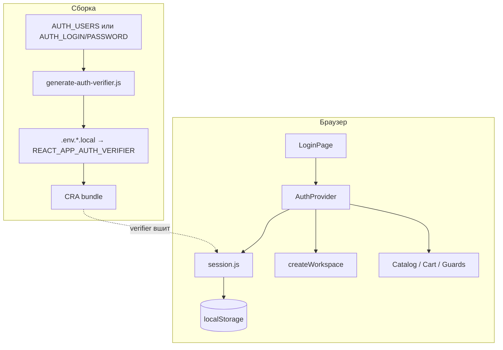
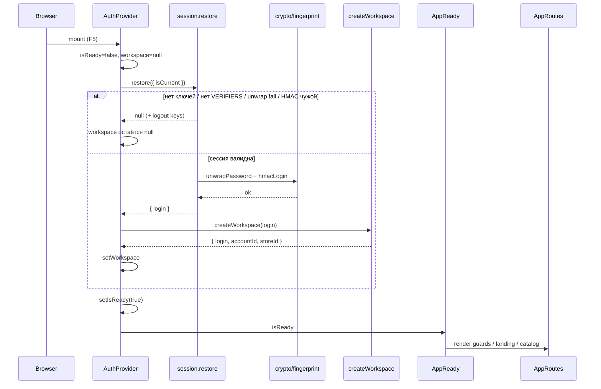
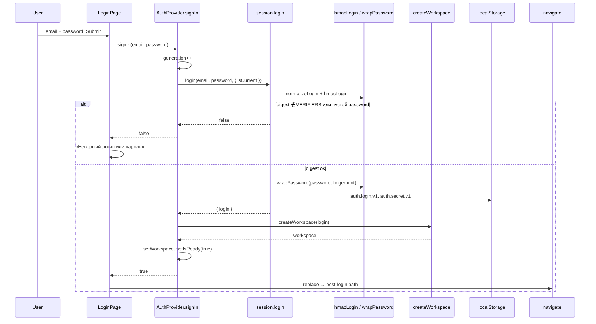
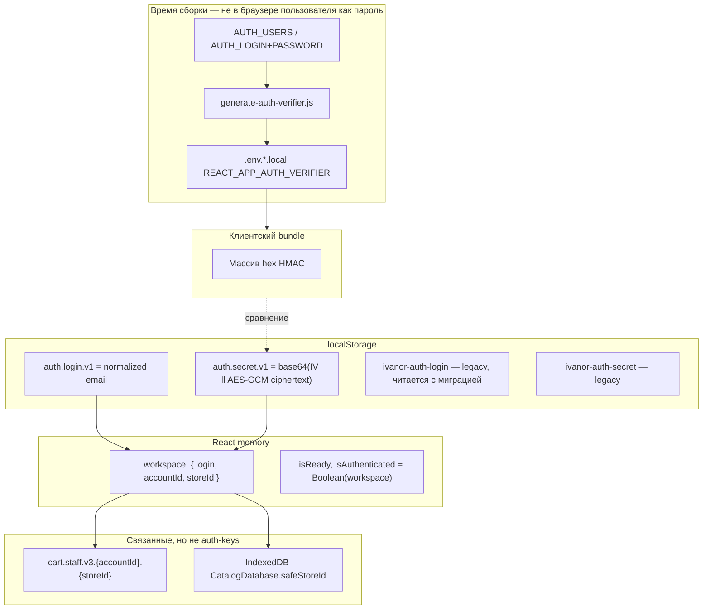

# Клиентская модель авторизации

::: tip Статус: проверено по коду
Граница client-only auth, AuthContext, LoginPage, route guards и генератор verifier сверены с текущей реализацией и тестами. Это **не** полноценная серверная граница безопасности.
:::

::: danger Важно для начинающего разработчика
Авторизация Ivanor — **локальный gate в браузере**. Она решает, какой UI и какой workspace показать на этом устройстве. Она **не** проверяет права на сервере, **не** выдаёт access token облаку и **не** защищает Object Storage или API Gateway от постороннего доступа. Любой, кто открыл DevTools, может обойти клиентские проверки маршрутов.
:::

## Назначение раздела

Объяснить, зачем в проекте есть «вход», как он устроен без сервера логина, какие угрозы закрывает, какие — нет, и как React-компоненты узнают, что пользователь «вошёл».

## Простыми словами

Представьте замок на двери офиса, ключ от которого лежит в том же офисе на видном месте. Замок мешает случайному прохожему, но не останавливает того, кто знает, где искать ключ.

В Ivanor:

1. При сборке из логина и пароля считается HMAC-дайджест — **verifier**.
2. Verifier попадает в клиентский bundle как `REACT_APP_AUTH_VERIFIER` (список через запятую).
3. При вводе пароля браузер считает тот же HMAC и сравнивает результат со списком.
4. Если совпало — пароль шифруется ключом от fingerprint устройства и кладётся в `localStorage`.
5. React создаёт **workspace** (`login`, `accountId`, `storeId`) и открывает каталог/корзину.

Сервер «да/нет» по паролю не вызывается. Облачные функции каталога живут своей жизнью и этой сессией не пользуются.

## Исходные файлы

| Файл | Роль |
| --- | --- |
| [`src/auth/AuthContext.jsx`](https://github.com/iscander-b10/tyres_discs/blob/main/src/auth/AuthContext.jsx) | Владелец auth-состояния в React |
| [`src/auth/session.js`](https://github.com/iscander-b10/tyres_discs/blob/main/src/auth/session.js) | login / restore / logout и `localStorage` |
| [`src/auth/crypto.js`](https://github.com/iscander-b10/tyres_discs/blob/main/src/auth/crypto.js) | HMAC, AES-GCM, `accountId` |
| [`src/auth/fingerprint.js`](https://github.com/iscander-b10/tyres_discs/blob/main/src/auth/fingerprint.js) | Строка устройства для обёртки пароля |
| [`src/auth/workspace.js`](https://github.com/iscander-b10/tyres_discs/blob/main/src/auth/workspace.js) | `accountId` + `storeId` |
| [`src/auth/useLogout.js`](https://github.com/iscander-b10/tyres_discs/blob/main/src/auth/useLogout.js) | Выход с flush корзины и invalidate IDB |
| [`scripts/generate-auth-verifier.js`](https://github.com/iscander-b10/tyres_discs/blob/main/scripts/generate-auth-verifier.js) | Сборка verifier до `start`/`build` |
| [`src/components/LoginPage/LoginPage.jsx`](https://github.com/iscander-b10/tyres_discs/blob/main/src/components/LoginPage/LoginPage.jsx) | Modal входа |
| [`src/App.js`](https://github.com/iscander-b10/tyres_discs/blob/main/src/App.js) | `RequireAuth`, `BasketGuard`, `AppReady` |
| [`src/app/appMode.js`](https://github.com/iscander-b10/tyres_discs/blob/main/src/app/appMode.js) | `canUseApp` / demo flag |

Детали crypto, session и workspace — на [Сессия, crypto и workspace](/04-auth/session-crypto-workspace).  
Гонки и logout — на [Гонки и выход](/04-auth/races-and-logout).  
Маршруты — на [Маршруты и вход](/03-routing-shell/routes-and-login-modal).

## Место в архитектуре

| Вопрос | Ответ |
| --- | --- |
| Слой | Frontend browser-only |
| Подсистема | Auth / workspace bootstrap |
| Владелец состояния | `AuthProvider` |
| Persist | `localStorage` ключи `auth.*.v1` (+ legacy) |
| Облако | **Не участвует** в проверке логина |



---

## 1. Почему это client-only auth

1. **Нет endpoint'а логина.** `login()` в `session.js` сравнивает HMAC с массивом, собранным из `process.env.REACT_APP_AUTH_VERIFIER` на этапе сборки.
2. **Нет cookie/session на сервере.** После успешного входа живут React state и два актуальных ключа `localStorage`; legacy-ключи `ivanor-auth-*` поддерживаются только для чтения/очистки при миграции.
3. **Нет JWT и refresh-токенов.** Облачный catalog-sync и Object Storage не принимают «сессию пользователя Ivanor».
4. **Цель модели** — разделить guest landing и staff UI, привязать корзину и IndexedDB к `accountId`/`storeId`, а не защитить backend от неавторизованных запросов.
5. **Verifier обязан быть в клиенте**, иначе браузер не сможет проверить пароль без сети. Значит, дайджест доступен любому, кто скачал JS.

Это осознанное ограничение текущей архитектуры (GitHub Pages + локальный staff-сценарий), а не «временный костыль, который уже равен OAuth».

---

## 2. От каких угроз защищает, а от каких нет

### Защищает или снижает риск

| Угроза / сценарий | Как помогает |
| --- | --- |
| Случайный гость открыл `/tyres` | `RequireAuth` → `/?login=1` |
| Опечатка пароля | HMAC не совпал с verifier → вход отклонён |
| Чужой человек за тем же ПК без пароля | Без секрета в `localStorage` restore не восстановит сессию |
| Утечка пароля из `localStorage` «как есть» | Пароль хранится в AES-GCM обёртке от fingerprint |
| Смена устройства / сильное изменение UA | `unwrapPassword` падает → сессия сбрасывается |
| Устаревший verifier после смены учёток | restore пересчитывает HMAC; нет в списке → logout |
| Гонки restore/signIn/logout | `generationRef` + `isCurrent` не дают записать чужой workspace |

### Не защищает

| Угроза | Почему не защищает |
| --- | --- |
| Злоумышленник с DevTools / своим JS | Может вызвать `setWorkspace` косвенно, править DOM, ходить в network без «auth header» приложения |
| Чтение verifier из bundle | HMAC-дайджесты публичны в клиенте; offline brute-force по словарю возможен |
| Доступ к Object Storage / API Gateway | Нет привязки к этой сессии; доступ регулируется облачной конфигурацией отдельно |
| XSS | Скрипт на странице читает `localStorage` и React state |
| Физический доступ к уже разблокированному браузеру | Сессия уже восстановлена |
| Межвкладочный logout как security revoke | Другая вкладка не получает server-side invalidate; у каждой вкладки свой React lifecycle |
| «Настоящая» многопользовательская IAM | Один список verifier на сборку, без ролей и аудита |

::: warning
Не называйте эту схему «безопасной серверной авторизацией» в ADR, README для заказчика или security review. Корректная формулировка: **client-side staff gate с локальной сессией**.
:::

---

## 3–5. Где хранится сессия, жизненный цикл, verifier

Кратко (полная таблица ключей и crypto — в следующей главе):

| Что | Где |
| --- | --- |
| Normalized login | `localStorage['auth.login.v1']` |
| Обёрнутый пароль (AES-GCM + IV) | `localStorage['auth.secret.v1']` |
| Список допустимых HMAC | `REACT_APP_AUTH_VERIFIER` в bundle |
| Живой workspace | React state `AuthProvider` |
| Verifier при сборке | `.env.development.local` / `.env.production.local` (генерируется скриптом) |

**Создание:** `LoginPage` → `signIn` → `login()` → HMAC ∈ verifiers → `wrapPassword` → запись в LS → `createWorkspace` → `setWorkspace`.

**Проверка при старте:** `restore()` читает LS → `unwrapPassword` → снова HMAC ∈ verifiers → workspace.

**Завершение:** `useLogout` / `logout` чистят LS и обнуляют workspace (см. [Гонки и выход](/04-auth/races-and-logout)).

**Verifier** — hex-подпись HMAC-SHA256, где ключом служит пароль, а сообщением — `normalizeLogin(login)`. Нужен, чтобы **не класть пароли в клиентский env**, а положить только значения для локального сравнения. Это не защита от offline-перебора: verifier доступен в bundle. Пароли живут только в секретах сборки (`AUTH_USERS` / `AUTH_LOGIN`+`AUTH_PASSWORD`) и никогда не должны попадать в `REACT_APP_*`.

---

## 6. Как auth-состояние передаётся компонентам

Через React Context:

```text
AuthProvider
  └─ value = {
       isAuthenticated, workspace, login,
       isReady, isWorkspaceReady,
       signIn, logout
     }
```

Компоненты вызывают `useAuth()`. Вне `AuthProvider` хук бросает ошибку.

Типичные потребители:

| Потребитель | Что читает |
| --- | --- |
| `AppReady` | `isReady` — не рендерит routes до конца restore |
| `RequireAuth` / `BasketGuard` / `HomeRoute` | `isAuthenticated` (+ `canUseApp`) |
| `LoginPage` | `signIn`, `isAuthenticated` |
| `AppShellProvider` | `isAuthenticated`, `isReady`, `workspace` |
| `CartProvider` | `workspace`, `isWorkspaceReady` |
| `CatalogSyncHost` / `CartReconciliationHost` | `isWorkspaceReady`, `workspace` |
| `SiteHeader` | `isAuthenticated`, `useLogout` |
| `AddToCartControl` / `BasketPage` | `isWorkspaceReady` / workspace |

---

## 7. Что происходит при обновлении страницы



Пока `isReady === false`, `AppReady` возвращает `null` — пользователь не видит «мигание» guest→staff. После restore с валидной сессией сразу открывается staff UI без повторного ввода пароля (пока fingerprint позволяет расшифровать секрет).

---

## 8–9. Logout и связь с workspace / корзиной

Кратко: UI вызывает **`useLogout`**, а не голый `logout` из Context.

Порядок: `flush` корзины → `detach` runtime корзины (**без** `clear` persisted v3) → `invalidateActiveStore(storeId)` → `AuthProvider.logout` → `navigate('/')`.

Корзина в `localStorage` по ключу `cart.staff.v3.{accountId}.{storeId}` **сохраняется** для следующего входа того же аккаунта. Подробности и sequence — в [Гонки и выход](/04-auth/races-and-logout).

---

## 10. Текущие ограничения проекта

| Ограничение | Следствие |
| --- | --- |
| Client-only gate | Нельзя полагаться на auth для защиты данных в сети |
| Verifier в bundle | Ротация учёток = пересборка; дайджесты публичны |
| Fingerprint «мягкий» | Смена браузера/UA может разлогинить; это не hardware TPM |
| Один список пользователей на env | Нет ролей, invite, self-service reset |
| `isDemo = false` заглушка | Demo-режим в коде намечен, но выключен |
| Нет server revoke | Logout локален для вкладки/хранилища устройства |
| Legacy keys ещё читаются | Миграция `ivanor-auth-*` → `auth.*.v1` односторонняя при чтении |

**Планируется** (если появится в коде — обновить эту страницу): полноценный demo URL, серверный auth — только после отдельного ADR; сейчас этого нет.

---

## Sequence: вход



---

## Схема хранения auth-данных



---

## `AuthProvider`

### Назначение

Единственный React-владелец auth runtime: restore при mount, `signIn`, `logout`, публикация workspace.

### Сигнатура

```js
export function AuthProvider({ children })
```

### Параметры и результат

| | |
| --- | --- |
| Вход | `children` — дерево приложения |
| Выход | `AuthContext.Provider` с value (см. ниже) |

### Состояние

| Поле | Тип | Начало | Смысл |
| --- | --- | --- | --- |
| `isReady` | `boolean` | `false` | Restore (или failed path) завершён |
| `workspace` | `object \| null` | `null` | Текущий staff-контекст |
| `generationRef` | `number` | `0` | Инвалидация устаревших async |

Производные в value:

- `isAuthenticated` = `Boolean(workspace)`
- `login` = `workspace?.login ?? null`
- `isWorkspaceReady` = `isReady && Boolean(workspace)`

### Side effects

- Mount: async `restore` → возможно `createWorkspace` / `logoutSession`
- `signIn`: `loginSession`, `createWorkspace`, запись LS через session
- `logout`: чистка LS, `setWorkspace(null)`
- Логи `appLog.error` с кодом `auth.infra_failed`

### Алгоритм mount-effect

1. `generation = ++generationRef`
2. `restore({ isCurrent })`
3. Если есть session и generation актуален → `createWorkspace` → `setWorkspace`
4. При ошибке → `logoutSession`, `workspace = null`, лог
5. `finally` → `setIsReady(true)` если generation актуален
6. Cleanup: если effect всё ещё current → `generationRef++` (StrictMode / unmount)

### Вызывающие стороны

`App` в `src/App.js` оборачивает `AppShellProvider` и остальное дерево.

### Ошибки

Любой throw в restore/signIn пути логируется; сессия сбрасывается; UI получает `false` / guest.

### Security-ограничения

Не проверяет сеть. Успех = локальный HMAC + успешный unwrap.

### Тесты

`src/auth/AuthContext.test.jsx`:

- поздний restore не затирает новый signIn;
- logout инвалидирует незавершённый signIn;
- параллельный старый signIn не заменяет новый workspace.

### Пример

```jsx
import { AuthProvider, useAuth } from './auth/AuthContext';

function Status() {
  const { isReady, isAuthenticated, login } = useAuth();
  if (!isReady) return null;
  return <span>{isAuthenticated ? login : 'guest'}</span>;
}

<AuthProvider>
  <Status />
</AuthProvider>
```

---

## `useAuth`

### Назначение

Подписка на auth Context.

### Сигнатура

```js
export function useAuth()
```

### Результат

Объект value провайдера (см. выше).

### Ошибки

`throw new Error('useAuth must be used within AuthProvider')` вне Provider.

### Тесты

Косвенно через `AuthContext.test.jsx` и routing/header mocks.

---

## `signIn` (метод Context)

### Назначение

Пользовательский вход из `LoginPage`.

### Сигнатура

```js
async (email, password) => boolean
```

### Параметры

| Параметр | Смысл |
| --- | --- |
| `email` | Сырой ввод; нормализуется в session |
| `password` | Секрет; не логируется |

### Результат

`true` — workspace установлен; `false` — отказ, гонка или infra fail.

### Алгоритм

1. `generation++`, `isCurrent`
2. `loginSession(email, password, { isCurrent })`
3. Если нет session / не current → `false` (при current ещё `setIsReady(true)`)
4. `createWorkspace(session.login)`
5. Если current → `setWorkspace`, `setIsReady(true)`, `true`
6. catch → лог, `logoutSession`, clear workspace, `false`

### Side effects

Запись LS, смена React state, возможный clear LS при ошибке persist.

### Вызывающие стороны

`LoginPage.handleFinish`.

---

## `logout` (метод Context)

### Назначение

Сброс auth runtime **без** политики корзины. Для UI предпочитайте `useLogout`.

### Сигнатура

```js
() => void
```

### Алгоритм

1. `generationRef++` — инвалидирует in-flight restore/signIn
2. `logoutSession()` — удаляет все auth keys
3. `setWorkspace(null)`, `setIsReady(true)`

### Вызывающие стороны

`useLogout`; аварийные ветки `signIn`/`restore` внутри session/AuthProvider.

---

## `canUseApp`

### Назначение

Единый gate «можно ли показывать staff UI».

### Сигнатура

```js
export function canUseApp(isAuthenticated)
```

### Алгоритм

`return isAuthenticated || isDemo` где сейчас `isDemo === false`.

### Вызывающие стороны

`RequireAuth`, `BasketGuard`, `HomeRoute`, `AppFrame`, `SiteHeader`.

### Ограничение

Это UI-gate, не security boundary.

---

## `RequireAuth` / `BasketGuard` / `HomeRoute` / `AppReady`

Внутренние компоненты `App.js` (не отдельные exports модуля auth).

| Компонент | Поведение |
| --- | --- |
| `AppReady` | Пока `!isReady` → `null` |
| `RequireAuth` | Если `!canUseApp` → redirect на `/?login=1` + `state.from` |
| `BasketGuard` | Если `!canUseApp` → `/` (без login modal) |
| `HomeRoute` | Если `canUseApp` → replace на `/tyres` |

Подробная матрица URL — [Маршруты и вход](/03-routing-shell/routes-and-login-modal).

---

## `LoginPage`

### Назначение

Modal ввода email/пароля поверх landing при `/?login=1`.

### Путь

`src/components/LoginPage/LoginPage.jsx`

### Props

Нет props; читает Router + `useAuth`.

### Локальное состояние

| Поле | Назначение |
| --- | --- |
| `form` | Ant Design Form |
| `authError` | Показать «Неверный логин или пароль» |
| `reducedMotion` | Отключить анимации Modal |

### Обработчики

- `handleFinish` → `signIn` → `navigate(resolvePostLoginPath)` или `showAuthError`
- `handleDismiss` → `resolveLoginDismissPath`
- При `isAuthenticated` сразу `<Navigate replace>`

### Ant Design

`Modal`, `Form`, `Input`, `Input.Password`, `Button`; иконки глаза для пароля.

### Ошибки

Единое сообщение без различия «нет verifier» / «неверный пароль» / infra — намеренно не раскрывает причину.

### Тесты

Покрыты через routing (`App.routing.test.jsx`) и косвенно auth; отдельного полного LoginPage unit в списке auth-тестов нет — это пробел покрытия UI, не контракта session.

---

## Генерация verifier (обзор)

`prestart` / `prebuild` в `package.json` вызывают:

```bash
node scripts/generate-auth-verifier.js development|production
```

Скрипт читает `AUTH_USERS` или `AUTH_LOGIN`+`AUTH_PASSWORD` (без `REACT_APP_`), считает HMAC так же, как браузерный `hmacLogin`, пишет `REACT_APP_AUTH_VERIFIER` в `.env.<mode>.local`.

Полный разбор функций скрипта — [Сессия, crypto и workspace](/04-auth/session-crypto-workspace#генератор-verifier).

---

## Предупреждения для начинающего разработчика

1. **Не копируйте пароли в `REACT_APP_*`.** В клиент идёт только verifier.
2. **Не вызывайте `logout` из Context в кнопке «Выйти».** Нужен `useLogout`, иначе корзина и IDB останутся в странном runtime.
3. **Не считайте `isAuthenticated` доказательством доступа к API.** Для сети нужны отдельные credentials облака.
4. **Не логируйте password / secret / fingerprint** в `appLog` или analytics.
5. **Не «улучшайте» security, пряча verifier.** Пока проверка в браузере, секрет проверки всегда извлекаем.
6. **Учитывайте StrictMode:** mount-effect restore может стартовать дважды; generation guards обязательны.
7. **Смена `REACT_APP_STORE_MAP` / `REACT_APP_STORE_ID`** меняет workspace без смены пароля — проверьте корзину и IDB.
8. **Тесты с `REACT_APP_AUTH_VERIFIER`** должны восстанавливать env в `afterAll`, как в `session.test.js`.

---

## Связанные тесты (сводка)

| Файл | Инвариант |
| --- | --- |
| `src/auth/AuthContext.test.jsx` | Generation races restore/signIn/logout |
| `src/auth/session.test.js` | Logout keys; login/restore не пишут после invalidate |
| `src/auth/crypto.test.js` | normalizeLogin; стабильный accountId |
| `src/auth/workspace.test.js` | Приоритет store map |
| `src/auth/useLogout.test.jsx` | Порядок flush→detach→invalidate→logout→navigate |
| `src/auth/useLogout.cartPolicy.test.jsx` | Persisted cart v3 не удаляется |
| `src/App.routing.test.jsx` | Guards и login query |

---

## Связанные страницы

- [Сессия, crypto и workspace](/04-auth/session-crypto-workspace)
- [Гонки и выход](/04-auth/races-and-logout)
- [Маршруты и вход](/03-routing-shell/routes-and-login-modal)
- [Дерево провайдеров](/02-architecture/frontend-provider-tree)
- [Владение состоянием](/02-architecture/state-ownership)
- [Ограничения и не-цели](/00-overview/constraints-and-non-goals)
