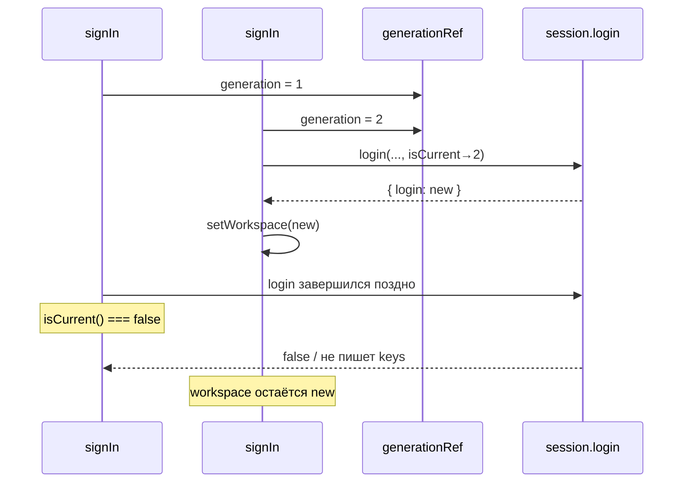
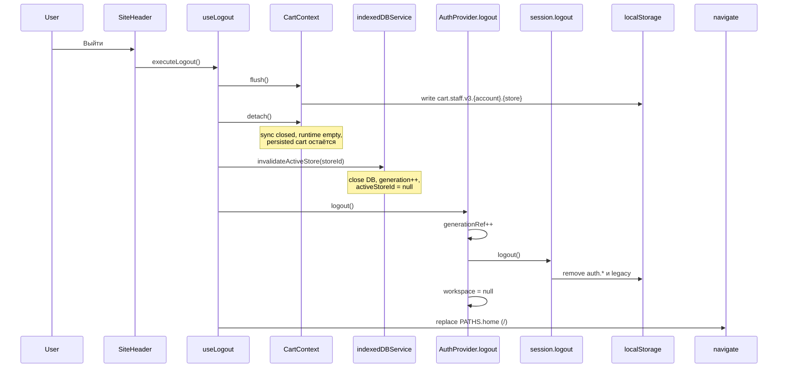

# Гонки и выход

::: tip Статус: проверено по коду
Generation guards, порядок `useLogout` и политика «flush/detach, не clear» сверены с `AuthContext`, `useLogout` и тестами `*.test.jsx`.
:::

## Назначение

Объяснить, почему async login/restore опасны без generation counter, что именно делает кнопка «Выйти», и почему корзина после logout **не** должна исчезать из `localStorage`.

## Простыми словами

Пока пользователь жмёт «Войти», браузер ждёт Web Crypto. За это время можно успеть нажать «Выйти», открыть вторую попытку входа или получить поздний ответ от restore, стартовавшего при загрузке страницы. Без **generation** старый ответ перезапишет новый workspace — человек увидит чужой магазин или «воскресшую» сессию.

Logout в UI — не одна функция, а **сценарий очистки runtime**: сохранить корзину на диск, отцепить её от React, закрыть активный IndexedDB store, стереть auth keys, уйти на `/`.

## Исходные файлы

- [`src/auth/AuthContext.jsx`](https://github.com/iscander-b10/tyres_discs/blob/main/src/auth/AuthContext.jsx)
- [`src/auth/useLogout.js`](https://github.com/iscander-b10/tyres_discs/blob/main/src/auth/useLogout.js)
- [`src/auth/session.js`](https://github.com/iscander-b10/tyres_discs/blob/main/src/auth/session.js)
- [`src/cart/CartContext.jsx`](https://github.com/iscander-b10/tyres_discs/blob/main/src/cart/CartContext.jsx) — `flush` / `detach`
- [`src/services/indexedDBService.js`](https://github.com/iscander-b10/tyres_discs/blob/main/src/services/indexedDBService.js) — facade, через который `useLogout` вызывает `invalidateActiveStore`
- [`src/services/catalogIdb/catalogIdbSession.js`](https://github.com/iscander-b10/tyres_discs/blob/main/src/services/catalogIdb/catalogIdbSession.js) — реализация `invalidateActiveStore`

---

## Generation guard

### Назначение

`generationRef` в `AuthProvider` — монотонный счётчик «эпохи» auth-операций.

### Как работает

1. Перед `restore` или `signIn`: `const generation = ++generationRef.current`
2. В замыкание кладётся `isCurrent = () => generationRef.current === generation`
3. `isCurrent` передаётся в `session.login` / `session.restore`
4. `logout` (Context) и cleanup effect делают `generationRef.current += 1` → все старые `isCurrent()` становятся `false`

### Зачем дублировать проверку в session

Между `await wrapPassword` и `writeStorage` тоже есть щель. Session проверяет `isCurrent` **до записи ключей**, чтобы logout не оставлял секрет после «отменённого» login.

### Состояние

Только ref — не вызывает re-render сам по себе.

### Ошибки

Не бросает; устаревший путь возвращает `false` / `null`.

### Тесты

| Тест | Файл |
| --- | --- |
| Поздний restore не затирает signIn | `AuthContext.test.jsx` |
| Logout инвалидирует signIn | `AuthContext.test.jsx` |
| Старый параллельный signIn проигрывает | `AuthContext.test.jsx` |
| Поздний login не пишет keys | `session.test.js` |
| Устаревший restore не зовёт logout keys новой сессии | `session.test.js` |



---

## Sequence: logout



---

## `useLogout`

### Назначение

Единый staff-сценарий выхода для UI.

### Сигнатура

```js
export function useLogout()
```

### Результат

`() => void` — стабильный callback (`useCallback`).

### Зависимости hooks

| Hook | Зачем |
| --- | --- |
| `useAuth()` | `logout`, `workspace.storeId` |
| `useCart()` | `flush`, `detach` |
| `useNavigate()` | Уход на home |

### Алгоритм

1. `flush()` — синхронно дописать envelope корзины в LS
2. `detach()` — отцепить runtime (внутри снова может flush)
3. `indexedDBService.invalidateActiveStore(workspace?.storeId)`
4. `logout()` — auth generation + session keys + clear workspace
5. `navigate(PATHS.home, { replace: true })`

### Side effects

LS (cart write, auth delete), закрытие IDB, React auth/cart state, history replace.

### Чего намеренно нет

**Не вызывает `cart.clear()`.** Clear изменил бы persisted envelope (пустая корзина с новым revision) или удалил бы ключ — это другая операция.

### Вызывающие стороны

`SiteHeader` (кнопка выхода). Не использовать «голый» Context `logout` в том же месте.

### Ошибки

`flush` при ошибке записи логирует cart-persist failure и возвращает `false`; logout всё равно продолжается. Auth errors здесь не ожидаются (синхронно).

### Security-ограничения

Локальная очистка. Другие вкладки с уже восстановленной сессией продолжают работать, пока сами не прочитают отсутствие keys / не сделают reload. Это не server-side session revoke.

### Тесты

#### `useLogout.test.jsx`

Порядок вызовов:

`flush` → `detach` → `invalidateActiveStore('store-a')` → `logout` → `navigate('/', { replace: true })`

`clear` **не** вызывается.

#### `useLogout.cartPolicy.test.jsx`

Интеграция с реальным `CartProviderCore`:

1. Добавить товар
2. Ключ `getCartStorageKey(accountId, storeId)` содержит envelope v3
3. После logout:
   - ключ **не** удалён (`removeItem` не звали для cart key)
   - items в LS на месте
   - runtime `cart.items === []`, `isLoaded === false`

---

## Политика корзины при logout

| Действие | Persisted v3 | Runtime Context |
| --- | --- | --- |
| `flush` | Обновляет | Без изменения модели |
| `detach` | Сохраняет (после flush) | Пусто, `isLoaded=false` |
| `clear` | Меняет/чистит | Пустая корзина — **не часть logout** |
| Повторный login того же account+store | Загрузит ту же v3 | Снова `isLoaded` |

Связь с workspace: ключ корзины зависит от `accountId` и `storeId`. Смена учётки → другой ключ → другая корзина. Тот же login после logout → та же корзина.

---

## `invalidateActiveStore` в контексте logout

### Назначение (для auth-потока)

Закрыть активную `CatalogDatabase.<encodeURIComponent(storeId)>`, поднять
generation catalog session, чтобы запоздалые open/sync не писали в
отсоединённый store.

### Вызов из logout

```js
indexedDBService.invalidateActiveStore(workspace?.storeId)
```

Если `storeId` не совпадает с активным — метод вернёт `false` и не тронет чужой runtime (защита от ошибочного id).

### Связь с Auth

После `workspace = null` `WorkspaceHosts` размонтирует `CatalogSyncHost` / `CartReconciliationHost`. Invalidate заранее рвёт IDB, чтобы не оставался «висящий» handle.

Детали API IDB — в разделе каталога; здесь важен только порядок относительно auth.

---

## Связь logout с AppShell и маршрутами

После `navigate('/')`:

- `isAuthenticated === false`
- `HomeRoute` / landing снова доступны
- `canUseApp` → false на `/` и `/tyres` без сессии; на `/demo*` true
- `AppShell` принудительно держит client mode для гостя
- Catalog panels не в `showCatalog`

`sessionResetKey` / `workspaceResetKey` в shell реагируют на смену auth/workspace и перемонтируют поиск при следующем входе (см. [Состояние AppShell](/03-routing-shell/app-shell-state)).

---

## `AuthProvider.logout` vs `useLogout`

| | Context `logout` | `useLogout` |
| --- | --- | --- |
| Чистит LS auth | Да | Да (через Context) |
| Generation++ | Да | Да |
| Flush/detach cart | Нет | Да |
| Invalidate IDB | Нет | Да |
| Navigate | Нет | Да |
| Когда звать | Fail-path внутри auth; низкоуровнево | Кнопка «Выйти», любой UX выхода |

---

## Крайние случаи

| Сценарий | Ожидание |
| --- | --- |
| Logout во время `signIn` | Generation++ → login вернёт false, keys пусты |
| Logout без активного workspace | `invalidate(undefined)` / detach no-op; auth clear всё равно |
| Две вкладки: logout в одной | Другая сохраняет React state до reload; LS keys уже пусты — следующий restore там даст guest |
| StrictMode double mount | Cleanup бампит generation; второй restore актуален |
| Flush упал (LS quota) | Detach/logout всё равно идут; возможна потеря последнего незаписанного изменения — риск UX, не security boundary |

---

## Предупреждения для начинающего разработчика

1. **Не добавляйте `clear()` в `useLogout` «для чистоты»** — сломаете политику сохранения корзины; упадёт `useLogout.cartPolicy.test.jsx`.
2. **Не убирайте `isCurrent` из session**, даже если «в UI один клик» — StrictMode и быстрый logout реальны.
3. **Не делайте logout только через `session.logout()`** — React останется с старым `workspace`, sync hosts продолжат работу.
4. **Не считайте navigate частью security** — это UX; защита ключей — в `session.logout`.
5. При отладке смотрите и Application → Local Storage, и React Context: они могут временно расходиться в гонках.

---

## Известные ограничения

- Нет BroadcastChannel «auth-logout» между вкладками.
- Нет блокировки повторного входа на сервере.
- Fingerprint logout при смене UA выглядит для пользователя как «выйти сами», хотя это fail restore.
- Demo-режим (`isDemo(pathname)`) открывает `/demo*` без login; кнопка «Выйти» там скрыта, `useLogout` с демо не вызывается.

---

## Связанные страницы

- [Клиентская модель](/04-auth/client-auth-model)
- [Сессия, crypto и workspace](/04-auth/session-crypto-workspace)
- [Маршруты и вход](/03-routing-shell/routes-and-login-modal)
- [Миграция и вкладки корзины](/09-cart/migration-and-multitab)
- [Жизненный цикл IndexedDB](/05-catalog-storage/lifecycle-and-migration)
