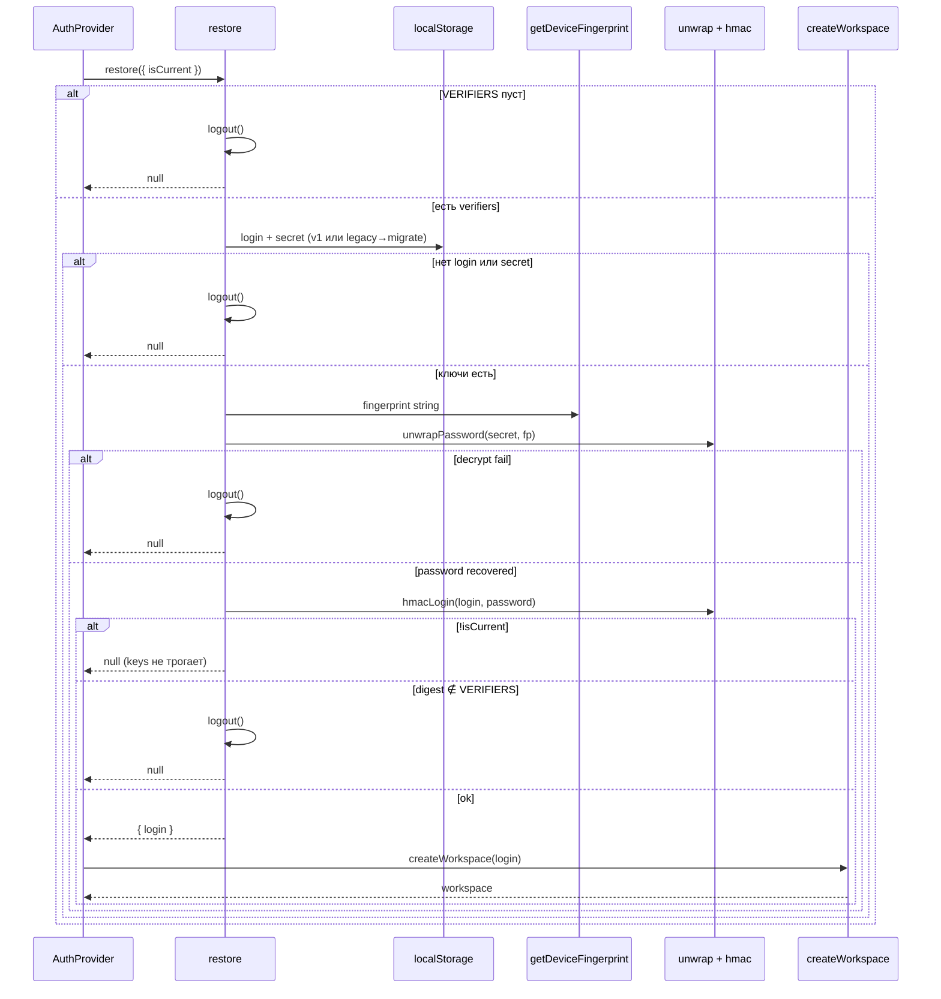
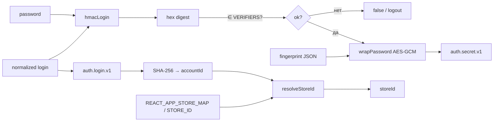

# Сессия, crypto и workspace

::: tip Статус: проверено по коду
HMAC, AES-GCM, fingerprint, `localStorage`, `accountId`/`storeId` и генератор verifier сверены с `src/auth/**` и `scripts/generate-auth-verifier.js`.
:::

::: warning
Здесь описана **криптография локальной сессии**, а не серверный login. Verifier и fingerprint не заменяют IAM, TLS-политику Object Storage или секреты Cloud Functions.
:::

## Назначение

Разобрать, как пароль превращается в запись в `localStorage`, как она снова становится workspace после F5, и как login отображается на `storeId` каталога.

## Простыми словами

1. **HMAC** — «отпечаток» пары login+password. Его можно сравнить со списком допустимых, не храня пароль в bundle.
2. **AES-GCM** — шифрование пароля перед записью в `localStorage`, чтобы сосед по компьютеру не увидел пароль открытым текстом в Application tab (при условии, что fingerprint совпадает только на похожем устройстве/браузере).
3. **Fingerprint** — JSON из UA, платформы, языка, таймзоны, CPU, памяти и экрана. Это **не** криптографический device attestation.
4. **Workspace** — три поля после успешного входа: кто (`login`), какой аккаунт (`accountId`), какой магазин (`storeId`).

## Исходные файлы

- [`src/auth/session.js`](https://github.com/iscander-b10/tyres_discs/blob/main/src/auth/session.js)
- [`src/auth/crypto.js`](https://github.com/iscander-b10/tyres_discs/blob/main/src/auth/crypto.js)
- [`src/auth/fingerprint.js`](https://github.com/iscander-b10/tyres_discs/blob/main/src/auth/fingerprint.js)
- [`src/auth/workspace.js`](https://github.com/iscander-b10/tyres_discs/blob/main/src/auth/workspace.js)
- [`scripts/generate-auth-verifier.js`](https://github.com/iscander-b10/tyres_discs/blob/main/scripts/generate-auth-verifier.js)

---

## Sequence: восстановление сессии



---

## Схема хранения

| Ключ | Содержимое | Кто пишет | Кто читает |
| --- | --- | --- | --- |
| `auth.login.v1` | Normalized email | `login` | `restore` |
| `auth.secret.v1` | Base64(`IV[12]` ‖ ciphertext) | `login` | `restore` |
| `ivanor-auth-login` | Legacy login | Только миграция/очистка | `readStorageWithMigration` |
| `ivanor-auth-secret` | Legacy secret | Только миграция/очистка | `readStorageWithMigration` |
| `REACT_APP_AUTH_VERIFIER` | CSV hex digests | Скрипт сборки | `session` при загрузке модуля |

Связанные, но **не** auth-ключи:

| Ключ / база | Связь |
| --- | --- |
| `cart.staff.v3.{accountId}.{storeId}` | Корзина того же workspace |
| `CatalogDatabase.<encodeURIComponent(storeId)>` | IndexedDB каталога |



---

## Модуль `session.js`

Константы:

```js
LOGIN_KEY = 'auth.login.v1'
SECRET_KEY = 'auth.secret.v1'
LEGACY_LOGIN_KEY = 'ivanor-auth-login'
LEGACY_SECRET_KEY = 'ivanor-auth-secret'
VERIFIERS = split/trim REACT_APP_AUTH_VERIFIER
```

`VERIFIERS` вычисляется **один раз при импорте модуля**.

### Внутренние функции storage

#### `readStorage(key)`

| | |
| --- | --- |
| Назначение | Безопасное чтение `localStorage` |
| Сигнатура | `(key: string) => string \| null` |
| Ошибки | Любой throw → `null` |
| Side effects | Нет записи |
| Чистота | Читает внешнее хранилище |

#### `writeStorage(key, value)`

| | |
| --- | --- |
| Назначение | Запись без try (ошибка всплывает к `login`) |
| Сигнатура | `(key, value) => void` |
| Side effects | `localStorage.setItem` |

#### `removeStorage(key)`

| | |
| --- | --- |
| Назначение | Удаление ключа; ошибки глотаются |
| Сигнатура | `(key) => void` |

#### `readStorageWithMigration(newKey, legacyKey)`

| | |
| --- | --- |
| Назначение | Прочитать v1; если пусто — legacy и по возможности скопировать в v1 |
| Алгоритм | 1) new; 2) legacy; 3) `writeStorage(new, legacy)` в try; при fail write всё равно вернуть legacy |
| Side effects | Может записать v1 ключ |

#### `hasVerifier(digest)`

| | |
| --- | --- |
| Назначение | `VERIFIERS.includes(digest)` |
| Чистота | Pure относительно массива модуля |

#### `alwaysCurrent`

| | |
| --- | --- |
| Назначение | Default `isCurrent` = `() => true` для вызовов без race guard |

---

### `login`

#### Назначение

Проверить пароль по verifier и сохранить сессию.

#### Сигнатура

```js
export async function login(email, password, { isCurrent = alwaysCurrent } = {})
```

#### Параметры

| Параметр | Тип | Смысл |
| --- | --- | --- |
| `email` | any → string | Нормализуется |
| `password` | string | Пустой → сразу `false` |
| `isCurrent` | `() => boolean` | Race guard от AuthContext |

#### Результат

- `{ login: string }` — успех
- `false` — отказ / гонка / ошибка persist

#### Алгоритм

1. Если нет `VERIFIERS` или нет `password` → `false`
2. `loginName = normalizeLogin(email)`; пусто → `false`
3. `digest = await hmacLogin(loginName, password)`
4. Если `!hasVerifier(digest) || !isCurrent()` → `false`
5. `secret = await wrapPassword(password, getDeviceFingerprint())`
6. Если `!isCurrent()` → `false` (после unwrap/wrap await — ключи ещё не писались)
7. `writeStorage(LOGIN_KEY)`, `writeStorage(SECRET_KEY)`
8. catch persist → лог `auth.infra_failed`, при current `logout()`, `false`
9. return `{ login: loginName }`

#### Side effects

Запись LS; при fail — полная очистка auth keys.

#### Вызывающие стороны

`AuthProvider.signIn` (как `loginSession`).

#### Security

Пароль не пишется открытым текстом. Digest не пишется в LS — только пересчитывается при restore. Verifier остаётся в памяти модуля из env.

#### Тесты

`session.test.js`: поздний login после `isCurrent=false` + `logout` не оставляет ключей.

#### Пример

```js
const session = await login('User@Example.COM', 'secret', {
  isCurrent: () => generation === currentGeneration,
});
// session → { login: 'user@example.com' } или false
```

---

### `restore`

#### Назначение

Поднять сессию из LS после перезагрузки.

#### Сигнатура

```js
export async function restore({ isCurrent = alwaysCurrent } = {})
```

#### Результат

`{ login }` | `null`

#### Алгоритм

1. Нет verifiers → `logout` если current, `null`
2. Читать login/secret с миграцией
3. Нет одного из них → `logout` если current, `null`
4. `password = unwrapPassword(secret, fingerprint)`
5. `digest = hmacLogin(loginName, password)`
6. `!isCurrent()` → `null` **без** logout (не сносить более новую сессию)
7. Нет verifier → `logout()`, `null`
8. Успех → `{ login: normalizeLogin(loginName) }`
9. catch unwrap/crypto → `logout` если current, `null`

#### Крайние случаи

| Случай | Поведение |
| --- | --- |
| Сменили пароль в AUTH_USERS, пересобрали | Старый digest не в списке → logout |
| Сменили браузер / UA | unwrap fail → logout |
| Параллельный новый login во время старого restore | `isCurrent=false` → null, ключи новой сессии целы |

#### Тесты

`session.test.js`: устаревший restore не удаляет ключи новой сессии.

---

### `logout` (session)

#### Назначение

Удалить текущие и legacy auth keys.

#### Сигнатура

```js
export function logout()
```

#### Алгоритм

`removeStorage` для всех четырёх ключей.

#### Side effects

Только `localStorage`. Не трогает корзину, IDB, React.

#### Вызывающие стороны

`AuthProvider.logout`, fail-path `login`/`restore`, тесты.

#### Тесты

`session.test.js` — все четыре ключа становятся `null`.

---

## Модуль `crypto.js`

Web Crypto API (`crypto.subtle`). В Node-тестах подменяется `webcrypto`.

### `normalizeLogin`

| | |
| --- | --- |
| Назначение | Единый канонический login |
| Сигнатура | `(login) => string` |
| Алгоритм | `String(login ?? '').trim().toLowerCase()` |
| Чистота | Pure |
| Тесты | `crypto.test.js` table-driven |

### `createAccountId`

| | |
| --- | --- |
| Назначение | Стабильный hex SHA-256 от normalized login |
| Сигнатура | `async (login) => string` |
| Результат | 64 hex chars |
| Зачем | Ключ корзины и lookup в `REACT_APP_STORE_MAP` без хранения PII как имени файла |
| Тесты | Одинаковый hash для `' User@Example.COM '` и `'user@example.com'` |

### `hmacLogin`

| | |
| --- | --- |
| Назначение | Verifier digest = HMAC-SHA256(key=password, data=normalized login) |
| Сигнатура | `async (login, password) => hex string` |
| Согласованность | Должен совпадать с Node `createHmac` в генераторе |
| Security | Password — ключ HMAC; login — сообщение |

### `wrapPassword`

| | |
| --- | --- |
| Назначение | Зашифровать пароль для LS |
| Сигнатура | `async (password, fingerprintString) => base64` |
| Алгоритм | SHA-256(fingerprint) → AES-GCM key; random IV 12 bytes; encrypt; pack IV‖cipher; base64 |
| Side effects | `getRandomValues` |

### `unwrapPassword`

| | |
| --- | --- |
| Назначение | Расшифровать секрет сессии |
| Сигнатура | `async (blob, fingerprintString) => string password` |
| Ошибки | Короткий blob → `Error('Некорректный секрет сессии')`; неверный ключ → throw от `decrypt` |
| Вызывающие | Только `restore` |

### Внутренние helpers

| Функция | Роль |
| --- | --- |
| `toHex` | ArrayBuffer → hex |
| `bytesToBase64` / `base64ToBytes` | Упаковка секрета |
| `fingerprintAesKey` | SHA-256(fp) → `importKey` AES-GCM |

---

## Модуль `fingerprint.js`

### `getDeviceFingerprint`

| | |
| --- | --- |
| Назначение | Строка для AES-ключа обёртки пароля |
| Сигнатура | `() => string` (JSON) |
| Поля | `ua`, `platform`, `lang`, `tz`, `hw`, `mem`, `screen` |
| Side effects | Читает `navigator` / `Intl` / `screen` |
| Ограничения | Легко меняется; не стойкий к целевой атаке; XSS всё равно читает LS после unwrap в том же JS-мире |
| Тесты | Отдельного unit нет; мокается в `session.test.js` |

---

## Модуль `workspace.js`

### `resolveStoreId`

#### Назначение

Выбрать `storeId` для аккаунта.

#### Сигнатура

```js
export function resolveStoreId({
  accountId,
  login,
  storeMap = process.env.REACT_APP_STORE_MAP,
  fallbackStoreId = process.env.REACT_APP_STORE_ID,
})
```

#### Алгоритм приоритета

1. `storeMap[accountId]` если непустая строка
2. иначе `storeMap[normalizeLogin(login)]`
3. иначе `trim(fallbackStoreId)`

`storeMap` — JSON-объект в строке env. Битый JSON / массив / пусто → `{}`, дальше fallback.

#### Тесты

`workspace.test.js` — приоритет accountId; fallback на login; fallback на `REACT_APP_STORE_ID`.

### `createWorkspace`

#### Назначение

Атомарно собрать объект workspace.

#### Сигнатура

```js
export async function createWorkspace(login, config = {})
```

#### Результат

```js
{
  login: string,      // normalized
  accountId: string,  // sha-256 hex
  storeId: string     // из map или fallback
}
```

#### Вызывающие стороны

`AuthProvider` после успешного `login` / `restore`.

#### Пример

```js
await createWorkspace('User@Example.COM', {
  storeMap: '{"account-hash":"ElistaIvanor"}',
  fallbackStoreId: 'DefaultStore',
});
```

### Внутренние

| Функция | Роль |
| --- | --- |
| `readStoreMap` | JSON.parse с защитой от non-object |
| `readStoreId` | Достать непустую string-value по ключу |

---

## Генератор verifier {#генератор-verifier}

Файл: `scripts/generate-auth-verifier.js`  
Запуск: `prestart` → `development`, `prebuild` → `production`.

### `hmacLogin(login, password)` (Node)

Тот же контракт, что browser `hmacLogin`: HMAC-SHA256, hex.

### `parseEnv` / `readEnvFile` / `loadAuthEnv`

Собирает env из `.env`, `.env.<mode>`, `.env.local`, `.env.<mode>.local`, плюс process `AUTH_USERS` / `AUTH_LOGIN` / `AUTH_PASSWORD`.

### `collectUsers(env)`

| Источник | Формат |
| --- | --- |
| `AUTH_USERS` | `login:password,login2:password2` |
| иначе | пара `AUTH_LOGIN` + `AUTH_PASSWORD` |

### `upsertEnvValue(filePath, key, value)`

Пишет/обновляет строку `REACT_APP_AUTH_VERIFIER=...` в `.env.<mode>.local`.

### `main`

1. argv mode ∈ {development, production}
2. Собрать users; пусто → exit 1 с подсказкой
3. Склеить digests через `,`
4. Upsert в `.env.<mode>.local`
5. Лог имени файла (без печати digest в документации мы тоже не приводим)

### Security для разработчика

- Файлы `.env*.local` с паролями **не коммитить**.
- В CI/CD пароли — секреты пайплайна, в артефакт попадает только verifier.
- Не путать: `AUTH_*` (build-time secrets) ≠ `REACT_APP_AUTH_VERIFIER` (публичный клиентский список).

---

## Обработка ошибок (сводка)

| Место | Ошибка | Fallback |
| --- | --- | --- |
| `login` persist | throw setItem/wrap | лог, `logout`, `false` |
| `restore` unwrap | throw | `logout` (если current), `null` |
| `restore` race | `!isCurrent` | `null`, keys intact |
| Нет verifier list | — | login невозможен; restore чистит |
| `createWorkspace` | throw из digest | ловит AuthProvider, logout |

Код лога: `auth.infra_failed`, domain `auth`.

---

## Опасные места при изменении

1. **Поменять алгоритм HMAC** без одновременного обновления `generate-auth-verifier.js` — все пользователи «ломаются».
2. **Добавить поле в fingerprint** — массовый force-logout после деплоя.
3. **Писать digest в LS вместо re-verify** — потеряете отзыв учётки через пересборку verifier.
4. **Удалить legacy keys из `logout` слишком рано** — старые вкладки/профили оставят секрет.
5. **Менять формат `accountId`** — отвяжутся корзины v3.

Связанные тесты: `crypto.test.js`, `session.test.js`, `workspace.test.js`.

---

## Связанные страницы

- [Клиентская модель](/04-auth/client-auth-model)
- [Гонки и выход](/04-auth/races-and-logout)
- [Конфигурация](/01-getting-started/configuration)
- [Владение состоянием](/02-architecture/state-ownership)
- [Домен корзины](/09-cart/cart-domain-and-storage)
