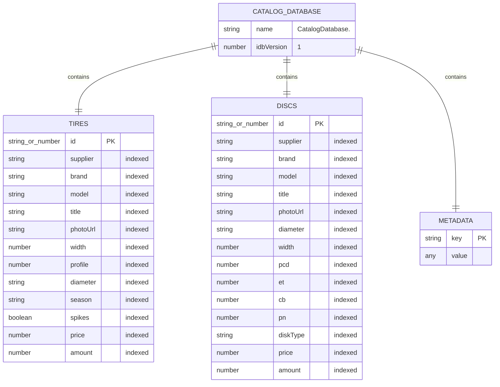
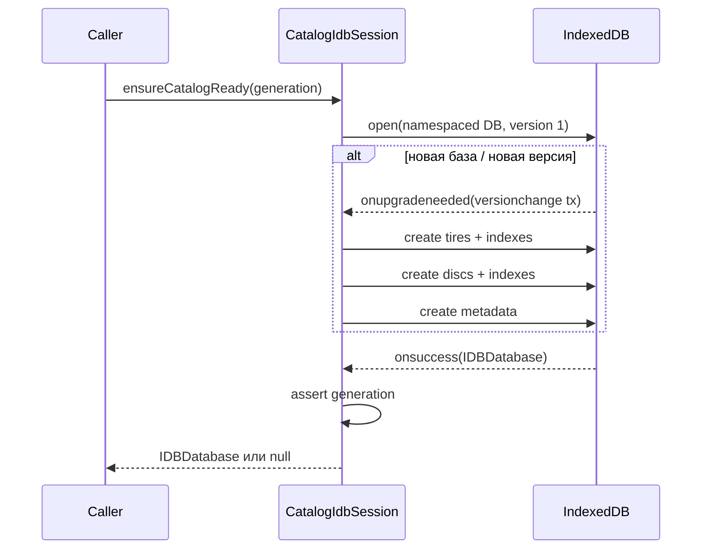

# Схема IndexedDB каталога

Эта страница описывает фактическую схему браузерного каталога. Источник истины —
`catalogSchema.js`, создание схемы выполняет `CatalogIdbSession.openCatalogDatabase`,
а `indexedDBService.js` служит только стабильным фасадом реэкспортов.

## Короткая модель

Для каждого магазина создаётся отдельная база:

```text
CatalogDatabase.<encodeURIComponent(storeId)>
```

Например, `store/a` превращается в `CatalogDatabase.store%2Fa`. Версия базы —
`CATALOG_DB_VERSION = 1`. Внутри всегда три object store: `tires`, `discs` и
`metadata`.

::: tip Две разные версии
`CATALOG_DB_VERSION` управляет структурой IndexedDB и событием
`onupgradeneeded`. `CATALOG_SCHEMA_VERSION` хранится в `metadata` и описывает
внутреннюю версию сохранённого каталога. `SUPPORTED_WIRE_SCHEMA_VERSION` из
валидатора относится уже к формату загружаемого JSON. Сейчас все три равны `1`,
но это разные контракты.
:::

## Владение и границы

### Активный production-код

- `catalogSchema.js` — имена базы, stores, metadata keys и списки индексов.
- `catalogIdbSession.js` — единственный владелец открытого `IDBDatabase`,
  транзакций, миграции и запросов.
- `indexedDBService.js` — facade: реэкспортирует схему, валидатор отдельных
  записей, matchers и singleton-сессию. Своей логики хранения не содержит.
- `catalogStoreNamespace.js` — нормализует `storeId` и экранирует его через
  `encodeURIComponent`.

### Deprecated compatibility

Поля `session.db` и `session.discDb` — deprecated тестовые shim-ссылки на ту же
объединённую базу `catalogDb`. Методы `openDatabase()` и
`openDiscDatabase()` — deprecated aliases для `ensureCatalogReady()`.

### Legacy, а не текущая схема

Безымянные базы `CatalogDatabase`, `TireDatabase`, `DiscDatabase` и ключ
`localStorage["ivanor.catalog.cloudVersion"]` читаются только однократной
миграцией магазина `ElistaIvanor`. Новые данные туда не записываются.

## Mermaid: stores и ключи



Индексы не уникальны. Связь товара с поставщиком логическая: отдельного store
поставщиков и внешних ключей нет. `id` должен быть уникален во всей категории,
не только внутри поставщика.

## Object stores

### `tires`

- **Роль:** материализованный каталог шин активного магазина.
- **Primary key:** `keyPath: "id"`; строка или конечное число.
- **Индексы:** `supplier`, `brand`, `model`, `title`, `photoUrl`, `width`,
  `profile`, `diameter`, `season`, `spikes`, `price`, `amount`.
- **Формат:** после snapshot-валидации общие поля нормализованы; геометрия —
  числа или `null`, `diameter` — строка вида `R16`, `season` — `s`, `w` или
  `null`, `spikes`/`runflat` — boolean или `null`.
- **Ограничение:** `runflat`, `sellingPrice`, `websitePrice`, `sizeTitle` и
  дополнительные cloneable-поля сохраняются, но индексов для них нет.

### `discs`

- **Роль:** материализованный каталог дисков активного магазина.
- **Primary key:** `keyPath: "id"`.
- **Индексы:** `supplier`, `brand`, `model`, `title`, `photoUrl`, `diameter`,
  `width`, `pcd`, `et`, `cb`, `pn`, `diskType`, `price`, `amount`.
- **Формат:** `width`, `pcd`, `et`, `cb`, `pn` — числа или `null`;
  `diskType` — `Литой`, `Штампованный` или `null`.

### `metadata`

| Ключ | Значение | Назначение |
|---|---|---|
| `snapshotVersion` | непустая строка версии | версия последнего атомарно подтверждённого snapshot |
| `migrationMarker` | `legacy-v1-completed` | не запускать legacy-миграцию повторно |
| `schemaVersion` | `1` | версия внутренней схемы мигрированных данных |

`snapshotVersion` записывается в той же транзакции, что `tires` и `discs`.
Поэтому подтверждённая версия не может опередить фактически сохранённые товары.

## Создание схемы: `openCatalogDatabase`

**Сигнатура:** `async openCatalogDatabase(expectedGeneration = this._generation)`.

**Роль.** Открыть базу активного магазина или вернуть уже открытый connection.

**Результат.** `Promise<IDBDatabase | null>`; `null` означает недоступный API
или синхронную/асинхронную ошибку открытия.

**Алгоритм.**

1. Проверяет generation, чтобы запрос не относился к старому магазину.
2. Возвращает кешированный `catalogDb`, если он существует.
3. Вызывает `indexedDB.open(getCatalogDatabaseName(activeStoreId), 1)`.
4. В `onupgradeneeded` создаёт недостающие stores и индексы.
5. В `onsuccess` повторно проверяет generation, сохраняет connection в
   `catalogDb` и временно дублирует его в deprecated `db`/`discDb`.
6. Если магазин успел смениться, закрывает только что открытый connection и
   отклоняет Promise с `StaleCatalogStoreError`.

**Async и side effects.** Открывает браузерную БД; schema mutation допустима
только внутри автоматической versionchange-транзакции `onupgradeneeded`.

**Callers / callees.** Вызывается `_doEnsureCatalogReady`; использует
`getCatalogDatabaseName`, константы stores и списки индексов.

**Ошибки и пределы.** Ошибки доступности логируются как `idb.unavailable` и
превращаются в `null`, но stale generation остаётся исключением. Нет обработчика
`onversionchange`, а изменение keyPath существующего store требует новой версии
БД и явной миграции.

## Транзакционные границы схемы



Versionchange-транзакция создаёт структуру. Обычные чтения и записи открывают
свои `readonly`/`readwrite` транзакции позднее; connection сам по себе не
является транзакцией.

## Гарантии и ограничения

- Разные `storeId` не делят базу и version metadata.
- `encodeURIComponent` предотвращает неоднозначные имена, но не является
  криптографической изоляцией.
- Схема разрешает дополнительные поля товара: IndexedDB сохраняет весь
  structured-cloneable объект, даже если поле не индексируется.
- Индексы ускоряют только часть equality-запросов; составных и range-индексов
  нет.
- Уникальность `id` обеспечивает keyPath/`put`, а глобальные дубликаты snapshot
  дополнительно отсекает валидатор.
- Сама схема не проверяет бизнес-тип полей; это ответственность
  `catalogSnapshotValidation.js`.

## Тесты, подтверждающие контракт

- `indexedDBService.fakeIndexedDB.test.js`: реальный fake-indexeddb проверяет
  три stores, индексы v1 и namespaced database name.
- Там же: `purge` затрагивает только выбранного поставщика; ошибка `put`
  откатывает товары и `snapshotVersion`.
- `indexedDBService.test.js`: разные `storeId` дают разные безопасные имена;
  недоступный IndexedDB выглядит пустым для чтения и запрещает запись.
- `catalogSyncService.commitBoundary.test.js`: validation/abort не меняют IDB,
  localStorage и broadcast до успешного commit.

## Пример инспекции

```js
const { databaseName, storeId } = indexedDBService.getActiveStore();
const db = await indexedDBService.ensureCatalogReady();
const tx = db.transaction(['tires', 'metadata'], 'readonly');
const tireRequest = tx.objectStore('tires').get('supplier_123');
const versionRequest = tx.objectStore('metadata').get('snapshotVersion');
```

В application-коде лучше пользоваться методами facade, а не открывать
транзакции напрямую: так сохраняются generation guards и единые fallback-правила.

## Риски изменений

1. Добавление/удаление индекса без повышения `CATALOG_DB_VERSION` не обновит уже
   созданные пользовательские базы.
2. Смена `id` или `keyPath` требует миграции данных, а не только правки
   `catalogSchema.js`.
3. Ослабление namespace по `storeId` может смешать каталоги разных workspace.
4. Запись `snapshotVersion` отдельной транзакцией разрушит atomic commit boundary.
5. Новый фильтр по неиндексированному полю корректен функционально, но может
   потребовать полного обхода store.

## Связанные страницы

- [Жизненный цикл и миграция](/05-catalog-storage/lifecycle-and-migration)
- [Запросы, фильтры и facets](/05-catalog-storage/queries-filters-facets)
- [Протокол и проверка snapshot](/06-catalog-sync/snapshot-protocol-validation)
