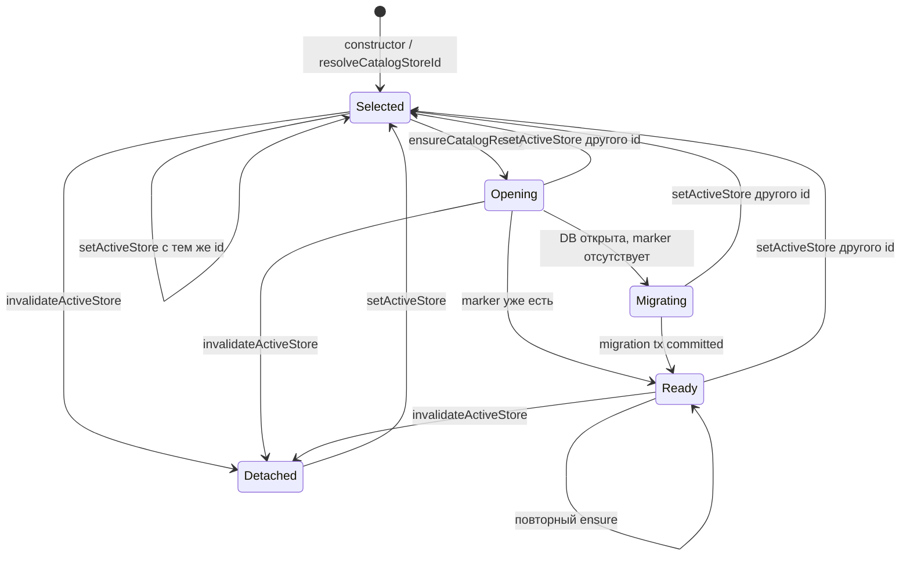
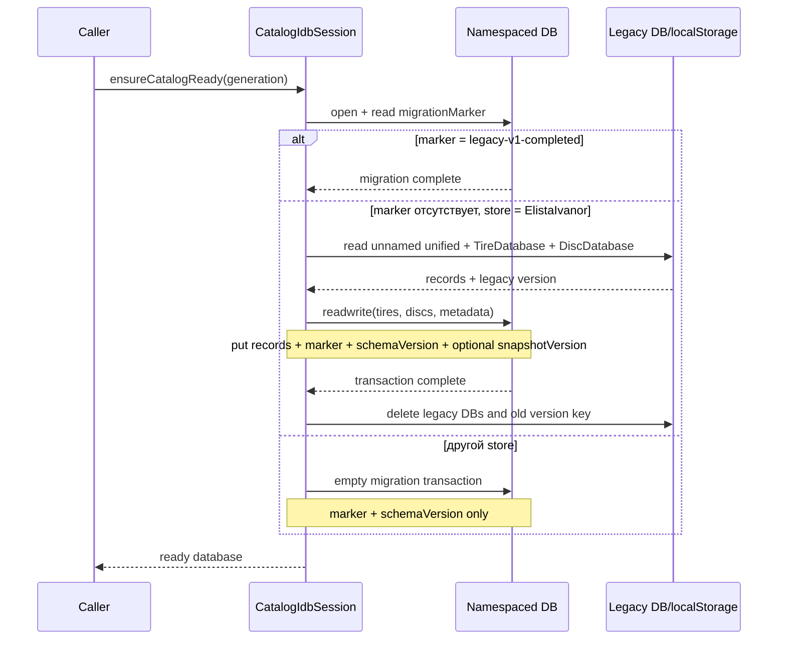

# Жизненный цикл, запись и миграция IndexedDB

`CatalogIdbSession` — singleton, который связывает активный магазин, открытое
соединение, однократную legacy-миграцию и транзакции записи. Facade
`indexedDBService.js` экспортирует этот singleton как default и не добавляет
собственного состояния.

## Три слоя, которые нельзя смешивать

### 1. Активный production lifecycle

`activeStoreId`, `_generation`, `catalogDb`, `_migrationComplete` и
`_ensurePromise` принадлежат `CatalogIdbSession`. UI и синхронизация используют
`setActiveStore`, `invalidateActiveStore`, `ensureCatalogReady`,
`applyCatalogSnapshot` и методы чтения.

### 2. Deprecated compatibility methods

- `openDatabase()` и `openDiscDatabase()` делегируют в `ensureCatalogReady()`.
- `db` и `discDb` указывают на тот же connection, что `catalogDb`.
- `saveTires`, `saveDiscs`, `replaceTiresForSupplier`,
  `replaceDiscsForSupplier` остаются рабочими, но production callers для
  синхронизации используют атомарный `applyCatalogSnapshot`. По поиску в
  репозитории replace-методы вызываются только тестами.

### 3. Legacy DB migration

Legacy-источники — `CatalogDatabase`, `TireDatabase`, `DiscDatabase` и старый
localStorage key. Они читаются только для default store `ElistaIvanor`, после
успешной транзакции удаляются best-effort и больше не участвуют в работе.

## Состояния сессии



`_generation` — монотонный runtime token. Он не хранится в IndexedDB. Любая
асинхронная операция запоминает generation и перед возвратом результата
проверяет, что магазин не сменился.

## Управление активным магазином

### `setActiveStore(storeId)`

- **Роль:** выбрать namespace каталога.
- **Параметр:** любой `storeId`; пустое значение нормализуется через env или
  `ElistaIvanor`.
- **Результат:** текущая generation; если id не изменился, lifecycle не
  сбрасывается.
- **Side effects:** при смене id увеличивает generation, закрывает connection,
  очищает promise/migration flags и deprecated aliases.
- **Callers:** `AppShellContext`, `CatalogSyncHost`, `catalogSyncService`, тесты.
- **Гарантия:** поздний результат старого магазина не становится текущим.

### `invalidateActiveStore(storeId?)`

- **Роль:** отсоединить runtime при logout/смене workspace.
- **Результат:** `false`, если передан другой store; иначе `true`.
- **Side effects:** увеличивает generation, закрывает connection, ставит
  `activeStoreId = null` и сбрасывает lifecycle.
- **Callers:** `useLogout`, `AppShellContext`.
- **Ограничение:** данные на диске не удаляются; это disconnect, не wipe.

### `getActiveStore()` и `isActiveStore(storeId, generation?)`

Это синхронные helpers без I/O. Первый возвращает
`{ storeId, generation, databaseName }`; второй используется sync-service как
race guard до и после сетевых/IDB операций.

## Подготовка базы и миграция

### `ensureCatalogReady(expectedGeneration = this._generation)`

**Результат:** `Promise<IDBDatabase | null>`.

**Алгоритм.**

1. Проверяет generation.
2. Если connection открыт и миграция завершена — возвращает его.
3. Дедуплицирует параллельные открытия через `_ensurePromise`.
4. `_doEnsureCatalogReady` открывает namespaced DB.
5. Читает `metadata.migrationMarker`.
6. При отсутствии marker запускает legacy migration transaction.
7. После каждого `await` проверяет generation.
8. В `finally` очищает только тот `_ensurePromise`, который сам ожидал.

**Async / boundaries.** Открытие, чтение marker, legacy reads, миграционная
readwrite-транзакция и cleanup — отдельные асинхронные этапы. Только перенос
товаров и запись metadata атомарны между собой; удаление legacy-баз идёт уже
после commit.

### Mermaid: миграция



### Правила выбора legacy-источника

Для шин и дисков объединённая безымянная `CatalogDatabase` имеет приоритет:
если соответствующий store непуст, отдельная `TireDatabase`/`DiscDatabase`
игнорируется. Версия берётся из metadata объединённой базы, затем fallback —
старый localStorage key.

`_runLegacyMigrationTransaction(legacyTires, legacyDiscs, generation,
database, migratedVersion)` открывает одну `readwrite` транзакцию на всех трёх
stores. Повторная проверка marker внутри самой транзакции делает операцию
идемпотентной. Любая синхронная ошибка вызывает `transaction.abort()`;
`onabort` отклоняет Promise.

::: warning Best-effort cleanup
`deleteLegacyDatabase` намеренно проглатывает `error`, `blocked` и синхронное
исключение. Поэтому cleanup не является гарантией удаления старых баз. Маркер в
новой базе — настоящая гарантия того, что данные не будут переноситься повторно.
:::

## Обычная запись одного поставщика

### `replaceCatalogItems({ supplier, items, skipped, storeName, entityName })`

- **Роль:** полностью заменить одну категорию одного поставщика.
- **Валидация:** `validateCatalogItemsForSupplier` требует массив, корректные
  `id`/`supplier`, structured-cloneability и точное совпадение supplier.
- **Результат:** `{ saved: items.length, skipped }`.
- **Транзакция:** один category store, режим `readwrite`.
- **Алгоритм helper-а `replaceSupplierItemsInStore`:** открыть cursor по индексу
  `supplier`; удалить все совпадения; после конца cursor выполнить `put` каждого
  нового item; завершение самой транзакции подтверждает успех.
- **Ошибки:** request/put error приводит к abort; старое состояние
  восстанавливается IndexedDB.
- **Предел:** пустой `items` означает подтверждённую очистку поставщика.

`saveCatalogItems` — compatibility helper: через `prepareCatalogItems` выбирает
supplier первого валидного товара, пропускает invalid/чужие записи и затем
делегирует replace. Для wire snapshot этот мягкий путь не применяется:
sync-validator либо нормализует весь snapshot, либо отклоняет его.

## Атомарное применение snapshot

### `applyCatalogSnapshot(commands, version)`

- **Роль:** единственная production commit boundary полного snapshot.
- **Параметры:** нормализованные команды `{ supplier, category, action,
  items? }[]` и строка версии.
- **Результат:** `{ applied, writes, skipped }`, где `writes` — количество
  категорий-команд, а не число товаров.
- **Caller:** `catalogSyncService.applyCatalogSnapshot`.
- **Callees:** `_getReadyContext`, `compareCatalogVersions`,
  `replaceSupplierItemsInStore`.

```mermaid
sequenceDiagram
    participant Sync as catalogSyncService
    participant S as CatalogIdbSession
    participant M as metadata
    participant T as tires/discs
    Sync->>S: applyCatalogSnapshot(commands, version)
    S->>S: drop keepPrevious; purge => items=[]
    S->>M: get(snapshotVersion) in one readwrite tx
    alt incoming <= current
        S-->>Sync: committed no-op {applied:false, skipped:true}
    else incoming > current
        loop последовательные writes
            S->>T: delete supplier rows by index
            S->>T: put normalized items
        end
        S->>M: put(snapshotVersion = version)
        T-->>S: transaction complete
        S-->>Sync: {applied:true, writes:N, skipped:false}
    end
```

Все `tires`, `discs` и `metadata` включены в одну `readwrite` транзакцию.
Команды выполняются последовательно, чтобы callbacks не завершили транзакцию
раньше следующей замены. `keepPrevious` вообще не создаёт write. `purge`
преобразуется в replace пустым массивом.

Если все категории пришли как `keepPrevious`, список товарных writes пуст, но
при более новой входящей версии metadata `snapshotVersion` всё равно
обновляется в этой транзакции: результат будет `applied: true, writes: 0`.

Сравнение версий лексикографическое (`<`/`>`). Гарантия корректного порядка
существует только для лексикографически сортируемого формата одинаковой формы.
Текущий cloud producer использует `YYYY-MM-DDTHH:mm:ss+03:00`; семантические
версии `v9`/`v10` или смешение offset-форматов так сравнивать нельзя.

### Commit и внешние side effects

После успешного IDB commit sync-service повторно проверяет generation, затем
обновляет namespaced localStorage version и вызывает `postCatalogApplied`.
При validation error, IDB abort или stale store оба внешних side effect не
выполняются. LocalStorage — вспомогательный сигнал; persisted metadata является
источником подтверждённой версии.

## Ошибки и fallback-поведение

- `StaleCatalogStoreError`: операция относится к старой generation; результат
  нельзя показывать или публиковать.
- IndexedDB отсутствует/не открывается: чтение возвращает пустые значения, запись
  отклоняется с «IndexedDB недоступен».
- Ошибка request/transaction: Promise отклоняется исходной причиной, если она
  сохранена, иначе `transaction.error` или доменное fallback-сообщение.
- Ошибка cleanup legacy sources не отменяет уже committed миграцию.
- Нет retry внутри сессии; решение о следующей синхронизации принимает
  `catalogSyncService`.

## Тесты и доказанные гарантии

- `indexedDBService.test.js`: закрытие connection при смене store, generation
  race, invalidate с совпадающим/чужим id, unavailable IndexedDB.
- Там же: replace success, empty replace, rollback при первом/втором `put`,
  snapshot idempotency и запрет downgrade версии.
- `indexedDBService.fakeIndexedDB.test.js`: schema и настоящий transaction abort,
  изоляция legacy данных, перенос только в `ElistaIvanor`, marker и cleanup.
- `catalogSyncService.commitBoundary.test.js`: invalid snapshot ничего не пишет;
  broadcast/localStorage идут после commit; abort оставляет старый каталог.

## Пример изменения магазина

```js
const generation = indexedDBService.setActiveStore(workspace.storeId);
const version = await indexedDBService.getPersistedCatalogVersion();

if (!indexedDBService.isActiveStore(workspace.storeId, generation)) {
  throw Object.assign(new Error('Устаревший результат'), {
    name: 'StaleCatalogStoreError',
  });
}
```

## Риски изменений

1. Удаление generation checks вернёт гонку «старый магазин перезаписал новый».
2. Параллельный запуск supplier replacements вне общей транзакции разрушит
   атомарность snapshot.
3. Перенос localStorage/broadcast до `transaction.oncomplete` опубликует
   неприменённую версию.
4. Миграция legacy-баз для любого storeId смешает каталоги workspace.
5. Изменение семантики пустого массива может превратить временный upstream
   сбой в массовое удаление.
6. Новая версия должна сохранять лексикографический порядок либо заменить
   `compareCatalogVersions`.

## Связанные страницы

- [Схема IndexedDB](/05-catalog-storage/indexeddb-schema)
- [Запросы, фильтры и facets](/05-catalog-storage/queries-filters-facets)
- [Протокол и проверка snapshot](/06-catalog-sync/snapshot-protocol-validation)
