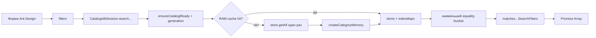
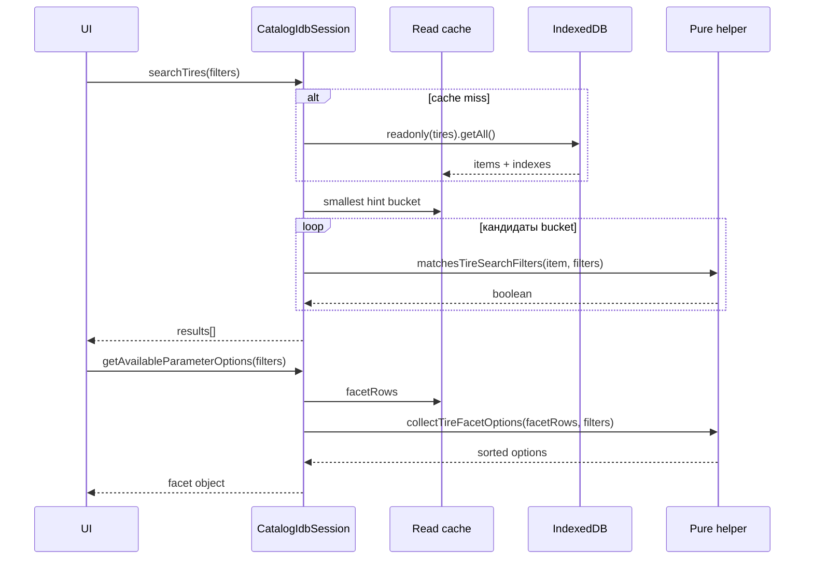

# Чтение, поиск, фильтры и facets

Подсистема чтения разделена на слои:

1. `catalogIdbMemory.js` — RAM-копия активного generation: items, equality-buckets,
   компактные facet-rows.
2. `catalogIdbQueries.js` — hint-порядок и `pickEqualityFilterKey` /
   `pickEqualityIndex` (IDB cursor helper; production search его не вызывает).
3. `catalogSearchFilters.js` — чистые предикаты полной проверки записи.
4. `catalogFacetOptions.js` — чистое построение зависимых вариантов фильтров.

`CatalogIdbSession` владеет IndexedDB (persistence) и read-cache. Поиск и facets
читают RAM; `getAll` category store выполняется **один раз на generation/revision**.
Витрина и cart-read по-прежнему ходят в IDB. `indexedDBService.js` — facade.

## Active, compatibility и helpers

### Активный production API

- `searchTires(filters)`, `searchDiscs(filters)`;
- `getAvailableParameterOptions(filters)`,
  `getAvailableDiscParameterOptions(filters)`;
- `collectTireShowcaseCandidates(options)`,
  `collectDiscShowcaseCandidates(options)`;
- `readCartCatalogItems(references)`, `getPersistedCatalogVersion()`,
  `isCatalogEmpty()`.

### Чистые helpers

`isActiveFilterValue`, `matches*`, `collect*FacetOptions`,
`pickEqualityFilterKey`, `pickEqualityIndex`, `selectIndexedCandidates`,
`createCategoryMemory`, `collectShowcaseCandidatesFromStore` не владеют
connection. Почти все синхронны; showcase helper возвращает Promise из-за
cursor API.

### Compatibility

Legacy DB не читаются поиском: они участвуют только в миграции. Deprecated
`openDatabase`/`openDiscDatabase` не создают альтернативного query path.

## Общий конвейер поиска



Bucket сужает множество кандидатов, но никогда не заменяет полную проверку.
Это важно для нескольких брендов, диапазонов, `minAmount`, `runflat` и
неиндексированных сочетаний.

Кэш сбрасывается при `setActiveStore`, `invalidateActiveStore`, успешном
`applyCatalogSnapshot`, `replaceCatalogItems` и после legacy-миграции
(`_dataRevision++`). Hydrate, начатый до invalidate, не записывает stale
массив.

## Выбор индекса: `pickEqualityFilterKey`

**Сигнатура:** `pickEqualityFilterKey(filters, hintOrder)` → `{ key, value } | null`.

`pickEqualityIndex(store, filters, hintOrder)` открывает IDB cursor по этому
ключу — остаётся helper'ом; hot path поиска использует те же hints, но в RAM
берёт **наименьший** bucket среди активных hint-полей (`selectIndexedCandidates`).

Приоритет шин: `width → profile → diameter → brand → supplier → season`.
Приоритет дисков: `diameter → pcd → pn → diskType → brand → supplier`.

`season` у шин последний: форма почти всегда шлёт сезон, и прежний порядок
`diameter → season` сканировал все летние шины при выбранной ширине.

Алгоритм first-match для IDB helper:

- scalar brand или массив из одного brand допускает ключ `brand`;
- несколько брендов не представимы одним equality-ключом;
- если подходящего hint нет — полный проход.

Range-фильтры дисков (`widthFrom`, `cb`, `et`) не имеют equality-hint и
проверяются matcher'ом после bucket.

**Тесты:** `catalogIdbQueries.test.js` фиксирует, что `season+width` выбирает
`width`, а не `season`. RAM-селективность — `catalogIdbMemory.test.js`.

## `searchTires(filters)`

- **Роль:** найти шины по полной совокупности фильтров.
- **Результат:** `Promise<Array<object>>`; недоступный IndexedDB даёт `[]`.
- **Чтение:** RAM-кэш `tires`; `getAll` только при hydrate.
- **Caller:** `TiresSearchParameters`.
- **Callees:** `_ensureReadCache`, `filterIndexedItems`,
  `matchesTireSearchFilters`.
- **Side effects:** нет записи; при промахе кэша — один readonly `getAll`.

Полный matcher проверяет:

- `width`, `profile` через числовое `Number(left) === Number(right)`;
- `diameter` через строковое сравнение;
- точный `season`, `supplier`;
- brand scalar или inclusion в массиве;
- `spikes`: строгий boolean, если filter не `undefined`;
- `runflat`: только `true` является ограничением;
- `amount >= minAmount`, если `minAmount` преобразуется в число.

`null`, `undefined`, пустая строка и пустой массив считаются неактивными. Для
`spikes` есть специальная семантика: `false` активен и требует именно
`item.spikes === false`.

## `searchDiscs(filters)`

- **Роль:** найти диски.
- **Результат:** `Promise<Array<object>>`, fallback `[]`.
- **Чтение:** RAM-кэш `discs`; `getAll` только при hydrate.
- **Caller:** `DiscsSearchParameters`.
- **Callees:** `_ensureReadCache`, `filterIndexedItems`,
  `matchesDiscSearchFilters`.

Matcher проверяет brand, supplier, diameter, `pcd`, `pn`, `diskType`,
`minAmount`, а также включительные диапазоны:

- `widthFrom <= width <= widthTo`;
- `cbFrom <= cb <= cbTo`;
- `etFrom <= et <= etTo`.

Если у товара диапазонное поле отсутствует/нечисловое, активный range filter
его исключает. Границы преобразуются через `Number`; UI должен не передавать
нечисловые активные строки.

## Facets: варианты, которые не блокируют сами себя

Facet — список допустимых значений следующего выбора с учётом других фильтров.
Session читает компактные `facetRows` из RAM-кэша (уникальные комбинации
размера/бренда/поставщика, не полный SKU-массив), затем чистая функция строит
Sets и сортированные массивы.

### `getAvailableParameterOptions(filters = {})`

**Результат:**

```js
{
  widths: [], profiles: [], diameters: [],
  seasons: [], brands: [], suppliers: []
}
```

**Чтение:** RAM-кэш `tires` (hydrate = один `getAll` на generation). **Caller:**
`TiresSearchParameters`. При unavailable IDB возвращается объект пустых
массивов той же формы.

`collectTireFacetOptions(items, filters)` реализует «своё поле не фильтрует
себя»:

- width зависит от profile + diameter;
- profile зависит от width + diameter;
- diameter зависит от width + profile;
- season/brand/supplier требуют совпадения всей тройки размеров;
- активный season предварительно отсекает товары для всех options.

Пример: при выбранных `205/55 R16` ширины могут содержать `205` и `215`, если
`215/55 R16` существует. Это позволяет пользователю изменить уже выбранную
ширину.

### `getAvailableDiscParameterOptions(filters = {})`

**Результат:** `{ brands, suppliers, diameters, widths, cb, et, pcd, pn,
diskTypes }`.

Каждая геометрическая facet игнорирует собственный фильтр, но уважает остальные.
Например, список `et` проверяет supplier, diameter, pcd, pn, diskType, width и
cb, но не текущий диапазон et. Brand сам не используется при вычислении
геометрических options и итоговых brand/supplier/diskType в этой функции.

::: warning Стоимость
Hydrate по-прежнему `getAll()` всего category store — это плата за первый
каскад после sync/смены магазина. Повторные Select и «Найти» не сканируют
store: facets идут по facet-rows, search — по equality-bucket. Схема IDB
без compound-индексов; `CATALOG_DB_VERSION` не поднимался.
:::

## Mermaid: hydrate и RAM-чтение



## Витрина: ранний ограниченный обход

### `collectShowcaseCandidatesFromStore(store, options)`

**Параметры:** `{ candidateLimit = 480, minAmount = 1, supplier = null,
preferItem = null }`.

`480` — default самого query helper, а не единый production-лимит обеих
витрин. `getCatalogShowcase` передаёт его для шин вместе с `preferItem:
isIkonBrand`, поэтому cursor дочитывается для preferred-пула. Для дисков caller
явно передаёт `candidateLimit: Number.POSITIVE_INFINITY`, чтобы ранняя отсечка
не потеряла литые диски showcase-поставщика.

**Результат:** `Promise<{ isEmpty, candidates }>`:

- `isEmpty: true` означает, что весь store пуст;
- непустой store без подходящих строк даёт `{ isEmpty: false, candidates: [] }`.

**Алгоритм.**

1. `store.count()` различает пустой каталог и пустой результат фильтра.
2. При supplier использует индекс `supplier`, если он существует.
3. Пропускает чужого supplier и `amount < minAmount`.
4. Без `preferItem` завершает cursor при достижении limit.
5. С `preferItem` дочитывает весь cursor, чтобы preferred-позиции не были
   отрезаны первыми 480 SKU, затем `mergePreferredShowcaseCandidates` объединяет
   пулы.

Session wrappers открывают readonly-транзакцию нужной категории и после Promise
проверяют generation. Callers находятся в
`catalog/showcase/getCatalogShowcase.js`.

## Согласованное чтение корзины

### `readCartCatalogItems(references)`

**Параметр:** массив `{ requestKey, category, id }`. **Результат:**

```js
{
  version: "2026-08-23T09:30:00+03:00",
  results: [{
    requestKey: "tyres:item-1",
    matches: { tyres: {/* item */}, discs: null }
  }]
}
```

Одна readonly-транзакция охватывает `tires`, `discs`, `metadata`. Она читает
подтверждённый `snapshotVersion` и товары из одной согласованной точки. Для
неизвестной legacy-категории id проверяется в обоих stores; для известной —
только в соответствующем.

Callers: `AddToCartControl` и `CartReconciliationHost`. Любая request error
abort-ит всю операцию; тест проверяет как единую транзакцию, так и rejection.

## Ошибки и race guarantees

- Request error hydrate отклоняет Promise исходной `request.error`.
- Abort транзакции hydrate без `request.onerror` отклоняет Promise (`AbortError`),
  а не оставляет pending.
- Hydrate, чей generation/revision устарел, не записывает кэш; повторный
  `_hydrateReadCache` читает уже новый store. `StaleCatalogStoreError` после
  смены магазина.
- Недоступный IndexedDB намеренно выглядит как пустой каталог для read API.
- Порядок результатов — порядок items в RAM-кэше (порядок `getAll` при hydrate),
  контракт сортировки отсутствует.
- Matchers не мутируют записи и filters.
- Facet sorting числовая для чисел и лексикографическая как tie-breaker; порядок
  diameter учитывает числовую часть.

## Тесты

- `catalogIdbQueries.test.js`: выбор equality hint; `season` не перебивает `width`.
- `catalogIdbMemory.test.js`: RAM-bucket ширины меньше сезонного.
- `catalogReadCache.fakeIndexedDB.test.js`: тысячи SKU, один `getAll` на каскад+search,
  изоляция workspace, invalidate после snapshot.
- `catalogIdbSession.readStoreAll.test.js`: abort `getAll` без `onsuccess` не зависает.
- `indexedDBService.searchFilters.test.js`: `minAmount`, spikes, runflat,
  width-only, массив brand, диапазон ET, PCD/PN/diskType.
- `catalogFacetOptions.test.js`: каскадная независимость width/profile/diameter
  и diameter/pcd/pn; та же семантика на facet-rows.
- `indexedDBService.test.js`: batch cart read одной readonly-транзакцией и
  request failure.
- `indexedDBService.fakeIndexedDB.test.js`: поиск после настоящих IDB writes.

## Риски изменений

1. Если добавить filter в hints, но забыть matcher, результаты могут стать
   шире ожидаемых; обратная ошибка даст лишний полный RAM-проход.
2. Equality bucket нельзя строить по массиву брендов без нескольких ключей.
3. Изменение типа нормализованного поля нарушит `Number`/`String` сравнения и
   ключи RAM-индекса.
4. Facet должна игнорировать собственное ограничение; иначе выбранный control
   может запереть пользователя на одном значении.
5. Hydrate `getAll()` остаётся стоимостью первого чтения категории; повторный
   `getAll` на каждый Select — регрессия.
6. Нельзя разделять cart version и item reads на разные транзакции: между ними
   может committed новый snapshot.
7. RAM-кэш обязан сбрасываться вместе с generation/snapshot, иначе смешаются
   магазины или останется старый каталог.

## Связанные страницы

- [Схема IndexedDB](/05-catalog-storage/indexeddb-schema)
- [Жизненный цикл и миграция](/05-catalog-storage/lifecycle-and-migration)
- [Протокол и проверка snapshot](/06-catalog-sync/snapshot-protocol-validation)
