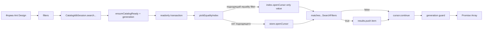
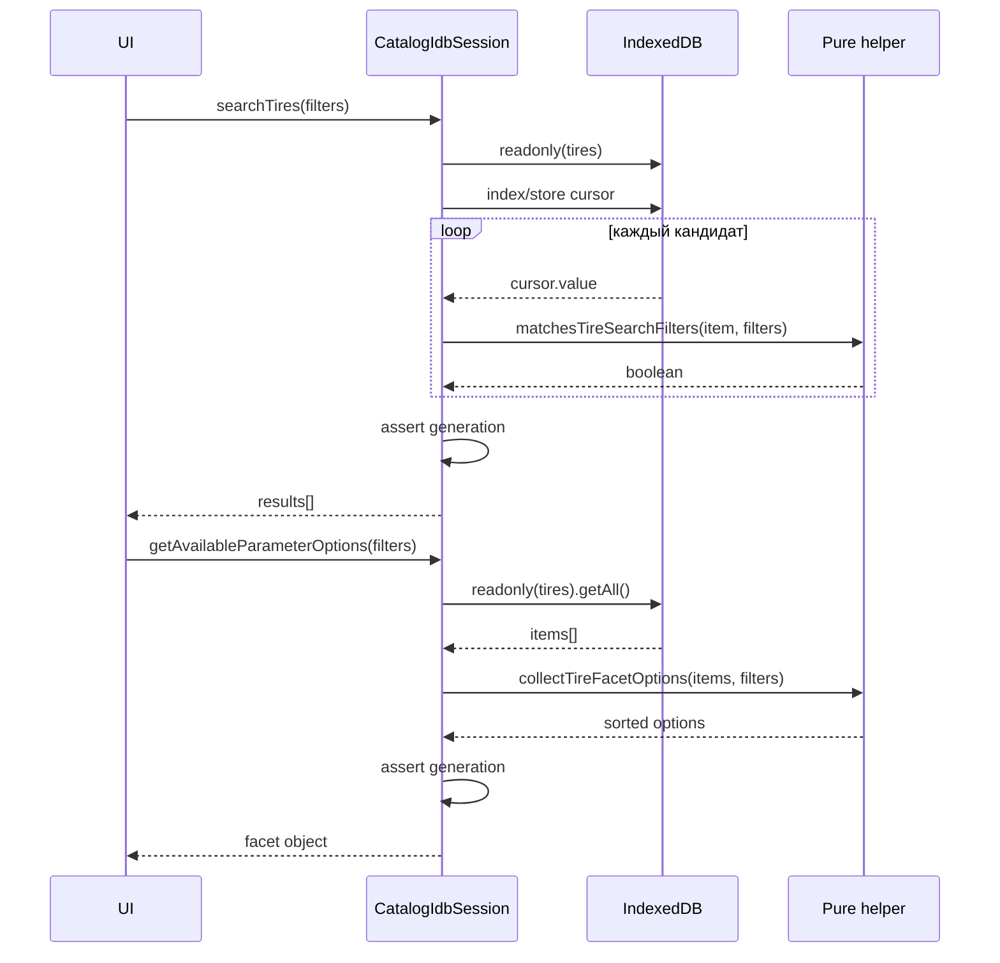

# Чтение, поиск, фильтры и facets

Подсистема чтения разделена на три простых слоя:

1. `catalogIdbQueries.js` выбирает IndexedDB cursor и содержит transaction-aware
   helpers.
2. `catalogSearchFilters.js` — чистые предикаты полной проверки записи.
3. `catalogFacetOptions.js` — чистое построение зависимых вариантов фильтров.

`CatalogIdbSession` создаёт readonly-транзакции и связывает эти helpers с
активным store/generation. `indexedDBService.js` — facade, а не второй query
engine.

## Active, compatibility и helpers

### Активный production API

- `searchTires(filters)`, `searchDiscs(filters)`;
- `getAvailableParameterOptions(filters)`,
  `getAvailableDiscParameterOptions(filters)`;
- `collectTireShowcaseCandidates(options)`,
  `collectDiscShowcaseCandidates(options)`;
- `readCartCatalogItems(references)`, `getPersistedCatalogVersion()`,
  `isCatalogEmpty()`.

### Чистые helpers

`isActiveFilterValue`, `matches*`, `collect*FacetOptions`,
`pickEqualityIndex`, `collectShowcaseCandidatesFromStore` не владеют connection.
Почти все синхронны; showcase helper возвращает Promise из-за cursor API.

### Compatibility

Legacy DB не читаются поиском: они участвуют только в миграции. Deprecated
`openDatabase`/`openDiscDatabase` не создают альтернативного query path.

## Общий конвейер поиска



Индекс сужает множество кандидатов, но никогда не заменяет полную проверку.
Это важно для нескольких брендов, диапазонов, `minAmount`, `runflat` и
неиндексированных сочетаний.

## Выбор индекса: `pickEqualityIndex`

**Сигнатура:** `pickEqualityIndex(store, filters, hintOrder)`.

**Роль.** Вернуть уже открытый `IDBRequest` cursor по одному equality-индексу
или по всему store.

**Параметры.**

- `store`: `IDBObjectStore`;
- `filters`: объект фильтров;
- `hintOrder`: фиксированный приоритет индексов.

**Результат:** request от `openCursor()`. Функция не ждёт его и не обрабатывает
ошибки.

Приоритет шин: `diameter → season → brand → supplier`.
Приоритет дисков: `diameter → diskType → brand → supplier`.

Алгоритм считает активные фильтры, затем выбирает первый hint:

- scalar brand или массив из одного brand допускает индекс `brand`;
- несколько брендов не представимы `IDBKeyRange.only`, поэтому индекс brand
  пропускается;
- прочие активные hints передаются в `IDBKeyRange.only` как есть;
- если подходящего hint нет — полный cursor.

**Гарантии/пределы.** Это эвристика, не cost-based optimizer. Приоритет не
учитывает реальную селективность и статистику. Range-фильтры width/cb/et не
используют индексы.

**Тесты:** `catalogIdbQueries.test.js` фиксирует оба порядка, fallback полного
cursor и поведение массива брендов.

## `searchTires(filters)`

- **Роль:** найти шины по полной совокупности фильтров.
- **Результат:** `Promise<Array<object>>`; недоступный IndexedDB даёт `[]`.
- **Транзакция:** readonly только на `tires`.
- **Caller:** `TiresSearchParameters`.
- **Callees:** `_getReadyContext`, `pickEqualityIndex`,
  `matchesTireSearchFilters`, `_resolveIfActive`.
- **Side effects:** нет записи; создаётся cursor и массив результатов.

Полный matcher проверяет:

- `width`, `profile` через числовое `Number(left) === Number(right)`;
- `diameter` через строковое сравнение;
- точный `season`, `supplier`;
- brand scalar или inclusion в массиве;
- `spikes`: строгий boolean, если filter не `undefined`;
- `runflat`: только `true` является ограничением;
- `amount >= minAmount`, если `minAmount` преобразуется в число.

`null`, `undefined`, пустая строка и пустой массив считаются неактивными. Для
`spikes` есть специальная семантика: `false` активен и требует именно
`item.spikes === false`.

## `searchDiscs(filters)`

- **Роль:** найти диски.
- **Результат:** `Promise<Array<object>>`, fallback `[]`.
- **Транзакция:** readonly только на `discs`.
- **Caller:** `DiscsSearchParameters`.
- **Callees:** тот же pipeline с `DISC_SEARCH_INDEX_HINTS` и
  `matchesDiscSearchFilters`.

Matcher проверяет brand, supplier, diameter, `pcd`, `pn`, `diskType`,
`minAmount`, а также включительные диапазоны:

- `widthFrom <= width <= widthTo`;
- `cbFrom <= cb <= cbTo`;
- `etFrom <= et <= etTo`.

Если у товара диапазонное поле отсутствует/нечисловое, активный range filter
его исключает. Границы преобразуются через `Number`; UI должен не передавать
нечисловые активные строки.

## Facets: варианты, которые не блокируют сами себя

Facet — список допустимых значений следующего выбора с учётом других фильтров.
Session сначала делает `store.getAll()`, затем чистая функция строит Sets и
сортированные массивы.

### `getAvailableParameterOptions(filters = {})`

**Результат:**

```js
{
  widths: [], profiles: [], diameters: [],
  seasons: [], brands: [], suppliers: []
}
```

**Транзакция:** readonly `tires`, один `getAll`. **Caller:**
`TiresSearchParameters`. При unavailable IDB возвращается объект пустых
массивов той же формы.

`collectTireFacetOptions(items, filters)` реализует «своё поле не фильтрует
себя»:

- width зависит от profile + diameter;
- profile зависит от width + diameter;
- diameter зависит от width + profile;
- season/brand/supplier требуют совпадения всей тройки размеров;
- активный season предварительно отсекает товары для всех options.

Пример: при выбранных `205/55 R16` ширины могут содержать `205` и `215`, если
`215/55 R16` существует. Это позволяет пользователю изменить уже выбранную
ширину.

### `getAvailableDiscParameterOptions(filters = {})`

**Результат:** `{ brands, suppliers, diameters, widths, cb, et, pcd, pn,
diskTypes }`.

Каждая геометрическая facet игнорирует собственный фильтр, но уважает остальные.
Например, список `et` проверяет supplier, diameter, pcd, pn, diskType, width и
cb, но не текущий диапазон et. Brand сам не используется при вычислении
геометрических options и итоговых brand/supplier/diskType в этой функции.

::: warning Стоимость
Оба facet API используют `getAll()` и затем O(n) обход в JavaScript. Индексы
здесь не используются. Это простая и корректная реализация, но её память и
время растут с полным размером category store.
:::

## Mermaid: readonly-транзакции



## Витрина: ранний ограниченный обход

### `collectShowcaseCandidatesFromStore(store, options)`

**Параметры:** `{ candidateLimit = 480, minAmount = 1, supplier = null,
preferItem = null }`.

`480` — default самого query helper, а не единый production-лимит обеих
витрин. `getCatalogShowcase` передаёт его для шин вместе с `preferItem:
isIkonBrand`, поэтому cursor дочитывается для preferred-пула. Для дисков caller
явно передаёт `candidateLimit: Number.POSITIVE_INFINITY`, чтобы ранняя отсечка
не потеряла литые диски showcase-поставщика.

**Результат:** `Promise<{ isEmpty, candidates }>`:

- `isEmpty: true` означает, что весь store пуст;
- непустой store без подходящих строк даёт `{ isEmpty: false, candidates: [] }`.

**Алгоритм.**

1. `store.count()` различает пустой каталог и пустой результат фильтра.
2. При supplier использует индекс `supplier`, если он существует.
3. Пропускает чужого supplier и `amount < minAmount`.
4. Без `preferItem` завершает cursor при достижении limit.
5. С `preferItem` дочитывает весь cursor, чтобы preferred-позиции не были
   отрезаны первыми 480 SKU, затем `mergePreferredShowcaseCandidates` объединяет
   пулы.

Session wrappers открывают readonly-транзакцию нужной категории и после Promise
проверяют generation. Callers находятся в
`catalog/showcase/getCatalogShowcase.js`.

## Согласованное чтение корзины

### `readCartCatalogItems(references)`

**Параметр:** массив `{ requestKey, category, id }`. **Результат:**

```js
{
  version: "2026-08-23T09:30:00+03:00",
  results: [{
    requestKey: "tyres:item-1",
    matches: { tyres: {/* item */}, discs: null }
  }]
}
```

Одна readonly-транзакция охватывает `tires`, `discs`, `metadata`. Она читает
подтверждённый `snapshotVersion` и товары из одной согласованной точки. Для
неизвестной legacy-категории id проверяется в обоих stores; для известной —
только в соответствующем.

Callers: `AddToCartControl` и `CartReconciliationHost`. Любая request error
abort-ит всю операцию; тест проверяет как единую транзакцию, так и rejection.

## Ошибки и race guarantees

- Request error отклоняет Promise исходной `request.error`.
- После cursor/getAll выполняется generation guard; старый результат получает
  `StaleCatalogStoreError`.
- Недоступный IndexedDB намеренно выглядит как пустой каталог для read API.
- Порядок результатов — порядок cursor, контракт сортировки отсутствует.
- Matchers не мутируют записи и filters.
- Facet sorting числовая для чисел и лексикографическая как tie-breaker; порядок
  diameter учитывает числовую часть.

## Тесты

- `catalogIdbQueries.test.js`: выбор equality index.
- `indexedDBService.searchFilters.test.js`: `minAmount`, spikes, runflat,
  diameter/season, массив brand, диапазон ET, PCD/PN/diskType.
- `catalogFacetOptions.test.js`: каскадная независимость width/profile/diameter.
- `indexedDBService.test.js`: batch cart read одной readonly-транзакцией и
  request failure.
- `indexedDBService.fakeIndexedDB.test.js`: поиск после настоящих IDB writes.

## Риски изменений

1. Если добавить filter в `pickEqualityIndex`, но забыть matcher, результаты
   могут стать шире ожидаемых; обратная ошибка даст лишний полный scan.
2. Equality index нельзя открывать по массиву значений без нескольких ranges или
   другого алгоритма.
3. Изменение типа нормализованного поля нарушит `Number`/`String` сравнения и
   индексные ключи.
4. Facet должна игнорировать собственное ограничение; иначе выбранный control
   может запереть пользователя на одном значении.
5. `getAll()` для facets — главный масштабный предел; оптимизация потребует
   сохранить ту же каскадную семантику.
6. Нельзя разделять cart version и item reads на разные транзакции: между ними
   может committed новый snapshot.

## Связанные страницы

- [Схема IndexedDB](/05-catalog-storage/indexeddb-schema)
- [Жизненный цикл и миграция](/05-catalog-storage/lifecycle-and-migration)
- [Протокол и проверка snapshot](/06-catalog-sync/snapshot-protocol-validation)
