# Общий поток каталога

::: tip Статус: проверено по коду
Это входная страница учебного раздела. Она показывает только действующий production-путь каталога; детали каждого перехода раскрываются в следующих главах.
:::

## Что проходит через систему

Каталог не загружается поставщиками прямо в UI. В production данные сначала собирает облачная функция, затем браузер получает готовый snapshot и атомарно переносит его в локальную IndexedDB:

```mermaid
flowchart LR
  subgraph Upstream[Внешние поставщики]
    SS[Shinservice JSON]
    SN[Semisotnov XML]
    FT[4tochki JSON]
    SU[ShinaSu XLSX]
    VE[Vershina XML]
  end

  Timer[Yandex Timer или ручной invoke] --> Handler[handler]
  Handler --> Run[runCatalogSync]
  Upstream --> Load[loadAllSuppliersData]
  Run --> Load
  Load --> Transform[общие transformers]
  Transform --> Commands[buildSnapshotSuppliers]
  Previous[(предыдущий snapshot)] --> Commands
  Commands --> Snapshot[snapshot.json]
  Commands --> Meta[meta.json]
  Snapshot --> Bucket[(Yandex Object Storage)]
  Meta --> Bucket
  Bucket --> Gateway[API Gateway /v2/catalog]
  Gateway --> Service[checkAndSyncCatalog]
  Host[CatalogSyncHost] --> Service
  Service --> Validate[validateAndNormalizeCatalogSnapshot]
  Validate --> Commit[applyCatalogSnapshot]
  Commit --> IDB[(CatalogDatabase.safeStoreId)]
  IDB --> Query[search / facets / showcase]
  Query --> UI[Ant Design формы и карточки]
```



## Границы active, legacy и helpers

| Статус | Код | Роль |
| --- | --- | --- |
| **ACTIVE** | `yandex/catalog-sync/src/**` | Получает raw-данные напрямую, строит и сохраняет snapshot |
| **ACTIVE** | `yandex/supplier-proxy/apigw.yaml` | Отдаёт `meta.json` и `snapshot.json` напрямую из Object Storage |
| **ACTIVE** | `CatalogSyncHost` → `catalogSyncService` → `CatalogIdbSession` | Проверяет версию, валидирует и применяет snapshot |
| **ACTIVE helper** | `src/services/suppliers/*/transformers.js` | Единый источник нормализации и для cloud bundle, и для старого browser-кода |
| **Вспомогательный** | `yandex/supplier-proxy/index.js` | CORS/SSRF-защищённый proxy для разрешённых upstream и изображений; cloud catalog-sync его не вызывает |
| **Legacy/unused для заполнения каталога** | `src/services/suppliers/supplierOrchestrator.js` и request-модули | Старый browser-side сбор поставщиков; production UI не вызывает его |
| **Compatibility** | legacy-массивы snapshot, старые базы `TireDatabase`/`DiscDatabase` | Принимаются или мигрируются ограниченно; не являются форматом нового production-потока |

## Сквозной алгоритм

1. Yandex Timer вызывает `handler(event)` со слотом, например `08:00`.
2. `handler` нормализует слот и вызывает `runCatalogSync({ slot })`.
3. `runCatalogSync` читает предыдущий snapshot. Это нужно для partial success, а не для version gate.
4. `loadAllSuppliersData()` последовательно обходит пять поставщиков. Ошибка одного превращается в `rejected`-результат и не останавливает остальных.
5. Общие transformers приводят JSON, XML и XLSX к товарным объектам шин и дисков.
6. `buildSnapshotSuppliers()` выбирает для каждой пары «поставщик × категория» команду `replace`, `keepPrevious` или `purge`.
7. Сначала записывается `snapshot.json`, затем `meta.json`. Публикация этих двух объектов не является одной S3-транзакцией; порядок уменьшает риск того, что новая meta укажет на ещё не записанный snapshot.
8. `CatalogSyncHost` запускает `checkAndSyncCatalog` на старте workspace, по расписанию, при возврате вкладки и восстановлении сети.
9. Под exclusive lock сервис читает маленькую meta. Если локальная версия не старее и база не пуста, большой snapshot не скачивается.
10. Новый snapshot полностью валидируется и нормализуется в памяти.
11. Все команды и `snapshotVersion` применяются одной readwrite-транзакцией IndexedDB. Ошибка любой записи отменяет весь commit.
12. После успешного commit публикуется событие между вкладками. `AppShellContext` увеличивает `catalogDataVersion`, после чего поиск, витрина и сверка корзины перечитывают IndexedDB.

## Главные форматы

### Результат загрузки поставщика

```js
{
  key: "shinservice",
  label: "Шинсервис",
  tyres: [{ id, code, supplier, width, profile, diameter, ... }],
  discs: [{ id, code, supplier, width, pcd, et, cb, ... }]
}
```

### Wire snapshot

```js
{
  schemaVersion: 1,
  storeId: "ElistaIvanor",
  version: "2026-08-24T12:00:00+03:00",
  slot: "12:00",
  suppliers: {
    shinservice: {
      supplier: "Шинсервис",
      tyres: { action: "replace", status: "ok", items: [] },
      discs: { action: "keepPrevious", status: "failed" }
    }
  }
}
```

### Нормализованные команды клиента

```js
[
  {
    supplier: "Шинсервис",
    category: "tyres",
    action: "replace",
    status: "ok",
    items: [/* только валидные нормализованные записи */]
  },
  {
    supplier: "Шинсервис",
    category: "discs",
    action: "keepPrevious",
    status: "failed"
  }
]
```

## Где проходят commit boundaries

- Fetch и transform поставщиков не транзакционны: каждый поставщик изолирован объектом результата.
- `snapshot.json` и `meta.json` — две отдельные операции `PutObject`.
- Валидация snapshot чистая: до её успешного завершения IndexedDB не открывается для записи.
- `CatalogIdbSession.applyCatalogSnapshot` открывает одну транзакцию на `tires`, `discs`, `metadata`.
- `localStorage`-версия и межвкладочное событие обновляются только после завершения IDB commit; они не входят в IDB-транзакцию.

## Сценарии жизненного цикла

### Первая загрузка

Локальная база пуста, поэтому совпадение версии в старом `localStorage` не блокирует bootstrap. Клиент скачивает snapshot, создаёт stores, применяет команды и фиксирует `snapshotVersion`.

### Повторный запуск

Клиент читает meta и persisted-версию из `metadata`. Если `meta.version <= localVersion` и каталог не пуст, возвращается `up-to-date`; snapshot и товары не перезаписываются.

### Устаревший или повторный snapshot

Есть две защиты. Сервис проверяет версию до скачивания и после него, а IDB-транзакция повторно сравнивает входную версию с persisted-версией. Старый snapshot завершается как `applied: false, skipped: true`.

### Ошибка сети

До commit локальный каталог не изменяется. Host не удаляет старые товары и повторит проверку при следующем триггере, в том числе событии `online`.

### Смена workspace во время async-операции

`storeId + generation` проверяются после сетевых и IDB-await. Результат для старого магазина превращается в `StaleCatalogStoreError` и не уведомляет новый workspace.

## Гарантии и ограничения

- Версии сравниваются как строки. Инвариант работает только для одинаково сформированных ISO-версий.
- Snapshot валидируется целиком: fatal-проблема запрещает частичный клиентский commit.
- Сервер допускает partial success между поставщиками и сохраняет ранее материализованные категории.
- `keepPrevious` без предыдущей локальной базы не создаёт товары; server-side builder старается переносить materialized payload, чтобы bootstrap оставался возможен.
- Meta и snapshot не имеют общей атомарной публикации и не связываются hash/ETag-контрактом.
- Facets сейчас читают весь store через `getAll`; это линейная операция по числу товаров.

## Что опасно менять

1. Нельзя считать пустой upstream подтверждённым удалением: временный сбой очистит магазин.
2. Нельзя записывать persisted-версию до товаров: следующий запуск ошибочно сочтёт неполный каталог актуальным.
3. Нельзя убрать повторную проверку версии внутри IDB-транзакции: две вкладки смогут откатить данные.
4. Нельзя разойтись cloud и browser transformers: wire-объекты перестанут соответствовать индексам и фильтрам.
5. Нельзя менять `storeId`-namespace без миграции: данные разных workspace смешаются либо станут недоступны.

## Проверяющие тесты

- `yandex/catalog-sync/src/snapshotCommands.test.js` — команды partial success и сохранение предыдущего payload.
- `src/services/catalogSync/catalogSnapshotValidation.test.js` — envelope, команды, товары, дубликаты и warning/fatal.
- `src/services/catalogSync/catalogSyncService.test.js` — version gate, bootstrap пустой базы и статусы sync.
- `src/services/catalogSync/catalogSyncService.commitBoundary.test.js` — версия и событие только после успешного commit.
- `src/services/catalogSync/catalogSyncLock*.test.js` — один writer.
- `src/services/indexedDBService.fakeIndexedDB.test.js` — stores, миграция и реальные IDB-транзакции.
- `src/services/catalogIdb/catalogIdbQueries.test.js` и `catalogFacetOptions.test.js` — выбор индекса, фильтрация и каскадные options.

## Маршрут обучения

Далее: [Получение данных поставщиков](/07-suppliers/supplier-adapters) → [Нормализация](/07-suppliers/transformers) → [Создание snapshot](/06-catalog-sync/yandex-catalog-sync) → [Хранение и выдача](/06-catalog-sync/snapshot-storage-serving) → [Клиентская синхронизация](/06-catalog-sync/frontend-autosync) → [Блокировки](/06-catalog-sync/locks-and-channels) → [IndexedDB](/05-catalog-storage/indexeddb-schema) → [Запись](/05-catalog-storage/lifecycle-and-migration) → [Чтение](/05-catalog-storage/queries-filters-facets) → [Валидация](/06-catalog-sync/snapshot-protocol-validation) → [Ошибки и восстановление](/06-catalog-sync/error-recovery).

