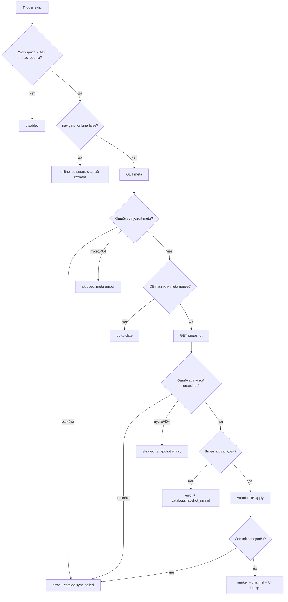

# Ошибки и восстановление frontend-синхронизации

Цель recovery-модели — сохранить последний подтверждённый каталог и автоматически прийти к актуальному состоянию при следующем безопасном триггере. Текущий frontend не показывает ошибку синхронизации пользователю и не делает retry loop: он классифицирует сбой, пишет диагностику и продолжает обслуживать чтение из прежней IndexedDB.

## Главный инвариант

Версия считается применённой только после завершения единственной IDB `readwrite`-транзакции, включающей:

- изменения `tires`;
- изменения `discs`;
- `metadata.snapshotVersion`.

Только после `transaction.oncomplete` разрешены localStorage marker и межвкладочный `catalog-applied`. Validation failure и transaction abort не должны менять ни товары, ни persisted version, ни внешние сигналы.



## Классы результата

`checkAndSyncCatalog` разрешает большинство ожидаемых отказов в объект, а не бросает:

| Результат | Смысл | Состояние каталога | Следующая попытка |
| --- | --- | --- | --- |
| `disabled` | Нет API base либо `storeId` не удалось разрешить даже с fallback | Без изменений | После исправления конфигурации/remount |
| `offline` | Браузер явно offline | Без изменений | Событие `online` |
| `skipped: aborted` | Effect демонтирован или сменился workspace | Без публикации | Новый host запускается сам |
| `skipped: stale store` | Результат относится к старой generation | Не должен обновить новый workspace | Новый host запускается сам |
| `skipped: meta empty` | `404`, `null` или meta без version | Без изменений | Следующий trigger |
| `skipped: snapshot empty` | `404`, `null` или snapshot без version | Без изменений | Следующий trigger |
| `up-to-date` | Persisted каталог не старее ответа | Чтение продолжается | Следующий плановый trigger |
| `applied` | Путь apply завершился | Новая либо уже более новая IDB version | UI сверяется с IDB |
| `error` | Network, JSON, validation или IDB failure | Предыдущий commit сохраняется | Следующий trigger; ручная диагностика |

Lock acquisition может отвергнуть promise до входа в callback, например при ошибке localStorage fallback. Такой rejection не преобразуется внутренним `try/catch`, потому что `try` расположен внутри lock callback. `CatalogSyncHost.run` не ловит его, но `finally` сбрасывает `syncing`. Это отдельный крайний случай текущей реализации.

## Точки отказа по стадиям

### 1. Конфигурация и workspace

`isCatalogSyncConfigured(storeId)` требует одновременно API base и resolved storeId. `resolveCatalogStoreId` обычно даёт env/default fallback, поэтому на практике основная причина `disabled` — отсутствующий API base. Host до готового workspace ничего не запускает. Это предотвращает обращение к default-магазину во время инициализации auth.

**Восстановление:** дождаться готового workspace. Env меняется только при новом frontend build/runtime configuration; автоматической проверки изменившегося env без нового effect нет.

### 2. Writer lock

Web Locks waiter ждёт освобождения без собственного timeout. При закрытии holder браузер освобождает lock. localStorage fallback ждёт lease, выполняет steal после TTL и поддерживает heartbeat.

**Восстановление:** Web Locks — автоматически; LS lease — максимум после expiry при работающих timers. Если localStorage операции бросают исключение, нужен следующий trigger после восстановления storage либо изменение реализации с graceful fallback.

### 3. Meta request

`fetchJson` использует `cache: 'no-store'` и переданный `AbortSignal`:

- `404` → `null` → `skipped: meta empty`;
- другой non-2xx → `Error('HTTP <status>')`;
- invalid JSON → rejection `res.json()`;
- network failure → error браузера;
- abort → `skipped: aborted`.

**Side effects до этой точки:** активирован IDB namespace, но товарного commit и version signal нет.

### 4. Чтение локального состояния

`getPersistedCatalogVersion` при исключении возвращает пустую строку. `isLocalCatalogEmpty` при исключении возвращает `true`. Это fail-safe в пользу попытки скачать полный snapshot.

Такой fallback не гарантирует успешное восстановление: последующий IDB apply может снова упасть. Но он не объявляет повреждённое/недоступное хранилище `up-to-date`.

### 5. Snapshot request

Обрабатывается так же, как meta. После response снова проверяется generation. Версия snapshot сравнивается с persisted version, потому что между meta и snapshot удалённое состояние могло измениться.

### 6. Validation

`validateAndNormalizeCatalogSnapshot` — синхронная чистая функция: не открывает IDB и не мутирует source object. Fatal-проблемы дают `report.valid === false`, пустые `commands` и `Error.validationReport` в apply layer.

Первая проблема формирует message вида:

```text
Некорректный snapshot: suppliers.vendor.tyres.items[0].id — id обязателен
```

`checkAndSyncCatalog` отличает validation error по `validationReport` и пишет:

```js
appLog.error({
  code: 'catalog.snapshot_invalid',
  domain: 'catalogSync',
  message: 'Catalog snapshot validation failed',
  context: {
    storeId,
    validationPath,
    validationMessage,
    errorCount,
  },
});
```

Warning не блокирует commit: например, invalid price нормализуется в `null`, отрицательный amount — в `0`. Fatal блокирует весь snapshot: unsupported schema, отсутствующая команда, unknown action, duplicate id, supplier mismatch и другие structural нарушения.

**Восстановление:** исправить producer/snapshot и опубликовать новую монотонную version. Повторная доставка того же исправленного payload с той же version может быть остановлена IDB version gate, если эта version уже была подтверждена ранее; на практике исправлению следует дать новую version.

### 7. IndexedDB transaction

`CatalogIdbSession.applyCatalogSnapshot(commands, version)` сначала открывает active store context, затем создаёт одну transaction на всех catalog stores. Перед writes он читает текущую metadata version внутри той же transaction:

- incoming `<= current` → `{applied:false, writes:0, skipped:true}`;
- incoming `> current` → последовательно применяет supplier/category writes и записывает metadata;
- request error/throw → `transaction.abort()`;
- `onabort` → rejection с первопричиной;
- смена generation до completion → `StaleCatalogStoreError`.

**Восстановление:** transaction abort автоматически оставляет старый commit. Следующий start/visible/online/slot повторит весь sync. Автоматического удаления базы при любой ошибке нет — это правильно, потому что quota, blocked upgrade и transient I/O не доказывают логическую порчу данных.

### 8. Публикация и UI

После `applied:true` service best-effort обновляет localStorage и channel. Их ошибки подавляются: IDB commit уже состоялся и не должен превращаться в ложный `error`.

Если событие потеряно, `CatalogSyncHost.bumpIfIdbAhead` читает persisted version после каждого запуска, включая `up-to-date` и `skipped`. При принятии `notifyCatalogApplied` AppShell bump-ит `catalogDataVersion`, а `catalogSnapshotVersion` запускает зависимые процессы, включая reconciliation корзины.

## Подробные recovery-сценарии

### Первая загрузка

**Исходное состояние:** metadata version `''`, обе категории пусты.

1. Host запускается после готовности workspace.
2. Meta доступен.
3. Пустота каталога заставляет скачать snapshot независимо от совпадения внешнего localStorage marker.
4. Валидный snapshot коммитится.
5. UI получает persisted version.

**Если сеть недоступна:** приложение остаётся с пустым каталогом; `online` повторит попытку. Код не поставляет встроенный seed fallback.

### Повторный запуск

**Исходное состояние:** metadata version `v2`, товары присутствуют, meta `v2`.

Snapshot endpoint не вызывается; ответ `up-to-date`. Host читает `v2` из IDB и обновляет UI новой вкладки, если она ещё не видела эту version.

### Stale snapshot

**Исходное состояние:** meta сообщил `v3`, но snapshot endpoint вернул `v2`, а IDB уже `v2`.

Service-level second gate возвращает `up-to-date`. Если race дошёл до IDB, transaction-level gate также запрещает `v2 <= v2`. Старый или равный snapshot не делает downgrade.

**Ограничение:** сравнение строк лексикографическое. `v10` считается меньше `v2`; безопасны ISO timestamps и другие одинаково padded sortable identifiers.

### Stale store

**Исходное состояние:** sync магазина A ждёт сеть; пользователь переключился на B.

`setActiveStore(B)` увеличивает generation и закрывает прежний DB handle. После ближайшего `await` проверка A бросает `StaleCatalogStoreError`; service отвечает `skipped: stale store`. Старый host cleanup также abort-ит fetch и блокирует `bumpIfIdbAhead`.

**Гарантия:** AppShell принимает уведомление только если storeId совпадает с активным workspace.

### Offline/network error

- Явный browser offline → `offline`, без лога общей ошибки.
- DNS/CORS/timeout со стороны browser/non-2xx → `error`, код `catalog.sync_failed`.
- Abort при смене workspace/unmount → `skipped: aborted`, без error log.

**Recovery trigger:** `online`; дополнительно visibility/start/слот. Нет exponential backoff, jitter или ограничителя ошибок между вкладками кроме writer lock.

### Invalid snapshot

Validation происходит до IDB call. Старые товары, IDB version, localStorage marker и channel неизменны. Диагностика содержит первую проблему и общее число ошибок; report хранит до 100 детализированных warning/error entries, затем ставит `truncated`.

**Операционное действие:** проверить wire schema и supplier/category command в [протоколе snapshot](/06-catalog-sync/snapshot-protocol-validation), исправить producer, выпустить новую version, затем дождаться trigger/перезагрузить вкладку.

### IDB failure

Возможные источники: база недоступна, blocked/open failure, quota, ошибка delete/put, explicit abort, закрытие DB при смене store.

При abort существующая транзакция откатывает и товарные изменения, и metadata. Commit-boundary test искусственно бросает на `put('tire-boom')` и подтверждает:

- результат `{status:'error', error:'IndexedDB transaction aborted'}`;
- прежняя version остаётся;
- broadcast отсутствует;
- прежний товар остаётся доступным.

**Операционное действие:** сначала сохранить диагностику и проверить, повторяется ли ошибка. Очистка site data — крайняя мера: она удалит локальный каталог, после чего первая успешная сеть должна скачать полный snapshot. Автоматически выполнять destructive wipe при одиночном отказе нельзя.

## Диагностический алгоритм

1. Определить активный `storeId`; не смешивать логи разных workspace.
2. Проверить результат sync и код лога:
   - `catalog.snapshot_invalid` — contract/data;
   - `catalog.sync_failed` — network/JSON/IDB.
3. Сопоставить три версии:
   - `/meta.version`;
   - `/snapshot.version`;
   - IndexedDB `metadata.snapshotVersion`.
4. Не считать localStorage cloudVersion доказательством commit.
5. Если meta новее IDB, проверить snapshot response и validation path.
6. Если validation valid, искать IDB transaction/open/quota error.
7. Если IDB новее UI, инициировать безопасный trigger (`visibility`/reload) и проверить AppShell/channel storeId filtering.
8. Только после подтверждённой persistent IDB-проблемы рассматривать очистку site data.

## Гарантии, которых нет

- Нет server-side distributed lock между устройствами.
- Нет автоматического retry/backoff и пользовательского сообщения.
- Нет timeout ожидания lock или fetch на уровне service.
- Нет гарантированной доставки channel event.
- Нет восстановления частично логически неверного, но формально валидного snapshot.
- Нет строгого mutex у localStorage fallback.
- Нет поддержки произвольного формата version.

Эти ограничения компенсируются атомарным commit, persisted version gate, поколениями store, повторными lifecycle triggers и чтением IDB как источника истины.

## Active, legacy и helpers

### Active recovery path

- status mapping в `checkAndSyncCatalog`;
- `AbortController` и generation checks;
- full validation перед IDB;
- IDB transaction abort/rollback;
- persisted version gate внутри transaction;
- `bumpIfIdbAhead`;
- `appLog.error`;
- Web Locks/LS lease и channel/storage fallback.

### Legacy/compatibility

- Snapshot без `schemaVersion`, supplier `label` и непустые category arrays поддерживаются validator, но ошибки в них проходят через тот же full-snapshot отказ.
- localStorage cloudVersion и storage listener сохраняют совместимость, но не заменяют IDB metadata.
- Legacy IDB/localStorage cleanup относится к storage lifecycle, а не к runtime retry; см. [жизненный цикл и миграцию](/05-catalog-storage/lifecycle-and-migration).

### Helpers

- `fetchJson` классифицирует HTTP;
- `isAbortError` отделяет cancellation;
- `assertCatalogStoreActive` создаёт `StaleCatalogStoreError`;
- safe wrappers чтения IDB выбирают повторное скачивание при неопределённости;
- channel ping помогает convergence после потери основного transport.

## Тестовые доказательства

- `catalogSyncService.test.js` — invalid snapshot не вызывает IDB; IDB error не меняет marker/channel; persisted version и stale store обрабатываются корректно.
- `catalogSyncService.commitBoundary.test.js` — реальные rollback и commit boundaries на `fake-indexeddb`.
- `CatalogSyncHost.test.jsx` — old workspace не уведомляет новый, persisted IDB version догоняет UI.
- `catalogSyncLock.test.js` — recovery после holder crash/lease expiry.
- `catalogSyncChannel.test.js` — recovery через storage fallback и store filtering.

Не покрыты e2e-сбои реального браузерного IDB, quota exhaustion, долгий network hang, clock rollback в lease и реальные CORS-ответы.

## Риски изменения recovery-кода

- Catch всех исключений вокруг всей lock-функции может скрыть дефект lock и ошибочно вернуть обычный network status.
- Retry без backoff создаст stampede после outage.
- Wipe IDB на любой error уничтожит рабочий offline-каталог.
- Публикация version до commit создаст UI/data race.
- Удаление transaction-level version gate вернёт TOCTOU downgrade.
- Сравнение только localStorage version может пропустить пустую/откаченную IDB.
- Удаление generation checks смешает магазины при переключении workspace.

## Связанные страницы

- [Frontend-автосинхронизация](/06-catalog-sync/frontend-autosync)
- [Блокировки и каналы](/06-catalog-sync/locks-and-channels)
- [Хранение и выдача snapshot](/06-catalog-sync/snapshot-storage-serving)
- [Протокол и проверка snapshot](/06-catalog-sync/snapshot-protocol-validation)
- [Схема IndexedDB](/05-catalog-storage/indexeddb-schema)
- [Жизненный цикл и миграция storage](/05-catalog-storage/lifecycle-and-migration)
- [Запросы, фильтры и фасеты](/05-catalog-storage/queries-filters-facets)
- [Логирование и диагностика](/12-operations/logging-and-diagnostics)
