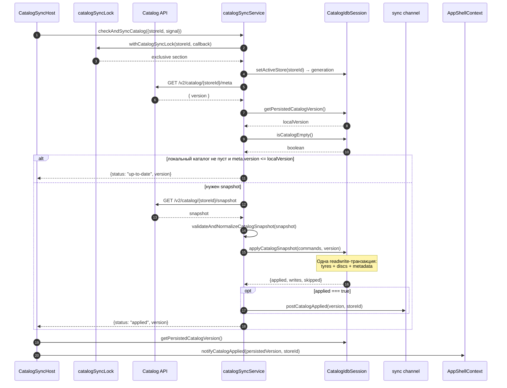

# Frontend-автосинхронизация каталога

Эта страница разбирает активный браузерный путь `meta → snapshot → IndexedDB → обновление UI`. Его задача — незаметно поддерживать локальный каталог выбранного магазина в актуальном состоянии. Пользователь не нажимает кнопку синхронизации и не получает toast: штатный результат отражается обновлением витрин и корзины, а сбои записываются в диагностический лог.

## Карта ответственности

| Участник | Ответственность | Не делает |
| --- | --- | --- |
| `CatalogSyncHost` | Выбирает момент запуска, привязывает работу к workspace, отменяет старый запуск, догоняет UI до версии в IDB, выставляет cold-start `catalogBootstrap` | Не скачивает и не валидирует snapshot |
| `checkAndSyncCatalog` | Выполняет сетевой сценарий под writer lock, сравнивает версии, классифицирует результат | Не владеет React-состоянием |
| `applyCatalogSnapshot` | Валидирует весь snapshot, вызывает единственный атомарный IDB commit, затем публикует версию | Не решает, когда запускать sync |
| `CatalogIdbSession.applyCatalogSnapshot` | В одной `readwrite`-транзакции меняет товары и metadata version | Не принимает wire-format без предварительной нормализации |
| `AppShellProvider` | Превращает подтверждённую версию в `catalogDataVersion` и `catalogSnapshotVersion` для потребителей UI | Не является источником истины для persisted version |

Источником истины для решения `up-to-date` служит metadata внутри IndexedDB, а не localStorage. Ключ `ivanor.catalog.cloudVersion.<encoded-storeId>` — совместимый межвкладочный сигнал после commit, но не commit marker.

## Где путь подключён

`CatalogSyncHost` монтируется в `App.js` внутри дерева приложения и требует `AppShellProvider`. Из `AuthContext` он получает готовность workspace и `workspace.storeId`; из `AppShellContext` — `notifyCatalogApplied`, `setCatalogBootstrap` и `registerCatalogBootstrapRetry`. Шторку рисует `AppShellProvider` (`CatalogBootstrapOverlay`), а не сам host.

Эффект не запускается, пока:

- `isWorkspaceReady !== true`;
- отсутствует `workspace.storeId`;
- не настроен API base (`REACT_APP_CATALOG_API_BASE`, либо fallback `REACT_APP_CORS_PROXY`).

При смене workspace React очищает старый эффект, вызывает `AbortController.abort()`, удаляет listeners и timer. Одновременно generation-механизм `indexedDBService` делает запоздавший результат старого магазина недействительным.

## Триггеры

После активации workspace host:

1. немедленно вызывает `run('start')`;
2. планирует ближайший московский слот;
3. слушает `visibilitychange` и запускается при переходе во `visible`;
4. слушает браузерное событие `online`.

Слоты заданы в МСК: `08:10`, `09:40`, `12:10`, `15:10`. `msUntilNextSyncCheck(now)` возвращает число миллисекунд до ближайшего строго будущего слота; если все слоты прошли — до `08:10` следующего дня. Внутренний timer ограничен снизу одной секундой.

Только причина `slot` подавляется в скрытой вкладке. `start` и `online` технически могут работать при `document.visibilityState === 'hidden'`. Флаг `syncing` не допускает второй конкурентный `run` внутри одного host; координацию между вкладками выполняет lock.

## Основная sequence diagram



Обратите внимание: публичный статус `applied` возвращается после `await applyCatalogSnapshot(...)` даже если нижний IDB version gate ответил `{ applied: false, skipped: true }`. В этом случае localStorage/broadcast не обновляются, но host всё равно перечитает persisted version и синхронизирует UI с ней. Это ограничение текущего формата результата, а не новый commit.

## Важные функции

### `checkAndSyncCatalog(options?)`

**Роль.** Полный сетевой orchestration под эксклюзивной блокировкой.

**Параметры.**

- `force = false` — обходит оба предварительных сравнения версий, но не нижний атомарный version gate в IDB;
- `storeId` — магазин; пустое значение разрешается через env/default namespace;
- `signal` — опциональный `AbortSignal` для `fetch`;
- `onProgress` — опциональный callback `{ phase: 'meta' \| 'download' \| 'parse' \| 'apply', receivedBytes, totalBytes, progress }`. React в сервис не импортируется. Host подписывается только на cold start и кладёт `progress`/`label` в уже существующий `catalogBootstrap`; исключение в callback глотается и не превращает sync в `error`. `progress` монотонен и не достигает 100 до commit. Фаза `warmup` («Готовим витрину») не из сервиса: её ставит host после IDB;
- `onLockWaiting` — опциональный callback, когда writer lock занят другой вкладкой. Host на blocking ставит подпись «Каталог загружается в другой вкладке» и не рисует фейковый download %. Warm start / background apply callback не передают.

**Результат.** `Promise` с одним из объектов:

```js
{ status: 'disabled' }
{ status: 'offline' }
{ status: 'skipped', error: 'aborted' | 'meta empty' | 'snapshot empty' | 'stale store' }
{ status: 'up-to-date', version: '2026-08-24T12:00:00+03:00' }
{ status: 'applied', version: '2026-08-24T12:00:00+03:00' }
{ status: 'error', error: 'HTTP 503' }
```

Функция `async`: rejection callback внутри lock обычно преобразуется в `{status: 'error'}`, кроме ошибки самого механизма lock до входа в callback.

**Алгоритм.**

1. Нормализовать `storeId` и занять writer lock `origin + storeId`.
2. Активировать namespace магазина и запомнить generation.
3. Вернуть `disabled`, `offline` или pre-fetch `aborted`, если проверка невозможна.
4. Получить `/meta` с `cache: 'no-store'`.
5. После каждого `await` проверить, что store/generation всё ещё активны.
6. Прочитать persisted IDB version и проверить, пуст ли каталог.
7. Если каталог не пуст и `meta.version <= local`, вернуть `up-to-date`.
8. Скачать `/snapshot` через `ReadableStream`: копить `Uint8Array` чанки, затем один `TextDecoder` + `JSON.parse`. AbortSignal сохраняется. `Content-Length` не считается истиной, если его нет, стоит `Content-Encoding` кроме `identity`, или принятые байты превысили заявленный total.
9. Повторить version gate уже по версии snapshot.
10. Валидировать и применить snapshot; `onProgress` переходит `parse` → `apply`.
11. Вернуть классифицированный результат; залогировать ошибку.

**Side effects.** Сеть, переключение IDB namespace, IDB commit через callee, `console.info` после успешного пути, `appLog.error` при ошибке.

**Callers/callees.** Caller — `CatalogSyncHost`; в тестах функция вызывается напрямую. Callees — `withCatalogSyncLock`, `fetch`, IDB service, `applyCatalogSnapshot`. `warmupCatalogReadCache` вызывает host после возврата из sync, не сам `checkAndSyncCatalog`.

**Гарантии.**

- один writer для одного `storeId` на origin;
- пустой локальный каталог заставляет скачать snapshot даже при равной version;
- stale store и abort не публикуются как общая ошибка;
- HTTP `404` преобразуется в `null`, затем в `meta empty`/`snapshot empty`;
- HTTP non-2xx (кроме `404`), JSON parsing, validation и IDB failures дают `status: 'error'`.

**Ограничения.**

- version сравнивается лексикографически, поэтому все producers обязаны использовать один сортируемый формат. Текущий cloud producer выдаёт время московского слота как `YYYY-MM-DDTHH:mm:ss+03:00`; смешивать его с `Z`-строками нельзя;
- автоматического retry/backoff внутри одного запуска нет;
- `navigator.onLine` — лишь ранняя эвристика, а не доказательство доступности API;
- timeout сети не задаётся: отмена приходит только через переданный signal;
- результат не содержит validation report, только строку первой ошибки; подробности идут в `appLog`.

**Пример.**

Вход:

```js
await checkAndSyncCatalog({
  storeId: 'ElistaIvanor',
  force: false,
  signal: abortController.signal,
});
```

При meta `v2`, persisted `v1` и валидном snapshot `v2` результат:

```js
{ status: 'applied', version: 'v2' }
```

**Риск изменения.** Перенос version gate за snapshot увеличит трафик; удаление проверок generation может записать данные другого workspace; превращение обработанных ошибок в rejection нарушит host и тестовый контракт.

### `applyCatalogSnapshot(snapshot, options?)`

**Роль.** Commit boundary между недоверенным wire snapshot и локальным каталогом.

**Параметры.**

- `snapshot` — объект с `version`, `schemaVersion`, `suppliers`;
- `options` — `{storeId, generation}`; для обратной совместимости строка трактуется как `storeId`.

**Результат.** `Promise<{applied, writes, skipped, validationReport}>`. `writes` — число команд `replace`/`purge`, а не число товарных строк.

**Алгоритм и граница транзакции.**

1. Разрешить store и generation, проверить активность.
2. Синхронно провалидировать и нормализовать весь snapshot.
3. При fatal-проблеме бросить `Error` с полем `validationReport`; IDB ещё не вызван.
4. Передать все команды и version в один `CatalogIdbSession.applyCatalogSnapshot`.
5. Нижний слой открывает одну `readwrite`-транзакцию сразу на `tires`, `discs`, `metadata`.
6. `keepPrevious` не создаёт write; `purge` становится заменой на `[]`; `replace` полностью заменяет строки данного supplier/category.
7. Metadata version записывается в той же транзакции после товарных операций.
8. Только после завершённого commit обновить localStorage и отправить межвкладочное событие.

**Side effects.** IDB, localStorage и channel; при validation failure side effects отсутствуют. Если IDB transaction abort, localStorage и channel сохраняют прежнее состояние.

**Ошибки.** Validation error содержит структурированный отчёт. IDB/stale-store ошибки пробрасываются caller. Предупреждения нормализации не блокируют commit и возвращаются в `validationReport`.

**Гарантии.** Нет частичного применённого supplier/category набора: транзакция либо фиксирует товары вместе с metadata version, либо откатывается. Snapshot старее/равный текущей IDB version пропускается уже внутри транзакции — защита от TOCTOU между предварительной проверкой и commit.

**Риск изменения.** Запись localStorage до `transaction.oncomplete` создаст ложный сигнал; разбиение на несколько транзакций позволит UI увидеть смешанные версии; ослабление full-snapshot validation может превратить отдельную ошибку поставщика в частичную порчу каталога.

### `CatalogSyncHost`

**Роль и результат.** React-компонент без собственной разметки, возвращает `null`. Управляет жизненным циклом синхронизации и cold-start bootstrap в AppShell.

**Cold start vs warm start.** В `useLayoutEffect` host ставит `catalogBootstrap.phase = 'blocking'`, чтобы до commit snapshot пользователь видел только шторку, а не рабочий сайт. Затем `isCatalogEmpty()`:

- `true` — шторка остаётся, скачивается один snapshot шин и дисков. `onProgress` обновляет `catalogBootstrap.progress` и `label`: meta ≈ 0–3%, download — основная доля, затем parse и apply. После успешного apply (или `up-to-date`, если снимок уже положила другая вкладка) host вызывает `warmupCatalogReadCache({ tires: true, discs: true })` — фаза «Готовим витрину», два шага. Только потом `notifyCatalogApplied` и `phase: 'ready'` с `waitForShowcase: true`. Overlay UI при этом ещё не снимается: ждёт settled витрину (полки, не skeleton), затем opacity 50ms. Если writer lock занят, шторка остаётся, label «Каталог загружается в другой вкладке», download % не имитируется. Когда lock отпущен, tab догоняет persisted version/channel; waiting ≠ error;
- `false` — phase сразу `ready` без `waitForShowcase`, overlay нет, warmup не вызывается, дальше тихий autosync без обязательного UI-прогресса (слот, visibility, online);
- ошибка чтения IDB трактуется как пустой каталог (нельзя доказать, что он не пуст).

`offline`, HTTP, validation и `disabled` на пустом каталоге ставят `phase: 'error'` с текстом в шторке и кнопкой «Повторить». Progress не маскирует эту ошибку. `{status:'skipped', error:'aborted'|'stale store'}` общую ошибку не показывают. Фоновый sync после `ready` шторку и toast не открывает.

**Async и side effects.** Его effect создаёт timer, listeners и `AbortController`. `run` ждёт sync, затем независимо от статуса читает persisted version через `bumpIfIdbAhead`.

`lastNotifiedVersion` локален конкретному effect. Он подавляет повторный bump для версии, которая не новее уже сообщённой. `notifyRef` позволяет использовать свежий callback без перезапуска эффекта.

**Гарантии.** Старый workspace не уведомляет новый; cleanup отменяет fetch и расписание; два события в одном host не запускают две работы одновременно; blocking выставляется до commit витрины с данными.

**Ограничения.** `syncing` не ставит событие в очередь: триггер во время работы теряется. Следующий slot/visible/online восстановит проверку. `Content-Length` используется для процента download только если заголовок виден JS и согласован со stream; иначе бар идёт коридором ≈ 5–80%, а крупно показываются мегабайты, не «N% от файла».

**Риск изменения.** Добавление `notifyCatalogApplied` в dependency array без ref может лишний раз перезапускать effect; удаление `isCurrent()` создаст race при logout/store switch; уведомление по network result вместо persisted version обойдёт реальный commit marker; ставить `ready` до `isCatalogEmpty()` даст вспышку рабочего сайта на cold start.

### `AppShellContext.notifyCatalogApplied(version, storeId)`

Функция принимает строковую version и storeId, возвращает boolean. Она отвергает пустую version, отсутствие активного workspace и чужой store. Для принятого события:

- обновляет `lastAppliedVersionRef`;
- монотонно обновляет `catalogSnapshotVersion`;
- всегда увеличивает `catalogDataVersion`.

`catalogDataVersion` инвалидирует кэши поиска/витрин. `catalogSnapshotVersion` запускает reconciliation корзины и участвует в стабильном seed витрины. Межвкладочная подписка в `AppShellProvider` делает ту же работу, но подавляет точный дубль `lastAppliedVersionRef`.

## Сценарии

### Первая загрузка

IDB version пустая, каталог пуст. Даже если localStorage содержит старую cloudVersion, она не участвует в решении. Пользователь видит полноэкранную шторку (`phase: 'blocking'`), а не рабочий сайт. Host получает meta, скачивает snapshot, валидирует его и коммитит. Затем прогревает RAM шин и дисков, UI получает persisted version, bootstrap становится `ready`. Шторка UI держится, пока активная витрина не соберёт полки (не skeleton), затем гаснет вместе с fade-in зоны результатов. Empty «Каталог ещё загружается» в витрине нет.

### Повторный запуск

Если IDB не пуст и `meta.version <= persistedVersion`, snapshot не скачивается. Результат — `up-to-date`. Bootstrap сразу `ready`, шторки нет. Host всё равно вызывает `bumpIfIdbAhead`, поэтому только что открытая вкладка узнаёт уже применённую другой вкладкой версию.

### Stale snapshot

Meta могла измениться между двумя GET или API мог вернуть более старый snapshot. Второй service-level gate возвращает `up-to-date`, если snapshot.version не новее локальной. Даже при `force: true` нижний IDB gate не разрешит переписать более новую версию старой.

### Stale store

Пользователь переключил магазин во время fetch/IDB operation. Generation перестаёт совпадать; service возвращает `{status:'skipped', error:'stale store'}` и не отправляет событие. Host старого workspace также не делает UI bump.

### Offline или network error

При `navigator.onLine === false` запросов нет, результат `offline`. Реальная сетевая ошибка, HTTP 5xx или invalid JSON дают `error` и `catalog.sync_failed`. Если каталог уже не пуст, старые товары остаются, шторки нет. Если это cold start, AppShell ставит `phase: 'error'` в шторке с кнопкой «Повторить». Событие `online` создаёт новую попытку, но отдельного backoff нет.

### Invalid snapshot

Fatal validation report блокирует вызов IDB. Service пишет `catalog.snapshot_invalid` с storeId, путём первой проблемы и числом ошибок; localStorage и channel не меняются. Подробнее о wire-командах — в [протоколе и проверке snapshot](/06-catalog-sync/snapshot-protocol-validation).

### IDB failure

Ошибка открытия базы, `put`, delete/replace или abort транзакции превращается в `status: 'error'`. Атомарность сохраняет предыдущие товары и metadata version. Поэтому localStorage и broadcast также остаются прежними. Практическое восстановление разобрано в [обработке ошибок и восстановлении](/06-catalog-sync/error-recovery).

## Active, legacy и helpers

### Active path

- `CatalogSyncHost`;
- `checkAndSyncCatalog`;
- `applyCatalogSnapshot`;
- `validateAndNormalizeCatalogSnapshot`;
- `CatalogIdbSession.applyCatalogSnapshot`;
- `postCatalogApplied` / `subscribeCatalogApplied`;
- `AppShellContext.notifyCatalogApplied`.

### Legacy/compatibility

- Snapshot без `schemaVersion` принимается как legacy с warning.
- `entry.label` может заменить отсутствующий `entry.supplier`.
- Непустой legacy-массив category трактуется как `replace`; пустой массив отвергается как неоднозначный.
- Строковый второй аргумент `applyCatalogSnapshot(snapshot, storeId)` поддерживается адаптером options.
- `getLocalCatalogVersion` и `setLocalCatalogVersion` сохраняют совместимый localStorage marker, но `getLocalCatalogVersion` не используется version gate активного sync.

### Helpers

- `catalogApiBase`, `metaUrl`, `snapshotUrl`, `fetchJson` (meta) и stream-чтение snapshot — конфигурация и HTTP;
- `getMoscowParts`, `msUntilNextSyncCheck` — расписание;
- `isAbortError` — нормализация abort;
- `isLocalCatalogEmpty`, `getPersistedCatalogVersion` — fail-safe wrappers: при ошибке считают каталог пустым/version неизвестной, после чего основной путь попробует snapshot;
- `resolveCatalogStoreId` и `getCatalogVersionKey` — store-scoped namespace.

## Что подтверждают тесты

- `catalogSyncService.test.js`: validation до IDB, нормализация, localStorage/broadcast только после commit, persisted version как gate, пустой каталог, store isolation, stale store, stream progress с/без Content-Length, abort посреди stream, gzip/total mismatch и onProgress на up-to-date.
- `catalogSyncService.commitBoundary.test.js`: реальные транзакции через `fake-indexeddb`, rollback при abort, отсутствие side effects при invalid snapshot, supplier-scoped purge.
- `CatalogSyncHost.test.jsx`: ожидание готового workspace, abort/изоляция старого магазина, UI bump по persisted version, подавление slot в hidden-вкладке, empty → blocking затем ready с `waitForShowcase`, non-empty → ready без шторки и без `waitForShowcase`, onProgress → progress/label, warmup до notify, waiting lock без download %, offline на пустом каталоге → error, stale/abort без общей ошибки.
- `catalogSyncLock.integration.test.js`: два параллельных запуска скачивают snapshot один раз.

Тесты не доказывают доступность реального API, поведение браузера при длительном suspend вкладки или восстановление после исчерпания quota.

## Связанные страницы

- [Хранение и выдача snapshot](/06-catalog-sync/snapshot-storage-serving)
- [Блокировки и каналы](/06-catalog-sync/locks-and-channels)
- [Обработка ошибок и восстановление](/06-catalog-sync/error-recovery)
- [Схема IndexedDB](/05-catalog-storage/indexeddb-schema)
- [Жизненный цикл и миграция storage](/05-catalog-storage/lifecycle-and-migration)
- [Запросы, фильтры и фасеты](/05-catalog-storage/queries-filters-facets)
- [Состояние App Shell](/03-routing-shell/app-shell-state)
