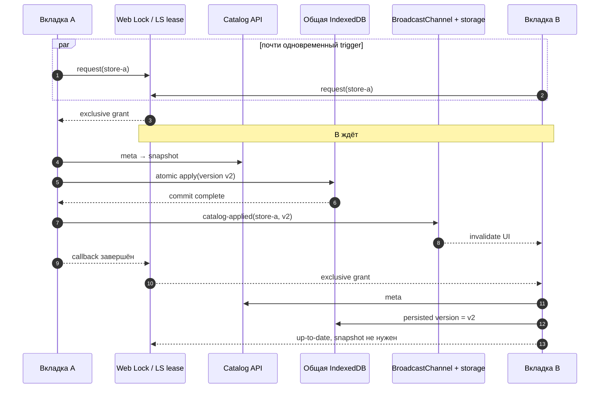

# Блокировки и каналы синхронизации

Автосинхронизация решает две разные межвкладочные задачи:

1. **Взаимное исключение:** только одна вкладка проверяет и записывает каталог конкретного магазина.
2. **Инвалидация UI:** после commit остальные вкладки узнают, что нужно перечитать IndexedDB.

Их нельзя объединять мысленно. Lock не переносит данные и не обновляет React. Channel не защищает транзакцию и не выбирает writer.

## Namespace и область координации

Все механизмы store-scoped:

- Web Lock: `ivanor.catalog.sync.<resolvedStoreId>`;
- localStorage lease: `ivanor.catalog.sync.lock.<resolvedStoreId>`;
- persisted signal version: `ivanor.catalog.cloudVersion.<encodeURIComponent(storeId)>`;
- payload channel: `{type:'catalog-applied', storeId, version}`.

Таким образом, `store-a` и `store-b` не блокируют друг друга и не принимают чужие события. Координация ограничена одним browser origin/profile: она не является распределённой блокировкой между разными устройствами.

## Sequence двух вкладок



Результат интеграционного теста именно такой: первый caller получает `applied`, второй — `up-to-date`, а snapshot endpoint вызывается один раз.

## Writer lock

### `withCatalogSyncLock(storeId, fn, options?)`

**Роль.** Выполнить callback эксклюзивно относительно того же `origin + storeId`.

**Параметры.**

- `storeId: string` — namespace магазина;
- `fn: () => T | Promise<T>` — критическая секция;
- `options` — инъекции только для localStorage fallback: `ttlMs`, `pollMs`, `heartbeatMs`, `storage`, `now`.

**Результат и async.** Всегда `Promise<T>`. Результат callback возвращается без преобразования, rejection пробрасывается. Для sync callback используется `Promise.resolve().then(fn)`, поэтому выполнение всё равно асинхронное.

**Caller/callee.** Активный caller — `checkAndSyncCatalog`; callee — `navigator.locks.request`, либо приватный `withLocalStorageLease`.

**Side effects.** Занятие Web Lock или чтение/запись/удаление localStorage lease; fallback также создаёт interval heartbeat и polling timeouts.

**Transaction boundary.** Lock шире IDB-транзакции: внутри находятся конфигурационные проверки, оба HTTP GET, version checks, validation и commit. Это намеренно предотвращает несколько snapshot download в параллельных вкладках. Сам lock не обеспечивает атомарность данных — её обеспечивает отдельная IDB `readwrite`-транзакция.

**Пример input/output.**

```js
const result = await withCatalogSyncLock('store-a', async () => {
  return { status: 'up-to-date', version: 'v2' };
});
// result === { status: 'up-to-date', version: 'v2' }
```

**Гарантии и ограничения.**

- Web Locks path ставит запросы одного имени в exclusive queue.
- Разные storeId имеют разные lock names.
- Нет timeout/cancellation ожидания lock.
- Lock не защищает от кода, который пишет IDB в обход этой функции.
- Между разными origin, browser profiles и устройствами общей очереди нет.

**Риск изменения.** Сужение критической секции только до IDB commit сохранит целостность, но вернёт дублирующие загрузки. Один общий lock без storeId снизит параллелизм магазинов. Добавление `ifAvailable` изменит контракт с «ждать» на «пропустить».

### Основной путь: Web Locks API

Если существует `navigator.locks.request`, вызывается:

```js
navigator.locks.request(lockName, { mode: 'exclusive' }, callback)
```

Браузер освобождает lock, когда promise callback settled. При закрытии/краше holder вкладки Web Lock освобождается платформой; unit test моделирует этот случай и подтверждает вход второго waiter.

Web Locks предпочтительнее lease: владелец управляется браузером, нет TTL race и ручного heartbeat.

### Fallback: localStorage lease

Fallback включается только при отсутствии Web Locks. Формат:

```json
{
  "owner": "1724510000000-k3m9x2ab",
  "expiresAt": 1724510008000
}
```

Значения по умолчанию:

- TTL — `8000 ms`;
- poll — `50 ms`;
- heartbeat — `2500 ms`.

Алгоритм `withLocalStorageLease`:

1. Сформировать случайный owner.
2. В бесконечном цикле прочитать JSON lease.
3. Если записи нет или `expiresAt <= now`, записать собственную lease.
4. Перечитать ключ и войти, только если owner совпал.
5. Во время callback продлевать `expiresAt` heartbeat-ом.
6. В `finally` остановить heartbeat и удалить ключ, только если owner всё ещё свой.

`readLease` fail-closed относительно содержимого: malformed/недоступный JSON считается отсутствующей lease. Если `storage` совсем отсутствует, callback выполняется без межвкладочной защиты.

#### Что fallback гарантирует не полностью

localStorage не предоставляет compare-and-swap. Две вкладки способны почти одновременно увидеть свободный ключ, записать себя и обе пройти проверку в неблагоприятном interleaving. Перечитывание owner уменьшает окно, но не превращает алгоритм в строгий mutex.

Кроме того:

- длинная пауза event loop может задержать heartbeat за TTL;
- другая вкладка тогда «украдёт» истёкшую lease, пока первый callback ещё работает;
- системные часы используются для expiry и могут прыгнуть;
- запись localStorage может бросить исключение: в отличие от channel ping, `writeLease` его не подавляет.

IDB version gate остаётся последней защитой от downgrade, но fallback не следует описывать как математически строгую взаимную блокировку.

**Подтверждённый тестом recovery:** заранее записанная lease мёртвой вкладки удерживает waiter до expiry; после TTL waiter входит, callback завершается и ключ удаляется.

## Канал commit-событий

### `postCatalogApplied(version, storeId?)`

**Роль.** После подтверждённого IDB commit сообщить другим вкладкам версию магазина.

**Параметры.** Непустая `version`, опциональный storeId. Пустая version приводит к немедленному `return`.

**Результат.** `undefined`, функция синхронная.

**Side effects.**

1. Лениво создаёт singleton `BroadcastChannel('ivanor.catalog.sync')` и вызывает `postMessage(payload)`.
2. Независимо выполняет localStorage ping: `setItem(eventKey, JSON)` и сразу `removeItem(eventKey)`.

Ошибки обоих transport подавляются. Это best-effort invalidation: неуспех канала не должен превращать уже состоявшийся commit в ошибку.

LS ping отправляется даже если cloudVersion не изменилась. Отдельный временный ключ нужен потому, что `storage` event обычно не возникает при записи того же значения. Сама вкладка-отправитель не полагается на event: `CatalogSyncHost` догоняет UI прямым чтением persisted version.

**Caller.** Только `applyCatalogSnapshot`, и только при `result.applied === true`.

**Риск изменения.** Вызов до `transaction.oncomplete` разошлёт ложный commit. Удаление storeId позволит вкладке другого workspace инвалидировать UI. Отказ от LS ping ухудшит fallback при одинаковой version.

### `subscribeCatalogApplied(listener, storeId?)`

**Роль.** Подписать текущий AppShell на commit нужного магазина.

**Параметры.**

- `listener(version)` — callback;
- `storeId` — ожидаемый namespace.

**Результат.** Синхронная функция `unsubscribe`, удаляющая оба listener.

**Входные transport.**

- `BroadcastChannel` message с правильными `type`, `storeId`, непустой `version`;
- `storage` event по version key конкретного магазина;
- `storage` event по ping key с валидным JSON payload.

Malformed payload и чужой storeId игнорируются. Listener может получить одну логическую версию более одного раза через разные transport. Дедупликация находится уровнем выше в `AppShellContext`, а не в channel.

**Async.** Функция подписки синхронна; callbacks вызываются браузером позднее. Promise здесь нет.

**Caller/callee.** Caller — effect `AppShellProvider`; callee — React-side listener, обновляющий `catalogSnapshotVersion` и `catalogDataVersion`.

**Гарантии/ограничения.**

- payload фильтруется по storeId;
- unsubscribe снимает обработчики;
- channel не хранит историю: поздняя вкладка не получит прошлое сообщение, поэтому host читает persisted IDB version;
- delivery best-effort, порядок между BroadcastChannel и storage не гарантирован;
- singleton BroadcastChannel не закрывается в текущей реализации.

## AppShell как consumer

При готовом workspace `AppShellProvider` вызывает:

```js
subscribeCatalogApplied(listener, subscribedWorkspace.storeId)
```

Перед обновлением он проверяет identity объекта workspace и отклоняет точный дубль последней версии. Принятое событие:

- монотонно обновляет `catalogSnapshotVersion`;
- увеличивает `catalogDataVersion`;
- заставляет поиск/витрину перечитать IDB;
- позволяет reconciliation корзины сравнить позиции с новой snapshot version.

Channel не передаёт товары. Все вкладки читают общую IndexedDB.

## Сценарии отказа и восстановления

### Holder вкладка закрылась

Web Locks освобождает lock, waiter продолжает работу. LS fallback восстанавливается после TTL; до expiry вторая вкладка ждёт.

### BroadcastChannel отсутствует

Остаются два storage-маршрута: изменение version key и временный ping key. Тест подтверждает получение события без `BroadcastChannel`.

### localStorage недоступен

Channel всё ещё пытается использовать BroadcastChannel. Ошибка ping подавляется. Для lock ситуация строже: если объект storage отсутствует — callback выполняется без lock; если storage существует, но операции бросают, sync может завершиться rejection механизма lock.

### Дубликат события

Channel доставляет его, но AppShell подавляет exact duplicate `lastAppliedVersionRef`. Прямой `notifyCatalogApplied` может всё же bump-нуть `catalogDataVersion` для догоняющего чтения host — это предусмотренный путь восстановления UI.

### Событие потеряно

При следующем `start`, `visibility`, `online` или slot host читает persisted IDB version через `bumpIfIdbAhead`. Поэтому channel ускоряет согласование, но не является единственным способом convergence.

## Active, legacy и helpers

### Active

- `withCatalogSyncLock`;
- Web Locks path;
- localStorage lease fallback;
- `postCatalogApplied`;
- `subscribeCatalogApplied`;
- consumer в `AppShellProvider`.

### Legacy/compatibility

- Реакция на прямое изменение `ivanor.catalog.cloudVersion.<storeId>` сохраняет совместимость с version-key signaling.
- localStorage lease и event ping — browser compatibility fallbacks, а не основной путь при наличии Web Locks/BroadcastChannel.
- Default store `ElistaIvanor` применяется, если storeId/env не переданы.

### Helpers

- `getCatalogSyncLockName`, `getLsLockKey` — namespace;
- `readLease`, `writeLease`, `clearLeaseIfOwner` — сериализация и owner-safe cleanup;
- `sleep` — polling;
- `hasWebLocks` — выбор механизма;
- `getChannel`, `pingLocalStorage` — transport setup.

## Что подтверждают тесты

- `catalogSyncLock.test.js`: последовательность двух Web Lock holders, освобождение после simulated crash, steal LS lease после TTL.
- `catalogSyncLock.integration.test.js`: два `checkAndSyncCatalog` для одного store дают один snapshot request.
- `catalogSyncChannel.test.js`: BroadcastChannel roundtrip, storage fallback, store filtering и ping при неизменившейся version.
- `CatalogSyncHost.test.jsx` и AppShell-код подтверждают, что stale workspace не получает UI update.

Не покрыты реальный межпроцессный race LS compare/write, timer throttling в background, Safari private mode/quota и перестановка двух transport событий.

## Связанные страницы

- [Frontend-автосинхронизация](/06-catalog-sync/frontend-autosync)
- [Обработка ошибок и восстановление](/06-catalog-sync/error-recovery)
- [Хранение и выдача snapshot](/06-catalog-sync/snapshot-storage-serving)
- [Протокол и проверка snapshot](/06-catalog-sync/snapshot-protocol-validation)
- [Схема IndexedDB](/05-catalog-storage/indexeddb-schema)
- [Жизненный цикл и миграция storage](/05-catalog-storage/lifecycle-and-migration)
- [Состояние App Shell](/03-routing-shell/app-shell-state)
