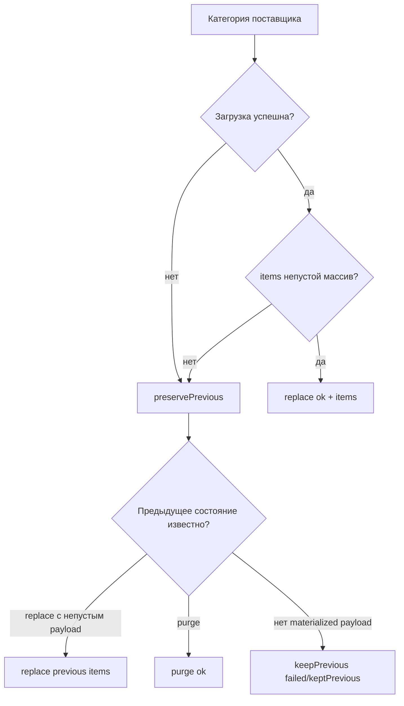
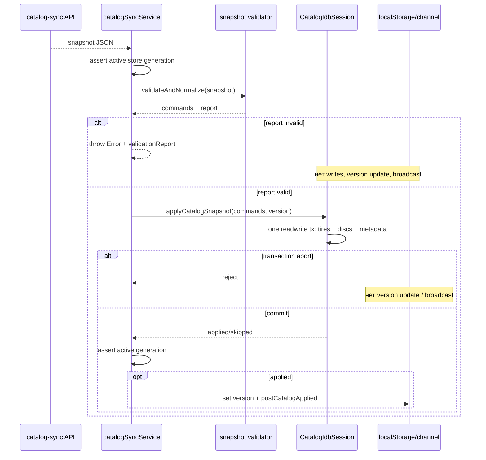

# Протокол и валидация snapshot

Snapshot — versioned JSON, который серверный catalog-sync формирует для
магазина, а браузер целиком валидирует и нормализует до первого обращения на
запись в IndexedDB. Главная гарантия: fatal-проблема в любой категории блокирует
весь snapshot, а warning только нормализует конкретное поле.

## Границы ответственности

### Активный production-код

- `yandex/catalog-sync/src/snapshotCommands.js` строит команды wire schema.
- `catalogSnapshotValidation.js` — чистый браузерный валидатор/нормализатор.
- `catalogSyncService.applyCatalogSnapshot` связывает validation, active-store
  race guards, IDB commit, localStorage и broadcast.
- `CatalogIdbSession.applyCatalogSnapshot` применяет уже доверенные команды одной
  readwrite-транзакцией.

### Legacy compatibility

- Snapshot без `schemaVersion` принимается как legacy с warning
  `MISSING_SCHEMA_VERSION`.
- Категория в виде непустого массива принимается как legacy `replace`.
- Пустой legacy-массив отклоняется как `AMBIGUOUS_LEGACY_ARRAY`: он не
  различает «поставщик пуст» и «upstream временно ничего не вернул».
- `entry.label` может заменить отсутствующий `entry.supplier`.

### Helpers, не выполняющие I/O

`normalizeNumber`, `normalizeDiameter`, `normalizeCommonCatalogItem`,
`normalizeTire`, `normalizeDisc`, `normalizeCategoryCommand`,
`findDuplicateIds`, report collector и cloneability checks — чистые функции.
Они не открывают IndexedDB и не мутируют исходный snapshot.

## Wire schema v1

```json
{
  "schemaVersion": 1,
  "storeId": "ElistaIvanor",
  "version": "2026-08-23T12:00:00+03:00",
  "slot": "12:00",
  "suppliers": {
    "supplier-a": {
      "key": "supplier-a",
      "label": "Поставщик A",
      "supplier": "Поставщик A",
      "ok": false,
      "keptPrevious": true,
      "error": "example diagnostic",
      "tyres": {
        "action": "replace",
        "status": "ok",
        "items": []
      },
      "discs": {
        "action": "keepPrevious",
        "status": "failed"
      }
    }
  }
}
```

Envelope требует непустую строку `version`, обычный непустой объект
`suppliers`, поддерживаемую `schemaVersion` (сейчас `1`) и обе категории для
каждого supplier entry.

`storeId`, `slot`, а также supplier-поля `key`, `label`, `ok`, `error` и
`keptPrevious` присутствуют в текущем production snapshot как маршрутная и
диагностическая информация. Клиентский `validateSnapshotEnvelope` требует
только `schemaVersion`, `version` и `suppliers`: он не проверяет `storeId`
против активного workspace и не использует `slot` при формировании IDB-команд.
Поля `ok`/`error` также не заменяют обязательные команды категорий. Поэтому
проверка правильного Object Storage route остаётся ответственностью server/API
границы, а не wire-валидатора браузера.

### Команды категории

| action | допустимый status | поле `items` | Семантика в браузере |
|---|---|---|---|
| `replace` | `ok` | обязательный массив, включая `[]` | удалить строки supplier и записать items |
| `keepPrevious` | `failed` или `keptPrevious` | запрещено | не создавать write для категории |
| `purge` | `ok` | запрещено | подтверждённо очистить категорию supplier |

`replace([])` и `purge` на apply-уровне оба очищают поставщика, но protocol
выделяет `purge` как явное намерение. `keepPrevious` не несёт payload и сам по
себе непригоден для bootstrap пустого клиента.

## Как сервер не превращает сбой в очистку

`resolveCategoryCommand({ loaded, items, previousCategory })` работает так:



`buildSnapshotSuppliers` применяет это к `tyres` и `discs`, выставляет
diagnostic `ok`, `keptPrevious`, `error`, а также строит `metaSuppliers`.
Сохранение materialized previous payload делает повторно деградировавший
snapshot пригодным для bootstrap. Пустой upstream-ответ считается degraded, а
не доказательством отсутствия товара.

## Главная функция валидации

### `validateAndNormalizeCatalogSnapshot(snapshot)`

- **Роль:** полностью проверить envelope, команды и товары; построить команды
  для IDB и диагностический отчёт.
- **Параметр:** неизвестное runtime-значение.
- **Результат:** `{ commands, report }`.
- **Async:** нет; функция синхронная и CPU/memory-bound.
- **Side effects:** нет; snapshot не мутируется.
- **Caller:** `catalogSyncService.applyCatalogSnapshot`, audit script, тесты.
- **Callees:** envelope/category/item normalizers, duplicate detector, report
  builder.

**Пошаговый алгоритм.**

1. Создать collector warning/fatal problems.
2. Проверить snapshot, schema/version/suppliers.
3. Для каждого supplier нормализовать `supplier` или legacy `label`.
4. Потребовать команды обеих категорий.
5. Проверить пару `action`/`status` и наличие/запрет `items`.
6. Для `replace` последовательно нормализовать каждый товар.
7. Отдельно для tyres и discs обнаружить дубликаты итогового `id` во всём
   snapshot, включая разных suppliers.
8. Построить report со счётчиками.
9. Вернуть команды только если `report.valid`; при хотя бы одном fatal итоговый
   `commands` принудительно равен `[]`.

### Формат report

```js
{
  valid,
  schemaVersion,
  snapshotVersion,
  supplierCount,
  itemCount: { tyres, discs },
  normalizedCount,
  warningCount,
  errorCount,
  warnings: [{ severity, code, path, message, received?, normalizedTo? }],
  errors: [{ severity, code, path, message, received?, firstPath? }],
  truncated
}
```

Полные счётчики продолжают расти, но массив деталей ограничен
`VALIDATION_PROBLEM_LIMIT = 100`; тогда `truncated = true`. Это защищает
диагностику от огромного payload, но не ограничивает число обрабатываемых
товаров.

### Throwing wrapper: `validateCatalogSnapshot(snapshot)`

Совместимый синхронный API возвращает только commands. При invalid report
бросает `Error("Некорректный snapshot: <path> — <message>")` и прикладывает
`error.validationReport`. Production sync-service использует non-throwing
функцию, формирует такой же error после проверки report и логирует первый path.

## Проверка и нормализация товара

### Обязательная identity

`normalizeCommonCatalogItem(item, path, sectionSupplier, collector)` требует:

- обычный объект и structured-cloneability;
- `id`: непустая строка или конечное число;
- `code`: непустая строка или конечное число;
- непустой `supplier`, точно равный supplier секции.

Дубликат `id` внутри одной категории — fatal независимо от supplier. Одинаковый
`code` разрешён, если итоговые ids различаются. Неизвестные cloneable-поля
сохраняются, а нормализованные известные поля перезаписывают исходные.

### Общие поля

- `brand`, `model`, `sizeTitle`, `photoUrl`: trim, иначе `null`.
- `title`: исходный title либо fallback из brand/model/sizeTitle/code.
- `amount`: число или строгая numeric string; отсутствующее/нечисловое/
  отрицательное → `0` + warning; дробное округляется вниз + warning.
- `price`, `sellingPrice`, `websitePrice`: только число `> 0`; иначе `null` +
  warning (отсутствующее значение становится `null` без warning).

`normalizeNumber` принимает число, пробелы, знак, точку или запятую, но требует,
чтобы вся строка была числом: `"114,3"` → `114.3`, `"123abc"` → `null`.

### Шины

`normalizeTire(item, path, collector)` возвращает item с:

- `width`, `profile`: number или `null`; `profile === 0` → `null`;
- `diameter`: canonical `R<number>[C]`, включая `R17.5`, `r22,5`, numeric input;
- `season`: только `s`/`w`, иначе `null` + warning;
- `spikes`, `runflat`: boolean или `null`, иначе warning.

Неоднозначный diameter не отбрасывает товар: становится `null`, а `sizeTitle`
сохраняется.

### Диски

`normalizeDisc` нормализует `width`, `pn`, `pcd`, `et`, `cb` в числа/null,
diameter тем же helper-ом, `color` в trim/null. `diskType` допускает только
`Литой` или `Штампованный`; иное → `null` + warning. Отрицательный ET допустим.

## Structured clone boundary

`canBeStoredInIndexedDB` сначала пробует глобальный `structuredClone`, затем
`window.structuredClone`, иначе рекурсивный fallback. Function, symbol,
WeakMap, WeakSet и Promise считаются недопустимыми. Cyclic references не
зацикливают fallback благодаря `WeakSet`.

Если весь item не cloneable — fatal `NOT_CLONEABLE`. После этого
`cloneCloneableFields` переносит только cloneable собственные enumerable-поля.
Fallback является приближением браузерного structured clone и не заменяет
реальную IDB-транзакцию как последнюю границу.

## От validation до commit



Валидатор не является transaction boundary. Он гарантирует форму commands;
атомарность обеспечивает только IDB readwrite-транзакция. Более старая или
равная версия превращается в committed no-op `{ applied: false, skipped: true }`.

## Fatal errors и warnings

Типичные fatal codes:

- `INVALID_SNAPSHOT`, `INVALID_VERSION`, `INVALID_SUPPLIERS`,
  `EMPTY_SUPPLIERS`, `UNSUPPORTED_SCHEMA_VERSION`;
- `MISSING_CATEGORY`, `INVALID_COMMAND`, `UNKNOWN_ACTION`, `INVALID_STATUS`,
  `INVALID_ITEMS`, `UNEXPECTED_ITEMS`, `AMBIGUOUS_LEGACY_ARRAY`;
- `INVALID_ITEM`, `NOT_CLONEABLE`, `MISSING_ID`, `MISSING_CODE`,
  `MISSING_SUPPLIER`, `SUPPLIER_MISMATCH`, `DUPLICATE_ID`.

Warnings включают `MISSING_SCHEMA_VERSION`, `INVALID_AMOUNT`,
`AMOUNT_ROUNDED`, `INVALID_PRICE`, `INVALID_DIAMETER`, `INVALID_SEASON`,
`INVALID_SPIKES`, `INVALID_RUNFLAT`, `INVALID_DISK_TYPE` и invalid optional
numeric fields.

Правило выбора строгое: identity, command intent и schema ambiguity — fatal;
потеря необязательного display/filter значения — warning с явной нормализацией.

## Тесты

`catalogSnapshotValidation.test.js` покрывает:

- envelope/schema/action/status/items и throwing wrapper;
- identity, supplier mismatch, duplicate ids внутри и между suppliers;
- numeric legacy ids/codes и одинаковые codes с разными ids;
- amount/prices, шинные и дисковые поля, fractional/cargo diameter;
- дополнительные cloneable-поля;
- snapshots на 10 000 товаров и truncation после 100 деталей.

`snapshotCommands.test.js` подтверждает серверную защиту от очистки: непустой
результат заменяет, пустой/failed сохраняет materialized payload, подтверждённый
purge переносится, повторный сбой остаётся bootstrap-safe.

`catalogSyncService.commitBoundary.test.js` использует fake-indexeddb и
доказывает, что invalid schema/item не пишет IDB, abort не обновляет
localStorage/broadcast, а purge затрагивает только нужного supplier.

## Пример валидного результата

```js
const { commands, report } = validateAndNormalizeCatalogSnapshot(snapshot);

if (!report.valid) {
  console.error(report.errors[0]);
  return;
}

// Например:
// [
//   { supplier: 'A', category: 'tyres', action: 'replace', status: 'ok', items: [...] },
//   { supplier: 'A', category: 'discs', action: 'keepPrevious', status: 'failed' }
// ]
await indexedDBService.applyCatalogSnapshot(commands, report.snapshotVersion);
```

В production не следует повторять этот glue вручную: вызывайте
`catalogSyncService.applyCatalogSnapshot`, чтобы сохранить store generation,
post-commit localStorage и channel semantics.

## Гарантии, ограничения и риски изменений

- **Гарантия:** fatal в одном товаре отклоняет весь snapshot до IDB.
- **Гарантия:** warning не удаляет товар, а фиксирует преобразование в report.
- **Гарантия:** исходный snapshot не мутируется.
- **Ограничение:** валидация синхронна; очень большой snapshot блокирует main
  thread на время полного O(n) обхода и требует память под normalized copy.
- **Ограничение:** сохранение неизвестных cloneable-полей полезно для
  расширяемости, но не даёт им бизнес-валидацию.
- Добавление wire `schemaVersion = 2` требует согласованно изменить генератор,
  браузерный валидатор, тесты и стратегию совместимости.
- Нельзя трактовать пустой upstream array как purge без явного доменного
  подтверждения.
- Ослабление global duplicate-id проверки приведёт к `put`-перезаписи товара
  одного supplier товаром другого.
- Перенос validation после частичных writes разрушит all-or-nothing контракт.
- Новое поле, участвующее в поиске, должно получить нормализацию, matcher,
  возможно индекс и facet tests.

## Связанные страницы

- [Схема IndexedDB](/05-catalog-storage/indexeddb-schema)
- [Жизненный цикл и миграция](/05-catalog-storage/lifecycle-and-migration)
- [Запросы, фильтры и facets](/05-catalog-storage/queries-filters-facets)
