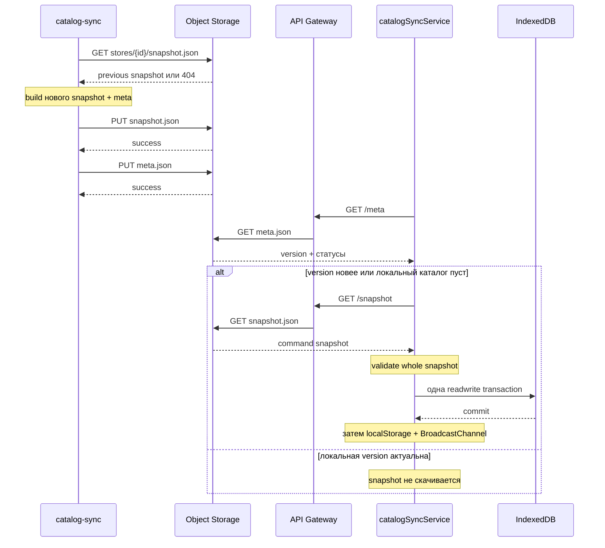

# Хранение и выдача snapshot

Эта страница описывает путь уже созданных `snapshot.json` и `meta.json`: ключи
Object Storage, чтение/запись, основной маршрут API Gateway, fallback Cloud
Function и получение файлов браузером.

Создание содержимого разобрано в
[Yandex catalog-sync](./yandex-catalog-sync.md), wire-команды — в
[Протоколе и проверке snapshot](./snapshot-protocol-validation.md).

## Что является production-путём

### ACTIVE production

Запись:

```text
catalog-sync Cloud Function
  → @aws-sdk/client-s3
  → закрытый Yandex Object Storage bucket
  → stores/{storeId}/snapshot.json
  → stores/{storeId}/meta.json
```

Выдача:

```text
browser catalogSyncService
  → API Gateway /v2/catalog/{storeId}/meta
  → Object Storage integration
  → при новой version:
      API Gateway /v2/catalog/{storeId}/snapshot
      → Object Storage integration
```

### FALLBACK / вспомогательный путь

`yandex/catalog-sync/src/handler.js` умеет сам прочитать и отдать meta/snapshot
по path/query. Комментарий в коде прямо называет это fallback на случай, если
Gateway не читает Object Storage напрямую. В текущем `apigw.yaml` catalog routes
настроены как `type: object_storage`, поэтому supplier-proxy Cloud Function и
catalog-sync handler при обычном GET не вызываются.

### LEGACY / unused и HELPERS

- `src/services/suppliers/supplierOrchestrator.js` не участвует в хранении или
  выдаче snapshot и не импортируется runtime UI;
- `yandex/supplier-proxy` помогает browser/legacy supplier requests и image
  URLs, но **не является production-путём cloud catalog-sync к прайс-листам**;
- расположение `apigw.yaml` внутри `yandex/supplier-proxy` не меняет тип
  интеграции catalog routes: они читают Object Storage напрямую.

## Объекты и адреса

| Ресурс | Object Storage key | HTTP route |
| --- | --- | --- |
| Meta | `stores/{storeId}/meta.json` | `GET /v2/catalog/{storeId}/meta` |
| Snapshot | `stores/{storeId}/snapshot.json` | `GET /v2/catalog/{storeId}/snapshot` |

`storeId` writer получает из `STORE_ID`, default — `ElistaIvanor`. Gateway
подставляет path parameter в object key. Frontend перед подстановкой делает
`encodeURIComponent(storeId)`.

Bucket задаётся обязательной `CATALOG_BUCKET`. AWS-compatible client использует
region `ru-central1`, endpoint `https://storage.yandexcloud.net` и
`forcePathStyle: true`, если env не переопределяет значения.

Bucket рассчитан на закрытый доступ: Cloud Function нужны права чтения/записи, а
service account API Gateway — чтения. Статические access key/secret используются
только writer/fallback S3 client и не должны попадать в frontend.

## Lifecycle публикации и потребления



Meta служит дешёвым version gate, а snapshot содержит полный payload. Frontend
запрашивает оба с `cache: 'no-store'`.

## Storage helpers

### `getBucket()`

```js
getBucket(): string
```

Синхронно читает обязательную `CATALOG_BUCKET`; пустое значение бросает
`Error`. Side effects и commit отсутствуют.

### `getStoreId()`

```js
getStoreId(): string
```

Синхронно возвращает trim `STORE_ID` или `ElistaIvanor`. Пустая строка также
переходит к default.

### `getClient()`

**Роль.** Лениво создать и кешировать один `S3Client` в module-level `client`.

**Параметры/результат.** Публичных параметров нет; возвращает S3 client.

**Side effects.** Читает env, создаёт клиент один раз. Сам сетевой вызов не
выполняет.

**Ошибки.** При отсутствии `AWS_ACCESS_KEY_ID` или `AWS_SECRET_ACCESS_KEY`
бросает до сети.

**Гарантии/ограничения.** Кеш полезен для warm invocation. Если env изменится в
живом процессе после первого вызова, клиент не будет пересоздан.

### `metaObjectKey(storeId)` и `snapshotObjectKey(storeId)`

Чистые синхронные функции:

```js
metaObjectKey(storeId)     // stores/${storeId}/meta.json
snapshotObjectKey(storeId) // stores/${storeId}/snapshot.json
```

Они не валидируют и не escape-ят `storeId`. В writer значение контролируется
env; fallback handler принимает `q.storeId`, поэтому Gateway/permissions должны
ограничивать нежелательные object keys.

### `getJsonObject(key)`

**Сигнатура.**

```js
async function getJsonObject(key: string): Promise<object | null>
```

**Callers.** `readMeta`, `readSnapshot`.

**Callees.** `getClient().send(new GetObjectCommand(...))`,
`streamToString`, `JSON.parse`.

**Алгоритм.**

1. Выполнить S3 GET в configured bucket.
2. Преобразовать Body в UTF-8: предпочесть `transformToString`, иначе собрать
   async iterable chunks через `Buffer.concat`.
3. Пустой body вернуть как `null`.
4. Иначе выполнить `JSON.parse`.
5. `NoSuchKey`, `NotFound` или HTTP 404 преобразовать в `null`; остальные ошибки
   пробросить.

**Async/side effects.** Async, сетевое чтение. Записей и транзакции нет.

**Ограничения.** Весь JSON материализуется строкой в памяти. Для большого
snapshot это повышает peak memory. Невалидный JSON не считается «not found» и
бросает `SyntaxError`.

### `putJsonObject(key, data)`

**Сигнатура.**

```js
async function putJsonObject(key: string, data: unknown): Promise<number>
```

**Результат.** После успешного PUT возвращает `body.length`.
Это длина JavaScript string в UTF-16 code units, а не гарантированное число
UTF-8 bytes, несмотря на имя `snapshotBytes` в логе.

**Алгоритм.** `JSON.stringify` → `PutObjectCommand` с
`ContentType: application/json; charset=utf-8` → `await send`.

**Side effects / commit.** Один успешный S3 PUT атомарно заменяет объект как
отдельную единицу с точки зрения клиента Object Storage. Код не задаёт ETag
precondition, versioning, metadata или cache headers.

**Ошибки.** Ошибка сериализации или S3 отклоняет Promise. Retry policy явно не
настроена в приложении; возможное поведение SDK не является бизнес-гарантией
этого модуля.

### Domain wrappers

```js
readMeta(storeId)               // getJsonObject(metaObjectKey(storeId))
readSnapshot(storeId)           // getJsonObject(snapshotObjectKey(storeId))
writeMeta(storeId, meta)        // putJsonObject(metaObjectKey(storeId), meta)
writeSnapshot(storeId, snapshot)// putJsonObject(snapshotObjectKey(storeId), snapshot)
```

Все async. Они только связывают domain resource с key и не добавляют validation,
locking или transaction.

## Граница облачного commit

В `runCatalogSync` публикация выполняется строго так:

```text
await writeSnapshot(...)
await writeMeta(...)
```

Это **не одна транзакция**:

| Сбой | Наблюдаемое состояние |
| --- | --- |
| snapshot PUT упал | оба старых объекта остаются; meta PUT не начинается |
| snapshot PUT успешен, meta PUT упал | snapshot новый, meta старый |
| оба PUT успешны | оба описывают одну version |
| параллельные sync | last writer wins отдельно для каждого key |

Текущий порядок важен: он не публикует новую meta до доступности нового
snapshot. Однако в промежуточном состоянии клиент с прежней meta не узнает о
новом snapshot. Это безопаснее преждевременного объявления версии, но не
эквивалентно atomic publish.

Для строгой атомарности потребовался бы другой протокол, например immutable
versioned snapshot keys и atomic-подобное переключение маленького manifest.
Такого механизма в текущем коде нет.

## Основная HTTP-выдача: API Gateway

В `yandex/supplier-proxy/apigw.yaml` маршруты:

```yaml
/v2/catalog/{storeId}/meta:
  get:
    x-yc-apigateway-integration:
      type: object_storage
      bucket: ${var.CATALOG_BUCKET}
      object: stores/{storeId}/meta.json

/v2/catalog/{storeId}/snapshot:
  get:
    x-yc-apigateway-integration:
      type: object_storage
      bucket: ${var.CATALOG_BUCKET}
      object: stores/{storeId}/snapshot.json
```

**Caller.** `checkAndSyncCatalog` в браузере.

**Callee.** Object Storage integration API Gateway, не supplier-proxy function.

**Результат.** `200` с JSON object либо `404`, если объект ещё не создан.
Глобальная Gateway CORS-конфигурация разрешает GET/OPTIONS с origin `*`.

**Side effects/transaction.** Только чтение. HTTP cache policy в integration
явно не описана; frontend дополнительно просит `cache: 'no-store'`.

## Fallback-выдача через `handler`

Если path содержит `/catalog/meta` либо query `resource=meta`, handler вызывает
`readMeta(storeId)`. Для snapshot аналогично.

HTTP envelope:

```js
{
  statusCode,
  headers: {
    'Access-Control-Allow-Origin': '*',
    'Content-Type': 'application/json; charset=utf-8'
  },
  body: JSON.stringify(data),
  isBase64Encoded: false
}
```

Отсутствующий объект → `404` с `{ error, storeId }`; другая ошибка → `500`.
Fallback целиком загружает и повторно сериализует большой snapshot, поэтому
уступает direct Object Storage integration по памяти и CPU.

## Получение браузером

### `checkAndSyncCatalog({ force, storeId, signal })`

**Роль.** Проверить meta, при необходимости получить snapshot и передать его на
валидацию/commit.

**Async и callers/callees.** Async; вызывается frontend autosync-host. Внутри
использует cross-tab lock, `fetchJson`, version getters,
`applyCatalogSnapshot`.

**Пошагово.**

1. Захватить lock для store.
2. Проверить configuration, online и abort.
3. Скачать meta.
4. Сравнить `meta.version` с persisted local version и проверить пустоту
   каталога.
5. Если обновление нужно — скачать snapshot.
6. Повторить version gate уже по `snapshot.version`.
7. Полностью валидировать и применить snapshot.

`404` helper превращает в `null`, после чего функция возвращает `skipped` для
пустых meta/snapshot. HTTP/JSON/validation/IDB ошибки превращаются в
`{ status: 'error', error }` и логируются.

### Клиентский commit boundary

`applyCatalogSnapshot` сначала валидирует весь snapshot без записи. Только
валидные commands передаются `indexedDBService.applyCatalogSnapshot`, который
применяет категории в одной IndexedDB readwrite transaction.

После успешного commit:

1. обновляется localStorage version;
2. отправляется cross-tab `postCatalogApplied`.

При validation failure или abort транзакции эти два side effect не выполняются.
Это подтверждает `catalogSyncService.commitBoundary.test.js`.

## Форматы на границе

Meta содержит version gate и health summary, но не товары:

```json
{
  "storeId": "ElistaIvanor",
  "version": "2026-08-24T15:00:00+03:00",
  "slot": "15:00",
  "suppliers": [
    { "key": "shinservice", "label": "Шинсервис", "ok": true }
  ],
  "okCount": 5,
  "failCount": 0
}
```

Snapshot содержит `schemaVersion`, ту же version/slot и supplier command
sections. Клиент не проверяет равенство предварительно загруженной `meta.version`
и `snapshot.version`; он сравнивает snapshot непосредственно с local version.

## Ошибки и гарантии

### Гарантируется кодом

- 404 storage read превращается в `null`;
- JSON записывается с корректным content type;
- snapshot записывается раньше meta;
- browser не commit-ит невалидный snapshot;
- локальная version и broadcast меняются только после IDB commit;
- API Gateway catalog routes читают object keys напрямую.

### Не гарантируется

- атомарность пары meta/snapshot;
- защита от параллельных writers;
- проверка совпадения `storeId` в path, meta и snapshot;
- cryptographic integrity/signature;
- лимит размера object до загрузки в память;
- application-level retry записи;
- неизменяемая история версий;
- согласованность meta/snapshot при ручном изменении bucket.

## Тесты

Прямых unit/integration-тестов `storage.js`, handler read fallback и реального
API Gateway/Object Storage в репозитории нет.

Связанные тесты фиксируют соседние гарантии:

- `snapshotCommands.test.js` — snapshot сохраняет previous payload при сбоях;
- `catalogSnapshotValidation.test.js` — wire validation и normalization;
- `catalogSyncService.test.js` — URL, version gates и статусы browser sync;
- `catalogSyncService.commitBoundary.test.js` — validation/IDB commit boundary;
- `catalogSyncLock.integration.test.js` — координация browser writers.

Эти тесты не доказывают IAM, CORS, bucket key mapping и реальную S3 семантику;
это проверяется deployment smoke/verify-сценариями.

## Риски изменения

1. Смена key layout требует одновременно обновить writer, Gateway и reader.
2. Запись meta первой создаёт окно новой version со старым snapshot.
3. Cache headers без versioned URL могут задержать обновление.
4. Удаление previous snapshot лишит builder основы для partial success.
5. Передача произвольного `storeId` в fallback расширяет область доступных keys.
6. Большой snapshot увеличивает память writer, fallback handler и browser.
7. Изменение version format ломает лексикографическое сравнение.
8. Перенос catalog routes на supplier-proxy function добавит лишний runtime,
   лимиты ответа и точку отказа; это не текущая архитектура.

## Связанные страницы

- [Создание snapshot](./yandex-catalog-sync.md)
- [Получение данных поставщиков](../07-suppliers/supplier-adapters.md)
- [Transformers](../07-suppliers/transformers.md)
- [Протокол и проверка snapshot](./snapshot-protocol-validation.md)
- [Frontend-автосинхронизация](./frontend-autosync.md)
