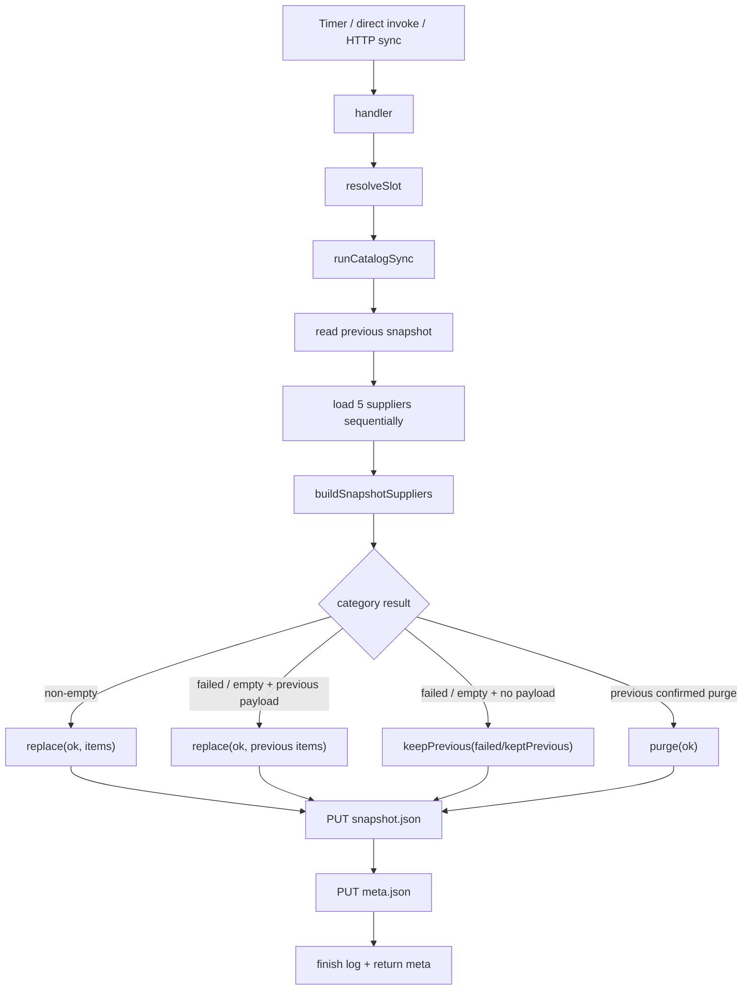

# Создание snapshot в Yandex catalog-sync

`yandex/catalog-sync` — активная production Cloud Function, которая по
расписанию получает прайс-листы, нормализует их, сохраняет прошлые данные при
деградации и публикует versioned snapshot.

Эта страница посвящена **созданию** snapshot. S3-ключи, порядок публикации и
HTTP-выдача вынесены в
[Хранение и выдачу snapshot](./snapshot-storage-serving.md).

## Статусы и архитектурная граница

### ACTIVE production

- `src/handler.js` — entrypoint Cloud Function;
- `src/runSync.js` — orchestration одного запуска;
- `src/time.js` — слоты и version;
- `src/suppliers/*` — прямое получение upstream и нормализация;
- `src/snapshotCommands.js` — политика partial success;
- `src/storage.js` — чтение/запись Object Storage.

### LEGACY / unused

`src/services/suppliers/supplierOrchestrator.js` — браузерный оркестратор, не
импортируемый runtime UI. Он не запускает production sync и не создаёт
production snapshot.

### HELPERS

`yandex/supplier-proxy` и браузерный `fetchSupplier.js` обслуживают
legacy/browser-запросы и изображения. Cloud `catalog-sync` ходит к supplier URL
напрямую и не проходит через supplier-proxy. Файл API Gateway физически лежит в
каталоге `yandex/supplier-proxy`, но его Object Storage routes — конфигурация
выдачи snapshot, а не вызов supplier-proxy function.

## Lifecycle одного snapshot



Пустой upstream-массив намеренно не означает «удалить всё»: это неоднозначный
сигнал. Явный `purge` текущий sync не создаёт из пустого ответа; он только
переносит ранее подтверждённый purge.

## Точки входа `handler(event = {}, context = {})`

**Роль.** Разобрать форму Yandex event и направить запрос в sync либо read
fallback.

**Сигнатура/параметры.**

```js
async function handler(event = {}, context = {}): Promise<HttpResponse | Meta>
```

`context` сейчас не используется. `event` может быть HTTP event, Timer/Message
Queue event или direct invoke.

**Результат.**

- `OPTIONS` → HTTP `204`;
- `GET .../catalog/meta` → `200 meta` либо `404`;
- `GET .../catalog/snapshot` → `200 snapshot` либо `404`;
- Timer/direct invoke → plain `meta`;
- HTTP sync/POST → `{ statusCode: 200, body: {"ok":true,"meta":...} }`;
- неизвестный HTTP-запрос → `400`;
- исключение HTTP → `500` с message; исключение non-HTTP логируется и
  пробрасывается, чтобы платформа увидела failure.

**Async и side effects.** Async; читает/пишет Object Storage через callees,
запускает сетевой импорт и пишет `console.error`.

**Callers/callees.** Caller — Yandex Cloud Functions runtime. Callees:
`resolveSlot`, `runCatalogSync`, `readMeta`, `readSnapshot`.

**Алгоритм маршрутизации.**

1. Нормализовать method/path/query из нескольких форматов event.
2. Сначала обработать preflight и read routes.
3. Считать sync-событием наличие `messages`, event metadata, `action=sync`,
   `/catalog/sync`, POST или direct invoke без HTTP wrapper.
4. Извлечь slot из query, первого message payload, `event.payload` или
   `event.slot`.
5. Запустить sync.

**Гарантии/ограничения.** Берётся только первое сообщение `messages[0]`.
POST считается sync независимо от path. CORS открыт на `*`. HTTP error body
раскрывает `err.message`, поэтому в исключения нельзя помещать секреты.

**Transaction boundary.** Сам handler транзакции не создаёт. Облачный commit
состоит из отдельных Object Storage PUT внутри `runCatalogSync`.

## Оркестратор `runCatalogSync(opts = {})`

**Роль.** Создать одну согласованную in-memory версию snapshot и meta.

**Сигнатура.**

```js
async function runCatalogSync(
  opts?: { slot?: string }
): Promise<{ meta: CatalogMeta }>
```

**Callers/callees.**

- caller: `handler`;
- callees: `getStoreId`, `resolveSlot`, `versionForSlot`, `readSnapshot`,
  `loadAllSuppliersData`, `buildSnapshotSuppliers`, `writeSnapshot`,
  `writeMeta`.

**Пошаговый алгоритм.**

1. Получить `storeId` (`STORE_ID`, default `ElistaIvanor`).
2. Разрешить slot и построить `version`.
3. Записать JSON start-log.
4. Прочитать предыдущий `snapshot.json`; отсутствующий объект даёт `null`.
5. Последовательно загрузить пять поставщиков.
6. Для каждой категории построить command с учётом предыдущего snapshot.
7. Посчитать успешных/неуспешных поставщиков.
8. Собрать snapshot с payload и компактный meta без товаров.
9. Сначала записать snapshot, затем meta.
10. Записать finish-log и вернуть `{ meta }`.

**Input/output.** Вход — опциональный slot; raw supplier payload функция получает
через callees. Выход не содержит snapshot, только meta. Полный snapshot
передаётся в storage.

**Async.** Да. Все сети и storage ожидаются последовательно. Transformer и
command builder синхронны.

**Side effects.** Upstream GET, два Object Storage PUT, два JSON-лога и supplier
error logs.

**Ошибки.** Ошибки отдельных поставщиков инкапсулируются в `loadResults`.
Ошибка чтения предыдущего snapshot, сборки, записи snapshot/meta или другая
системная ошибка отклоняет весь `runCatalogSync`.

**Transaction/commit boundaries.**

- До `writeSnapshot` все изменения только in-memory.
- Успешный `writeSnapshot` — первый внешний commit.
- `writeMeta` — второй, независимый commit.
- Атомарной транзакции между объектами нет. Если snapshot PUT успешен, а meta
  PUT упал, новый snapshot уже доступен, а meta остаётся старым.
- Нет lock/conditional write. Два параллельных sync используют last-writer-wins
  по каждому ключу и могут читать один и тот же previous snapshot.

**Риск изменения.** Менять порядок на `meta → snapshot` опаснее: клиент может
увидеть новую meta.version и скачать старый snapshot. Текущий порядок уменьшает
этот риск, но не даёт полной атомарности.

## Время: `resolveSlot` и `versionForSlot`

### `resolveSlot(explicit)`

Синхронная чистая относительно storage функция. Если `explicit` точно входит в
`['08:00', '09:30', '12:00', '15:00']`, возвращает его; иначе выбирает ближайший
уже прошедший slot по времени `Europe/Moscow`. До первого слота default остаётся
`08:00`, то есть фактически это ещё не прошедший слот.

### `versionForSlot(slot, now = new Date())`

Возвращает строку вида `2026-08-24T12:00:00+03:00`, используя московскую дату и
переданный slot. Формат задуман для лексикографического сравнения клиентом.

**Ограничения.**

- формат `slot` отдельно regex-валидацией не защищён;
- два запуска одного слота в один день получают одинаковую version;
- повторный запуск может изменить payload без увеличения version; обычный клиент
  с непустым каталогом тогда сочтёт себя up-to-date;
- `resolveSlot` при неверном explicit молча выбирает время, а не бросает.

## Команды snapshot

### `readPreviousCategoryState(category)`

**Роль.** Материализовать предыдущее состояние из legacy-массива или command.

**Результат.**

```js
{ known: boolean, action: 'replace' | 'purge' | null, items: object[] }
```

Поддерживает legacy `[]`, `replace(items)` и `purge`. `keepPrevious` payload не
имеет, поэтому `known: false`. Функция синхронна, чиста, без side effects.

### `resolveCategoryCommand({ loaded, items, previousCategory })`

**Роль.** Выбрать безопасную команду одной категории.

```js
{
  command: { action, status, items? },
  degraded: boolean,
  reason: string | null
}
```

Алгоритм:

1. При `loaded === false` сохранить materialized previous, иначе
   `keepPrevious('failed')`.
2. При непустом новом массиве вернуть `replace(newItems)`.
3. При пустом/не-массиве сохранить previous, пометить degraded с причиной
   `empty upstream result`.

Функция не умеет получить явное подтверждение purge от текущего upstream.

### `buildSnapshotSuppliers({...})`

**Роль.** Применить политику ко всем поставщикам и двум категориям.

**Параметры.**

- `previousSnapshot` — прошлый объект или `null`;
- `loadResults` — settled-подобный массив адаптеров;
- `supplierKeys` — канонический порядок;
- `getSupplierLabel` — fallback label resolver.

**Результат.**

```js
{
  suppliers: Record<string, SupplierCommands>,
  metaSuppliers: Array<{ key, label, ok, error?, keptPrevious? }>
}
```

Поставщик `ok` только если загрузка fulfilled и обе категории непустые.
Деградация хотя бы одной категории устанавливает `ok: false`,
`keptPrevious: true` и error, даже если другая категория новая.

**Side effects/async/commit.** Синхронная чистая функция; commit отсутствует.

## Wire-форматы

Сокращённый snapshot:

```json
{
  "schemaVersion": 1,
  "storeId": "ElistaIvanor",
  "version": "2026-08-24T12:00:00+03:00",
  "slot": "12:00",
  "suppliers": {
    "shinservice": {
      "key": "shinservice",
      "label": "Шинсервис",
      "supplier": "Шинсервис",
      "ok": true,
      "tyres": { "action": "replace", "status": "ok", "items": [] },
      "discs": { "action": "replace", "status": "ok", "items": [] }
    }
  }
}
```

В production builder `replace.items` для нового успешного результата непустой.
Пустой `items` в примере показывает форму команды, но current builder не
создаёт такой command из пустого upstream.

Meta:

```json
{
  "storeId": "ElistaIvanor",
  "version": "2026-08-24T12:00:00+03:00",
  "slot": "12:00",
  "suppliers": [
    { "key": "shinservice", "label": "Шинсервис", "ok": true },
    {
      "key": "semisotnov",
      "label": "Семисотнов",
      "ok": false,
      "error": "HTTP 500",
      "keptPrevious": true
    }
  ],
  "okCount": 4,
  "failCount": 1
}
```

## Что подтверждают тесты

`yandex/catalog-sync/src/snapshotCommands.test.js` фиксирует:

- `schemaVersion === 1`;
- непустой успех создаёт `replace`;
- пустой upstream сохраняет previous materialized payload и отмечает
  деградацию;
- ошибка без previous создаёт `keepPrevious/failed`;
- прежний `purge` переносится;
- читаются legacy и command previous formats;
- повторные сбои сохраняют snapshot пригодным для bootstrap.

Downstream `catalogSnapshotValidation.test.js` проверяет wire-схему и нормализацию,
а `catalogSyncService.commitBoundary.test.js` — что validation failure/abort не
изменяют IndexedDB, localStorage и broadcast.

Не покрыты прямыми тестами `handler`, `runCatalogSync`, `time`, storage,
supplier fetch/load и реальная интеграция с Object Storage. Поэтому порядок PUT,
конкурентные запуски, timeout и event shapes остаются интеграционными рисками.

## Риски изменения

1. Повышение `CATALOG_SNAPSHOT_SCHEMA_VERSION` требует сначала научить frontend
   принимать новую версию.
2. Изменение labels нарушит `supplier` match товаров и секции.
3. Параллелизация supplier load изменит upstream-нагрузку.
4. Удаление previous read разрушит partial-success/bootstrap гарантию.
5. Принятие `[]` как purge может массово очистить каталог при сбое upstream.
6. Изменение slot/version влияет на клиентский gate `snapshot.version <= local`.
7. Перестановка PUT meta/snapshot создаст окно публикации новой meta со старым
   payload.

## Связанные страницы

- [Получение данных поставщиков](../07-suppliers/supplier-adapters.md)
- [Transformers](../07-suppliers/transformers.md)
- [Хранение и выдача snapshot](./snapshot-storage-serving.md)
- [Протокол и проверка snapshot](./snapshot-protocol-validation.md)
- [Frontend-автосинхронизация](./frontend-autosync.md)
