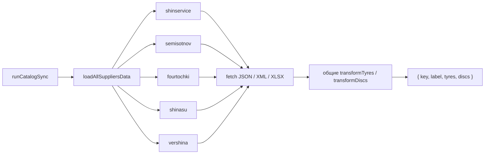

# Получение данных поставщиков

Эта страница объясняет сетевую половину импорта: где берутся прайс-листы пяти
поставщиков, как разбираются JSON/XML/XLSX и где проходит граница частичного
успеха. Преобразование строк в товары разобрано отдельно в
[Transformers](./transformers.md), а сборка итогового файла — в
[Создание snapshot](../06-catalog-sync/yandex-catalog-sync.md).

## Сначала определите статус кода

### ACTIVE production: Cloud Function `catalog-sync`

Текущий production-путь находится в `yandex/catalog-sync/src/suppliers/`:

```text
Timer / ручной invoke
  → runCatalogSync({ slot? })
  → loadAllSuppliersData()
  → loadSupplierData(key)
  → fetchRaw()
  → transform(...)
  → snapshot в Object Storage
```

Cloud Function обращается к полным upstream URL напрямую. CORS-прокси ей не
нужен: CORS ограничивает браузер, а не серверный `fetch`.

### LEGACY / unused: браузерный `supplierOrchestrator`

`src/services/suppliers/supplierOrchestrator.js` и соседние `request.js` —
сохранённый браузерный/manual вариант. По текущему графу импортов runtime UI его
не вызывает. Он **не является** способом наполнения production-каталога.

Legacy-оркестратор умеет:

- при CORS-прокси загружать поставщиков и их части последовательно;
- без прокси параллельно загружать шины и диски одного поставщика и допускать
  частичный результат;
- добавлять к ошибке `supplierLabel` и `failedParts`.

Эта логика отличается от active cloud-пути: облачный адаптер считает ошибку
любой части ошибкой всего поставщика и затем сохраняет его предыдущее состояние
на этапе сборки snapshot.

### HELPERS

- `yandex/catalog-sync/src/suppliers/fetch.js` — timeout, HTTP и разбор формата;
- `yandex/catalog-sync/src/suppliers/transforms.js` — только реэкспорт общих
  transformers из `src/services/suppliers/*/transformers.js`;
- `src/services/suppliers/shared/fetchXmlJson.js`,
  `src/utils/fetchSupplier.js` — браузерные helpers legacy-пути;
- `yandex/supplier-proxy` — вспомогательная инфраструктура для
  legacy/browser-запросов и проксирования изображений. Это **не** production-путь
  облачного `catalog-sync` к поставщикам.

## Активный конвейер



Поставщики обрабатываются **последовательно** в фиксированном порядке:
`shinservice → semisotnov → fourtochki → shinasu → vershina`. Ошибка одного не
прерывает цикл.

## Контракты адаптеров

| Ключ | Upstream и env | Raw input | Получение категорий |
| --- | --- | --- | --- |
| `shinservice` | `SHINSERVICE_TYRES_URL`, `SHINSERVICE_DISCS_URL`; fallback на одноимённые `REACT_APP_*` | два JSON | два последовательных `fetchJson` |
| `semisotnov` | две переменные `SEMISOTNOV_*_URL` | два XML, разобранных в object | два последовательных `fetchXmlJson` |
| `fourtochki` | `FOURTOCHKI_TYRES_URL`, fallback `REACT_APP_4TOCHKI_TYRES_URL` | один JSON с `tires` и `rims` | один запрос, обе категории из общего raw |
| `shinasu` | `SHINASU_URL`, fallback `REACT_APP_SHINASU_URL` | строки первого листа XLSX | один запрос, строки фильтруют два transformer |
| `vershina` | `VERSHINA_TYRES_URL`, `VERSHINA_DISCS_URL` | два XML | два последовательных `fetchXmlJson` |

URL поставщиков обязательны. Значения секретов и реальные URL не являются
частью документационного контракта.

## Важные функции active-пути

### `loadSupplierData(key)`

**Роль.** Выполнить полный адаптер одного поставщика.

**Сигнатура и параметры.**

```js
async function loadSupplierData(key: string): Promise<{
  key: string,
  label: string,
  tyres: object[],
  discs: object[]
}>
```

- `key` должен быть одним из пяти ключей реестра `suppliers`;
- функция `async`;
- caller: `loadAllSuppliersData`;
- callees: `supplier.fetchRaw`, затем синхронный `supplier.transform`.

**Пошаговый алгоритм.**

1. Найти описание поставщика; неизвестный ключ приводит к `Error`.
2. Дождаться всех raw-ответов, предусмотренных данным адаптером.
3. Синхронно вызвать transformers шин и дисков.
4. Если transformer вернул не массив, подставить `[]`.
5. Вернуть ключ, label и обе категории.

**Side effects и границы commit.** Сетевые GET-запросы — side effect. Записей в
Object Storage/IndexedDB и транзакций здесь нет. Нормализация выполняется в
памяти и ничего не commit-ит.

**Ошибки и гарантии.** Ошибка env, timeout, HTTP, парсинга или transformer
отклоняет весь Promise поставщика. Успешный результат всегда содержит массивы
`tyres` и `discs`, но они могут быть пустыми; смысл пустоты решается позже в
`buildSnapshotSuppliers`.

**Риск изменения.** Параллелизация двух endpoint одного поставщика изменит
нагрузку на upstream и порядок ошибок. Частичное принятие одной категории
изменит семантику snapshot и требует согласованного изменения тестов команд.

### `loadAllSuppliersData()`

**Роль.** Изолировать отказы поставщиков и вернуть полный отчёт для snapshot.

**Результат.**

```js
Promise<Array<
  | { key, status: 'fulfilled', value: { key, label, tyres, discs } }
  | { key, status: 'rejected', reason: Error }
>>
```

**Алгоритм и async.** Функция `async`; выполняет `await loadSupplierData(key)` в
цикле. На успех добавляет `fulfilled`, на ошибку пишет `console.error` и
добавляет `rejected`. Массив всегда следует `SUPPLIER_LOAD_ORDER`.

**Callers/callees.** Единственный production caller — `runCatalogSync`;
непосредственный callee — `loadSupplierData`.

**Side effects / transaction boundary.** Помимо сетевых запросов, пишет ошибки в
лог Cloud Function. Транзакции нет; отказ одного поставщика не откатывает уже
выполненные запросы и не прекращает остальные.

**Гарантия partial success.** Функция не бросает из-за обычного отказа отдельного
поставщика. Но системная ошибка вне внутреннего `try`, например проблема до
начала цикла, всё ещё может отклонить Promise.

### `fetchWithTimeout(url, options = {})`

**Роль.** Общая отмена зависшего upstream-запроса.

- async; возвращает `Promise<Response>`;
- timeout: числовой `UPSTREAM_TIMEOUT_MS`, иначе `120000` мс;
- создаёт `AbortController`, передаёт его `signal` в `fetch`;
- всегда очищает timer в `finally`;
- caller: `fetchJson`, `fetchXmlJson`, `fetchExcelRows`;
- side effects: сеть и timer; retry отсутствует;
- ошибка сети/abort пробрасывается без преобразования.

Изменение timeout влияет сразу на все пять адаптеров. Передача собственного
`signal` через `options` не образует композицию сигналов: внутренний `signal`
перезаписывает его.

### Парсеры `fetchJson`, `fetchXmlJson`, `fetchExcelRows`

Все три функции `async`, требуют непустой URL, используют `cache: 'no-store'` и
бросают `Error("HTTP <status>")` при `!response.ok`.

- `fetchJson(url) → Promise<any>` вызывает `response.json()`;
- `fetchXmlJson(url) → Promise<object>` читает text и использует
  `fast-xml-parser` с сохранением атрибутов под `@_`, приведением node/attribute
  values и trim;
- `fetchExcelRows(url) → Promise<object[]>` читает `ArrayBuffer`, открывает
  workbook через `xlsx` и преобразует **только первый лист** через
  `sheet_to_json`.

Парсеры не валидируют бизнес-схему. Это обязанность transformers. XLSX без листа,
невалидный JSON/XML или несовместимая библиотечная структура приводят к reject.

## Input/output на примере

Условный raw JSON:

```json
{
  "tires": [{ "cae": "A-1", "brand": "Kama", "price_krd": 5000 }],
  "rims": [{ "cae": "D-1", "brand": "СКАД", "price_krd": 7000 }]
}
```

После адаптера:

```json
{
  "key": "fourtochki",
  "label": "Форточки",
  "tyres": [{ "id": "fourtochki_A-1", "supplier": "Форточки" }],
  "discs": [{ "id": "fourtochki_D-1", "supplier": "Форточки" }]
}
```

Фактические товары содержат больше полей; их контракт описан на странице
[Transformers](./transformers.md).

## Ошибки по слоям

| Слой | Пример | Где перехватывается |
| --- | --- | --- |
| Конфигурация | обязательный URL не задан | `loadAllSuppliersData` превращает в `rejected` |
| Сеть | timeout, DNS, HTTP 4xx/5xx | там же |
| Синтаксис | битый JSON/XML/XLSX | там же |
| Бизнес-схема | нет ожидаемого массива | transformer бросает, затем `rejected` |
| Пустой корректный массив | upstream вернул 0 товаров | загрузка `fulfilled`, но snapshot помечает категорию degraded и сохраняет предыдущее |

## Что подтверждают тесты

Прямых unit-тестов `loadAll.js`, сетевых helpers и supplier transformers в
репозитории нет. Не следует приписывать им покрытие, которого нет.

Косвенно поведение результата закреплено:

- `yandex/catalog-sync/src/snapshotCommands.test.js` проверяет, что rejected
  supplier и пустой upstream не стирают materialized payload;
- `src/services/catalogSync/catalogSnapshotValidation.test.js` проверяет
  обязательные identity-поля, числа, шины/диски, дубликаты и большие snapshot;
- `catalogSyncService.commitBoundary.test.js` проверяет, что невалидный snapshot
  не пересекает IndexedDB commit boundary.

Наиболее рискованные непокрытые места — изменения upstream-схем, XLSX-заголовков,
XML parser options, brand mappings и арифметики количества.

## Связанные страницы

- [Transformers и нормализация](./transformers.md)
- [Создание snapshot](../06-catalog-sync/yandex-catalog-sync.md)
- [Хранение и выдача snapshot](../06-catalog-sync/snapshot-storage-serving.md)
- [Протокол и проверка snapshot](../06-catalog-sync/snapshot-protocol-validation.md)
