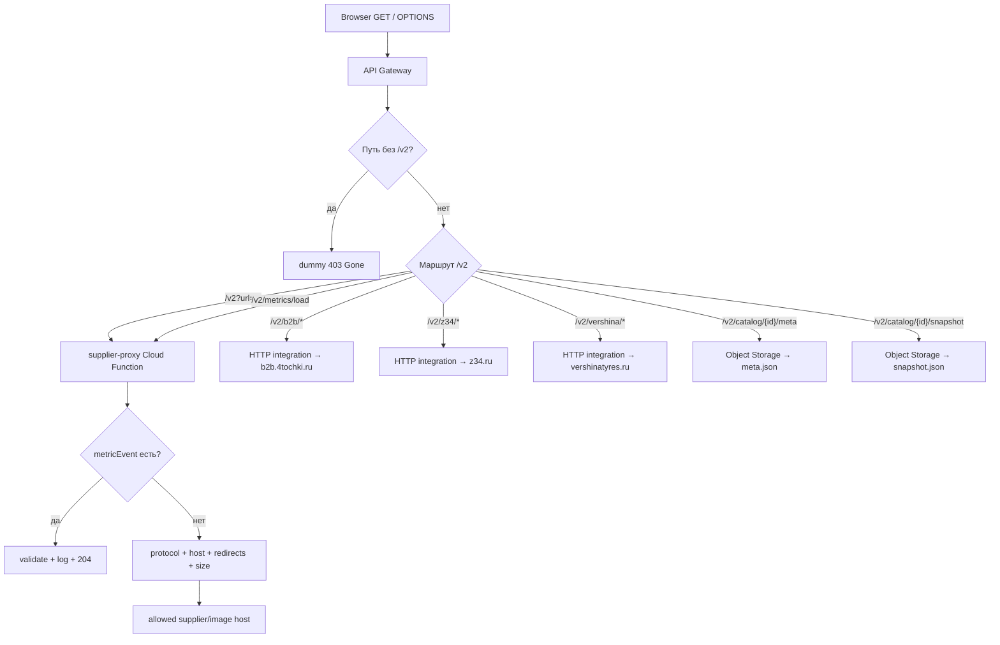

# Supplier proxy: безопасный мост для браузера

`supplier-proxy` — активный **вспомогательный** CORS-мост между браузером и
разрешёнными supplier-hosts. Он нужен прежде всего для изображений карточек и
сохранённого browser/manual пути загрузки прайсов.

::: danger Не путайте две production-цепочки
Production `catalog-sync` в Yandex Cloud получает прайсы **напрямую** по
server-side URL, без supplier-proxy. Готовые `meta.json` и `snapshot.json`
API Gateway читает напрямую из Object Storage. Supplier-proxy не является
production-путём облачной синхронизации каталога.
:::

Страница проверена по `yandex/supplier-proxy/index.js`,
`yandex/supplier-proxy/apigw.yaml` и `src/utils/fetchSupplier.js`.

## Роли и статусы

### ACTIVE: вспомогательные browser/image-запросы

Актуальный префикс Gateway — `/v2`.

- `GET /v2?url=...&purpose=image|price` вызывает Cloud Function
  `supplier-proxy`; она проверяет URL, allowlist, каждый redirect и размер body.
- `GET /v2/b2b/{path+}`, `/v2/z34/{path+}`,
  `/v2/vershina/{path+}` — прямые HTTP integrations API Gateway. Cloud Function
  здесь не вызывается.
- `GET /v2/metrics/load?...` вызывает metric-ветку той же Cloud Function.

В текущем UI изображения проходят через `resolvePhotoUrl` из карточки товара,
модального окна и корзины. Browser-price helpers остаются рабочими, но их
основной caller — legacy supplier adapters, а не autosync snapshot.

### LEGACY routes: намеренно закрыты

Старые публичные пути `/`, `/b2b/{path+}`, `/z34/{path+}` и
`/vershina/{path+}` описаны как `dummy` integrations и всегда отвечают
`403 {"error":"Gone"}`. Это блокирует старые открытые вкладки с устаревшим JS,
которые не добавляли `/v2`.

Это не «fallback» и не временный redirect: маршруты специально выведены из
эксплуатации.

### Object Storage catalog routes: отдельная подсистема

В том же `apigw.yaml` находятся:

- `/v2/catalog/{storeId}/meta`;
- `/v2/catalog/{storeId}/snapshot`.

Они имеют `type: object_storage` и читают
`stores/{storeId}/meta.json|snapshot.json` из bucket. Эти запросы **не проходят**
через `supplier-proxy/index.js` и не используют allowlist supplier hosts.
Подробнее: [Хранение и выдача snapshot](../06-catalog-sync/snapshot-storage-serving.md).

## Дерево маршрутизации



## Контракт Cloud Function

### `handler(event)`

**Роль.** Главная точка входа: обработать CORS, metrics или безопасно
проксировать один GET.

**Сигнатура и параметры.**

```js
async function handler(event: ApiGatewayEvent): Promise<{
  statusCode: number,
  headers: Record<string, string>,
  body: string,
  isBase64Encoded: boolean
}>
```

Из event читаются:

- HTTP method из `event.httpMethod` либо
  `event.requestContext.http.method`, default `GET`;
- query из `queryStringParameters`;
- входной `Accept`;
- IP из первого `x-forwarded-for` либо `requestContext`;
- `url`, `purpose` или metric-параметры.

`handler` экспортируется как CommonJS `module.exports.handler`, его caller —
Yandex Cloud Functions runtime через API Gateway.

**Результат и форматы.**

- `OPTIONS` → `204`, пустой body;
- не-GET → JSON `405`;
- metric event → `204` либо JSON `400`;
- proxy success → upstream status, исходный `Content-Type`, text body или
  base64 binary body;
- validation/upstream failure → JSON 4xx/5xx.

Все ответы Cloud Function содержат CORS:

```text
Access-Control-Allow-Origin: *
Access-Control-Allow-Methods: GET, OPTIONS
Access-Control-Allow-Headers: *
Access-Control-Max-Age: 86400
```

Gateway также задаёт глобальный CORS. Заголовки upstream, кроме
`Content-Type`, наружу не переносятся: нет `Content-Length`, `Cache-Control`,
`ETag`, `Content-Disposition` и cookies.

**Async.** Да. Ожидает upstream response и полное чтение body.

**Side effects.** Выполняет внешний GET, читает env, запускает timers, пишет
структурированные JSON-логи через `console.error`. Module-level handlers также
логируют `unhandledRejection` и `uncaughtException`.

**Callers/callees.**

- caller: API Gateway Cloud Function integration;
- callees: metric helpers либо `parseAllowedHostsEnv`, limit getters,
  `requestPurpose`, `isAllowedHost`, `fetchFollowingRedirects`,
  `readBodyForGateway`.

**Пошаговый алгоритм proxy-ветки.**

1. Нормализовать method; закончить на OPTIONS/405.
2. Если query содержит `metricEvent`, передать запрос metric handler.
3. Прочитать allowlist и ограниченные env-настройки.
4. Потребовать `url` и разобрать его через `new URL`.
5. Определить purpose: явные `image|price`, иначе эвристика по extension/path.
6. Разрешить только `http:` и `https:`.
7. Проверить начальный hostname по allowlist.
8. Выполнить GET с ручной обработкой redirect.
9. Проверить объявленный и фактический размер body.
10. Текст вернуть как UTF-8, binary — как base64.
11. Сохранить upstream status и добавить CORS/Content-Type.
12. Логировать price-запросы и ошибки; успешные image-запросы не логировать.

**Transaction/commit boundary.** Транзакции нет. Proxy ничего не сохраняет:
каждый запрос независим. Единственный необратимый внешний эффект — уже
выполненный GET и запись лога.

## SSRF-граница `isAllowedHost`

```js
isAllowedHost(
  hostname: string,
  allowedHosts: string[]
): boolean
```

**Роль.** Разрешить только точный host или его subdomain.

Алгоритм приводит входной hostname к lowercase и проверяет:

```text
hostname === allowedHost
или
hostname заканчивается на "." + allowedHost
```

Например, allowlist `example.com` разрешит `example.com` и
`cdn.example.com`, но не `evil-example.com`.

Функция синхронная и чистая. Callers — первоначальная проверка в `handler` и
проверка каждого redirect в `fetchFollowingRedirects`.

Default allowlist:

- `z34.ru`;
- `b2b.4tochki.ru`;
- `api-b2b.pwrs.ru`;
- `shina.su`;
- `vershinatyres.ru`;
- `duplo-api.shinservice.ru`;
- `duplo-s0.shinservice.ru`.

`ALLOWED_HOSTS` принимает JSON-массив либо CSV. Если JSON parsing не удался,
строка трактуется как CSV.

**Гарантии.**

- произвольный host вне списка не проксируется;
- похожий суффикс без границы точки не проходит;
- каждый redirect host проверяется повторно;
- non-HTTP(S) protocol не проходит.

**Ограничения.**

- env entries не приводятся к lowercase: uppercase в пользовательском
  `ALLOWED_HOSTS` может неожиданно не совпасть;
- разрешаются все subdomains каждого allowlist entry;
- нет отдельной проверки DNS result/private IP, DNS rebinding и URL credentials;
- безопасность зависит от доверия к разрешённым доменам и их redirects;
- `http:` допустим наравне с `https:`, поэтому transport confidentiality не
  гарантируется самим proxy.

Расширение allowlist — изменение security boundary, а не обычная настройка.

## Redirects: `fetchFollowingRedirects`

```js
async function fetchFollowingRedirects(
  initialUrl: URL,
  init: RequestInit,
  {
    timeoutMs: number,
    maxRedirects: number,
    allowedHosts: string[]
  }
): Promise<Response>
```

**Роль.** Следовать redirects вручную и не позволить redirect обойти allowlist.

**Алгоритм.**

1. Выполнить `fetchWithTimeout(..., redirect: 'manual')`.
2. Для status `300–399` прочитать `Location`.
3. Без `Location` вернуть response как есть.
4. Разрешить relative Location через `new URL(location, current)`.
5. Повторно проверить protocol и hostname.
6. Продолжить не более `maxRedirects`; иначе бросить
   `TOO_MANY_REDIRECTS`.
7. Первый non-redirect response вернуть caller.

**Ошибки.**

- `BAD_REDIRECT` → HTTP 502 `Bad redirect`;
- `BAD_REDIRECT_HOST` → 502 и отклонённый host;
- `TOO_MANY_REDIRECTS` → 502;
- ошибка `new URL(Location, current)`, не имеющая custom code, попадёт в общий
  502 `Upstream fetch failed`.

**Async/side effects.** Async; один или несколько внешних GET. Storage и commit
отсутствуют.

**Ограничения.**

- timeout применяется **к каждому hop отдельно**, а не ко всей redirect-цепочке;
- каждый hop получает новый `AbortController`;
- метод всегда GET из handler, но helper сам принимает произвольный `init`;
- redirect response body не читается перед следующим hop;
- max `10` redirects ограничен getter-ом конфигурации.

## Timeout: `fetchWithTimeout`

```js
async function fetchWithTimeout(
  url: string,
  init: RequestInit,
  timeoutMs: number
): Promise<Response>
```

Создаёт `AbortController`, через timer вызывает
`controller.abort(new Error('upstream-timeout'))`, передаёт внутренний signal в
`fetch` и очищает timer в `finally`.

**Callers.** Только `fetchFollowingRedirects`.

**Гарантия.** Timer не остаётся после завершения `fetch`.

**Важное ограничение.** `fetch` возвращает Response после получения headers.
Timer очищается до `readBodyForGateway`, поэтому медленное/зависшее чтение body
не ограничено этим timeout. Кроме того, переданный в `init` внешний signal
перезаписывается внутренним.

Timeout/abort в большинстве Node runtime попадёт в message и преобразуется
handler-ом в `504 Upstream timeout`; точная форма ошибки зависит от реализации
`fetch`.

## Ограничение body: `readStreamToBuffer`

```js
async function readStreamToBuffer(
  stream: ReadableStream | NodeJS.Readable | null,
  maxBytes: number
): Promise<Buffer>
```

**Роль.** Полностью собрать body, не превысив лимит.

Поддерживаются два формата:

1. Web/undici stream через `getReader`;
2. Node.js async iterable `Readable`.

Для каждого chunk увеличивается `total`. При `total > maxBytes` бросается Error
с `code: 'RESPONSE_TOO_LARGE'`, `bytes`, `maxBytes`. Web reader дополнительно
пытается выполнить `cancel`; Node fallback явно stream не уничтожает.

Пустой stream даёт `Buffer.alloc(0)`.

**Async/side effects.** Async, потребляет поток и выделяет память. Никакого
постепенного streaming к клиенту нет: весь body буферизуется.

**Гарантии/ограничения.**

- фактические chunks проверяются даже без `Content-Length`;
- peak memory включает chunks, итоговый Buffer и позднее text/base64;
- base64 увеличивает размер примерно на треть;
- при превышении лимита уже принятые bytes остаются выделенными до cleanup;
- отдельного body-read timeout нет.

## Формат Gateway: `readBodyForGateway`

```js
async function readBodyForGateway(
  upstreamResponse: Response,
  maxBytes: number
): Promise<{
  body: string,
  isBase64Encoded: boolean,
  contentType: string
}>
```

**Алгоритм.**

1. Взять `Content-Type`, default `application/octet-stream`.
2. Если корректный `Content-Length` уже больше лимита — отклонить до чтения.
3. Для `text/*`, JSON, XML, JavaScript и XHTML прочитать Buffer и декодировать
   UTF-8; `isBase64Encoded: false`.
4. Остальное считать binary и вернуть base64;
   `isBase64Encoded: true`.

Caller — `handler`; callee — `readStreamToBuffer`.

**Форматная граница.** Классификация зависит только от `Content-Type`. Ошибочно
помеченный binary как text может быть повреждён UTF-8 decoding; неизвестный
текст как octet-stream останется корректными bytes, но будет base64 envelope.

`Content-Length` — ранняя оптимизация, но не доверенная гарантия: stream limit
всё равно проверяется.

## Metric handler

### `handleMetricEvent(event)`

**Роль.** Записать диагностическое событие, не сохраняя его в БД.

Допустимы только `load-start` и `load-finish`. Неизвестное значение возвращает
JSON 400.

Логируемый payload:

```js
{
  event: 'load-start' | 'load-finish',
  loadId: string, // максимум 80 символов
  ip: string,
  ok?, hadClientErrors?, hadSaveErrors?, // только load-finish
  suppliers? // максимум 500 символов
}
```

Boolean является `true` только для case-insensitive строки `"true"`.
Успех возвращает `204`.

**Async.** Нет: helper синхронный, хотя вызывающий handler async.

**Side effects.** Одна JSON-строка в `console.error`.

**Callers/callees.** Caller — metric branch `handler`; callees — query/IP/bool
helpers, `logJson`, `empty/json`.

**Гарантии/ограничения.**

- длины свободных строк ограничены;
- нет пользовательской auth, rate limit, подписи или проверки существования
  `loadId`;
- IP доверяет первому `x-forwarded-for`; корректность зависит от Gateway;
- endpoint публичный, поэтому metrics пригодны для диагностики, но не для
  биллинга или security-аудита;
- frontend helper `reportCatalogLoadMetric` по комментарию больше не вызывается
  UI autosync и оставлен для debug/manual use.

### `reportCatalogLoadMetric(...)` в браузере

Формирует query `/v2/metrics/load`, вызывает fire-and-forget GET с
`cache: 'no-store'`, `keepalive: true` и подавляет синхронные/Promise-ошибки.
Если нет proxy base, event или loadId, ничего не делает. Commit/result для
caller отсутствует.

## Конфигурационные limits

| Env | Default | Нормализация и жёсткие границы |
| --- | ---: | --- |
| `ALLOWED_HOSTS` | 7 project hosts | JSON array или CSV |
| `UPSTREAM_TIMEOUT_MS` | `120000` мс | clamp `1000…240000`; invalid → default |
| `MAX_REDIRECTS` | `5` | clamp `0…10`; invalid → default |
| `MAX_RESPONSE_BYTES` | `25 MiB` | clamp `1…200 MiB`; invalid → default |

Limits применяются только к Cloud Function route `/v2?url=...`. Прямые HTTP
integrations `/v2/b2b`, `/v2/z34`, `/v2/vershina` не исполняют `index.js`,
поэтому эти JavaScript limits к ним не относятся. У API Gateway/платформы могут
быть собственные лимиты, но они не заданы этим кодом.

## Логи и классификация purpose

`purpose` может быть явно `image` или `price`. Иначе `looksLikeImageUrl`
определяет image по расширению или каталогам `pictures`, `photo`, `photos`,
`catalog`, `goods`, `upload`; всё остальное считается price.

Логи:

- blocked initial host → `blocked-host`;
- успешный/non-4xx price response → `proxy-price`;
- image с status `>= 400` → `proxy-image-error`;
- исключение → `proxy-error`;
- outer crash → `handler-crash`;
- успешное изображение намеренно не логируется.

Поле `bytes` успешного лога — `JSON.stringify(responseObj).length`, а не точный
размер upstream body и не UTF-8 byte length. `safeUpstream` логирует host/path,
но не query, уменьшая риск утечки query-секретов.

## Связь с frontend

### `resolveSupplierFetchUrl(targetUrl, { purpose = 'price' })`

Синхронно выбирает transport:

1. Пустой/relative URL вернуть без изменений.
2. Без `REACT_APP_CORS_PROXY` вернуть абсолютный target напрямую.
3. Для точных hosts из `DIRECT_PROXY_MAP` построить:
   - `b2b.4tochki.ru → /v2/b2b/...`;
   - `z34.ru → /v2/z34/...`;
   - `vershinatyres.ru → /v2/vershina/...`.
4. Для остальных абсолютных URL построить
   `/v2?url=<encoded>&purpose=<encoded>`.

При невалидном URL helper оставляет исходную строку. Host lookup точный:
subdomain, разрешённый Cloud Function allowlist, не обязательно попадёт в
`DIRECT_PROXY_MAP` и тогда пойдёт через `/v2?url=...`.

### `resolvePhotoUrl(rawUrl, supplierLabel)`

```js
resolvePhotoUrl(
  rawUrl: unknown,
  supplierLabel: string
): string
```

**Роль.** Сделать supplier photo URL абсолютным и при configured production
proxy направить его через Gateway с `purpose=image`.

**Алгоритм.**

1. Trim; пустые, `"undefined"` и `"null"` превратить в `''`.
2. `//host/path` превратить в `https://host/path`.
3. Relative path дополнить origin по supplier label.
4. Без proxy или при всё ещё не-HTTP URL вернуть как есть.
5. Иначе вызвать `resolveSupplierFetchUrl(..., { purpose: 'image' })`.

Callers — `CatalogItemCard`, `CatalogItemModalWindow`, `BasketPage`.
Функция синхронная, side effects/commit отсутствуют.

**Ограничения.** Origin выбирается по точному русскому label. Неизвестный label
оставит relative URL. Helper не проверяет allowlist — фактическая Cloud Function
сделает это позже; direct HTTP integration полагается на статическую route
mapping.

Пример:

```text
resolvePhotoUrl("/pictures/a.jpg", "Вершина")
→ https://<gateway>/v2/vershina/pictures/a.jpg
```

### `fetchSupplier(targetUrl, init = {})`

**Роль.** Browser helper для price/raw requests.

**Результат.** `Promise<Response>`; HTTP `!ok` сам по себе не считается
исключением и возвращается caller, который решает, бросать ли ошибку.

**Алгоритм.**

1. Построить proxy/direct URL с `purpose=price`.
2. Скопировать headers.
3. Для GET удалить `Content-Type`, чтобы не создавать лишний preflight.
4. Вызвать `fetchWithRetry`.
5. Сетевую ошибку обернуть сообщением с безопасным host/path description и
   количеством попыток, сохранив `cause`.

**Async/side effects.** Async, сеть и при retry — delay timer. Commit/storage
отсутствуют.

**Retry.**

- через configured proxy: одна попытка;
- без proxy: две попытки с backoff `1500 * attempt` мс;
- retryable: network/timeout/abort-like ошибки, HTTP `>=500` и `429`;
- `503` и `504` специально не повторяются.

В active snapshot UI `fetchSupplier` не загружает каталог: браузер скачивает
готовый snapshot. Текущая активная связь proxy с UI — прежде всего
`resolvePhotoUrl`; price-fetch callers принадлежат legacy supplier adapters.

## Input/output examples

### Текстовый upstream

```http
GET /v2?url=https%3A%2F%2Fshina.su%2Fprice.xml&purpose=price
```

Условный ответ функции:

```json
{
  "statusCode": 200,
  "headers": {
    "Access-Control-Allow-Origin": "*",
    "Content-Type": "application/xml"
  },
  "body": "<?xml version=\"1.0\"?>...",
  "isBase64Encoded": false
}
```

### Binary image

```http
GET /v2?url=https%3A%2F%2Fduplo-s0.shinservice.ru%2Fphoto.jpg&purpose=image
```

Body Cloud Function envelope — base64 и `isBase64Encoded: true`; API Gateway
декодирует binary для HTTP-клиента согласно своей интеграции.

### Запрещённый redirect

Если разрешённый host отвечает `Location: http://127.0.0.1/`, следующий host не
проходит allowlist. Клиент получает 502:

```json
{
  "error": "Redirect host not allowed",
  "host": "127.0.0.1"
}
```

### Слишком большой response

При превышении configured limit функция возвращает 413 с уже измеренным
`bytes` и `maxBytes`.

## Ошибки и HTTP-коды

| Условие | Ответ |
| --- | --- |
| Нет `url`, invalid URL/protocol | `400` |
| Unknown metric event | `400` |
| Initial host вне allowlist | `403` |
| Метод не GET/OPTIONS | `405` |
| Body больше лимита | `413` |
| Redirect invalid/forbidden/too many | `502` |
| Остальная upstream/network ошибка | `502` |
| Распознанный upstream timeout | `504` |
| Неожиданный outer crash | `502` |

Обычный upstream status, включая 404/500, проксируется как есть после чтения
body. Он не превращается в proxy exception.

В generic 502 и handler-crash response включается `detail: err.message`.
Следовательно, тексты исключений не должны содержать secrets.

## Гарантии и ограничения системы

### Гарантируется кодом

- только GET/OPTIONS;
- protocol и host проверяются до initial fetch;
- redirect protocol/host проверяются на каждом hop;
- число redirects и body size ограничены;
- binary не проходит через UTF-8 при корректном Content-Type;
- старые routes получают 403;
- успешные image requests не засоряют function logs;
- catalog routes отделены типом `object_storage`.

### Не гарантируется

- пользовательская authentication/authorization;
- rate limiting и quotas на уровне приложения;
- end-to-end timeout body;
- malware/content validation;
- корректность upstream Content-Type;
- streaming без полной буферизации;
- retry Cloud Function proxy-вызова со стороны frontend;
- точная аналитика metrics;
- защита от компрометации allowlisted host;
- ограничения `index.js` на direct HTTP integrations.

## Тесты и способы проверки

Unit/integration-тестов для `yandex/supplier-proxy/index.js`,
`fetchSupplier.js`, `resolvePhotoUrl` и Gateway route selection в репозитории
нет. Поэтому нельзя утверждать, что allowlist/redirect/size/error mapping
автоматически защищены тестами.

Есть эксплуатационный `yandex/supplier-proxy/verify.ps1`: по README он проверяет
актуальные direct routes и ожидает HTTP 200, большие ответы и XML-префикс для
z34/vershina. Это smoke script, не unit test; он зависит от развернутого Gateway
и upstream.

Минимальный будущий test contract:

1. exact host/subdomain/evil-suffix для `isAllowedHost`;
2. redirect на allowed, forbidden и non-HTTP destination;
3. 0, limit и limit+1 bytes для обоих stream APIs;
4. text/binary Content-Type и base64;
5. env clamps;
6. handler status matrix;
7. URL mapping и relative photo origins;
8. отсутствие retry через proxy и две попытки без него.

## Риски изменения

1. Добавление host расширяет SSRF/data-egress boundary.
2. Удаление redirect re-check превращает разрешённый host в открытый redirect к
   запрещённой сети.
3. Повышение `MAX_RESPONSE_BYTES` повышает peak memory сильнее линейно из-за
   chunks + Buffer + base64/envelope.
4. Добавление новых text Content-Type может повредить binary при ошибочной
   классификации.
5. Смена `/v2` требует синхронно обновить Gateway и frontend URL builder.
6. Возврат legacy routes вместо 403 снова активирует устаревшие вкладки.
7. Перенос direct routes в Cloud Function вернёт function memory/response
   limits для больших прайсов.
8. Нельзя направлять cloud `catalog-sync` через этот публичный proxy: это
   добавит CORS-ненужную точку отказа и смешает trust boundaries.
9. Изменение supplier label ломает relative photo origin mapping.
10. Логирование query может раскрыть tokens/параметры upstream; текущий
    `safeUpstream` намеренно исключает query.

## Навигация по 12-главному учебнику

- Архитектурная граница:
  [Браузер и Yandex Cloud](/02-architecture/browser-yandex-boundary)
- Основной поток каталога:
  [Создание snapshot](/06-catalog-sync/yandex-catalog-sync)
- Хранение каталога:
  [Хранение и выдача snapshot](/06-catalog-sync/snapshot-storage-serving)
- Поставщики:
  [Получение данных](/07-suppliers/supplier-adapters) и
  [Transformers](/07-suppliers/transformers)
- Потребитель изображений:
  [Компоненты каталога](/10-ui/catalog-components)
- Контрактное тестирование:
  [Каталог контрактов](/11-testing/contract-catalog) и
  [Стратегия тестирования](/11-testing/test-strategy)
- Эксплуатация:
  [Yandex runbook](/12-operations/yandex-runbook) и
  [Логи и диагностика](/12-operations/logging-and-diagnostics)
