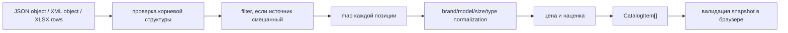

# Transformers: нормализация товаров

Transformers переводят пять несовместимых прайс-листов в одну модель шин и
дисков. Они не загружают данные и не сохраняют каталог: их граница — чистое
синхронное преобразование raw object/rows в массив plain objects.

Сеть и форматы источников описаны в
[Получении данных поставщиков](./supplier-adapters.md), а серверная сборка
результата — в [Создании snapshot](../06-catalog-sync/yandex-catalog-sync.md).

## Статус кода

### ACTIVE production

Реализации находятся в:

- `src/services/suppliers/shinservice/transformers.js`;
- `src/services/suppliers/semisotnov/transformers.js`;
- `src/services/suppliers/4tochki/transformers.js`;
- `src/services/suppliers/ShinaSu/transformers.js`;
- `src/services/suppliers/Vershina/transformers.js`.

`yandex/catalog-sync/src/suppliers/transforms.js` не копирует эту логику, а
реэкспортирует те же функции под supplier-specific именами. `esbuild` включает
их в Node.js bundle Cloud Function. Поэтому эти frontend-каталоги файлов,
несмотря на путь `src/`, являются единым production source of truth для
нормализации snapshot.

### LEGACY / unused browser path

Те же transformers подключены объектами из
`src/services/suppliers/*/index.js` к
`src/services/suppliers/supplierOrchestrator.js`. Сам оркестратор не импортируется
текущим runtime UI. Это legacy/manual caller, а не основной production-путь.

### HELPERS

- `src/config/stores.js` — реестр профилей магазина: имя, телефон, списки брендов, `tyreMargins` и `discMargin`;
- `src/services/dataTransformers.js` — `getMargin(brand, storeId?)` и `getDiscMargin(storeId?)` читают профиль, `calculateSellingPrice` считает цену;
- `src/services/suppliers/shared/deriveModel.js` — model/title helpers;
- локальные `parse*`, `normalize*`, `clean*` внутри transformer-файлов —
  supplier-specific helpers.

`supplier-proxy` не участвует в преобразовании и не является путем cloud
catalog-sync. Он нужен браузерному legacy-коду и URL изображений.

## Общий поток



Важное разделение обязанностей:

1. supplier transformer делает предметное сопоставление полей;
2. `snapshotCommands.js` решает `replace/keepPrevious/purge`;
3. браузерный `catalogSnapshotValidation.js` выполняет строгую wire-валидацию и
   консервативную повторную нормализацию перед IndexedDB.

## Контракт экспортируемых функций

У каждого поставщика есть:

```js
transformTyres(rawData: unknown, storeId?: string): TireItem[]
transformDiscs(rawData: unknown, storeId?: string): DiscItem[]
```

**Роль.** Проверить ожидаемый корневой массив, затем сопоставить каждую запись с
общей моделью. `storeId` задаёт профиль маржи из `src/config/stores.js`;
`catalog-sync` передаёт `STORE_ID` / `getStoreId()`. Без аргумента helpers
падают на профиль `ElistaIvanor`.

**Async.** Нет: обе функции синхронные.

**Side effects.** Нет сети, логов, storage или мутации внешнего состояния.
Функции создают новые массивы и объекты. Они читают raw; явной мутации raw в
коде нет.

**Transaction/commit boundary.** Отсутствует. Результат существует только в
памяти. Commit появляется намного позже — при одной IndexedDB-транзакции на
клиенте.

**Callers.**

- ACTIVE: `yandex/catalog-sync/src/suppliers/loadAll.js` через реэкспорты
  `transforms.js`;
- LEGACY/unused: `supplierOrchestrator.loadSupplierData`.

**Callees.** Общие price/model helpers и локальные parser/normalizer-функции.

**Ошибки.** При неверной корневой структуре бросается supplier-specific `Error`.
Ошибка внутри одного `.map` отклоняет преобразование всей категории, а в active
адаптере — всего поставщика. Поэлементного quarantine нет.

**Гарантии и ограничения.**

- успешный результат — массив plain objects;
- `id` строится как `<supplierKey>_<upstream code>`, что снижает риск коллизий
  между поставщиками;
- transformer не гарантирует тип каждого числового поля: некоторые источники
  оставляют strings; браузерная wire-валидация приводит допустимые числа;
- transformer не проверяет уникальность `id`; это делает snapshot validator;
- неизвестные значения часто превращаются в `null`, `''`, `0` либо остаются как
  raw — политика неоднородна и зависит от поставщика.

## Общая выходная модель

### Шина

```js
{
  id, code, supplier,
  brand, model, title, sizeTitle,
  width, profile, diameter,
  season, spikes, runflat?,
  amount,
  price, websitePrice?, sellingPrice,
  photoUrl
}
```

Ожидаемые значения после клиентской валидации: `season` — `'s' | 'w' | null`,
`spikes`/`runflat` — boolean или `null`, diameter — `R16`, `R13C`, `R17.5` и
подобные однозначные формы.

### Диск

```js
{
  id, code, supplier,
  brand, model, title, sizeTitle,
  diameter, width, pn, pcd, et, cb,
  diskType, color,
  amount,
  price, websitePrice?, sellingPrice,
  photoUrl
}
```

После wire-валидации `diskType` допускает только `Литой`, `Штампованный` или
`null`; геометрические поля — number/null.

## Пошаговая нормализация по поставщикам

### Шинсервис

**Input.** `rawData.tyre[]` и `rawData.disk[]` из двух JSON.

**Шины.**

1. Проверить `rawData.tyre`.
2. Нормализовать diameter: начальную `r` в `R`, конечную `c` в `C`.
3. Trim модели через `normalizeModelText`.
4. Собрать title из brand/model/load/speed и `sizeTitle`.
5. Рассчитать brand margin и selling price.
6. Выбрать остаток `amountDetailed[0]?.total ?? amountTotal`.

**Диски.** Строка diameter вида `16 / 6.5J` разбирается в `R16` и `6.5`;
`type` делится на тип/цвет, `Стальной` становится `Штампованный`; отдельные
бренды приводятся к каноническому написанию.

**Ограничения.** `tyre.diameter.replace` и `diameterString.match` предполагают
строки. Неожиданный `null` приведёт к исключению. Нераспознанная геометрия диска
даёт `undefined` в полях и неполный `sizeTitle`, но сама по себе не бросает.

### Семисотнов

**Input.** XML objects:
`Выгрузка_Шины.Шина[]` и `Выгрузка_Диски.Диск[]`.

Это наиболее насыщенная очистка:

- понимает metric, flotation, `R` и дефисные размеры;
- удаляет из названия размер, «шип.», «кам.», дубли brand и load/speed;
- выбирает более информативную модель из `Модель` и `Наименование`;
- нормализует большой список написаний брендов;
- сохраняет маркер «год» в title;
- декодирует базовые HTML entities у дисков;
- удаляет из модели диска размер, PCD, ET, DIA, артикулы и повтор бренда;
- определяет stamped/литой по allowlist брендов.

**Ограничения.** `parseSeason(season)` и `parseSpikes(spikes)` вызывают
`.includes` без null guard. Неизвестный размер не бросает, но даёт
`width: 0`, `profile: 0`, `diameter: ''`; позднее validator преобразует
неоднозначные значения в `null` с warning.

### Форточки

**Input.** Один JSON: `tires[]` и `rims[]`.

- нормализует несколько brand aliases;
- `rest_krd` понимает number, numeric string и «более N»;
- diameter шин очищает от `Z`, а ведущий дефис заменяет на `R`;
- runflat определяется по вхождению `ДА`;
- для дисков собирает цвет из `color` и `rim_base_color`;
- selling price дисков — `calculateSellingPrice(price_krd, discMargin)` профиля магазина (Иванор: 20).

**Ограничение.** Любое season, отличное от точной строки `Зимняя`, становится
летним; любое thorn, отличное от `Да`, становится `false`.

### ШинаСу

**Input.** Плоский `object[]` первого XLSX-листа.

Один raw-массив используется дважды:

- шины: только строки с группой `Легковые шины` и непустым `Код`;
- диски: только строки с группой `Диски` и непустым `Код`.

Цена берётся как целая часть строки до точки. Коммерческая шина определяется по
`(C)` в поле `Номенклатура`; diameter получает суффикс `C`. Для дисков
десятичная запятая DIA/PCD заменяется точкой, а тип диска берётся из значения
или inferred по stamped-brand set.

**Ограничения.** `parsePrice`, индексы нагрузки/скорости и некоторые `.trim`
ожидают строки. Пустая/иная XLSX-ячейка может уронить всю категорию. `amount`
для шин намеренно остаётся строкой до wire-валидации.

### Вершина

**Input.** XML objects `data.tyres[]` и `data.rims[]`.

- brand имеет aliases, остальные значения переводятся в title case;
- модель шин также title-cased по каждому слову;
- `commercial === 'Да'` добавляет `C` к diameter;
- остатки двух складов складываются;
- runflat определяется по `ДА`;
- дисковые brand/type приводятся к UI-значениям.

**Ограничения.** Оператор `+` не принуждает складские остатки к number. Если XML
parser даст строки, возможно склеивание (`"2" + "3" → "23"`), которое поздняя
валидация примет как число 23. Это существенный риск изменения parser options.

## Общие helpers

### `getMargin(brand, storeId?)`

```js
getMargin(brand: string, storeId?: string): number
```

Синхронная чистая функция: trim/lowercase, затем точное сравнение со списками
`russianBrands` / `importBrands` профиля магазина. Для `ElistaIvanor` это
15 / 23 / default 18. `null` brand вызовет ошибку на `.trim()`. Неизвестный
`storeId` (кроме `demo`) берёт fallback-профиль Иванора; `demo` не является
tenant-профилем, но pricing-helpers всё равно падают на Иванора, чтобы
трансформация snapshot не падала.

### `getDiscMargin(storeId?)`

```js
getDiscMargin(storeId?: string): number
```

Возвращает `pricing.discMargin` профиля. У Иванора одна ставка 20 на литые и
штампованные; отдельной ставки на штампы нет. Все пять `transformDiscs` считают
`sellingPrice` через `calculateSellingPrice(price, getDiscMargin(storeId))`.

### `calculateSellingPrice(price, margin)`

```js
calculateSellingPrice(price: number, margin: number): number
```

При falsy или `price <= 0` возвращает `0`; иначе округляет
`price * (1 + margin / 100)` через `Math.round`. Приведение numeric strings
происходит неявно. Для Иванора `calculateSellingPrice(price, 20)` совпадает с
прежним `Math.round(price * 1.2)`. Смена маржи — новый cloud sync, не клиентский
пересчёт `sellingPrice` в IndexedDB.

### Model helpers

- `normalizeModelText(model) → string | null`: trim и пустое в `null`;
- `joinBrandAndModel(brand, model) → string`: не дублирует brand в начале model;
- `extractLoadSpeedFromTitle(title) → { indices, rest }`: снимает хвост вроде
  `92H`, включая кириллическую `Т → T`;
- `deriveModelFromTitle(...)` — helper UI fallback; сами текущие supplier
  transformers его напрямую не вызывают.

Helpers синхронны, чисты и не имеют commit boundary.

## Input/output пример

```json
{
  "cae": "123",
  "brand": "Kama",
  "model": "Breeze",
  "width": 205,
  "height": 55,
  "diameter": "-16",
  "season": "Летняя",
  "thorn": "Нет",
  "price_krd": 5000,
  "rest_krd": "более 20"
}
```

```json
{
  "id": "fourtochki_123",
  "code": "123",
  "supplier": "Форточки",
  "brand": "Кама",
  "model": "Breeze",
  "width": 205,
  "profile": 55,
  "diameter": "R16",
  "season": "s",
  "spikes": false,
  "amount": 20,
  "price": 5000,
  "sellingPrice": 5750,
  "title": "Кама Breeze",
  "sizeTitle": "205/55R16"
}
```

Пример сокращён: реальный title Форточек также добавляет load/speed indices, а
неуказанные поля зависят от raw.

## Ошибки, тесты и риски изменения

`dataTransformers.test.js` фиксирует `getMargin` (Кама 15, Michelin/Ikon 23,
неизвестный 18, trim/регистр), `getDiscMargin` / `calculateSellingPrice(1000, 20) → 1200`,
изоляцию второго тестового storeId и отсутствие литерала `* 1.2` в пяти
`transformDiscs`. Поставщиковые mapping-тесты по-прежнему не покрывают regex
Семисотнова и XLSX ШинаСу.

Downstream-тесты в `catalogSnapshotValidation.test.js` подтверждают принимаемый
результат: identity, supplier match, числовые строки/запятые, amount, diameter,
season/spikes/runflat, PCD/ET, diskType, дубликаты и snapshot до 10 000 позиций.
Они не доказывают правильность конкретного upstream mapping.

Риски изменения:

1. Поле `id`, `code` или `supplier` — fatal contract: ошибка отвергнет весь
   snapshot до commit.
2. Переименование brand меняет фильтры, наценку и reconcilliation UI.
3. Изменение `model`, `title`, `sizeTitle` влияет на поиск и отображение.
4. Изменение XML parser options может поменять string/number и арифметику.
5. Замена пустого результата на допустимый `[]` не должна автоматически
   означать удаление: snapshot-builder трактует пустоту как degraded.
6. Новое значение season/diskType нужно согласовать с wire validator.

## Связанные страницы

- [Получение данных поставщиков](./supplier-adapters.md)
- [Создание snapshot](../06-catalog-sync/yandex-catalog-sync.md)
- [Хранение и выдача snapshot](../06-catalog-sync/snapshot-storage-serving.md)
- [Протокол и проверка snapshot](../06-catalog-sync/snapshot-protocol-validation.md)
