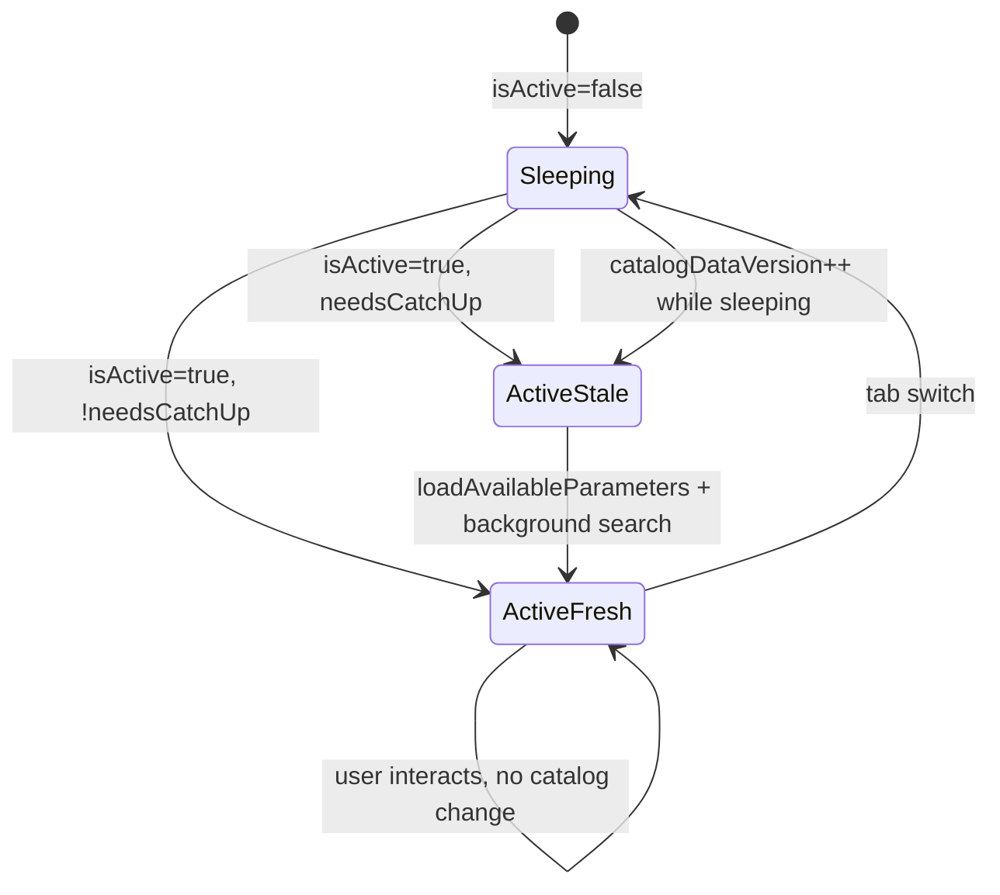
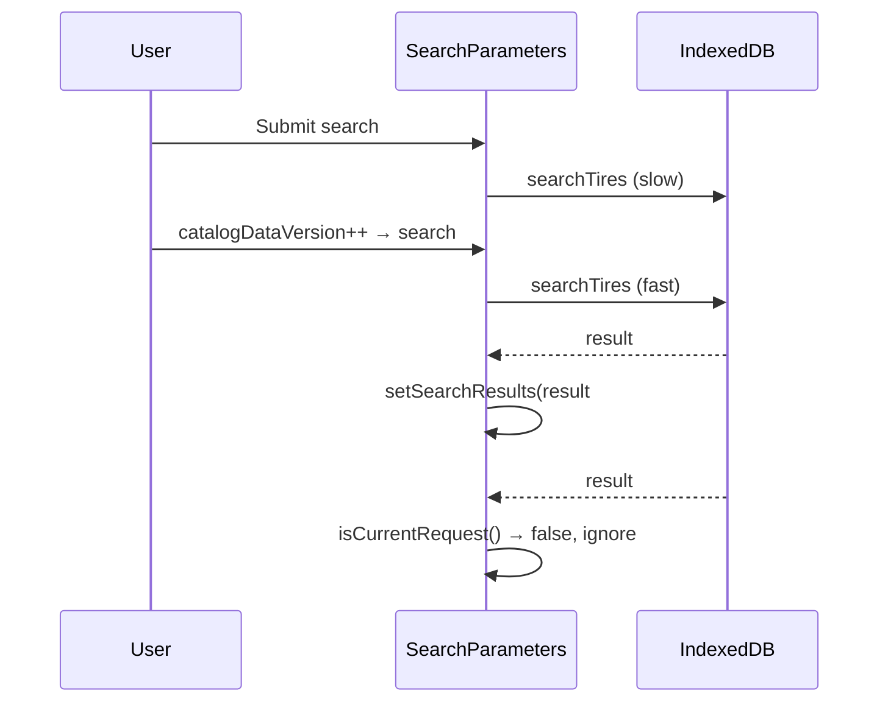

# Защита от асинхронных гонок

Сборка паттернов request id, workspace key, mounted ref и stale-result guards в подсистеме поиска, витрины и смежных модулях. Сквозной контекст — [Шаг 4](/08-search-showcase/end-to-end-flow#шаг-4-защита-от-гонки-запросов).

## Зачем это нужно

Поиск и facets — асинхронные операции IndexedDB. Пользователь может:

- быстро менять фильтры и жать «Найти» несколько раз;
- переключить вкладку шины/диски (dual-mount);
- дождаться обновления каталога (`catalogDataVersion++`) пока висит старый запрос;
- сменить workspace (logout/login);
- закрыть вкладку (unmount).

Без guards **поздний ответ** старого запроса перетирает UI актуальными данными.

---

## Карта guards по модулям

| Модуль | Ref / key | Защищает от |
| --- | --- | --- |
| `TiresSearchParameters` | `searchRequestIdRef` | stale search results |
| `TiresSearchParameters` | `foregroundRequestIdRef` | spinner «Найти» принадлежит foreground |
| `TiresSearchParameters` | `loadRequestIdRef` | stale facet options |
| `TiresSearchParameters` | `workspaceKeyRef` | workspace switch mid-flight |
| `TiresSearchParameters` | `mountedRef` | setState after unmount |
| `DiscsSearchParameters` | те же | аналогично |
| `CatalogShowcase` | `requestIdRef` | stale showcase |
| `catalogIdbSession` | `generation` | IDB reset mid-cursor |
| `AddToCartControl` | `workspaceKeyRef` | stale cart add |
| `getCatalogShowcase` | cache `versionAtStart` | stale cache write |

---

## Паттерн: monotonic request id

### Принцип

Каждый новый async-запрос **инкрементирует** счётчик. В completion handler проверяется: `requestId === ref.current`. Если нет — результат отбрасывается.

### Реализация в `handleSearch`

```js
const requestId = ++searchRequestIdRef.current;
const requestedWorkspaceKey = workspaceResetKey;

const isCurrentRequest = () =>
  mountedRef.current &&
  requestId === searchRequestIdRef.current &&
  requestedWorkspaceKey === workspaceKeyRef.current;

// ... await search
if (!isCurrentRequest()) return;
setSearchResults(dbResults);
```

### Инвалидация при reset

При смене `workspaceResetKey` effect вызывает `invalidateCatalogSearchRequest`
(инкремент `searchRequestIdRef`, сброс `foregroundRequestIdRef`, `loadingSearch=false`)
и отдельно инкрементирует `loadRequestIdRef`.

Кнопка «Сбросить фильтры» делает то же для поиска: in-flight `searchTires` /
`searchDiscs` становится stale **без отмены Promise** (IndexedDB cursor/getAll
нельзя abort cleanly). Поздний ответ не пишет `searchResults` / `errorSearch`
и не включает spinner. Каскад facets после сброса — загрузка опций Select,
не поиск SKU.

---

## Паттерн: workspace key

`workspaceResetKey` из `AppShellContext` — строка вида `accountId:storeId` или `'guest'`.

**Проблема:** closure в async handler захватывает старый workspace.

**Решение:** `workspaceKeyRef.current` обновляется синхронно на каждом рендере; в handler сравнивается `requestedWorkspaceKey` (на момент старта) с ref (актуальный).

---

## Паттерн: mounted ref

```js
const mountedRef = useRef(true);

useEffect(() => {
  mountedRef.current = true;
  return () => {
    mountedRef.current = false;
    loadRequestIdRef.current += 1;
    searchRequestIdRef.current += 1;
  };
}, []);
```

`isCurrentRequest()` включает `mountedRef.current` — после настоящего unmount setState не вызывается.

**Setup обязан ставить `mountedRef.current = true`.** `useRef(true)` задаёт значение только при создании ref. В development React.StrictMode (`src/index.js`, `npm start`) прогоняет эффект как `setup → cleanup → setup` и **восстанавливает тот же объект ref**. Cleanup ставит `false`; без `true` в следующем setup флаг остаётся ложным на весь lifetime панели.

Production (`preview:prod`, GitHub Pages) эти проверки no-op: cleanup не вызывается «для проверки», симптом не воспроизводится.

---

## Background search

При обновлении каталога (`catalogDataVersion` изменился) и уже есть результаты:

```js
handleSearch(form.getFieldsValue(), { background: true });
```

| | Foreground | Background |
| --- | --- | --- |
| `setSearchResults(null)` | **нет** (витрина / прошлый список до settle) | **нет** |
| `setLoadingSearch(true)` | да | **нет** |
| `searchResetKey++` | да | **нет** |
| Обновление results при success | да | да |
| `setErrorSearch` при failure | да (включая TimeoutError) | **нет** |

Пользователь не видит flash loading, но данные обновляются.

---

## Keep-alive и catch-up (dual-mount)



**`needsCatchUpRef`:**

- `true` когда панель спала **и** catalog/workspace устарел
- `false` после успешного catch-up
- Первый уход в sleep (был active) **не** помечает stale сам по себе

**Цель:** при возврате на вкладку без изменений — не трогать IDB; при sync во сне — один refresh.

---

## CatalogShowcase: stale-friendly error

```js
const hasStaleShowcase = showcaseRef.current !== null;
// on error:
if (!hasStaleShowcase) {
  setShowcase(null);
  setStatus('error');
}
// иначе — оставить старые полки на экране
```

При transient IDB error пользователь продолжает видеть предыдущую витрину.

---

## catalogIdbSession: generation guard

`_resolveIfActive(resolve, reject, generation, value)` — если generation IDB
изменилась (commit sync, workspace reset), Promise **отклоняется**
`StaleCatalogStoreError`, а не зависает. Это второй слой ниже UI guards.
`isExpectedOperationalError` считает эту ошибку ожидаемой: spinner «Найти»
гасится, `errorSearch` не пишется.

Холодный hydrate (`_readStoreAll`) слушает `request.onsuccess/onerror` и
`transaction.onabort/oncomplete`, плюс timeout 30 с (`TimeoutError`), чтобы
Promise не остался pending. `openCatalogDatabase` обрабатывает `onblocked`
(лог `idb.blocked`) и timeout 15 с. Legacy open — тот же hang-guard.

UI оборачивает `searchTires` / `searchDiscs` в `withCatalogSearchTimeout` (30 с):
зависший мок или IDB всё равно гасит spinner и пишет `errorSearch`.

---

## `settleCatalogSearchLoading`

Решает overlap foreground search + background catch-up: background **не** перехватывает spinner, а устаревший foreground всё равно гасит кнопку, если его сменил background.

```js
const requestId = beginCatalogSearchRequest({
  searchRequestIdRef,
  foregroundRequestIdRef,
  background,
});
if (!background) {
  setSearchLoading(true);
}
// finally:
settleCatalogSearchLoading({ background, requestId, ... });
```

- Если `mountedRef.current === false` — **ранний return без `setLoadingSearch(false)`** (нельзя setState после unmount). Поэтому remount/StrictMode обязан вернуть `mountedRef` в `true` в setup, иначе кнопка «Найти» крутится вечно.
- Актуальный request (любой) гасит spinner.
- Устаревший foreground гасит spinner, только если он всё ещё «владелец» (`foregroundRequestIdRef`).
- `StaleCatalogStoreError` — expected: spinner гасится, `errorSearch` не пишется.
- Catch-up не стартует background search, пока уже крутится foreground (`loadingSearchRef`).

---

## Диаграмма: конкурирующие search-запросы



---

## Связанные тесты

| Тест | Инвариант |
| --- | --- |
| `TiresSearchParameters.searchRace.test.jsx` | поздний stale id не перетирает latest; spinner гаснет на StaleCatalogStoreError; чекбоксы не бьют facets; сброс во время pending гасит spinner; pending не blank; timeout гасит spinner; StrictMode: «Найти» settle’ит список и гасит кнопку |
| `DiscsSearchParameters.searchRace.test.jsx` | то же для дисков |
| `searchFormCascade.test.js` | `invalidateCatalogSearchRequest` делает поиск stale; late settle не трогает spinner; settle при `mountedRef=false` не вызывает setState; `withCatalogSearchTimeout` отклоняет hanging Promise |
| `catalogIdbSession.readStoreAll.test.js` | abort hydrate без `request.onsuccess` отклоняет Promise; timeout `getAll` |
| `App.catalogDualMount.test.jsx` | неактивная панель не вызывает search |

### Пример из теста (шины)

1. Submit → result «Seed».
2. `catalogDataVersion` 0→1 → background search #2.
3. Submit #3 → latest deferred.
4. Resolve latest → «Новый результат» на экране.
5. Resolve stale → экран **не** меняется.

---

## AddToCartControl: workspace guard

```js
const requestedWorkspaceKey = workspaceKey;
// after IDB read:
if (requestedWorkspaceKey !== workspaceKeyRef.current) return;
if (!indexedDBService.isActiveStore(requestedStoreId)) return;
addItem(currentItem, category);
```

Предотвращает добавление в корзину после logout или смены магазина.

---

## Типичные ошибки при изменении

| Ошибка | Симптом |
| --- | --- |
| Забыть инкремент id при reset workspace или «Сбросить фильтры» | ghost results / вечный spinner «Найти» |
| Cleanup `mountedRef=false` без `mountedRef.current = true` в setup | `npm start`: вечный spinner «Найти»; `preview:prod` / Pages ок |
| setState без mounted check | React warning после unmount |
| Background search с `setSearchResults(null)` | flash empty / showcase |
| Foreground search с `setSearchResults(null)` до await | blank UI со spinner, пока hydrate/cursor заняты |
| Убрать timeout у open/`getAll`/handleSearch | вечный pending, если IndexedDB молчит |
| Единый id для load и search | facets completion блокирует search spinner |
| Убрать generation guard в IDB | results после destructive IDB reset |

---

## Связанные страницы

- [Сквозной поток](/08-search-showcase/end-to-end-flow)
- [Поиск шин и дисков](/08-search-showcase/tire-and-disc-search)
- [Гонки и выход](/04-auth/races-and-logout)
- [Две панели каталога](/03-routing-shell/dual-mount-catalog)
- [Владение состоянием](/02-architecture/state-ownership)
