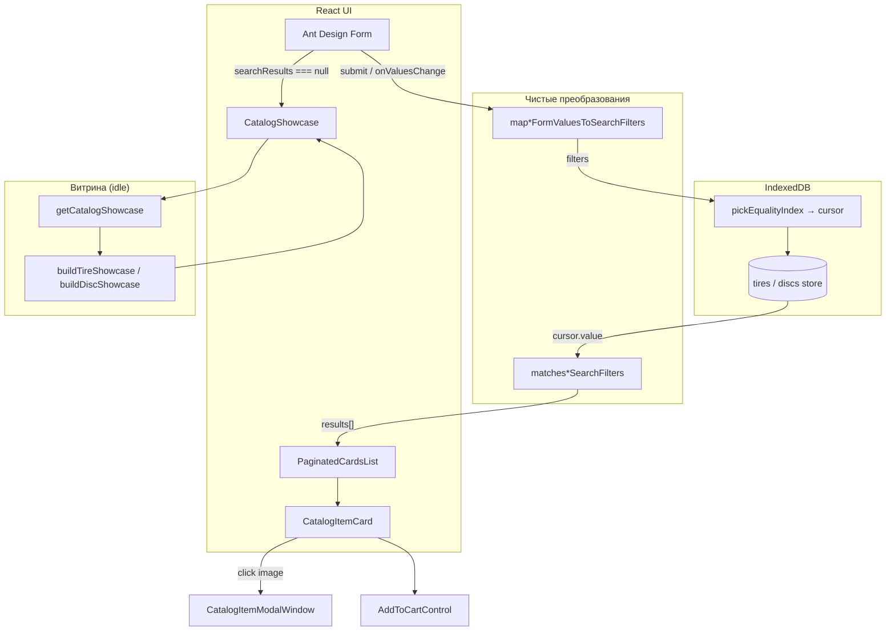
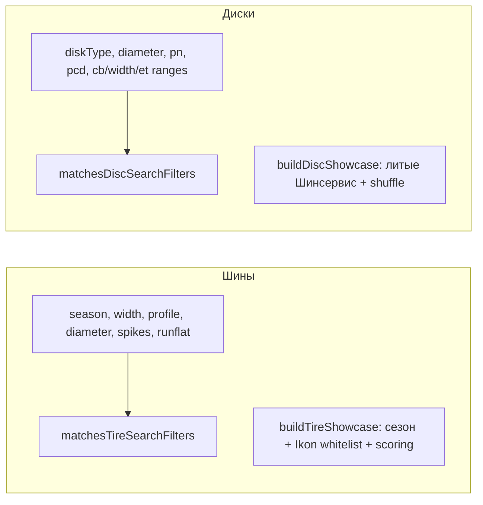
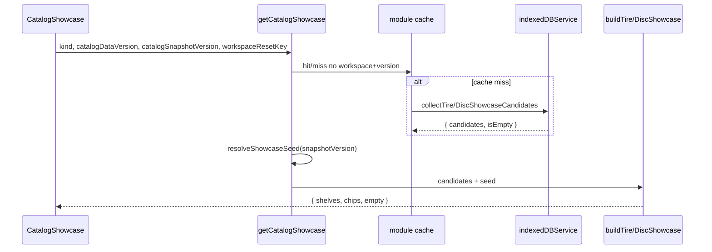

# Сквозной поток: форма → IndexedDB → витрина → корзина

Пошаговое объяснение того, как пользователь проходит путь от пустой панели каталога до добавления товара в корзину. Общая логика для шин и дисков выделена отдельно; различия — в полях формы, matcher-функциях и правилах витрины.

## Карта подсистемы

| Слой | Модули | Владелец состояния |
| --- | --- | --- |
| UI формы | `TiresSearchParameters`, `DiscsSearchParameters` | локальный React state + Ant Design Form |
| Маппинг формы | `searchFormFilters.js` | чистые функции, без state |
| Matcher / index hint | `catalogSearchFilters.js`, `catalogIdbQueries.js` | чистые функции |
| Хранилище | `catalogIdbSession.searchTires/searchDiscs` | IndexedDB (readonly cursor) |
| Витрина | `getCatalogShowcase`, `buildTireShowcase`, `buildDiscShowcase` | module-level cache + React state в `CatalogShowcase` |
| Результаты | `PaginatedCardsList` | локальный state (page, sort, title filter) |
| Карточка | `CatalogItemCard`, `CatalogItemModalWindow` | локальный `isModalOpen` |
| Корзина | `AddToCartControl` | `CartContext` + свежий read из IDB |

## Общая схема (шины и диски)



## Различия шин и дисков



| Аспект | Шины | Диски |
| --- | --- | --- |
| Обязательный контекст | `season` (default `'s'`) | нет сезона |
| Каскад опций | `getAvailableParameterOptions` | `getAvailableDiscParameterOptions` |
| Index hints | `diameter → season → brand → supplier` | `diameter → diskType → brand → supplier` |
| Полка витрины | «Сейчас в сезоне» (Ikon + others, scoring) | «Литые диски в наличии» (shuffle) |
| Чипы | width/profile/diameter | diameter/pn/pcd/cb |
| Auto-resubmit | `onlyAmountFrom4`, `onlyRunflat` | только `onlyAmountFrom4` |
| Смена типа | смена season → soft-drop размеров | смена diskType → soft-drop геометрии |

---

## Шаг 1. Заполнение формы

**Что происходит.** Пользователь выбирает параметры в Ant Design Form. Поля живут в `Form.useForm()` внутри `TiresSearchParameters` или `DiscsSearchParameters`.

**Шины — поля формы:**

- `season`: `'s'` (лето) или `'w'` (зима), default `'s'`
- `spikes`: `true` / `false` / `null` («Все») — видно только при `season === 'w'`
- `width`, `profile`, `diameter` — каскадные Select с опциями из IDB
- `brand[]`, `supplier`, `onlyAmountFrom4`, `onlyRunflat`

**Диски — поля формы:**

- `diskType`: `'Литой'`, `'Штампованный'` или «Все» (`undefined`)
- `diameter`, `pn`, `pcd`
- диапазоны: `cbFrom/cbTo`, `widthFrom/widthTo`, `etFrom/etTo`
- `brand[]`, `supplier`, `onlyAmountFrom4`

**Побочный эффект при изменении.** `onValuesChange` → `handleFormChange`:

1. Для шин при смене season синхронизируется поле `spikes`.
2. Вызывается `softInvalidateIncompatible*Values` — значения, отсутствующие в новых списках опций, сбрасываются без полного reset формы.
3. Для дисков изменение только `brand` не перезагружает каскад (оптимизация).
4. Чекбоксы «от 4 шт» (и runflat у шин) при уже показанных результатах вызывают `form.submit()` без повторного клика «Найти».

**Загрузка опций.** Параллельно `loadAvailableParameters` читает facets из IDB и заполняет Select. Пока идёт загрузка — `loadingOptions={true}` на Select.

---

## Шаг 2. Преобразование формы в фильтры

**Модуль:** `src/catalog/search/searchFormFilters.js`

При submit или background-поиске форма передаёт `values` в чистую функцию:

```js
// Шины
mapTireFormValuesToSearchFilters(values)
// Диски
mapDiscFormValuesToSearchFilters(values)
```

**Правила маппинга (общие):**

| Поле формы | Поле фильтра IDB | Условие |
| --- | --- | --- |
| `onlyAmountFrom4: true` | `minAmount: 4` | флаг формы удаляется |
| `onlyAmountFrom4: false` | — | `minAmount` не добавляется |

**Только шины:**

| Поле формы | Поле фильтра | Условие |
| --- | --- | --- |
| `spikes: null` | ключ удаляется | «Все» = без фильтра |
| `spikes: true/false` | сохраняется | точное совпадение |
| `onlyRunflat: true` | `runflat: true` | флаг формы удаляется |

**Пример (шины):**

```js
// Вход формы
{ season: 'w', width: 205, profile: 55, diameter: 'R16', spikes: null, onlyAmountFrom4: true }

// Выход фильтров
{ season: 'w', width: 205, profile: 55, diameter: 'R16', minAmount: 4 }
```

**Тесты:** `src/catalog/search/searchFormFilters.test.js`

---

## Шаг 3. Запрос в IndexedDB

**Точка входа:** `indexedDBService.searchTires(filters)` / `searchDiscs(filters)` → `catalogIdbSession`.

**Алгоритм:**

1. `_getReadyContext()` — если БД не готова, вернуть `[]`.
2. Readonly-транзакция на store `tires` или `discs`.
3. `pickEqualityIndex(store, filters, HINTS)` — выбор наиболее селективного индекса:
   - шины: `diameter → season → brand → supplier`
   - диски: `diameter → diskType → brand → supplier`
   - для `brand[]` с одним элементом — index `brand`
   - если нет активных фильтров — полный cursor
4. На каждой записи cursor — `matchesTireSearchFilters` / `matchesDiscSearchFilters`.
5. Совпавшие записи push в `results`.
6. `_resolveIfActive` — отбрасывает результат, если generation IDB сменилась mid-flight.

**Matcher (`catalogSearchFilters.js`)** — чистые функции post-filter. Index сужает курсор, но не заменяет matcher: диапазоны (`cbFrom/cbTo`), multi-brand, `minAmount`, `spikes`, `runflat` проверяются в JS.

**Тесты matcher:** `src/services/indexedDBService.searchFilters.test.js`

---

## Шаг 4. Защита от гонки запросов

Шесть guard-механизмов образуют три группы: React request/workspace guards,
отдельный guard витрины и generation guard IndexedDB (подробнее —
[Защита от async-гонок](/08-search-showcase/async-race-guards)):

| Guard | Где | Что защищает |
| --- | --- | --- |
| `searchRequestIdRef` | SearchParameters | поздний ответ старого поиска |
| `loadRequestIdRef` | SearchParameters | устаревшие facets |
| `workspaceKeyRef` | SearchParameters | смена workspace mid-request |
| `mountedRef` | SearchParameters | unmount компонента |
| `requestIdRef` | CatalogShowcase | устаревшая витрина |
| `generation` | catalogIdbSession | commit/reset IDB mid-cursor |

**Паттерн в `handleSearch`:**

```js
const requestId = ++searchRequestIdRef.current;
const requestedWorkspaceKey = workspaceResetKey;
const isCurrentRequest = () =>
  mountedRef.current &&
  requestId === searchRequestIdRef.current &&
  requestedWorkspaceKey === workspaceKeyRef.current;

// ... await indexedDBService.searchTires(...)
if (!isCurrentRequest()) return; // stale — не трогаем UI
setSearchResults(dbResults);
```

**Background-поиск** (`{ background: true }`) — после обновления каталога (`catalogDataVersion`): не сбрасывает `searchResults`, не показывает spinner, но обновляет данные если request актуален.

**Тесты:** `TiresSearchParameters.searchRace.test.jsx`, `DiscsSearchParameters.searchRace.test.jsx`

---

## Шаг 5. Получение результатов

**Семантика `searchResults`:**

| Значение | UI |
| --- | --- |
| `null` | поиск ещё не выполнялся → показывается **витрина** |
| `[]` | поиск выполнен, ничего не найдено → **CatalogSearchEmptyHint** |
| `[...items]` | результаты → **PaginatedCardsList** |

**Ошибка:** `errorSearch` (string) → `PaginatedCardsList` рендерит `Alert type="error"`.

**Keep-alive панели.** При dual-mount (`isActive={false}`) компонент «спит», но не размонтируется. При повторной активации без stale — фильтры и результаты на месте. При смене `catalogDataVersion` / `workspaceResetKey` — catch-up: перезагрузка facets + background search.

---

## Шаг 6. Построение showcase

**Когда.** `searchResults === null && !loadingSearch && isActive`.

**Цепочка:**



**Кэш кандидатов** — отдельно от `searchResults`. Ключ: `${workspaceResetKey}:${catalogDataVersion}`. Seed shuffle — от `catalogSnapshotVersion` (стабильный порядок карточек между перезагрузками одного snapshot).

Подробнее — [Алгоритм showcase](/08-search-showcase/showcase-selection).

---

## Шаг 7. Сортировка и scoring

**Поиск (PaginatedCardsList):** сортировка **не** в IDB. После получения массива пользователь выбирает режим:

- `default` — порядок IDB (как вернул cursor)
- `priceAsc` / `priceDesc` — по `sellingPrice ?? price ?? cost`
- `alphabetAsc` / `alphabetDesc` — по `title` (locale `ru`)

**Витрина (scoring):** `scoreCatalogItem` — soft retail-score для отбора Ikon и «остальных» на полке шин:

| Критерий | Вес (default) |
| --- | --- |
| amount ≥ 4 | +40 |
| amount ≥ 1 | +22 |
| photoUrl | +14 |
| brand | +6 |
| есть цена | +18 |
| цена 2500–25000 | +8 |

`pickTopDiverse` ограничивает max 2 карточки на бренд. Диски на полке **не** используют scoring — только `shuffleItems` + slice.

**Тесты scoring:** `src/catalog/showcase/scoring.test.js`, `ikonSeasonHits.test.js`, `preferredCandidates.test.js`

---

## Шаг 8. Пагинация

**Компонент:** `PaginatedCardsList`

- Default 20 карточек на страницу; опции 20/40/60/80/100 (сохраняется в `localStorage` ключ `ivanor-catalog-items-per-page`)
- При смене `items`, `sortMode`, `debouncedQuery`, `itemsPerPage` → `currentPage = 1`
- `searchResetKey` (инкремент при новом поиске) сбрасывает локальный title-filter
- Дополнительный **поиск по названию** в toolbar (debounce 600 ms) — client-side filter по `item.title`
- Pagination Ant Design + sticky nav через `IntersectionObserver`

---

## Шаг 9. Открытие карточки

**Триггер:** клик по изображению в `CatalogItemCard` → `setIsModalOpen(true)`.

**CatalogItemModalWindow:**

- Portal в `document.body`
- Focus trap (Tab/Shift+Tab), Escape закрывает
- `body.overflow = hidden` пока открыт
- Мета-поля: бренд, модель, типоразмер, индексы, код, наличие, поставщик (скрыт в client mode)
- Те же `CatalogPriceStrip` и `AddToCartControl`, что на карточке
- `onGoToCart` в модалке закрывает окно перед навигацией

Подробнее — [Компоненты каталога](/10-ui/catalog-components).

---

## Шаг 10. Добавление товара в корзину

**Компонент:** `AddToCartControl`

**Алгоритм `handleAdd`:**

1. Проверка `canAdd`: workspace готов, корзина loaded, `isCatalogItemSellable(item, category)`.
2. `indexedDBService.readCartCatalogItems([{ key, category, id }])` — **свежий** snapshot из IDB (не stale props карточки).
3. Guard workspace: если workspace сменился mid-read — abort.
4. `addItem(currentItem, category)` через `CartContext`.
5. UI переключается на `CartQtyControls` + кнопка «Перейти в корзину».

**Race guard:** сравнение `requestedWorkspaceKey !== workspaceKeyRef.current` и `isActiveStore(storeId)`.

**Тесты корзины:** см. [Домен и хранение корзины](/09-cart/cart-domain-and-storage).

---

## Пример полного сценария (шины)

1. Пользователь открывает вкладку «Шины» → `searchResults === null` → витрина «Сейчас в сезоне».
2. Клик по чипу `205/55 R16` → форма заполняется, `handleSearch` → IDB → 47 позиций.
3. В toolbar вводит «Ikon» → client filter → 6 позиций.
4. Сортировка «По цене ↑» → PaginatedCardsList пересчитывает порядок.
5. Клик по фото → модалка с деталями.
6. «В корзину» → fresh read из IDB → строка в корзине.

---

## Типичные ошибки при изменении

| Изменение | Риск |
| --- | --- |
| Добавить поле формы без маппинга в `searchFormFilters` | фильтр не дойдёт до IDB |
| Добавить фильтр только в matcher без index hint | работает, но медленнее на большом каталоге |
| Убрать `searchRequestIdRef` check | stale results перетирают новые |
| Менять семантику `null` vs `[]` для `searchResults` | сломается переключение витрина/empty/list |
| Добавлять товар в корзину без fresh IDB read | устаревшая цена/остаток в корзине |
| Использовать `Math.random()` в showcase | порядок карточек меняется при каждом рендере |

---

## Связанные страницы

- [Поиск шин и дисков](/08-search-showcase/tire-and-disc-search) — компоненты формы и фильтры
- [Алгоритм showcase](/08-search-showcase/showcase-selection) — воронка кандидатов
- [Защита от async-гонок](/08-search-showcase/async-race-guards) — request id и workspace guards
- [Компоненты каталога](/10-ui/catalog-components) — карточка, модалка, цены, корзина
- [Запросы, фильтры и facets](/05-catalog-storage/queries-filters-facets) — IndexedDB слой
- [Две панели каталога](/03-routing-shell/dual-mount-catalog) — keep-alive и `isActive`
