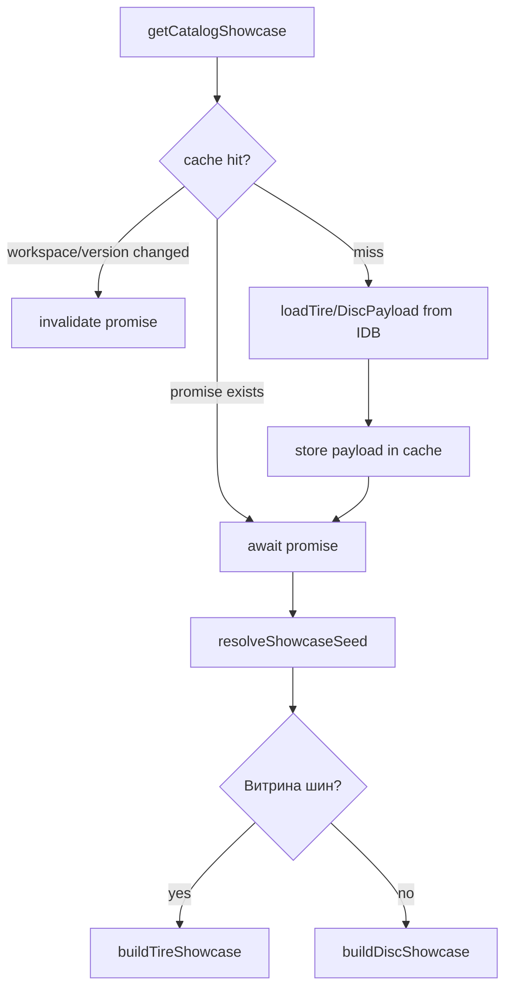
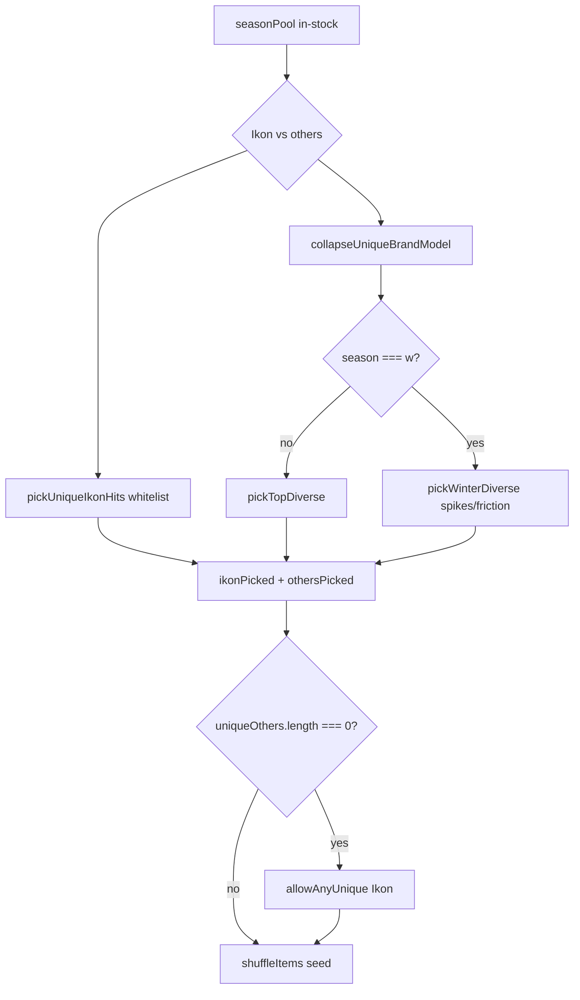
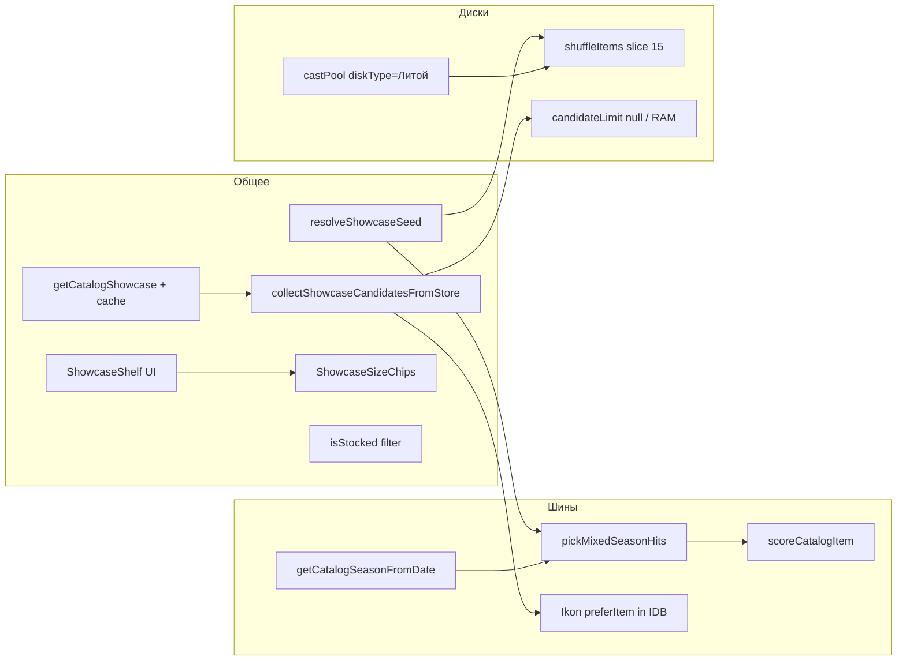

# Алгоритм showcase

Разбор автовитрины каталога: сбор кандидатов из IndexedDB, scoring, preferred Ikon models, seeded shuffle и UI-полок. Сквозной контекст — [Сквозной поток, шаги 6–7](/08-search-showcase/end-to-end-flow).

## Границы подсистемы

**Входит:**

- `getCatalogShowcase.js` — cache + orchestration
- `buildTireShowcase.js`, `buildDiscShowcase.js` — pure rules
- `scoring.js`, `ikonSeasonHits.js`, `showcaseSeed.js`, `showcaseConfig.js`
- UI: `CatalogShowcase`, `ShowcaseShelf`, `ShowcaseSizeChips`, `CatalogSearchEmptyHint`

**Не входит:**

- Поиск по форме — [Поиск шин и дисков](/08-search-showcase/tire-and-disc-search)
- Карточка товара — [Компоненты каталога](/10-ui/catalog-components)

**Владелец состояния:**

- Module-level cache в `getCatalogShowcase` (кандидаты по workspace+version)
- React state в `CatalogShowcase` (`status`, `showcase`)
- `searchResults` в SearchParameters **не связан** с showcase

---

## React-компонент: `CatalogShowcase`

**Путь:** `src/components/shared/CatalogShowcase/CatalogShowcase.jsx`

### Назначение

Автовитрина при idle-состоянии поиска (`searchResults === null`). Шины: полка сезона + чипы размеров. Диски: литые в наличии + чипы диаметров.

### Props

| Prop | Тип | Default | Описание |
| --- | --- | --- | --- |
| `kind` | `'tires' \| 'discs'` | `'tires'` | тип каталога |
| `renderCard` | `(item, { isClientMode }) => ReactNode` | — | рендер карточки (из SearchParameters) |
| `onChipClick` | `(chip) => void` | — | клик по чипу размера → заполнить форму и искать |

### Context

`useAppShell()`: `clientMode`, `catalogDataVersion`, `catalogSnapshotVersion`, `workspaceResetKey`, `catalogBootstrap`, `notifyCatalogSurfaceReady`.

### Локальное состояние

| State | Значения | Назначение |
| --- | --- | --- |
| `status` | `'loading' \| 'ready' \| 'error'` | фаза загрузки |
| `showcase` | object \| null | `{ shelves, chips, chipsTitle, empty, kind }` |

### Refs

- `requestIdRef` — async race guard
- `showcaseRef` — stale showcase для error fallback

### Effect

```js
useEffect(() => {
  const requestId = ++requestIdRef.current;
  const hasStaleShowcase = showcaseRef.current !== null;
  const keepStaleShowcase = hasStaleShowcase && !showcaseRef.current?.empty;
  if (!keepStaleShowcase) setStatus('loading');

  getCatalogShowcase({ kind, catalogDataVersion, catalogSnapshotVersion, workspaceResetKey })
    .then(result => { if (requestId === requestIdRef.current) { setShowcase(result); setStatus('ready'); }})
    .catch(error => { /* keep stale showcase if had one */ });
}, [kind, catalogDataVersion, catalogSnapshotVersion, workspaceResetKey]);
```

### Ветви рендеринга

| Условие | UI |
| --- | --- |
| `status === 'error'` && нет stale | `Empty` «Не удалось собрать полки» |
| `status === 'loading'` или `status === 'ready' && showcase.empty` | `ShowcaseShelf skeleton` + чипы (Empty catalog-empty нет) |
| `status === 'ready'` и полки есть | shelves + `ShowcaseSizeChips` |

Cold-start пустого IndexedDB закрывает полноэкранная шторка AppShell (`CatalogBootstrapOverlay`), не Empty витрины. Overlay не уходит по одному `phase: 'ready'`: витрина вызывает `notifyCatalogSurfaceReady`, когда полки settled (не skeleton). Тогда шторка и зона результатов гаснут/проявляются opacity 280ms. Enter витрины без `translateY` — сдвиг блоков запрещён.

### Ant Design

`Empty` только для error state загрузки витрины.

### Async

`getCatalogShowcase` — Promise; при ошибке без stale data → error state.

### Тесты

`CatalogShowcase.appLog.test.jsx` — логирование ошибок загрузки. `CatalogShowcase.bootstrap.test.jsx` — пустой store и `status === 'loading'` показывают skeleton, без текста «Каталог ещё загружается»; skeleton на `blocking` не шлёт `notifyCatalogSurfaceReady`, готовые полки после `ready` — шлют.

---

## React-компонент: `ShowcaseShelf`

**Путь:** `src/components/shared/CatalogShowcase/ShowcaseShelf.jsx`

### Назначение

Горизонтальная полка карточек со scroll-snap, стрелками навигации и progress-track.

### Props

| Prop | Тип | Default |
| --- | --- | --- |
| `title` | string | — |
| `items` | object[] | `[]` |
| `renderCard` | function | — |
| `isClientMode` | boolean | — |
| `skeleton` | boolean | `false` |
| `skeletonCount` | number | `6` |
| `variant` | `'default' \| 'featured'` | `'default'` |
| `viewAllLabel`, `onViewAll` | optional | — |

### Локальное состояние

`canPrev`, `canNext`, `hasOverflow`, `sliderMeta` — для навигации и ARIA slider.

### Effects

- scroll listener + ResizeObserver + window resize → sync scroll state
- cleanup rAF и timers

### Ant Design

`LeftOutlined`, `RightOutlined` из `@ant-design/icons`.

### Accessibility

- row: `tabIndex={0}`, Arrow/Home/End
- progress track: `role="slider"`, `aria-valuetext="N из M"`
- `prefers-reduced-motion` → scroll behavior `auto`

### Early return

`skeleton === false && items.length === 0` → `null` (полка не рендерится).

---

## Функция: `getCatalogShowcase`

**Путь:** `src/catalog/showcase/getCatalogShowcase.js`

### Сигнатура

```js
export const getCatalogShowcase = async ({
  kind,
  catalogDataVersion = 0,
  catalogSnapshotVersion = '',
  workspaceResetKey = 'guest',
  now = new Date(),
} = {}) => { ... }
```

### Side effects

- Module-level **cache** `{ tires, discs }` с полями `workspace`, `version`, `payload`, `promise`
- IndexedDB read через RAM `_ensureReadCache` + `collectShowcaseCandidatesFromItems`

### Алгоритм



1. Выбрать bucket `tires` или `discs`.
2. Cache key: `${workspaceResetKey}:${catalogDataVersion}`.
3. При смене workspace — сброс payload и promise.
4. Single-flight promise для параллельных вызовов.
5. Load payload:
   - **Шины:** `candidateLimit: 480`, `preferItem: isIkonBrand` — Ikon не отрезаются лимитом (фильтр по RAM)
   - **Диски:** `candidateLimit: null` — все matching из RAM; литые Шинсервиса отбирает `buildDiscShowcase`
6. `resolveShowcaseSeed(catalogSnapshotVersion, workspace, candidates)`
7. Delegate to `buildTireShowcase` / `buildDiscShowcase`.

### Крайние случаи

- `payload` null после failed load → throw
- Failed promise но есть stale `payload` → вернуть stale
- Пустой store → `{ isEmpty: true }` → UI «Каталог загружается»

### Тесты

`getCatalogShowcase.test.js`

---

## Функция: `buildTireShowcase`

**Путь:** `src/catalog/showcase/buildTireShowcase.js`

### Сигнатура

```js
export const buildTireShowcase = ({
  candidates, isEmpty, now = new Date(), seed,
}) => { ... }
```

### Чистота

**Pure function** (now и seed — explicit inputs).

### Алгоритм

1. `season = getCatalogSeasonFromDate(now)` — мар–авг = `'s'`, иначе `'w'`.
2. Если `isEmpty` → `{ empty: true, shelves: [], chips }`.
3. `stocked = candidates.filter(isStocked)` — amount ≥ minAmount (1).
4. `seasonPool = stocked.filter(item.season === season)`.
5. `seasonHits = pickMixedSeasonHits({ pool: seasonPool, season, limit: 30, whitelist, seed })`.
6. Если hits.length > 0 → shelf `{ id: 'season-hits', title: 'Сейчас в сезоне', items }`.
7. Return `{ kind: 'tires', chips: popularSizes, shelves }`.

### Whitelist Ikon

Из `SHOWCASE_CONFIG.tires.ikonSeasonModelsSummer/Winter` — партнёрские модели для полки.

### Пример данных

```js
buildTireShowcase({
  candidates: [{ id: 1, season: 's', brand: 'Ikon', title: 'Ikon Character Eco 91H', amount: 8, ... }],
  isEmpty: false,
  now: new Date('2026-06-15'),
  seed: 'guest|snap:v42',
})
// → shelves[0].items — mix Ikon whitelist + others, shuffled
```

### Тесты

`buildTireShowcase.test.js` — сезон без stock, Ikon mix, декабрь без летних.

---

## Функция: `buildDiscShowcase`

**Путь:** `src/catalog/showcase/buildDiscShowcase.js`

### Алгоритм

1. `isEmpty` → empty state с chips.
2. `stocked` — amount ≥ 4 (`SHOWCASE_CONFIG.discs.minAmount`).
3. `castPool` — `diskType === 'Литой' && supplier === 'Шинсервис'`.
4. `popularModels = shuffleItems(castPool, seed).slice(0, 15)`.
5. Shelf `{ id: 'popular-models', title: 'Литые диски в наличии' }`.

**Без scoring**, без collapse brand+model, без фильтра размера на полке.

### Тесты

`buildDiscShowcase.test.js`

---

## Scoring и preferred candidates

### `scoreCatalogItem(item, scoringCfg?)`

**Путь:** `src/catalog/showcase/scoring.js`

**Pure.** Retail-score для ранжирования внутри пула:

```
score = 0
+ weights.amountHigh (40) if amount >= 4
+ weights.amountLow (22) else if amount >= 1
+ weights.photo (14) if photoUrl
+ weights.brand (6) if brand
+ weights.hasPrice (18) if price > 0
+ weights.priceInBand (8) if price in [2500, 25000]
```

Hard filter `minAmount` на полке ≠ soft `amountHigh` в scoring.

### `pickTopDiverse(items, scoreFn, limit, { maxPerBrand: 2 })`

Сортировка по score desc, затем amount desc. Два прохода: с cap на бренд, потом без cap если не набрали limit.

### `pickMixedSeasonHits` (ikonSeasonHits.js)

**Воронка полки шин:**



**Ikon whitelist matching:** `resolveIkonSeasonModelKey` — нормализация текста модели, исключение SUV/Eco C2/C3/Nordman.

**Preferred candidates:** `collectShowcaseCandidatesFromItems` с `preferItem: isIkonBrand` — Ikon попадают в `preferred[]` первыми и **не обрезаются** лимитом 480. Production-путь — RAM после `_ensureReadCache`, не отдельный IDB cursor.

### Тесты

- `scoring.test.js`
- `preferredCandidates.test.js`
- `ikonSeasonHits.test.js`
- `showcaseSeed.test.js`

---

## Seeded shuffle

### `resolveShowcaseSeed`

Seed = `${workspace}|snap:${catalogSnapshotVersion}` или fallback hash от id кандидатов.

### `shuffleItems(items, seed)`

Fisher–Yates с mulberry32 PRNG. **Один seed → один порядок** на snapshot.

Диски: shuffle всего castPool. Шины: shuffle финального mix после scoring.

---

## Конфигурация: `SHOWCASE_CONFIG`

**Путь:** `src/catalog/showcase/showcaseConfig.js`

| Ключ | Значение | Назначение |
| --- | --- | --- |
| `showcaseSupplier` | `'Шинсервис'` | фильтр поставщика на полках |
| `tires.seasonHitsCount` | `{ min: 30, max: 30 }` | размер полки шин |
| `tires.candidateLimit` | `480` | лимит non-Ikon кандидатов |
| `discs.popularModelsCount` | `{ min: 15, max: 15 }` | размер полки дисков |
| `discs.minAmount` | `4` | hard filter на полке дисков |
| `scoring.*` | weights/thresholds | soft score |
| `diversity.maxPerBrand` | `2` | cap в pickTopDiverse |

---

## Диаграмма: общая vs различная логика



---

## `CatalogSearchEmptyHint`

**Путь:** `src/components/shared/CatalogShowcase/CatalogSearchEmptyHint.jsx`

Empty после неуспешного **поиска** (не idle showcase). Показывает `Empty` + чипы «Другие размеры» (`tryHint: true`).

Props: `kind`, `emptyText`, `onChipClick`.

---

## Типичные ошибки при изменении

| Ошибка | Последствие |
| --- | --- |
| Привязать seed к `catalogDataVersion` | порядок карточек меняется при каждом local sync |
| Убрать `preferItem` для Ikon | whitelist модели отрезаются лимитом 480 |
| Вернуть отдельный IDB cursor витрины с `preferItem` | полный `cursor.continue` по поставщику блокирует кадр «Найти» |
| Использовать scoring на дисках без явного решения | поведение полки изменится непредсказуемо |
| Смешать cache showcase с searchResults | лишние перезагрузки или stale UI |
| Не обрабатывать `showcase.empty` | пользователь видит skeleton вместо hint |

---

## Связанные страницы

- [Сквозной поток](/08-search-showcase/end-to-end-flow)
- [Поиск шин и дисков](/08-search-showcase/tire-and-disc-search)
- [Компоненты каталога](/10-ui/catalog-components)
- [Запросы, фильтры и facets](/05-catalog-storage/queries-filters-facets)
