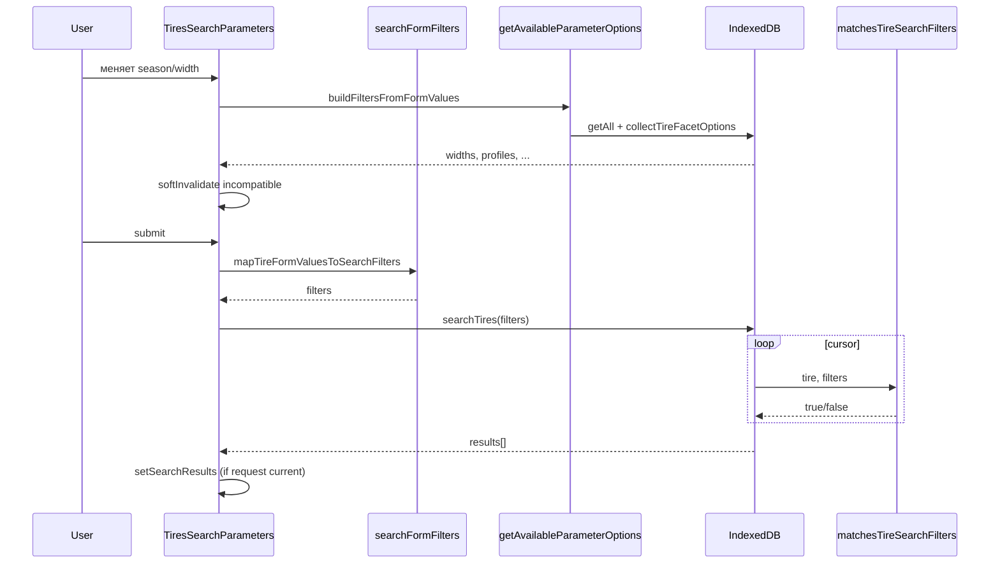
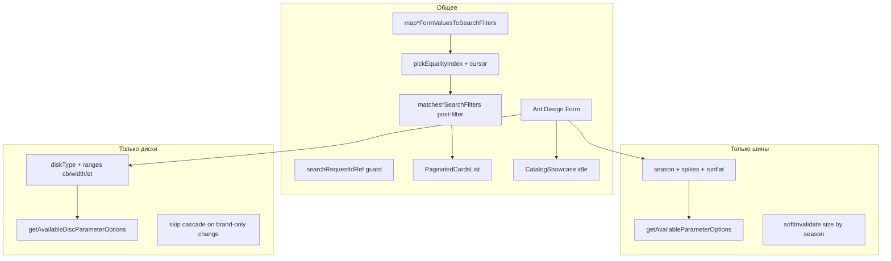

# Поиск шин и дисков

Подробный разбор форм поиска, маппинга значений, matcher-функций IndexedDB и состояний результата. Сквозной сценарий из десяти шагов — на странице [Сквозной поток](/08-search-showcase/end-to-end-flow).

## Границы подсистемы

**Входит:**

- `TiresSearchParameters`, `DiscsSearchParameters`
- `searchFormFilters.js` — form → filters
- `catalogSearchFilters.js` — item ↔ filters matching
- Facets: `getAvailableParameterOptions`, `getAvailableDiscParameterOptions`
- Поиск: `searchTires`, `searchDiscs`

**Не входит (ссылки):**

- Showcase — [Алгоритм showcase](/08-search-showcase/showcase-selection)
- Карточки и корзина — [Компоненты каталога](/10-ui/catalog-components)
- Sync и запись IDB — [Жизненный цикл каталога](/06-catalog-sync/catalog-lifecycle)

---

## React-компонент: `TiresSearchParameters`

**Путь:** `src/components/TiresSearchParameters/TiresSearchParameters.jsx`

### Назначение

Панель поиска шин: форма фильтров, загрузка каскадных опций из IndexedDB, запуск поиска, отображение витрины (idle), пустого состояния или списка результатов.

### Место в пользовательском сценарии

Монтируется в `App.js` на маршруте каталога шин. При dual-mount получает `isActive` — неактивная панель «спит», но сохраняет форму и результаты.

### Props

| Prop | Тип | Default | Описание |
| --- | --- | --- | --- |
| `isActive` | `boolean` | `true` | Панель активна; витрина рендерится только при `isActive` |

### Context и hooks

| Hook / Context | Что читает | Зачем |
| --- | --- | --- |
| `useAppShell()` | `clientMode`, `catalogDataVersion`, `workspaceResetKey` | режим клиента, перезагрузка после sync, сброс при смене workspace |
| `Form.useForm()` | instance формы | управление полями |
| `Form.useWatch('season', form)` | текущий сезон | показ фильтра шипов |
| `useCatalogSelectCloseOnMouseLeave()` | props для brand Select | UX закрытия dropdown |
| `useMemo` | `widthOptions` | летом — ширины от 135 мм в начале списка |

### Локальное состояние

| State | Начальное | Назначение |
| --- | --- | --- |
| `loadingSearch` | `false` | spinner на кнопке «Найти» |
| `errorSearch` | `null` | текст ошибки для PaginatedCardsList |
| `searchResults` | `null` | `null` = idle/showcase; `[]` = empty; array = results |
| `searchResetKey` | `0` | сброс title-filter в PaginatedCardsList |
| `availableWidths/Profiles/Diameters/Brands/Suppliers` | `[]` | опции Select |
| `loadingOptions` | `false` | loading на Select |

### Refs (не state, но критичны)

| Ref | Назначение |
| --- | --- |
| `loadRequestIdRef` | guard facets-запросов |
| `searchRequestIdRef` | guard search-запросов |
| `loadingVisibleRequestRef` | не гасить spinner чужим finally |
| `mountedRef` | unmount guard |
| `workspaceKeyRef` | актуальный workspace в async closure |
| `needsCatchUpRef`, `isActiveRef` | keep-alive / stale catch-up |

### Вычисляемые данные (render guards)

```js
showShowcase = searchResults === null && !loadingSearch
showSearchEmpty = Array.isArray(searchResults) && searchResults.length === 0 && !loadingSearch
showSearchResults = Array.isArray(searchResults) && searchResults.length > 0
showSpikesFilter = selectedSeason === 'w'
```

### Effects

1. **`[workspaceResetKey]`** — полный reset: форма, результаты, опции, инкремент request ids.
2. **Unmount cleanup** — `mountedRef = false`, инкремент ids.
3. **`[catalogDataVersion, workspaceResetKey, isActive]`** — catch-up при активации или обновлении каталога: reload facets + background search если уже были результаты.

### Обработчики событий

| Handler | Триггер | Действие |
| --- | --- | --- |
| `handleSearch(values, { background })` | submit / chip / catch-up | map → IDB → setSearchResults |
| `handleFormChange(changed, all)` | onValuesChange | season/spikes sync, soft invalidate, auto-resubmit чекбоксов |
| `handleResetFilters` | кнопка сброса | reset form, searchResults=null, reload facets |
| `handleShowcaseChipClick(chip)` | чип витрины | set width/profile/diameter + search |
| `softInvalidateIncompatibleSizeValues` | cascade | drop несовместимых width/profile/diameter |

### Ветви рендеринга

```
Form (всегда)
├─ showShowcase && isActive → CatalogShowcase kind="tires"
├─ showSearchEmpty → CatalogSearchEmptyHint
└─ showSearchResults || errorSearch → PaginatedCardsList
```

### Ant Design

`Form`, `Select`, `Button`, `Radio.Group`, `Checkbox`; иконки через SVG ReactComponent.

### Loading / empty / error

| Состояние | UI |
| --- | --- |
| Loading search | Button `loading`, searchResults сброшен (если не background) |
| Loading options | Select `loading={loadingOptions}` |
| Empty search | CatalogSearchEmptyHint + чипы «попробуйте» |
| Error | Alert в PaginatedCardsList |
| Idle | CatalogShowcase |

### Связь с сервисами

- `indexedDBService.getAvailableParameterOptions(filters)`
- `indexedDBService.searchTires(mapTireFormValuesToSearchFilters(values))`

### Связанные тесты

- `TiresSearchParameters.searchRace.test.jsx` — stale searchRequestId
- `App.catalogDualMount.test.jsx` — discs не вызывается на вкладке шин

### Пример взаимодействия

Пользователь выбирает «Зимние» → появляется Select шипов → выбирает 205/55/R16 → жмёт «Найти» → `searchResults` становится массивом → витрина скрывается → PaginatedCardsList.

### Типичные ошибки при изменении

- Не добавить поле в `buildFiltersFromFormValues` → facets не сузятся
- Не обработать season change в `handleFormChange` → spikes останутся от летнего режима
- Убрать `isActive` guard у showcase → две панели одновременно грузят витрину

---

## React-компонент: `DiscsSearchParameters`

**Путь:** `src/components/DiscsSearchParameters/DiscsSearchParameters.jsx`

Структура **идентична** `TiresSearchParameters`, отличия:

### Props

Те же: `{ isActive = true }`.

### Поля формы (initialValues)

`diskType`, `diameter`, `pn`, `pcd`, `cbFrom/To`, `widthFrom/To`, `etFrom/To`, `brand[]`, `supplier`, `onlyAmountFrom4`.

### Отличия в логике

| Аспект | Поведение дисков |
| --- | --- |
| `buildFiltersFromFormValues` | диапазоны и diskType, без season |
| `loadAvailableParameters` | `getAvailableDiscParameterOptions` |
| `handleSearch` | `mapDiscFormValuesToSearchFilters` → `searchDiscs` |
| `handleFormChange` | skip если изменился только `brand`; при `diskType` — soft invalidate с `{ diskType }` |
| Auto-resubmit | только `onlyAmountFrom4` |
| Showcase chip | patch: diameter, pn, pcd, cbFrom/cbTo |
| `handleResetFilters` | `loadAvailableParameters()` без season default |

### Ant Design

Те же + Select «Тип диска» с options `[Литой, Штампованный, Все]`.

### Тесты

`DiscsSearchParameters.searchRace.test.jsx`

---

## Функция: `mapTireFormValuesToSearchFilters`

**Путь:** `src/catalog/search/searchFormFilters.js`

### Сигнатура

```js
export function mapTireFormValuesToSearchFilters(values = {})
```

### Вход

Объект значений Ant Design Form (все поля, включенные и выключенные чекбоксы).

### Выход

Копия объекта с преобразованными ключами для `matchesTireSearchFilters`.

### Чистота

**Pure function** — без side effects.

### Алгоритм

1. Shallow copy `values`.
2. `spikes === null` → delete `spikes`.
3. `onlyAmountFrom4` → `minAmount: 4`, delete flag.
4. `onlyRunflat` → `runflat: true`, delete flag.
5. Return.

### Пример

```js
// Вход
{ season: 's', width: 205, onlyAmountFrom4: true, onlyRunflat: true, spikes: null }

// Выход
{ season: 's', width: 205, minAmount: 4, runflat: true }
```

### Вызывающие стороны

`TiresSearchParameters.handleSearch`

### Тесты

`searchFormFilters.test.js`

---

## Функция: `mapDiscFormValuesToSearchFilters`

Аналогична шинной, но без `spikes`/`runflat`. Только `onlyAmountFrom4` → `minAmount`.

---

## Модуль: `catalogSearchFilters.js`

**Путь:** `src/services/catalogIdb/catalogSearchFilters.js`

Чистые matcher-функции между item из IDB и объектом filters (после form mapping).

### `isActiveFilterValue(value)`

```js
export const isActiveFilterValue = (value) => { ... }
```

- `undefined`, `null`, `''` → false
- `[]` → false
- иначе → true

**Pure.** Используется в pickEqualityIndex, facets, soft invalidate.

`DiscsSearchParameters.jsx` содержит локальную упрощённую проверку с тем же
именем для сборки partial filters facets. Она проверяет только
`value !== undefined/null/''` и, в отличие от shared helper, не считает `[]`
отдельным неактивным случаем. Сейчас соответствующие поля формы скалярные, но
эти две функции не следует считать одним export-контрактом.

### `matchesTireSearchFilters(item, filters)`

**Сигнатура:** `(item, filters = {}) => boolean`

**Критерии (все должны пройти):**

| Фильтр | Условие |
| --- | --- |
| width, profile | `Number(item.field) === Number(filter)` |
| diameter | `String(item.diameter) === String(filter)` |
| season | `item.season === filters.season` |
| brand | `includes` если массив |
| supplier | точное совпадение если задан |
| spikes | `item.spikes === filters.spikes` если ключ есть |
| runflat | `item.runflat === true` если `filters.runflat === true` |
| minAmount | `Number(item.amount) >= minAmount` |

**Вызывающие:** `catalogIdbSession.searchTires` (cursor loop)

**Тесты:** `indexedDBService.searchFilters.test.js`

**Пример:**

```js
matchesTireSearchFilters(
  { width: 205, profile: 55, diameter: 'R16', season: 's', amount: 8, spikes: false },
  { season: 's', width: 205, minAmount: 4 }
) // → true
```

### `matchesDiscSearchFilters(item, filters)`

**Критерии:**

| Фильтр | Условие |
| --- | --- |
| brand, supplier, diameter, diskType | string equality |
| pcd, pn | numeric equality |
| widthFrom/To, cbFrom/To, etFrom/To | range inclusive |
| minAmount | как у шин |

**Вызывающие:** `catalogIdbSession.searchDiscs`

### Вспомогательные exports

- `matchesBrandFilter`, `getSingleBrandForIndex` — для index hint и brand[]
- `matchesDiscRange`, `matchesTireDiameter`, `matchesTireNumericField`

---

## Функция: `pickEqualityIndex`

**Путь:** `src/services/catalogIdb/catalogIdbQueries.js`

```js
export const pickEqualityIndex = (store, filters, hintOrder) => { ... }
```

### Алгоритm

1. Если нет активных фильтров → `store.openCursor()` (full scan).
2. Иначе перебирает `hintOrder`:
   - `brand` → если ровно один бренд в массиве → `index('brand').openCursor(only)`
   - иначе если фильтр по hint активен → `index(hint).openCursor(only)`
3. Fallback → full cursor.

**Важно:** index сужает выборку, но **не заменяет** matcher. Диапазоны и multi-brand всегда проверяются в JS.

### Index hints

```js
TIRE_SEARCH_INDEX_HINTS = ['diameter', 'season', 'brand', 'supplier']
DISC_SEARCH_INDEX_HINTS = ['diameter', 'diskType', 'brand', 'supplier']
```

---

## Функции поиска в IDB

### `searchTires(filters)` / `searchDiscs(filters)`

**Путь:** `src/services/catalogIdb/catalogIdbSession.js`

| | |
| --- | --- |
| **Вход** | объект filters после form mapping |
| **Выход** | `Promise<object[]>` |
| **Side effects** | readonly IDB transaction |
| **Early return** | `[]` если database null |
| **Stale guard** | `_resolveIfActive(generation)` |

**Алгоритм:** см. [Шаг 3](/08-search-showcase/end-to-end-flow#шаг-3-запрос-в-indexeddb).

---

## Диаграмма: форма → facets → поиск



---

## Сравнение шин и дисков (форма + IDB)



---

## Связанные страницы

- [Сквозной поток](/08-search-showcase/end-to-end-flow)
- [Защита от async-гонок](/08-search-showcase/async-race-guards)
- [Запросы, фильтры и facets](/05-catalog-storage/queries-filters-facets)
- [Две панели каталога](/03-routing-shell/dual-mount-catalog)
