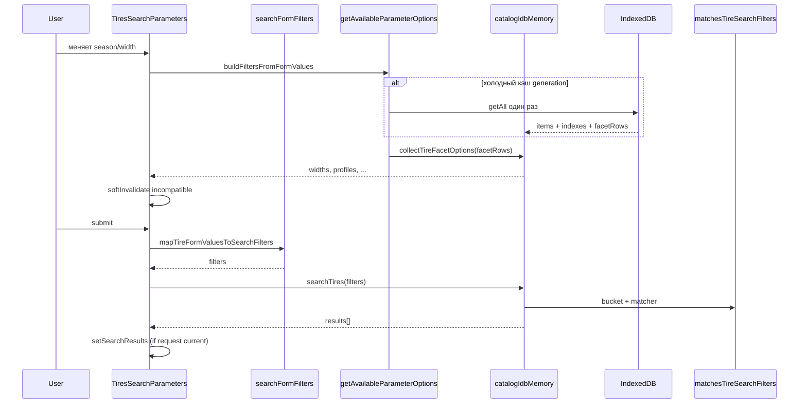
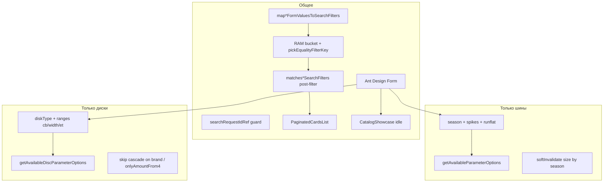

# Поиск шин и дисков

Подробный разбор форм поиска, маппинга значений, matcher-функций IndexedDB и состояний результата. Сквозной сценарий из десяти шагов — на странице [Сквозной поток](/08-search-showcase/end-to-end-flow).

## Границы подсистемы

**Входит:**

- `TiresSearchParameters`, `DiscsSearchParameters`
- `searchFormFilters.js` — form → filters
- `catalogSearchFilters.js` — item ↔ filters matching
- Facets: `getAvailableParameterOptions`, `getAvailableDiscParameterOptions`
- Поиск: `searchTires`, `searchDiscs`

**Не входит (ссылки):**

- Showcase — [Алгоритм showcase](/08-search-showcase/showcase-selection)
- Карточки и корзина — [Компоненты каталога](/10-ui/catalog-components)
- Sync и запись IDB — [Жизненный цикл каталога](/06-catalog-sync/catalog-lifecycle)

---

## React-компонент: `TiresSearchParameters`

**Путь:** `src/components/TiresSearchParameters/TiresSearchParameters.jsx`

### Назначение

Панель поиска шин: форма фильтров, загрузка каскадных опций из IndexedDB, запуск поиска, отображение витрины (idle), пустого состояния или списка результатов.

### Место в пользовательском сценарии

Монтируется в `App.js` на маршруте каталога шин. При dual-mount получает `isActive` — неактивная панель «спит», но сохраняет форму и результаты.

### Props

| Prop | Тип | Default | Описание |
| --- | --- | --- | --- |
| `isActive` | `boolean` | `true` | Панель активна; витрина рендерится только при `isActive` |

### Context и hooks

| Hook / Context | Что читает | Зачем |
| --- | --- | --- |
| `useAppShell()` | `clientMode`, `catalogDataVersion`, `workspaceResetKey` | режим клиента, перезагрузка после sync, сброс при смене workspace |
| `Form.useForm()` | instance формы | управление полями |
| `Form.useWatch('season', form)` | текущий сезон | показ фильтра шипов |
| `useCatalogSelectCloseOnMouseLeave()` | props для brand Select | UX закрытия dropdown; композирует lock popup, не перетирает его |
| `useMemo` | `widthOptions` | летом — ширины от 135 мм в начале списка |
| `useCatalogSearchFormLayout(rootRef)` | `data-layout` панели | `horizontal` / `sidebar` / `stacked` по ширине |

### Локальное состояние

| State | Начальное | Назначение |
| --- | --- | --- |
| `loadingSearch` | `false` | spinner на кнопке «Найти» |
| `errorSearch` | `null` | текст ошибки для PaginatedCardsList |
| `searchResults` | `null` | `null` = idle/showcase; `[]` = empty; array = results |
| `searchResetKey` | `0` | сброс title-filter в PaginatedCardsList |
| `availableWidths/Profiles/Diameters/Brands/Suppliers` | `[]` | опции Select |
| `loadingOptions` | `false` | spinner на Select **только пока списки ещё пустые** (первая загрузка). Повторный каскад идёт stale-while-revalidate: предыдущие options остаются на экране |

### Refs (не state, но критичны)

| Ref | Назначение |
| --- | --- |
| `loadRequestIdRef` | guard facets-запросов |
| `searchRequestIdRef` | guard search-запросов |
| `foregroundRequestIdRef` | какой request показал spinner «Найти»; background его не перехватывает |
| `loadingSearchRef` | актуальный loading без stale closure в catch-up effect |
| `optionsReadyRef` | уже были успешные options — не крутить Select повторно |
| `cascadeTimerRef` | debounce каскада ~16 ms |
| `mountedRef` | unmount guard; setup обязан ставить `true` (StrictMode remount сохраняет ref) |
| `workspaceKeyRef` | актуальный workspace в async closure |
| `needsCatchUpRef`, `isActiveRef` | keep-alive / stale catch-up |

### Вычисляемые данные (render guards)

```js
showShowcase = searchResults === null
showSearchEmpty = Array.isArray(searchResults) && searchResults.length === 0 && !loadingSearch
showSearchResults = Array.isArray(searchResults) && searchResults.length > 0
showSpikesFilter = selectedSeason === 'w'
```

### Effects

1. **`[workspaceResetKey]`** — полный reset: форма, результаты, опции, инкремент request ids.
2. **Mounted flag** — setup: `mountedRef.current = true`; cleanup: `false` + инкремент load/search ids + сброс debounce каскада + отмена отложенного scroll к каталогу. Без `true` в setup development StrictMode оставляет флаг ложным → «Найти» не settle’ит.
3. **`[catalogDataVersion, workspaceResetKey, isActive]`** — catch-up при активации или обновлении каталога: reload facets + background search если уже были результаты.

### Обработчики событий

| Handler | Триггер | Действие |
| --- | --- | --- |
| `handleSearch(values, { background })` | submit / chip / catch-up | map → IDB → setSearchResults. Foreground **не** обнуляет `searchResults` до await: витрина или прошлые результаты остаются. Таймаут 30 с → `errorSearch`. В `stacked` после `CATALOG_SURFACE_FADE_MS` — `scheduleScrollIntoView` к `.catalog-search-main`
| `handleFormChange(changed, all)` | onValuesChange | season/spikes sync; debounce каскада; skip brand/supplier/чекбоксы/spikes (они не меняют size options); auto-resubmit чекбоксов |
| `handleResetFilters` | кнопка сброса | reset form, `searchResults=null`, `loadingSearch=false`, bump `searchRequestIdRef` (in-flight поиск stale), reload facets. **Не** вызывает `searchTires` |
| `handleShowcaseChipClick(chip)` | чип витрины / empty-hint | set width/profile/diameter + `scrollWindowToTop` + search |
| `softInvalidateIncompatibleSizeValues` | cascade | drop несовместимых width/profile/diameter |

### Ветви рендеринга

```
div.tires-search-parameters[data-layout]
├─ Form.search-form (всегда)
└─ div.catalog-search-main
   ├─ Alert errorSearch, если есть
   └─ CatalogResultsFade (opacity 50ms, delayed unmount)
      ├─ showShowcase && isActive → CatalogShowcase kind="tires"
      ├─ showSearchEmpty → CatalogSearchEmptyHint
      └─ showSearchResults → PaginatedCardsList
```

`data-layout` задаёт `useCatalogSearchFormLayout` по ширине панели (порог калиброван по более плотной форме дисков). Это **режим панели**, его нельзя путать с Ant Design `Form layout`:

| Режим панели (`data-layout`) | Когда | UI панели | Ant `Form layout` |
| --- | --- | --- | --- |
| `horizontal` | ширина ≥ 1100px | форма сверху на всю ширину, каталог ниже; compact toolbar 32px, подписи скрыты, wrap максимум в ~2 ряда, иконки «Найти»/«Сбросить» | `horizontal` |
| `sidebar` | 769–1099px | вертикальная форма слева (`position: sticky`, ~20.5rem), каталог справа; подписи над полями, размер в 3 колонки, чекбоксы в 2, кнопки на всю ширину | `vertical` |
| `stacked` | ≤ 768px | та же вертикальная форма сверху, каталог ниже; foreground «Найти» плавно скроллит к `.catalog-search-main` после fade 50ms | `vertical` |

В третью строку горизонтальный toolbar не переваливается: как только две строки уже не влезают, включается `sidebar`. На широком десктопе формы слева быть не должно.

### Select dropdown: страница и sidebar-форма не скроллятся

На ширине **ниже 1100px** (`CATALOG_SEARCH_HORIZONTAL_MIN_PX`) — и `stacked` (телефон, ≤ 768px), и `sidebar` (планшет / узкий экран, 769–1099px) — жест прокрутки по длинному списку опций (бренд, ширина, ЦО) должен двигать **только** список, не `window`/`body` и не sticky `.search-form` слева.

Это **не** баг «только мобилки»: порог 768px здесь ни при чём. `getPopupContainer` в `.search-form` нельзя ставить — у sidebar-формы `overflow-y: auto`, popup обрежется. Dropdown по-прежнему порталится в `document.body`.

Два слоя, один shared-контракт (не панели шин/дисков и не AppShell):

1. CSS: `overscroll-behavior: contain` и `-webkit-overflow-scrolling: touch` на `.catalog-search-select-dropdown` и `.rc-virtual-list-holder`. Это дополнение (wheel/Android), на iOS/iPad цепочка жеста всё равно уходит в document или в overflow формы.
2. JS: refcount-lock в `src/components/shared/catalogSelectPopupScrollLock.js`. Пока счётчик открытых popup > 0 и ширина `< 1100`, на `document` стоят `touchmove`/`wheel` (`passive: false`) с `preventDefault`, кроме allowlist-скроллера самого popup (`.catalog-search-select-dropdown` / `.rc-virtual-list-holder`). На границе списка жест не «пробивает» страницу и форму. Класс `catalog-select-popup-open` вешается на `html`. **Не** используется `document.body.style.overflow = 'hidden'` — на iOS/iPad это прыжок страницы и конфликт restore с `CatalogItemModalWindow` / `CatalogBootstrapOverlay`.

Подключение: `catalogSearchSelectProps.onOpenChange` — все catalog Select (включая `SupplierFilterSelect`) без копирования lock в JSX форм. Brand Select спредит `useCatalogSelectCloseOnMouseLeave` **после** `catalogSearchSelectProps`: хук отдаёт прежние `open` / `onOpenChange` / `popupRender` и вызывает lock внутри `onOpenChange` (и при mouseleave), а не перетирает его в ноль. Lock не привязан к `isActive` (dual-mount: обе панели смонтированы, неактивная `hidden`+`inert`). Счётчик открытых popup общий: lock снимается при close, unmount хука и если antd убрал portal dropdown, не вызвав `onOpenChange(false)`.

На `horizontal` (≥ 1100px) слушатели не вешаются: колесо над страницей работает как раньше. CSS contain на dropdown остаётся везде.

Смены витрина ↔ empty ↔ список — целиком, без stagger полок/карточек и без translate. `prefers-reduced-motion: reduce` — мгновенная смена.

### Ant Design

`Form`, `Select`, `Button`, `Radio.Group`, `Checkbox`; иконки через SVG ReactComponent.

### Loading / empty / error

| Состояние | UI |
| --- | --- |
| Loading search | Button `loading`. Гасится в `settleCatalogSearchLoading` (success / error / stale / смена workspace / timeout). `StaleCatalogStoreError` не пишет `errorSearch`. `TimeoutError` пишет `errorSearch` («Каталог не отвечает…») |
| Loading options | Select `loading={loadingOptions}` только до первой успешной загрузки options |
| Empty search | CatalogSearchEmptyHint + чипы «попробуйте» |
| Error | Alert в PaginatedCardsList |
| Idle | CatalogShowcase |

### Связь с сервисами

- `indexedDBService.getAvailableParameterOptions(filters)` — RAM-кэш активного generation, не `getAll` на каждый Select
- `indexedDBService.searchTires(mapTireFormValuesToSearchFilters(values))` — RAM + equality-bucket, не `cursor.continue` по сезону

### Связанные тесты

- `TiresSearchParameters.searchRace.test.jsx` — stale searchRequestId; сброс во время in-flight гасит spinner и игнорирует поздний ответ; pending «Найти» не blank (витрина остаётся); timeout гасит spinner; рендер в `React.StrictMode` settle’ит «Найти»
- `catalogSelectPopupScrollLock.test.js` — refcount popup, ширина stacked/sidebar vs horizontal, unmount, allowlist скроллера, композиция brand mouseleave
- `App.catalogDualMount.test.jsx` — discs не вызывается на вкладке шин

### Пример взаимодействия

Пользователь выбирает «Зимние» → появляется Select шипов → выбирает 205/55/R16 → жмёт «Найти» → витрина на месте (кнопка `loading`) → на stacked через 50ms страница плавно съезжает к зоне каталога → `searchResults` становится массивом → витрина скрывается → PaginatedCardsList.

### Типичные ошибки при изменении

- Не добавить поле в `buildFiltersFromFormValues` → facets не сузятся
- Не обработать season change в `handleFormChange` → spikes останутся от летнего режима
- Убрать `isActive` guard у showcase → две панели одновременно грузят витрину
- Вернуть `season` выше `width` в hints → «Найти» снова сканирует весь сезон
- Забыть `invalidateCatalogSearchRequest` в `handleResetFilters` → spinner «Найти» живёт, пока не settle Promise; поздний ответ может снова заполнить список
- Снова обнулять `searchResults` в foreground `handleSearch` до await → blank UI со spinner, пока IDB/CPU заняты
- Убрать `withCatalogSearchTimeout` → зависший `searchTires`/`searchDiscs` оставляет кнопку `loading` навсегда
- Cleanup `mountedRef=false` без `true` в setup → на `npm start` вечный spinner «Найти»; production-бандл выглядит «исправным»

---

## React-компонент: `DiscsSearchParameters`

**Путь:** `src/components/DiscsSearchParameters/DiscsSearchParameters.jsx`

Структура **идентична** `TiresSearchParameters`, отличия: та же раскладка `data-layout` (порог ширины калиброван по форме дисков).

### Props

Те же: `{ isActive = true }`.

### Поля формы (initialValues)

`diskType` (default `'Литой'`), `diameter`, `pn`, `pcd`, `cbFrom/To`, `widthFrom/To`, `etFrom/To`, `brand[]`, `supplier`, `onlyAmountFrom4`.

### Отличия в логике

| Аспект | Поведение дисков |
| --- | --- |
| `buildFiltersFromFormValues` | всегда `diskType` (default `'Литой'`) + диапазоны; без season |
| `loadAvailableParameters` | `getAvailableDiscParameterOptions` |
| `handleSearch` | `mapDiscFormValuesToSearchFilters` → `searchDiscs` |
| `handleFormChange` | skip если изменились только `brand` или `onlyAmountFrom4`; при `diskType` — soft invalidate с `{ diskType }`; debounce ~16 ms |
| Auto-resubmit | только `onlyAmountFrom4` |
| Showcase chip | patch: diameter, pn, pcd, cbFrom/cbTo; `scrollWindowToTop` перед search |
| `handleResetFilters` | `invalidateCatalogSearchRequest` + `loadAvailableParameters({ diskType: DEFAULT_DISK_TYPE })` |
| Связанные «от/до» | UI-only: `filterDiscRangeSelectOptions` режет опции Select по соседней границе |

### Связанные опции «от / до»

Три пары Select в `.filter-range` (ЦО `cbFrom/cbTo`, ширина `widthFrom/widthTo`, вылет `etFrom/etTo`) читают границы через `Form.useWatch` и показывают не сырой facet-список, а результат `filterDiscRangeSelectOptions` (`src/components/DiscsSearchParameters/filterDiscRangeSelectOptions.js`):

- выбрали «от» = 67 → в «до» только значения **≥ 67** из текущего facet-списка;
- выбрали «до» = 67 → в «от» только значения **≤ 67**;
- обе границы заданы → каждая сторона режет по соседней;
- соседнее поле пусто (`undefined` / `null` / `''`) → полный facet-список;
- сравнение **включительное** через `Number(...)` (дробные ЦО вроде 67.1, отрицательный ET, равенство `от === до`);
- `allowClear` одной границы снова открывает полный список в противоположном Select.

Это **только фильтрация опций Select**. `getAvailableDiscParameterOptions` / `collectDiscFacetOptions` по-прежнему не сужают список ширины/ЦО/вылета собственным range того же измерения — иначе после выбора «от» из самого «от» пропали бы меньшие значения. `softInvalidateIncompatibleValues` сверяет выбранное с полным `availableCb` / `availableWidths` / `availableEt`, а не с урезанным списком соседнего Select. Поиск остаётся inclusive: `matchesDiscRange` проверяет `from <= value <= to`. Чип витрины может выставить `cbFrom === cbTo`. Противоположное поле форма не автосбрасывает: через UI пара `from > to` не появляется.

### Ant Design

Те же: `Radio.Group` «Тип диска» (`Литой` / `Штампованный`, default `'Литой'`) — тот же segmented control, что сезон у шин, без лейбла сверху и без опции «Все». Placeholders «от»/«до», `aria-label`, `allowClear` и `catalogSearchSelectProps` у диапазонов сохраняются. Popup scroll lock тот же shared-модуль, что у шин: на `sidebar` жест по ЦО/ширине/бренду не скроллит левую форму.

### Тесты

- `DiscsSearchParameters.searchRace.test.jsx` — stale request id, StaleCatalogStoreError, сброс во время in-flight, pending не blank, timeout, StrictMode settle «Найти».
- `filterDiscRangeSelectOptions.test.js` — пустой other, inclusive `from`/`to`, дробные ЦО, отрицательный ET, `''`/`null`/`undefined`.
- `DiscsSearchParameters.rangeSelect.test.jsx` — после выбора `cbFrom` в dropdown `cbTo` нет меньших значений; после clear полный список возвращается.

---

## Функция: `mapTireFormValuesToSearchFilters`

**Путь:** `src/catalog/search/searchFormFilters.js`

### Сигнатура

```js
export function mapTireFormValuesToSearchFilters(values = {})
```

### Вход

Объект значений Ant Design Form (все поля, включенные и выключенные чекбоксы).

### Выход

Копия объекта с преобразованными ключами для `matchesTireSearchFilters`.

### Чистота

**Pure function** — без side effects.

### Алгоритм

1. Shallow copy `values`.
2. `spikes === null` → delete `spikes`.
3. `onlyAmountFrom4` → `minAmount: 4`, delete flag.
4. `onlyRunflat` → `runflat: true`, delete flag.
5. Return.

### Пример

```js
// Вход
{ season: 's', width: 205, onlyAmountFrom4: true, onlyRunflat: true, spikes: null }

// Выход
{ season: 's', width: 205, minAmount: 4, runflat: true }
```

### Вызывающие стороны

`TiresSearchParameters.handleSearch`

### Тесты

`searchFormFilters.test.js`

---

## Функция: `mapDiscFormValuesToSearchFilters`

Аналогична шинной, но без `spikes`/`runflat`. Только `onlyAmountFrom4` → `minAmount`.

---

## Модуль: `catalogSearchFilters.js`

**Путь:** `src/services/catalogIdb/catalogSearchFilters.js`

Чистые matcher-функции между item из IDB и объектом filters (после form mapping).

### `isActiveFilterValue(value)`

```js
export const isActiveFilterValue = (value) => { ... }
```

- `undefined`, `null`, `''` → false
- `[]` → false
- иначе → true

**Pure.** Используется в pickEqualityIndex, facets, soft invalidate.

`DiscsSearchParameters.jsx` содержит локальную упрощённую проверку с тем же
именем для сборки partial filters facets. Она проверяет только
`value !== undefined/null/''` и, в отличие от shared helper, не считает `[]`
отдельным неактивным случаем. Сейчас соответствующие поля формы скалярные, но
эти две функции не следует считать одним export-контрактом.

### `matchesTireSearchFilters(item, filters)`

**Сигнатура:** `(item, filters = {}) => boolean`

**Критерии (все должны пройти):**

| Фильтр | Условие |
| --- | --- |
| width, profile | `Number(item.field) === Number(filter)` |
| diameter | `String(item.diameter) === String(filter)` |
| season | `item.season === filters.season` |
| brand | `includes` если массив |
| supplier | точное совпадение если задан |
| spikes | `item.spikes === filters.spikes` если ключ есть |
| runflat | `item.runflat === true` если `filters.runflat === true` |
| minAmount | `Number(item.amount) >= minAmount` |

**Вызывающие:** `catalogIdbSession.searchTires` (RAM filter по equality-bucket)

**Тесты:** `indexedDBService.searchFilters.test.js`

**Пример:**

```js
matchesTireSearchFilters(
  { width: 205, profile: 55, diameter: 'R16', season: 's', amount: 8, spikes: false },
  { season: 's', width: 205, minAmount: 4 }
) // → true
```

### `matchesDiscSearchFilters(item, filters)`

**Критерии:**

| Фильтр | Условие |
| --- | --- |
| brand, supplier, diameter, diskType | string equality |
| pcd, pn | numeric equality |
| widthFrom/To, cbFrom/To, etFrom/To | range inclusive |
| minAmount | как у шин |

**Вызывающие:** `catalogIdbSession.searchDiscs`

### Вспомогательные exports

- `matchesBrandFilter`, `getSingleBrandForIndex` — для index hint и brand[]
- `matchesDiscRange`, `matchesTireDiameter`, `matchesTireNumericField`

---

## Функция: `pickEqualityFilterKey` / `pickEqualityIndex`

**Путь:** `src/services/catalogIdb/catalogIdbQueries.js`

```js
export const pickEqualityFilterKey = (filters, hintOrder) => { ... }
export const pickEqualityIndex = (store, filters, hintOrder) => { ... }
```

### Алгоритм

1. Если нет активных фильтров → `null` / `store.openCursor()` (полный проход).
2. Иначе перебирает `hintOrder` и возвращает **первый** активный equality-hint:
   - `brand` → если ровно один бренд в массиве
   - иначе если фильтр по hint активен → это поле
3. Fallback → полный проход.

`pickEqualityIndex` открывает IDB cursor — это helper для тестов и потенциального cursor-fallback. Production search/facets читают RAM (`catalogIdbMemory.js`): среди тех же hint-полей выбирается **наименьший bucket**, затем JS matcher.

### Index hints

```js
TIRE_SEARCH_INDEX_HINTS = ['width', 'profile', 'diameter', 'brand', 'supplier', 'season']
DISC_SEARCH_INDEX_HINTS = ['diameter', 'pcd', 'pn', 'diskType', 'brand', 'supplier']
```

`season` у шин намеренно последний: форма почти всегда передаёт сезон, и прежний порядок `diameter → season` сканировал все летние/зимние шины, даже когда задана ширина.

---

## Функции поиска в IDB

### `searchTires(filters)` / `searchDiscs(filters)`

**Путь:** `src/services/catalogIdb/catalogIdbSession.js`

| | |
| --- | --- |
| **Вход** | объект filters после form mapping |
| **Выход** | `Promise<object[]>` |
| **Side effects** | при холодном кэше — один readonly `getAll`; дальше только RAM |
| **Early return** | `[]` если database null |
| **Stale guard** | generation / `_dataRevision` read-cache |

**Алгоритм:** см. [Шаг 3](/08-search-showcase/end-to-end-flow#шаг-3-запрос-в-indexeddb).

**Алгоритм:** см. [Шаг 3](/08-search-showcase/end-to-end-flow#шаг-3-запрос-в-indexeddb).

---

## Диаграмма: форма → facets → поиск



---

## Сравнение шин и дисков (форма + IDB)



---

## Связанные страницы

- [Сквозной поток](/08-search-showcase/end-to-end-flow)
- [Защита от async-гонок](/08-search-showcase/async-race-guards)
- [Запросы, фильтры и facets](/05-catalog-storage/queries-filters-facets)
- [Две панели каталога](/03-routing-shell/dual-mount-catalog)
