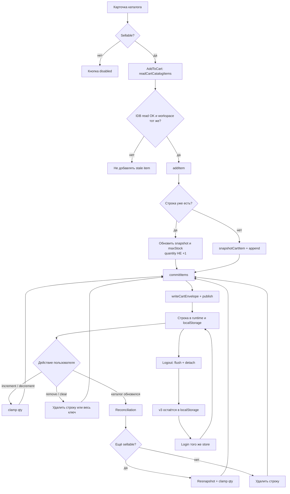
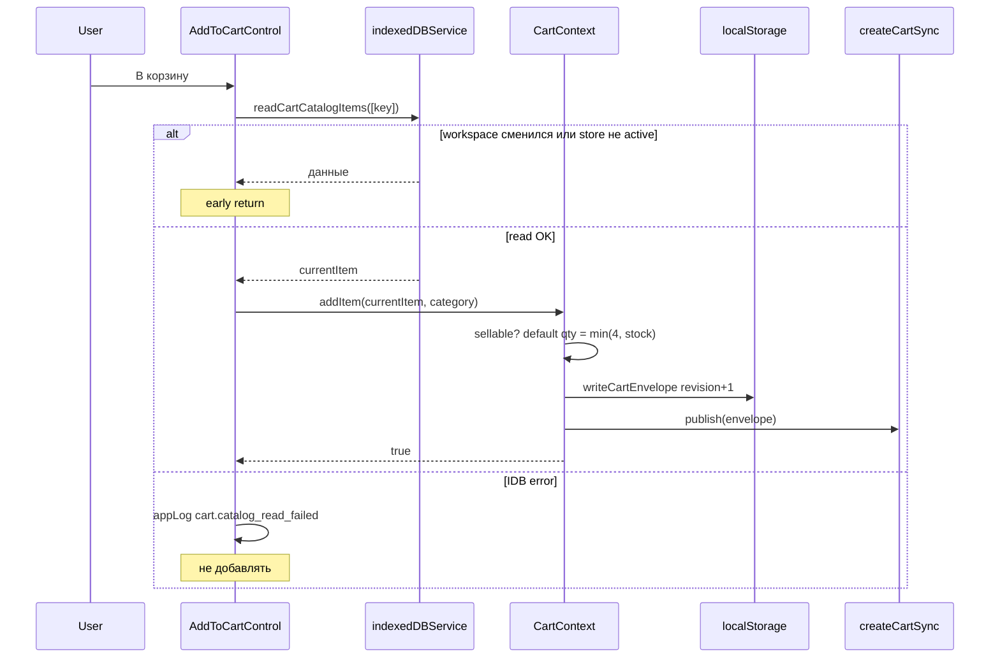

# Домен корзины и хранение

::: tip Статус: проверено по коду
Модель строки, envelope v3, `CartContext`, `cartStorage` и `cartUtils` сверены с исходниками и тестами `cartStorage.test.js`, `cartUtils.test.js`, `CartContext.test.jsx`.
:::

## Назначение

Корзина Ivanor — **локальный staff-инструмент** для набора шин и дисков в рамках пары `accountId` + `storeId`. Сервера корзины нет: источник истины для строк — `localStorage` (envelope v3), для актуальных цен и остатков — IndexedDB каталога.

Эта страница отвечает на вопросы:

1. как устроена модель элемента корзины;
2. кто владеет состоянием;
3. как товар добавляется, изменяется и удаляется;
4. как корзина сохраняется;
5. какие инварианты нельзя нарушать.

Миграция вкладок и legacy, сверка с каталогом и UI страницы `/basket` разобраны в соседних главах.

## Простыми словами

Менеджер открывает каталог магазина, жмёт «В корзину», правит количество и смотрит итог. Браузер кладёт снимок позиций в `localStorage` под ключом вида `cart.staff.v3.{account}.{store}`. После выхода из аккаунта корзина **не стирается**: при следующем входе в тот же магазин строки снова загрузятся. Если каталог обновился и товар пропал или стал непродаваемым, сверка (следующая глава) уберёт или обновит строку.

## Исходные файлы

- [`src/cart/CartContext.jsx`](https://github.com/iscander-b10/tyres_discs/blob/main/src/cart/CartContext.jsx)
- [`src/cart/cartStorage.js`](https://github.com/iscander-b10/tyres_discs/blob/main/src/cart/cartStorage.js)
- [`src/cart/cartUtils.js`](https://github.com/iscander-b10/tyres_discs/blob/main/src/cart/cartUtils.js)

## Место в архитектуре

```
AuthProvider
  └─ AppShellProvider
       └─ CartProvider
            ├─ runtime: items[], isLoaded
            ├─ persistence: localStorage envelope v3
            └─ WorkspaceHosts → CartReconciliationHost
```

| Слой | Владелец | Что хранит |
| --- | --- | --- |
| React runtime | `CartProviderCore` | `items`, `isLoaded`, refs envelope/generation/sync |
| Persistence | `localStorage` | envelope v3 по account + store |
| Multi-tab | `createCartSync` | BroadcastChannel / storage-event |
| Каталог | IndexedDB | цены, остатки, наличие (не владеет корзиной) |
| UI selection | `BasketPage` | локальный `Set` выбранных ключей |

Корзина **не** живёт в IndexedDB и **не** синхронизируется с облаком.

---

## 1. Модель элемента корзины

### Ключ строки

`getCartItemKey(item, category)` → `` `${category}:${id}` ``.

Категории только `tyres` и `discs`. Идентификаторы уникальны **внутри категории**: шина `tyres:42` и диск `discs:42` — две разные позиции.

### Sellability

Товар можно добавить только если:

1. ключ валиден;
2. `parseStock(amount) > 0`;
3. `getUnitSellingPrice(item) > 0` (`sellingPrice`, иначе fallback на `price`).

### Снимок строки: `snapshotCartItem`

На входе — объект каталога, категория и желаемое количество. На выходе:

```js
{
  ...item,           // снимок полей каталога на момент добавления/сверки
  key,               // "tyres:123"
  category,          // "tyres" | "discs"
  id: String(item.id),
  quantity,          // целое ≥ 1, clamp по остатку
  maxStock,          // floor(amount)
}
```

### Envelope v3

```js
{
  version: 3,
  revision: 0,      // монотонно растёт при каждой успешной записи
  updatedAt: 0,     // ms; при commit ≥ previous + 1
  items: [ /* строки */ ]
}
```

Валидация persistence (`isValidCartItem`): обязательны непустой `key` и `quantity` как safe integer ≥ 1; опциональные числовые поля (`amount`, `maxStock`, `price`, `sellingPrice`, `websitePrice`) либо пустые, либо ≥ 0.

Ключи строк в одном envelope **уникальны**.

### Цены и количество

| Функция | Смысл |
| --- | --- |
| `getUnitSellingPrice` | цена продажи для итога |
| `getUnitB2bPrice` | только `price` (итог менеджера) |
| `getUnitWebsitePrice` | `websitePrice` |
| `getDefaultCartQty` | `min(4, stock)`; при stock 0 → 0 |
| `clampCartQty` | floor, минимум 1; при stock > 0 — потолок по stock |

`parseStock` / `parseStrictNumber`: вся строка должна быть числом; допускается `,` как десятичный разделитель; остаток берётся через `Math.floor`. Строка `'123abc'` даёт 0.

---

## 2. Кто владеет состоянием

**Единственный мутатор runtime** — `CartProviderCore` через `commitItems`, `replaceRuntime`, `clear`, `detach`, `handleMigrated`.

UI (`AddToCartControl`, `BasketPage`, `CartQtyControls`) только вызывает API `useCart()`. Reconciliation Host вызывает `reconcileCatalog`. Logout вызывает `flush` + `detach`, но **не** `clear`.

Пока `isLoaded === false` (нет готового workspace или после `detach`), мутации через `commitItems` возвращают `false` и ничего не пишут.

---

## Flowchart: жизненный цикл товара в корзине



---

## 3. Добавление, изменение, удаление

### Sequence: добавление



### `addItem(item, category, qty?)`

| | |
| --- | --- |
| **Назначение** | Добавить sellable позицию или обновить снимок уже существующей |
| **Вход** | объект каталога, категория, опционально qty |
| **Выход** | `true` / `false` |
| **Алгоритм** | 1) reject если не sellable; 2) qty = clamp(qty) или `getDefaultCartQty`; 3) если qty ≤ 0 → false; 4) если строка есть — переснять item и **оставить** текущее quantity (только clamp к stock); 5) иначе append snapshot |
| **Ошибки** | persist fail → runtime без изменений, `false` |
| **Опасное место** | повторный клик «В корзину» **не** увеличивает количество — только `increment` |

### `increment` / `decrement` / `removeItem`

- `increment(key)` — `quantity + 1`, потолок по `maxStock ?? amount` если > 0.
- `decrement(key)` — `Math.max(1, qty - 1)`; **сам не удаляет** строку.
- `removeItem(key)` — filter по ключу.

В каталоге `AddToCartControl` при qty = 1 и минусе вызывает `removeItem` (`allowRemoveAtMin`). На странице корзины минус при 1 disabled — удаление через крестик или «Удалить выбранные».

### `clear()`

Удаляет store-ключ из `localStorage`, затем заменяет runtime пустым envelope с `revision + 1` и публикует этот envelope другим вкладкам. Пустой envelope нужен для текущей вкладки и sync-сообщения, но обратно в storage методом `clear` не записывается. Это **явная** очистка пользователем, не logout.

---

## 4. Как корзина сохраняется

### Ключи

| Функция | Формат |
| --- | --- |
| `getCartAccountStorageKey` | `cart.staff.v3.{accountId}` (legacy account-only) |
| `getCartStorageKey` | `cart.staff.v3.{accountId}.{getSafeCatalogStoreId(storeId)}` |

`getSafeCatalogStoreId` сначала применяет `resolveCatalogStoreId`: при пустом аргументе используется настроенный `REACT_APP_STORE_ID`, а затем стабильный default. После этого значение кодируется через `encodeURIComponent`.

`readCartEnvelope` = `migrateAccountCartToStore`: если store-ключ уже есть — он побеждает, account-ключ удаляется; иначе содержимое account-ключа один раз переносится на store-ключ.

### `commitItems(update)`

1. Захватить `activeRef`; требовать `isLoaded` и matching generation.
2. `nextItems = update(itemsRef)`; тот же ref → no-op success.
3. `createCartEnvelope` с `revision + 1` и монотонным `updatedAt`.
4. `writeCartEnvelope`; при ошибке — лог `cart.persist_failed` / `storage.quota_exceeded`, **runtime не менять**, `false`.
5. Повторно проверить generation; `replaceRuntime`; `sync.publish`.

### `flush()` / `detach()`

- `flush` — повторная запись текущего envelope на диск (перед logout).
- `detach` — flush → close sync → null active → bump generation → `replaceRuntime(null, false)`. **Ключ v3 не удаляется.**

### Повреждённый v3

Corrupt JSON / невалидный envelope при чтении → пустая корзина revision 0. Legacy v1/v2 не подмешиваются внутри `readCartEnvelope`; при load workspace `CartProviderCore` делает silent migrate/discard (глава о миграции).

---

## Разбор модулей

### `cartUtils.js`

Чистый домен: ключи, цены, stock, sellability, snapshot, `reconcileCartItems` (логика сверки — в [каталожной главе](/09-cart/catalog-reconciliation)).

| | |
| --- | --- |
| **Side effects** | нет |
| **Кто вызывает** | CartContext, AddToCart, Host, BasketPage, тесты |
| **Тесты** | `cartUtils.test.js` |
| **Опасные места** | смена формата `category:id`; ослабление `parseStrictNumber`; «нет result = keep» в reconcile |

### `cartStorage.js`

| Export | Назначение |
| --- | --- |
| `createCartEnvelope` | валидированный snapshot; throw `TypeError` при мусоре |
| `writeCartEnvelope` | JSON в store-ключ; throw при пустом account/store |
| `readCartEnvelope` | чтение + account→store migrate |
| `parseCartEnvelope` / `validateCart*` | malformed → `null`, не throw |
| `isEnvelopeNewer` | сначала `revision`, при равенстве — `updatedAt` |

**Тесты:** `cartStorage.test.js` — keys, round-trip, migration, validation matrix, newer.

### `CartContext` / `useCart`

#### Публичный API

```
items, isLoaded,
addItem, increment, decrement, removeItem, clear,
flush, detach, reconcileCatalog, getItem,
totalQuantity, totals: { selling, b2b, positions, quantity }
```

Вне provider → throw `'useCart must be used within CartProvider'`.

#### Состояние

- React: `items`, `isLoaded`
- Refs: `generationRef`, `itemsRef`, `envelopeRef`, `activeRef`, `syncRef`, `lastReconciledVersionRef`

#### Lifecycle workspace

1. bump generation, close sync, сброс runtime (`isLoaded = false`).
2. если workspace не ready — стоп.
3. read envelope (catch → empty).
4. `replaceRuntime` → loaded.
5. подключить sync: применять incoming только если `isCurrent` и `isEnvelopeNewer`.

#### Пример

```jsx
const { addItem, getItem, totals, isLoaded } = useCart();

// после подтверждённого IDB read:
addItem(catalogItem, 'tyres'); // qty = min(4, stock)

const line = getItem('tyres:item-1');
// totals.selling — «Итого»; totals.b2b — менеджеру
```

#### Тесты

`CartContext.test.jsx`: изоляция workspace, corrupt → empty, detach сохраняет storage, clear удаляет + publish, stale sync игнорируется, sellability, version gate reconcile, soft fail при ошибке storage.

---

## 10. Инварианты корзины

1. Envelope всегда `version === 3`; ключи строк уникальны; `quantity` — safe integer ≥ 1.
2. Namespace persistence и sync = `accountId` + `storeId`.
3. Мутации только при `isLoaded` и matching generation.
4. Ошибка persist → runtime без изменений.
5. Logout: `flush` → `detach` → invalidate IDB → auth logout → navigate; **никогда `clear`**.
6. UI-добавление только sellable и после успешного IDB read.
7. Corrupt v3 ≠ автоfallback на v1/v2.
8. `tyres:X` и `discs:X` — разные позиции.
9. Повторный `addItem` существующей строки не увеличивает qty.
10. Default qty при добавлении = `min(4, stock)`.
11. Reconciliation не увеличивает qty при росте остатка; строки вне result map сохраняются.
12. `decrement` сам не удаляет строку (минимум 1).

---

## Крайние случаи

| Ситуация | Поведение |
| --- | --- |
| QuotaExceeded | лог, мутация не применяется |
| Смена store mid-commit | generation mismatch → discard write path |
| Параллельная вкладка со старшим revision | принимается через sync |
| `clear` vs `detach` | clear стирает ключ; detach оставляет |

## Опасные места при изменении

1. Формат ключа / `version` — ломает всех клиентов.
2. Вызов `clear` из logout — регрессия P1 (`useLogout.cartPolicy.test.jsx`).
3. «Повторный addItem += qty» — смена UX и контракта тестов.
4. Generation guards — гонки workspace/logout.
5. Спред всего catalog item в snapshot — рост размера localStorage.

## Связанные страницы

- [Миграция и вкладки](/09-cart/migration-and-multitab)
- [Сверка с каталогом](/09-cart/catalog-reconciliation)
- [Корзина и режим клиента](/10-ui/basket-and-client-mode)
- [Гонки и выход](/04-auth/races-and-logout)
- [Владение состоянием](/02-architecture/state-ownership)
