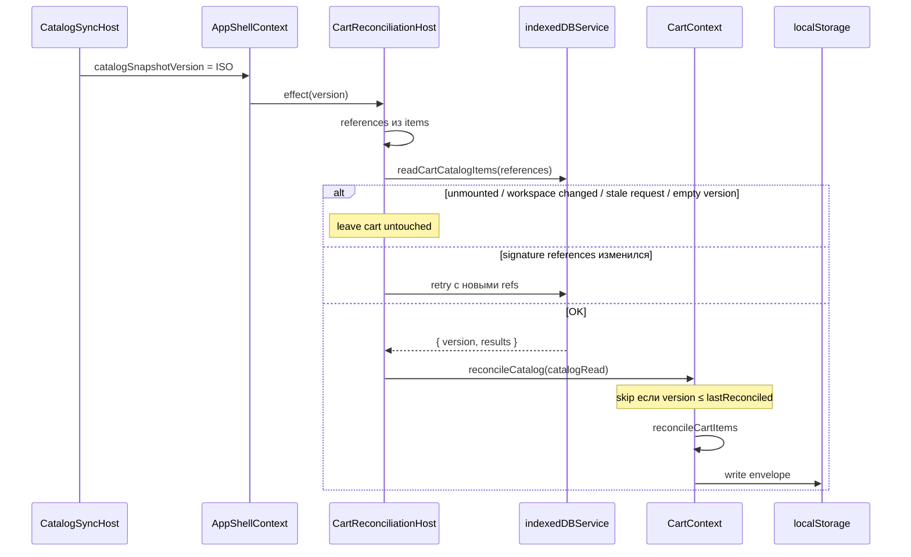

# Сверка корзины с каталогом

::: tip Статус: проверено по коду
`CartReconciliationHost`, `reconcileCartItems`, `reconcileCatalog` и read-before-add в `AddToCartControl` сверены с исходниками и тестами `CartReconciliationHost.test.jsx`, `cartUtils.test.js`, `CartContext.test.jsx`.
:::

## Назначение

Объяснить:

6. как работает reconciliation с каталогом;
7. как обрабатываются изменившиеся и удалённые товары;
а также контракт `AddToCartControl` (актуальный снимок до добавления).

Каталог обновляется атомарно в IndexedDB. Строки корзины живут в `localStorage` как снимки. Без сверки менеджер видел бы устаревшие цены, нулевые остатки и товары, которых уже нет.

## Простыми словами

После commit snapshot `AppShell` получает новый `catalogSnapshotVersion`. Невидимый `CartReconciliationHost` читает из IndexedDB все позиции, которые сейчас в корзине, и просит Context пересобрать строки. Если товар исчез или стал непродаваемым — строка удаляется. Если цена или остаток изменились — строка переснимается, quantity только уменьшается при необходимости, но **не растёт** вместе с остатком.

Параллельно кнопка «В корзину» сама перед добавлением делает точечный IDB-read: в корзину не должен попасть устаревший объект из React props карточки.

## Исходные файлы

- [`src/cart/CartReconciliationHost.jsx`](https://github.com/iscander-b10/tyres_discs/blob/main/src/cart/CartReconciliationHost.jsx)
- [`src/cart/cartUtils.js`](https://github.com/iscander-b10/tyres_discs/blob/main/src/cart/cartUtils.js) — `reconcileCartItems`
- [`src/cart/CartContext.jsx`](https://github.com/iscander-b10/tyres_discs/blob/main/src/cart/CartContext.jsx) — `reconcileCatalog`
- [`src/components/shared/AddToCartControl/AddToCartControl.jsx`](https://github.com/iscander-b10/tyres_discs/blob/main/src/components/shared/AddToCartControl/AddToCartControl.jsx)
- Facade: `indexedDBService.readCartCatalogItems`

## Место в архитектуре

```
CatalogSyncHost → applyCatalogSnapshot
       ↓
AppShell.catalogSnapshotVersion
       ↓
CartReconciliationHost (null render)
       ↓
indexedDBService.readCartCatalogItems(references)
       ↓
useCart().reconcileCatalog({ version, results })
       ↓
reconcileCartItems → commitItems → localStorage + sync
```

Host монтируется в `WorkspaceHosts` (`App.js`) только при готовом workspace, с `key = accountId:storeId`.

---

## 6. Как работает reconciliation

### Sequence



### Триггеры Host

1. `workspaceKey` + `isLoaded` → `reconcile()` (без обязательной requested version).
2. изменение `catalogSnapshotVersion` → `reconcile(catalogSnapshotVersion)`.

### `CartReconciliationHost`

| | |
| --- | --- |
| **Назначение** | Невидимый мост: событие каталога → IDB batch read → `reconcileCatalog` |
| **Рендер** | `null` |
| **Состояние** | refs: `items`, `mounted`, `latestRequest`, `workspaceKey` |
| **Вход** | косвенно: items корзины, `catalogSnapshotVersion`, workspace |
| **Выход** | side effect на Context; UI не рисует |
| **Зависимости** | `useAppShell`, `useAuth`, `useCart`, `indexedDBService` |
| **Кто вызывает** | React mount в `WorkspaceHosts` |

### Пошаговый алгоритм Host

1. Если нет workspaceKey или `!isLoaded` — выход.
2. Построить `references`: `{ requestKey, category|null, id }` для строк с непустым id.
3. Пустой список — выход.
4. Цикл `while (mounted)`:
   - bump `requestNumber`;
   - `await readCartCatalogItems(references)`;
   - abort, если unmounted / workspace сменился / номер запроса устарел / `!catalogRead.version` / version < requestedVersion;
   - если signature references изменился (пользователь добавил строку во время read) — retry;
   - иначе `reconcileCatalog(catalogRead)` и return.
5. `catch` → **корзину не трогать**.

### `reconcileCatalog({ version, results })`

| | |
| --- | --- |
| **Назначение** | Применить пакет сверки с version gate |
| **Алгоритм** | 1) reject если `!isLoaded` / `!version` / `version <= lastReconciledVersionRef` (сравнение строк ISO); 2) запомнить version **до** commit; 3) `commitItems(items => reconcileCartItems(items, results))` |
| **Ошибки** | как у commitItems (soft fail persist) |
| **Тесты** | `CartContext.test.jsx` — version gate |

### `reconcileCartItems(currentItems, catalogResults)` — чистая функция

| | |
| --- | --- |
| **Назначение** | Пересобрать массив строк по результатам batch-read |
| **Вход** | текущие items + `[{ requestKey, matches: { tyres?, discs? } }]` |
| **Выход** | новый массив (flatMap) |
| **Side effects** | нет |

Алгоритм на каждую строку:

1. `requestKey` = `category:id` или `line.key`.
2. **Нет result в map** → **сохранить строку** (её могли добавить во время чтения).
3. `resolveCatalogMatch`:
   - есть `line.category` → `matches[category]`;
   - legacy без category: ровно один кандидат среди tyres/discs; если два — разрешить по `supplier+code`; иначе null → удалить.
4. Match null или не sellable → **удалить**.
5. Иначе `snapshotCartItem(match, clamp(line.quantity, amount))`.

---

## 7. Изменившиеся и удалённые товары

| Ситуация | Результат сверки |
| --- | --- |
| Цена, title, photo, supplier обновились | полный resnapshot полей каталога |
| Остаток уменьшился ниже qty | qty clamped down |
| Остаток вырос | `maxStock` вверх, **qty без изменений** |
| `amount = 0` / цена ≤ 0 / item null | строка удаляется |
| Позиции нет в result map | строка **сохраняется** |
| Ambiguous legacy без identity | удаляется |
| IDB read упал / version пустой | Host не вызывает reconcile — всё как было |
| Старая version после новой | `reconcileCatalog` → false |

Массовое исчезновение позиций после sync — ожидаемое поведение при purge/out-of-stock, а не «баг clear». UX уведомлений о массовом удалении в коде **не** реализован (известное ограничение / возможное будущее улучшение).

---

## `AddToCartControl`

| | |
| --- | --- |
| **Назначение** | Кнопка «В корзину» / qty-controls на карточке и в модалке товара |
| **Props** | `item`, `category`, `onGoToCart?`, `className`, `block` |
| **Состояние** | нет своего store; читает `getItem(key)` из Context |
| **Кто вызывает** | `CatalogItemCard`, `CatalogItemModalWindow` |

### Read-before-add

1. `stopPropagation`.
2. `readCartCatalogItems([{ requestKey, category, id }])`.
3. Abort, если workspace сменился или `!isActiveStore(storeId)`.
4. Взять `matches[category]` → `addItem(currentItem, category)` (default qty).
5. `catch` → `appLog` `cart.catalog_read_failed`, **не** добавлять props-item.

Если строка уже в корзине: `CartQtyControls` с `allowRemoveAtMin` (минус при 1 → `removeItem`) + «Перейти в корзину».

### Ошибки

| Источник | Поведение |
| --- | --- |
| IDB fail | лог, кнопка остаётся; корзина не меняется |
| Не sellable / нет workspace | кнопка disabled |
| Stale workspace | silent return после read |

### Пример

```jsx
<AddToCartControl item={tire} category="tyres" />
```

### Опасные места

- Добавлять напрямую из props без IDB → stale price/stock.
- Убрать «нет result = keep» в `reconcileCartItems` → гонка с add во время Host-read сотрёт новую строку.
- Вызывать `reconcileCatalog` с пустой version → no-op сейчас; ослабление gate опасно.

---

## Тесты

| Файл | Что фиксирует |
| --- | --- |
| `CartReconciliationHost.test.jsx` | IDB fail, empty version, race old/new, remount, workspace switch, retry при смене refs |
| `cartUtils.test.js` | update price, clamp down, delete on zero/null, maxStock up without qty up, same id tyres/discs, legacy ambiguity, preserve unread |
| `CartContext.test.jsx` | version gate reconcile |
| (косвенно) AddToCart | через карточки / routing tests; ключевой контракт — не add stale |

---

## Инварианты сверки

1. Fail-closed: сомнение (ошибка, stale, empty version) → корзина не меняется.
2. Строки вне scope read сохраняются.
3. Не sellable после подтверждённого match → удаление.
4. Quantity не растёт от роста остатка.
5. Version gate монотонен по строковому ISO `catalogSnapshotVersion`.
6. UI-add только после успешного точечного IDB read.

## Известные ограничения

- Нет toast/баннера «N позиций удалено после обновления каталога».
- Сравнение версий — лексикографическое по строке; контракт держится на ISO-монотонности snapshot version в каталоге.

## Связанные страницы

- [Домен корзины и хранение](/09-cart/cart-domain-and-storage)
- [Миграция и вкладки](/09-cart/migration-and-multitab)
- [Полный жизненный цикл каталога](/06-catalog-sync/catalog-lifecycle)
- [Корзина и режим клиента](/10-ui/basket-and-client-mode)
