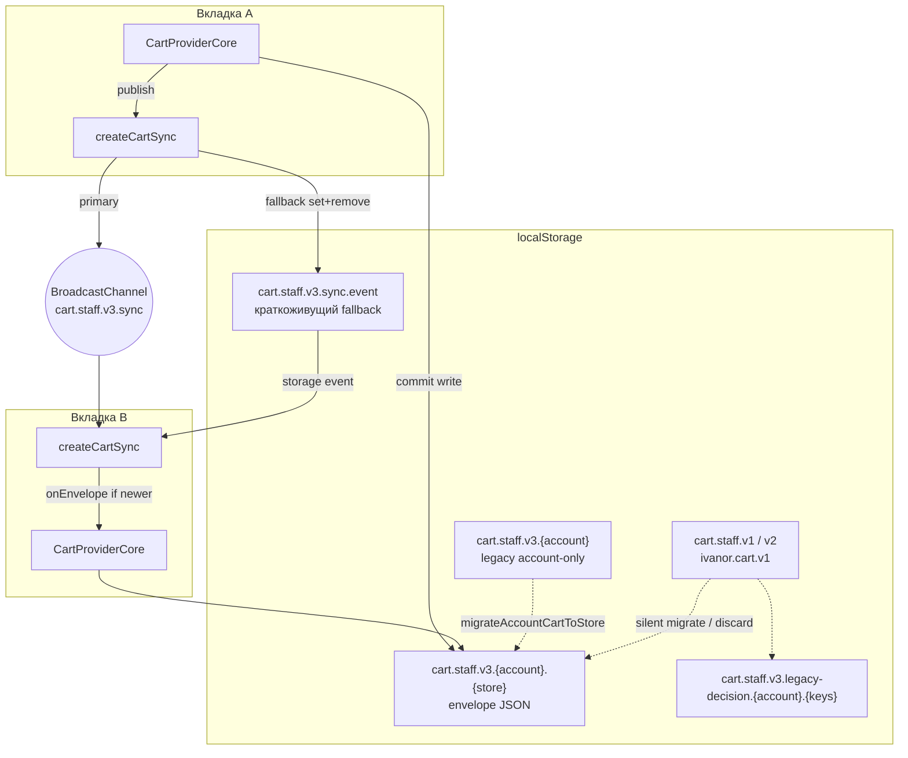
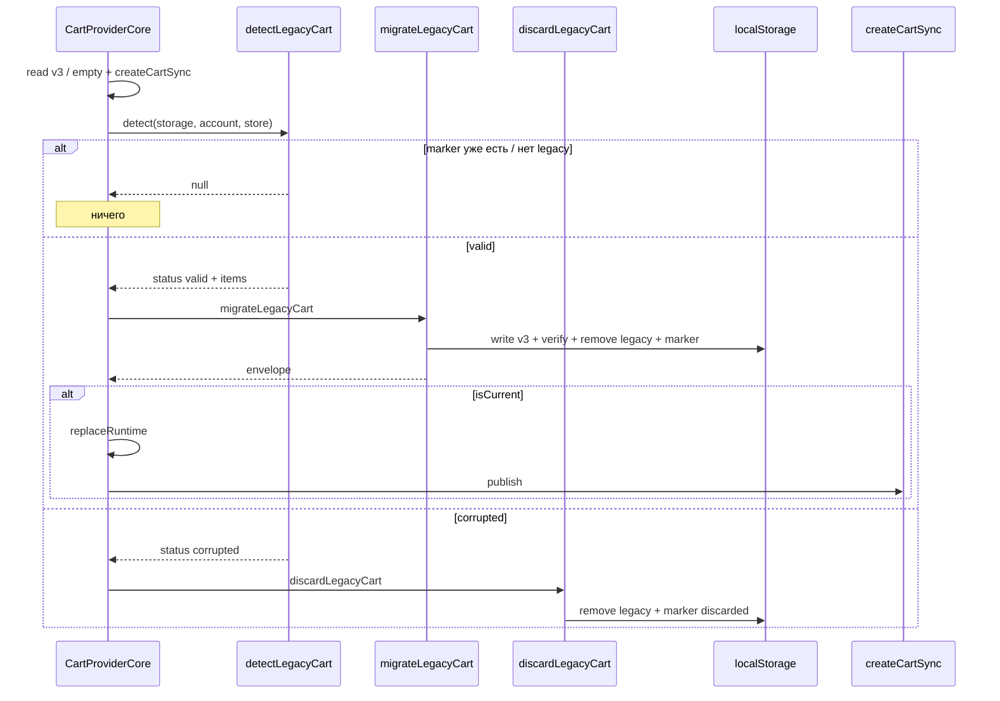
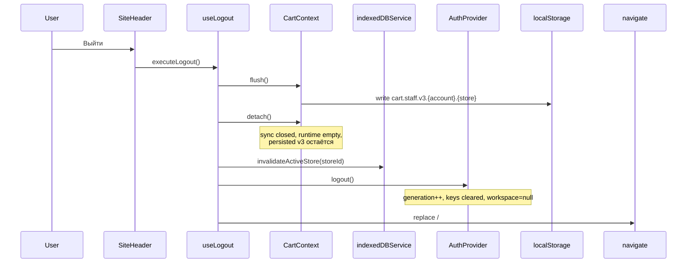

# Миграция и вкладки

::: tip Статус: проверено по коду
`cartSync`, legacy migration, account→store перенос и политика logout сверены с `cartSync.js`, `legacyCartMigration.js`, `CartContext.jsx`, `useLogout.js` и тестами `*.test.js` / `useLogout.cartPolicy.test.jsx`.
:::

## Назначение

Объяснить:

5. как синхронизируются вкладки;
8. как работает legacy migration;
9. что происходит при login и logout;
а также схему хранения и каналов между вкладками.

Домен envelope и мутации — в [Домен корзины и хранение](/09-cart/cart-domain-and-storage).

## Простыми словами

Две вкладки одного менеджера в одном магазине должны видеть одну корзину. После успешного commit вкладка A публикует envelope; вкладка B применяет его, только если revision/updatedAt новее. Старые форматы `cart.staff.v1` / `v2` / `ivanor.cart.v1` при готовности workspace обрабатываются тихо: valid — merge в envelope v3, corrupted — discard. Решение запоминается маркером, чтобы миграция не повторялась. UI/модалки нет.

Выход из аккаунта **сохраняет** v3 на диске и отцепляет runtime. Следующий вход в тот же `accountId` + `storeId` поднимает ту же корзину.

## Исходные файлы

- [`src/cart/cartSync.js`](https://github.com/iscander-b10/tyres_discs/blob/main/src/cart/cartSync.js)
- [`src/cart/legacyCartMigration.js`](https://github.com/iscander-b10/tyres_discs/blob/main/src/cart/legacyCartMigration.js)
- [`src/cart/CartContext.jsx`](https://github.com/iscander-b10/tyres_discs/blob/main/src/cart/CartContext.jsx) — silent auto-migrate/discard при load workspace
- [`src/cart/cartStorage.js`](https://github.com/iscander-b10/tyres_discs/blob/main/src/cart/cartStorage.js) — account→store
- [`src/auth/useLogout.js`](https://github.com/iscander-b10/tyres_discs/blob/main/src/auth/useLogout.js)

---

## Схема хранения и синхронизации вкладок



Константы:

| Имя | Значение |
| --- | --- |
| `CART_KEY_PREFIX` | `cart.staff.v3.` |
| `CART_SYNC_CHANNEL` | `cart.staff.v3.sync` |
| `CART_SYNC_STORAGE_KEY` | `cart.staff.v3.sync.event` |
| `LEGACY_CART_KEYS` | `cart.staff.v2`, `cart.staff.v1`, `ivanor.cart.v1` |
| Marker prefix | `cart.staff.v3.legacy-decision.` |

---

## 5. Синхронизация вкладок

### `createCartSync`

| | |
| --- | --- |
| **Назначение** | Доставить envelope другим вкладкам того же account+store |
| **Вход** | `{ accountId, storeId, storage, windowObject, BroadcastChannelClass, onEnvelope }` |
| **Выход** | `{ publish(envelope) → bool, close() }` |
| **Состояние** | `channel`, флаг `closed`, ожидаемый `resolvedStoreId` |
| **Side effects** | BroadcastChannel postMessage; или setItem+removeItem sync-ключа; listener `storage` |
| **Зависимости** | `validateCartEnvelope`, `resolveCatalogStoreId` |
| **Кто вызывает** | `CartProviderCore` при готовности workspace |

### Пошаговый алгоритм

1. Всегда подписаться на `storage` для ключа `CART_SYNC_STORAGE_KEY`.
2. Если `BroadcastChannel` доступен — создать канал `CART_SYNC_CHANNEL` (primary publish).
3. `publish`: проверить envelope; собрать `{ accountId, storeId, envelope }`; postMessage **или** fallback setItem → removeItem (чтобы другие вкладки получили storage event).
4. `receive`: отбросить closed / чужой account / чужой store / невалидный envelope; иначе `onEnvelope`.
5. В `CartProvider` `onEnvelope` применяет только если generation current и `isEnvelopeNewer`.
6. `close`: снять listener, закрыть канал, игнорировать late events.

### Обработка ошибок

- Malformed JSON в storage event — ignore.
- Ошибка конструктора BC → `channel = null` → fallback.
- `publish` fail → `false` (локальный commit уже мог пройти).

### Тесты

`cartSync.test.js`: фильтр account/store, storage fallback без ретрансляции в BC, `close` игнорирует late messages.

### Опасные места

- Ретранслировать storage→BC нельзя — петля.
- Не ослаблять фильтр storeId: иначе чужой магазин затрёт корзину.
- Не применять envelope со старым `revision` поверх нового.

### Пример сообщения

```js
{
  accountId: 'account-a',
  storeId: 'store-a',
  envelope: { version: 3, revision: 5, updatedAt: 1_700_000_000_000, items: [...] }
}
```

---

## Account → store migrate

До store-namespace v3 мог лежать под `cart.staff.v3.{accountId}`.

`migrateAccountCartToStore` (вызывается из `readCartEnvelope`):

1. Если store-ключ валиден — вернуть его; legacy account-ключ best-effort удалить.
2. Иначе если account-ключ валиден — скопировать на store-ключ, удалить legacy, вернуть.
3. Иначе `null`.

Это **не** то же самое, что миграция v1/v2: формат уже envelope v3, меняется только ключ.

---

## 8. Legacy migration

### Тихая миграция при load workspace

При готовности workspace `CartProviderCore` после чтения v3 и подключения sync вызывает `detectLegacyCart`. UI нет: valid → auto-migrate, corrupted → auto-discard. Corrupt v3 при обычном чтении даёт пустую корзину; если рядом есть **valid** legacy — он тихо мержится в v3 (отдельный шаг, не fallback внутри `readCartEnvelope`).

### `detectLegacyCart(storage, accountId, storeId)`

| | |
| --- | --- |
| **Назначение** | Найти legacy-ключи и понять, можно ли их разобрать |
| **Выход** | `null` или объект detection |
| **Алгоритм** | 1) собрать присутствующие `LEGACY_CART_KEYS`; 2) если есть marker для этой пары account+keys → `null`; 3) разобрать **первый** source: массив или `{ version: 1\|2, items }` через `validateCartItems`; 4) `status: 'valid' \| 'corrupted'` |

### `migrateLegacyCart`

1. Прочитать текущий v3 (если есть).
2. Merge: существующие v3 items + legacy items без дубликатов `key`.
3. Записать envelope, **verify readback**.
4. Удалить legacy keys, записать marker `migrated`.
5. При ошибке — rollback v3 и/или restore legacy (fail-safe).

### `discardLegacyCart`

Marker `discarded` + удаление legacy keys. Идемпотентно при повторном вызове.

### Поведение в `CartProviderCore`

| | |
| --- | --- |
| **Когда** | В том же effect, где читается v3 и поднимается sync |
| **valid** | `migrateLegacyCart` → при `isCurrent()`: `replaceRuntime(envelope)` + `publish` |
| **corrupted** | `discardLegacyCart` тихо |
| **null** | ничего |
| **Ошибки** | best-effort: `appLog`, UI не роняется; fail migrate откатывает v3/legacy внутри `migrateLegacyCart` |
| **Гварды** | `isCurrent()` / generation — не применять migrate-результат к устаревшему workspace |
| **Тесты** | `CartContext.test.jsx` (silent migrate/discard/marker), `legacyCartMigration.test.js` |

### Sequence: тихая миграция



### Опасные места

- Менять семантику marker → миграция повторится или наоборот никогда не сработает.
- Миграция без verify readback — риск «думали, записали».
- Применять envelope migrate без `isCurrent` после смены workspace — чужая корзина в runtime.

---

## 9. Login и logout

### Login

Сам `signIn` / `restore` корзину не трогает.

Когда workspace готов:

1. `CartProvider` читает store-scoped v3 (или empty).
2. Подключает sync.
3. При необходимости тихо мигрирует или discard’ит legacy.
4. Монтирует `CartReconciliationHost` (через `WorkspaceHosts`).

Смена `accountId` или `storeId` → новый generation, другой ключ storage, прежняя корзина другого магазина не смешивается.

### Sequence: logout



Порядок **жёсткий** (тесты `useLogout.test.jsx`):

1. `flush()`
2. `detach()`
3. `invalidateActiveStore`
4. `logout()`
5. `navigate(PATHS.home, { replace: true })`

**Никогда `clear()`.** Интеграция: `useLogout.cartPolicy.test.jsx` — после выхода ключ v3 на месте, runtime пуст.

Подробнее про generation auth и порядок очистки — [Гонки и выход](/04-auth/races-and-logout).

---

## Инварианты этой главы

1. Sync применяет только envelope того же account+store и только если newer.
2. Fallback storage-event не должен ретранслироваться в BroadcastChannel.
3. Legacy решение идемпотентно через marker.
4. Logout сохраняет v3; clear — только явное действие UI.
5. Account-only v3 ключ мигрирует в store-ключ один раз, store побеждает.

## Связанные страницы

- [Домен корзины и хранение](/09-cart/cart-domain-and-storage)
- [Сверка с каталогом](/09-cart/catalog-reconciliation)
- [Гонки и выход](/04-auth/races-and-logout)
- [Блокировки и каналы каталога](/06-catalog-sync/locks-and-channels) — другой канал, не путать с cart sync
