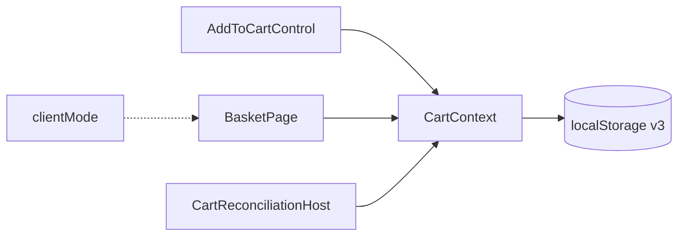

# Корзина и режим клиента

::: tip Статус: проверено по коду
`BasketPage`, `CartQtyControls`, различие client/manager и dual-mount панели сверены с `BasketPage.jsx`, `AppShellContext` (clientMode) и связанными UI-путями.
:::

## Назначение

Показать, как runtime-корзина отображается на маршруте `/basket`: загрузка, пустое состояние, выбор позиций, итоги и режим «клиент» (скрытие B2B/поставщика). Домен и persistence — в разделе [09-cart](/09-cart/cart-domain-and-storage).

## Простыми словами

Страница корзины не хранит товары сама: она читает `useCart().items` и рисует таблицу. Режим клиента (`clientMode` в AppShell) — презентационный переключатель для показа экрана покупателю: другие цены и меньше служебных полей. Сама корзина в storage от режима не зависит.

## Исходные файлы

- [`src/components/Basket/BasketPage.jsx`](https://github.com/iscander-b10/tyres_discs/blob/main/src/components/Basket/BasketPage.jsx)
- [`src/components/shared/CartQtyControls/CartQtyControls.jsx`](https://github.com/iscander-b10/tyres_discs/blob/main/src/components/shared/CartQtyControls/CartQtyControls.jsx)
- [`src/components/shared/AddToCartControl/AddToCartControl.jsx`](https://github.com/iscander-b10/tyres_discs/blob/main/src/components/shared/AddToCartControl/AddToCartControl.jsx)
- [`src/app/AppShellContext.jsx`](https://github.com/iscander-b10/tyres_discs/blob/main/src/app/AppShellContext.jsx) — `clientMode`, `continueSelection`

---

## `BasketPage`

| | |
| --- | --- |
| **Назначение** | UI списка корзины, selection, итоги, clear |
| **Вход** | Context: cart + auth ready + `clientMode` |
| **Локальное состояние** | `selected: Set<key>`, `modalItemKey` |
| **Side effects** | вызовы `increment` / `decrement` / `removeItem` / `clear`; навигация через `continueSelection` |
| **Кто монтирует** | dual-mount панель в `AppFrame` (`key={basket-${workspaceResetKey}}`) |

### Алгоритм отрисовки

1. Пока `!isWorkspaceReady || !isLoaded` → Spin «Загружаем корзину».
2. Пустой `items` → empty state + CTA продолжить подбор.
3. При входе на `/basket` и смене набора ключей → select all.
4. Строки: фото, title, qty controls, цены, чекбоксы, удаление.
5. Summary: `totals.selling` как «Итого»; `totals.b2b` только не в client mode; кнопка очистить.

### Client mode (`basket-page--client`)

Скрывает / упрощает:

- supplier;
- website line sum / B2B summary;
- `CatalogPriceStrip` переключается в client presentation.

Включается через UI ModeToggle в оболочке, не через storage корзины.

### Qty на странице vs в каталоге

| Место | Минус при qty = 1 |
| --- | --- |
| `BasketPage` | disabled; удаление крестиком / «Удалить выбранные» |
| `AddToCartControl` | `allowRemoveAtMin` → `removeItem` |

`decrement` в Context никогда сам не удаляет строку (минимум 1) — это UI-решение.

### Ошибки

Persist fail обрабатывается в Context (soft): UI может «не сдвинуться» после клика. Отдельного error banner на BasketPage нет.

### Тесты

Прямого полного unit-сьюта BasketPage может не быть; контракты домена покрыты `CartContext.test.jsx`. Routing/shell — `App.routing.test.jsx`, header badge — `SiteHeader.test.jsx`.

### Опасные места

- Хранить selection в Context — лишняя связность; сейчас UI-only.
- Путать `clear` (стирает storage) с logout `detach`.
- Ломать dual-mount key — утечки состояния при смене workspace.

---

## `CartQtyControls`

Презентационный Ant Design +/-.

| Prop | Смысл |
| --- | --- |
| `quantity`, `maxStock` | отображение и disable плюса |
| `onIncrement` / `onDecrement` | колбэки родителя |
| `allowRemoveAtMin` | минус активен при 1 (каталог) |
| `size` | visual |

Не знает про Context — только callbacks.

---

## Связь с учебником корзины

1. [Домен и хранение](/09-cart/cart-domain-and-storage)
2. [Миграция и вкладки](/09-cart/migration-and-multitab)
3. [Сверка с каталогом](/09-cart/catalog-reconciliation)
4. Эта страница — UI

## Связанные страницы

- [Две панели каталога](/03-routing-shell/dual-mount-catalog)
- [Тема и оболочка](/10-ui/theme-and-shell-components)
- [Гонки и выход](/04-auth/races-and-logout)
