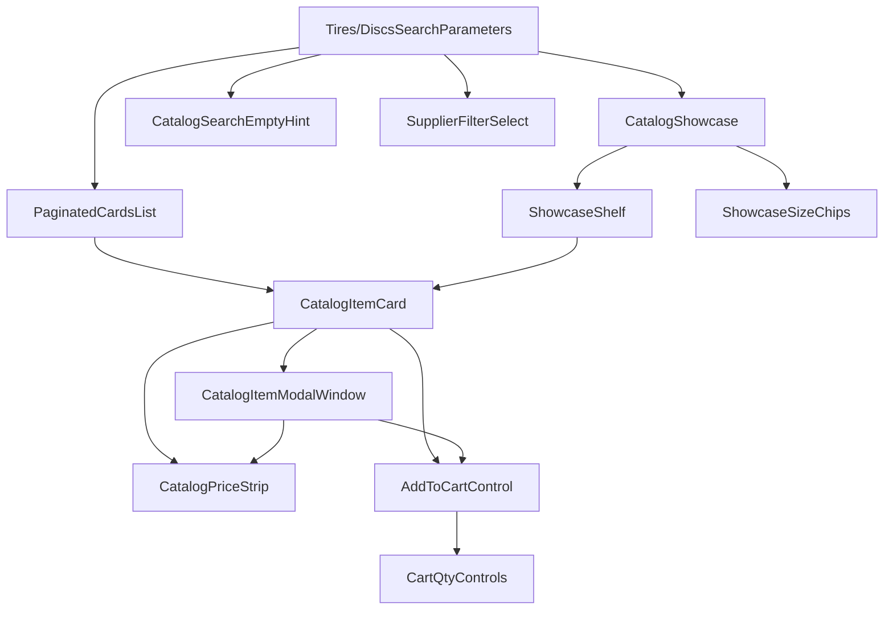
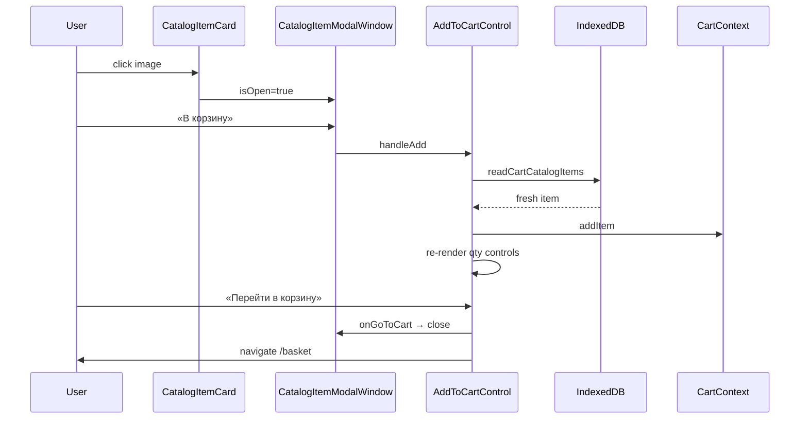

# Компоненты каталога

Композиция карточки товара, модального окна, полосы цен, фильтра поставщика, добавления в корзину и пагинированного списка результатов.

## Дерево shared-компонентов



---

## React-компонент: `CatalogItemCard`

**Путь:** `src/components/shared/CatalogItemCard/CatalogItemCard.jsx`

### Назначение

Компактная карточка товара каталога для grid, полки showcase и списка поиска.

### Props

| Prop | Тип | Default | Описание |
| --- | --- | --- | --- |
| `item` | object | — | запись из IDB |
| `category` | `'tyres' \| 'discs'` | — | для корзины |
| `isClientMode` | boolean | `false` | скрывает имя поставщика, меняет price strip |
| `cardClassName` | string | `'item-card'` | CSS class |
| `ModalComponent` | React component | — | usually CatalogItemModalWindow |
| `modalItemPropName` | string | `'item'` | prop name для item в модалке |

### Context и hooks

Нет Context. `useMemo` для photoSrc, sizeDisplay, stockDisplay.

### Локальное состояние

`isModalOpen: boolean` — видимость модалки.

### Обработчики

- `handleImageClick` → open modal
- keyboard Enter/Space на cover

### Ветви рендеринга

- `!item` → null
- cover: Image + code overlay + runflat icon + promo badges
- Meta: title, size, color, supplier (manager only), stock, price, cart
- `ModalComponent` рендерится всегда (controlled by isOpen)

### Ant Design

`Card`, `Meta`, `Image`, `Flex`, `Typography.Text`, `Divider`

### Связь с сервисами

`resolvePhotoUrl(item.photoUrl, item.supplier)` — URL фото поставщика.

### Пример

Клик по фото «Ikon Character Eco» → модалка с полным описанием, те же цены и кнопка корзины.

### Типичные ошибки

- Передавать `ModalComponent={null}` — модалка недоступна
- Hardcode category — ломает reconciliation корзины

---

## React-комponent: `CatalogItemModalWindow`

**Путь:** `src/components/shared/CatalogItemModalWindow/CatalogItemModalWindow.jsx`

### Назначение

Полноэкранная модалка товара через React portal.

### Props

| Prop | Тип | Описание |
| --- | --- | --- |
| `isOpen` | boolean | видимость |
| `onClose` | function | закрытие |
| `item` | object | товар |
| `category` | string | tyres/discs |
| `isClientMode` | boolean | скрывает supplier в meta |

### Effects

1. **Open/close:** `body.overflow`, focus на close button, restore focus on close.
2. **Keydown:** Escape → close; Tab trap внутри dialog.

### Вычисляемые данные

`metaFields` — массив `{ key, label, value }` из item: brand, model, size, load/speed index, code, stock, supplier.

### Ant Design

`Button` (close), `@ant-design/icons` CloseOutlined

### Loading / empty / error

`!isOpen || !item` → null (ничего не рендерится).

### Async

Нет.

### Пример

Открыта модалка → Escape → focus возвращается на карточку.

---

## React-компонент: `CatalogPriceStrip`

**Путь:** `src/components/shared/CatalogPriceStrip/CatalogPriceStrip.jsx`

### Назначение

Компактное отображение цен: B2B / Internet / магазин (manager) или только магазин (client).

### Props

| Prop | Тип | Default |
| --- | --- | --- |
| `item` | object | — |
| `isClientMode` | boolean | `false` |
| `className` | string | `''` |

### Вычисляемые данные

`getCatalogPriceStripItems(item, { isClientMode })` → массив `{ key, label, value, primary }`.

### Ветви

`!item || cells.length === 0` → null.

### Ant Design

Нет (custom div tiles).

### Пример (manager)

Три плитки: «B2B», «Интернет», «Магазин» (primary).

---

## React-компонент: `SupplierFilterSelect`

**Путь:** `src/components/shared/SupplierFilterSelect/SupplierFilterSelect.jsx`

### Назначение

Select поставщика в форме поиска. В client mode скрывает имя в закрытом селекторе (blur), но Form value остаётся реальным.

### Props

| Prop | Тип | Default |
| --- | --- | --- |
| `isClientMode` | boolean | `false` |
| `loading` | boolean | `false` |
| `options` | string[] | `[]` |
| `value`, `onChange` | — | от Form.Item |

### Ant Design

`Select` + `Option`, `allowClear`, `loading`.

### Client mode UX

Обёртка `HoverTooltip` с полным именем поставщика; CSS class `filter-select--supplier-client`.

### Async

Нет (options приходят из parent loadAvailableParameters).

---

## React-компонент: `AddToCartControl`

**Путь:** `src/components/shared/AddToCartControl/AddToCartControl.jsx`

### Назначение

Кнопка «В корзину» или блок qty + «Перейти в корзину» если товар уже в корзине.

### Props

| Prop | Тип | Default |
| --- | --- | --- |
| `item` | object | — |
| `category` | string | — |
| `onGoToCart` | function | — |
| `className` | string | `''` |
| `block` | boolean | `true` |

### Context

- `useAuth()` — workspace readiness
- `useCart()` — addItem, getItem, increment, decrement, removeItem, isLoaded
- `useNavigate()` — PATHS.basket

### Локальное состояние

Нет (derived from cart line by key).

### Async: `handleAdd`

1. Guard workspace + sellable.
2. `indexedDBService.readCartCatalogItems([...])` — fresh catalog row.
3. Workspace/store guard после await.
4. `addItem(currentItem, category)`.

**Side effects:** IDB read, CartContext mutation, optional navigate.

### Ветви рендеринга

- `cartLine` exists → CartQtyControls + «Перейти в корзину»
- else → primary Button disabled if !canAdd

### Ant Design

`Button`, `ShoppingCartOutlined`

### Loading / empty / error

- `!canAdd` → disabled button, aria-label «Нет в наличии»
- IDB error → log, **не** добавляет stale item

### Тесты

Покрытие через cart integration tests; см. [Домен корзины](/09-cart/cart-domain-and-storage).

### Типичные ошибки

- `addItem(item)` без fresh read — устаревший amount/price в корзине
- Не stopPropagation на click — открывается модалка под кнопкой

---

## React-компонент: `PaginatedCardsList`

**Путь:** `src/components/shared/PaginatedCardsList/PaginatedCardsList.jsx`

### Назначение

Grid результатов поиска с client-side title filter, сортировкой, пагинацией.

### Props

| Prop | Тип | Default |
| --- | --- | --- |
| `items` | array \| null | — |
| `error` | string \| null | — |
| `isClientMode` | boolean | — |
| `renderCard` | function | — |
| `emptyText` | string | — |
| `itemsPerPage` | number | `20` |
| `containerClassName`, `gridClassName` | string | — |
| `searchResetKey` | number | `0` |

### Локальное состояние

| State | Назначение |
| --- | --- |
| `currentPage` | текущая страница |
| `sortMode` | default/price/alphabet |
| `itemsPerPage` | из localStorage |
| `searchQuery`, `debouncedQuery` | title filter |
| `paginationStuck` | sticky pagination CSS |

### Effects

- Debounce search 600ms
- Reset page on items/sort/query/pageSize change
- Reset title filter on searchResetKey
- IntersectionObserver для pagination sticky

### Обработчики

- `handleSearchChange`, `handleSearchClear`
- Dropdown sort / page size
- `handlePageChange` + scroll to top

### Ветви рендеринга

```
error → Alert
!items → null
hasVisibleItems → grid + pagination
isTitleFilterEmpty → «Нет совпадений» + clear
else → Empty(emptyText)
```

### Ant Design

`Alert`, `Button`, `Dropdown`, `Empty`, `Flex`, `Input`, `Pagination`

### Side effects

`localStorage` для page size; `window.scrollTo`.

### Sort modes

| Mode | Ключ |
| --- | --- |
| По умолчанию | порядок IDB |
| Цена ↑/↓ | sellingPrice ?? price ?? cost |
| Алфавит ↑/↓ | title localeCompare ru |

---

## React-компонент: `CatalogSearchEmptyHint`

**Путь:** `src/components/shared/CatalogShowcase/CatalogSearchEmptyHint.jsx`

Empty state **после поиска** с чипами альтернативных размеров. Props: `kind`, `emptyText`, `onChipClick`.

Пока foreground-поиск идёт, витрина или прошлый список не размонтируются в blank (кнопка «Найти» в `loading`).

Ant Design: `Empty`.

---

## Сквозной сценарий: карточка → модалка → корзина



---

## Типичные ошибки при изменении (сводка)

| Компонент | Риск |
| --- | --- |
| CatalogItemCard | забыть keyboard a11y на cover |
| Modal | не restore focus → ловушка фокуса |
| PriceStrip | не учесть clientMode → leak B2B цен |
| SupplierFilterSelect | показать имя в client closed state |
| AddToCartControl | add без IDB read |
| PaginatedCardsList | sort ломает stable id keys |

---

## Связанные страницы

- [Сквозной поток](/08-search-showcase/end-to-end-flow)
- [Поиск шин и дисков](/08-search-showcase/tire-and-disc-search)
- [Алгоритм showcase](/08-search-showcase/showcase-selection)
- [Корзина и режим клиента](/10-ui/basket-and-client-mode)
- [Домен корзины](/09-cart/cart-domain-and-storage)
