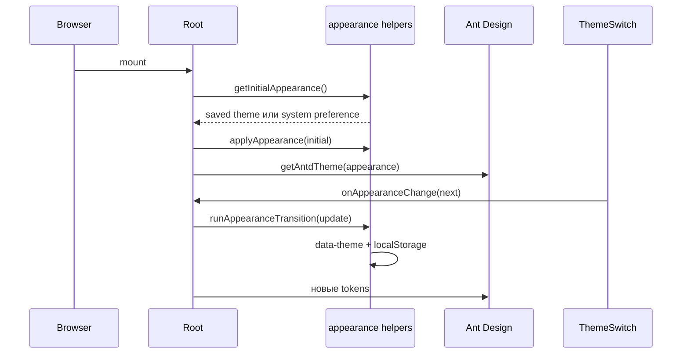

# Тема и компоненты оболочки

::: tip Статус: проверено по коду
Страница сверена с `src/index.js`, appearance helpers, header/footer,
`ThemeSwitch`, `ModeToggle` и тестом header badge.
:::

## Зачем нужен этот слой

Оболочка задаёт одинаковую тему, навигацию, контакты и действия аккаунта для
landing, каталога и корзины. Владелец appearance находится выше Router и
доменных Context: благодаря этому Ant Design tokens, DOM-атрибут и все страницы
переключаются как одно дерево.

Подробный порядок всех Provider описан в
[дереве frontend Provider](/02-architecture/frontend-provider-tree). Здесь
разобраны только визуальные обязанности оболочки.

## Исходные файлы

| Файл | Ответственность |
| --- | --- |
| `src/index.js` | `Root`, состояние appearance, Ant Design Provider |
| `src/theme/appearance.js` | initial value, DOM/localStorage, theme config |
| `src/components/SiteHeader/SiteHeader.jsx` | бренд, nav, auth, badge, theme |
| `src/components/SiteFooter/SiteFooter.jsx` | nav, контакты, account action |
| `src/components/shared/ThemeSwitch/ThemeSwitch.jsx` | доступный переключатель темы |
| `src/components/ModeToggle/ModeToggle.jsx` | плавающий переключатель manager/client |
| `src/components/shared/HoverTooltip.jsx` | controlled tooltip только по hover |

## Поток appearance

### Выбор начального значения

`getInitialAppearance()` принимает только сохранённые `light` и `dark` из
`localStorage['ivanor-appearance']`. Если ключа нет или storage недоступен,
проверяется `prefers-color-scheme: dark`; окончательный fallback — `light`.

До React inline-скрипт в `public/index.html` применяет сохранённую тему, чтобы
уменьшить вспышку неправильных цветов. `Root` затем повторяет нормализацию и
становится владельцем React state.

### Применение

`applyAppearance(appearance)`:

1. вызывает `document.documentElement.setAttribute('data-theme', appearance)`;
2. best-effort записывает значение в localStorage;
3. не бросает ошибку наружу при недоступном storage.

`runAppearanceTransition` сейчас выполняет update немедленно и возвращает
resolved Promise. **View Transitions и глобальная анимация цветов не
используются**: комментарий в коде фиксирует, что они вызывали рассинхронизацию
границ, иконок и Ant Design tokens.

### Ant Design

`Root` передаёт в `ConfigProvider` русскую locale, алгоритм light/dark,
проектные tokens и class `app-tooltip`. Вложенный `AntdApp component={false}`
создаёт контекст notification/message/modal без дополнительного DOM-wrapper.
Notification настроен на верхний правый угол и не более трёх сообщений.

## `ThemeSwitch`

**Props:** `appearance = 'light'`, `onAppearanceChange`, `disabled = false`.

Компонент рендерит тихую icon-кнопку в utility-ряду хедера (`role="switch"`,
`aria-checked`, label следующего действия). Визуал — outline sun/moon
(`currentColor`, без цветного трека и без сцены Uiverse). После клика он:

1. вычисляет противоположное appearance;
2. ставит локальный `isPending`;
3. вызывает callback;
4. на 500 ms блокирует повторный клик (pending-lock), пока идёт короткая
   смена иконки;
5. очищает timeout при unmount.

Эти 500 ms относятся только к pending-lock визуального switch. Сама тема
документа применяется сразу. `prefers-reduced-motion` отключает scale/blur
кроссфейда иконок.

Кнопки верхней полки `SiteHeader` (телефон, «Войти»/«Выйти», «Корзина»)
делят с переключателем одну шкалу: 14px / 600, `$color-text-muted` → hover
`$color-text`, иконка ~16px слева от подписи на одной линии; на узкой ширине
подписи скрываются, остаётся icon-only с `aria-label`.

## Header и footer

### `SiteHeader({ appearance, onAppearanceChange })`

- `useAuth` определяет кнопку «Войти»/«Выйти» на маркетинговых и staff URL;
- на `/demo*` «Войти» и «Выйти» скрыты (`isDemoPath`); login modal с демо не открывается;
- `useCart` показывает badge только когда одновременно готовы workspace и cart;
- badge ограничивает визуальный текст значением `99+`, но accessible label
  содержит фактическое количество;
- `loginLinkTarget(location)` сохраняет безопасный post-login return path;
- `handleBrandClick` сбрасывает поисковые панели и ведёт staff на `/tyres`, гостя на `/`, демо на `/demo/tyres`;
- disabled пункты `SITE_NAV_ITEMS` показываются как «Скоро»;
- category nav (`site-header__nav-list`) — горизонтальный overflow без видимого
  scrollbar: на touch — swipe, на desktop — wheel→горизонталь, soft edge-fade и
  стрелки только при `(hover: hover) and (pointer: fine)` и реальном overflow;
  активный пункт и focus прокручиваются в видимую зону (`useSiteHeaderNavScroll`).

`SiteHeader.test.jsx` подтверждает важный readiness-инвариант badge: старое
количество нельзя показывать до загрузки корзины текущего workspace.

### `SiteFooter`

Footer использует те же nav/contact constants, поэтому телефон и подписи не
дублируются. Для гостя вне демо отображается вход через query-modal target, для staff —
disabled «Личный кабинет» со статусом «Скоро». На `/demo*` кнопок входа и выхода нет. Внешняя ссылка разработчика
открывается с `noopener noreferrer nofollow`. `SiteFooter.test.jsx` проверяет скрытие «Войти»/«Выйти» на demo-path.

## `ModeToggle`

Компонент монтируется в `document.body` через portal для доступного app UI (`AppFrame`), включая `/demo*`. Он читает `clientMode` из AppShell, переключает режим Ant
Design `Switch` и позволяет перетаскивать панель:

- позиция ограничивается viewport;
- движение начинается после порога 5 px, чтобы не превратить click в drag;
- DOM-позиция во время drag обновляется через `requestAnimationFrame`;
- относительная позиция хранится в `ivanor.mode-toggle.position`;
- legacy `ivanor-sidebar-position` читается один раз и удаляется при новой
  записи;
- listeners, RAF и timers очищаются при завершении/unmount.

Смысл client mode и скрываемые поля разобраны на странице
[Корзина и режим клиента](/10-ui/basket-and-client-mode).

## Ошибки и ограничения

- Ошибки localStorage темы и позиции проглатываются с безопасным fallback.
- Нет отдельного unit-теста `Root`, `ThemeSwitch`, `SiteFooter` и drag-логики
  `ModeToggle`; интеграция Ant Design tokens также не покрыта тестом.
- Системная тема читается только при инициализации: подписки на последующее
  изменение `prefers-color-scheme` нет.
- Disabled nav и «Личный кабинет» не являются скрытыми active routes: это явно неготовые элементы интерфейса. Кнопка «Посмотреть демо» на лендинге — active, ведёт на `/demo`.

## Связанные страницы

- [Дерево frontend Provider](/02-architecture/frontend-provider-tree)
- [Маршруты и окно входа](/03-routing-shell/routes-and-login-modal)
- [Состояние AppShell](/03-routing-shell/app-shell-state)
- [Корзина и режим клиента](/10-ui/basket-and-client-mode)
- [ADR-005: Ant Design](/adr/005-ant-design-ui)
- [ADR-009: публичное демо](/adr/009-demo-url-frozen-snapshot)
