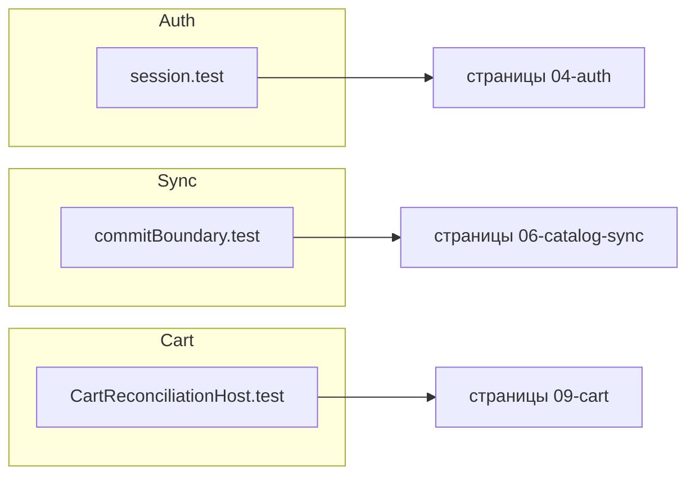

# Каталог проверяемых контрактов

::: tip Статус: проверено по коду
Связь инвариантов → тестов → учебных страниц.
:::

## Auth

| Инвариант | Тест | Страница |
| --- | --- | --- |
| HMAC login совпадает с verifier | `crypto.test.js`, `session.test.js` | [Client auth](/04-auth/client-auth-model) |
| wrap/unwrap привязан к fingerprint | `crypto.test.js` | [Session crypto](/04-auth/session-crypto-workspace) |
| restore отклоняет invalid verifier | `session.test.js` | [Races](/04-auth/races-and-logout) |
| generation guard при signIn | `AuthContext.test.jsx` | [Races](/04-auth/races-and-logout) |
| logout flush/detach корзины | `useLogout.cartPolicy.test.jsx` | [Races](/04-auth/races-and-logout) |
| storeId из env map | `workspace.test.js` | [Session crypto](/04-auth/session-crypto-workspace) |

## Routing

| Инвариант | Тест | Страница |
| --- | --- | --- |
| open redirect blocked | `paths.test.js` | [Routes](/03-routing-shell/routes-and-login-modal) |
| RequireAuth → login query | `App.routing.test.jsx` | [Routes](/03-routing-shell/routes-and-login-modal) |
| guest `/demo*` без login; unmatched → `/demo/tyres` | `App.routing.test.jsx`, `paths.test.js` | [Routes](/03-routing-shell/routes-and-login-modal), [ADR-009](/adr/009-demo-url-frozen-snapshot) |
| `isDemo` от pathname, не env | `appMode.test.js` | [AppShell](/03-routing-shell/app-shell-state) |
| dual-mount hidden/inert | `App.catalogDualMount.test.jsx` | [Dual-mount](/03-routing-shell/dual-mount-catalog) |

## Catalog sync & IDB

| Инвариант | Тест | Страница |
| --- | --- | --- |
| version gate skip old snapshot | `catalogSyncService.test.js` | [Autosync](/06-catalog-sync/frontend-autosync) |
| atomic single transaction apply | `catalogSyncService.commitBoundary.test.js`, `fakeIndexedDB.test.js` | [Lifecycle IDB](/05-catalog-storage/lifecycle-and-migration) |
| wire validation fatal/warning | `catalogSnapshotValidation.test.js` | [Snapshot protocol](/06-catalog-sync/snapshot-protocol-validation) |
| replace/keepPrevious/purge | `snapshotCommands.test.js` | [Snapshot protocol](/06-catalog-sync/snapshot-protocol-validation) |
| lock lease fallback | `catalogSyncLock.test.js`, `catalogSyncLock.integration.test.js` | [Locks](/06-catalog-sync/locks-and-channels) |
| demo frozen snapshot, без live `/meta` | `demoCatalogService.test.js`, `DemoCatalogHost.test.jsx`, `CatalogSyncHost.test.jsx` | [Autosync](/06-catalog-sync/frontend-autosync) |
| index hint + post-filter | `catalogIdbQueries.test.js`, `searchFilters.test.js` | [Queries](/05-catalog-storage/queries-filters-facets) |

## Search & showcase

| Инвариант | Тест | Страница |
| --- | --- | --- |
| stale search result discarded | `*searchRace.test.jsx` | [Race guards](/08-search-showcase/async-race-guards) |
| form → filters mapping | `searchFormFilters.test.js` | [Tire search](/08-search-showcase/tire-and-disc-search) |
| связанные Select «от/до» дисков | `filterDiscRangeSelectOptions.test.js`, `DiscsSearchParameters.rangeSelect.test.jsx` | [Поиск дисков](/08-search-showcase/tire-and-disc-search) |
| stacked/sidebar бренд — sheet + «Готово», без сабмита по Enter | `TiresSearchParameters.brandFilter.test.jsx`, `DiscsSearchParameters.brandFilter.test.jsx` | [Поиск шин и дисков](/08-search-showcase/tire-and-disc-search) |
| stacked ≤768: кнопка «Фильтры», та же форма, «Найти» закрывает панель без scrollIntoView | `TiresSearchParameters.mobileFilters.test.jsx`, `DiscsSearchParameters.mobileFilters.test.jsx` | [Поиск шин и дисков](/08-search-showcase/tire-and-disc-search) |
| Select popup не скроллит страницу/sidebar-форму на ширине < 1100px | `catalogSelectPopupScrollLock.test.js` | [Поиск шин и дисков](/08-search-showcase/tire-and-disc-search) |
| seeded shuffle stable per version | `showcaseSeed.test.js` | [Showcase](/08-search-showcase/showcase-selection) |
| tire vs disc showcase differ | `buildTire/DiscShowcase.test.js` | [Showcase](/08-search-showcase/showcase-selection) |

## Cart

| Инвариант | Тест | Страница |
| --- | --- | --- |
| envelope v3 parse/write | `cartStorage.test.js` | [Cart domain](/09-cart/cart-domain-and-storage) |
| reconcile updates/removes | `cartUtils.test.js` | [Reconciliation](/09-cart/catalog-reconciliation) |
| multitab sync | `cartSync.test.js` | [Migration tabs](/09-cart/migration-and-multitab) |
| post-snapshot reconcile host | `CartReconciliationHost.test.jsx` | [Reconciliation](/09-cart/catalog-reconciliation) |
| legacy migration | `legacyCartMigration.test.js` | [Migration](/09-cart/migration-and-multitab) |

## Traceability graph

## Связанные страницы

- [Стратегия](/11-testing/test-strategy)
- [Тестовые наборы](/13-code-reference/test-suites)
