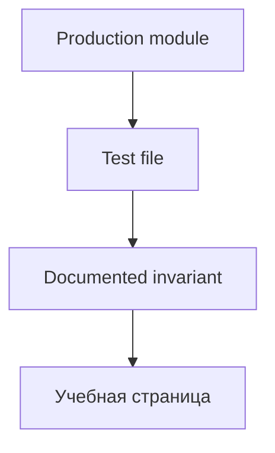

# Стратегия тестирования

::: tip Статус: проверено по коду
Jest + Testing Library + fake-indexeddb. Cloud tests отдельно.
:::

## Команды

```bash
npm test          # watch mode
npm run test:ci   # single run (CI)
```

## Уровни

| Уровень | Что тестируем | Инструменты |
| --- | --- | --- |
| Unit (pure) | crypto, cartUtils, searchFormFilters, scoring | Jest |
| Service | IDB queries, snapshot validation, sync version gate | Jest + fake-indexeddb |
| Integration | AuthProvider, CartContext, CatalogSyncHost, dual-mount | Testing Library |
| Component race | SearchParameters stale guards | RTL + fake timers |
| Cloud | snapshotCommands | Jest в `yandex/catalog-sync` |

## Setup

`src/setupTests.js`:

- `@testing-library/jest-dom`
- fake-indexeddb polyfill где нужно

## Mocks и фикстуры

| Область | Подход |
| --- | --- |
| IndexedDB | `fake-indexeddb` в service tests |
| fetch | `global.fetch` mock в sync tests |
| Web Locks / BroadcastChannel | partial mocks в lock/channel tests |
| Web Crypto | реальный subtle crypto в Node 18+ |

## Что считать контрактом

- Поведение **production-модуля**, подтверждённое тестом, импортирующим этот модуль.
- **Не контракт:** `catalogRevalidation.test.js` — локальная копия алгоритма.

## CI

`.github/workflows/test.yml` — `npm run test:ci` на push/PR.

## Пробелы покрытия

- `supplier-proxy` — без unit tests
- transformers — без golden fixtures
- `AppShellProvider` — без прямого unit test
- cloud suite не в корневом `npm test`

## Traceability

Полная карта файлов: [Тестовые наборы](/13-code-reference/test-suites).  
Инварианты по подсистемам: [Каталог контрактов](/11-testing/contract-catalog).



## Связанные страницы

- [Тестовые наборы](/13-code-reference/test-suites)
- [Каталог контрактов](/11-testing/contract-catalog)
- [Troubleshooting](/14-development/troubleshooting)
