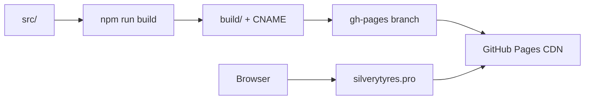

# GitHub Pages

::: tip Статус: проверено по коду
SPA на CRA + gh-pages. Отдельно от VitePress docs. Production URL — кастомный домен.
:::

## URL и basename

`package.json`:

```json
"homepage": "https://silverytyres.pro"
```

`ROUTER_BASENAME` = `PUBLIC_URL` без trailing slash → пустая строка (корень домена).

React Router: `BrowserRouter basename={ROUTER_BASENAME}`.

Исторический project URL `https://iscander-b10.github.io/tyres_discs` может открываться как запасной путь GitHub; канонический адрес — `https://silverytyres.pro`.

## Custom domain и CNAME

Файл [`public/CNAME`](https://github.com/iscander-b10/tyres_discs/blob/main/public/CNAME) содержит `silverytyres.pro` и копируется в `build/` при CRA build.

Без этого файла каждый `npm run deploy` (`gh-pages -d build`) затирает `CNAME` на ветке `gh-pages`, и GitHub отвечает «There isn't a GitHub Pages site here» на кастомном домене.

В Settings → Pages должен быть указан Custom domain `silverytyres.pro` (DNS A/AAAA/CNAME у регистратора → GitHub Pages).

## Deploy pipeline

```bash
npm run deploy
```

| Шаг | Действие |
| --- | --- |
| `predeploy` | `npm run build` |
| | copy `build/index.html` → `build/404.html` (SPA fallback) |
| | write `build/.nojekyll` |
| `deploy` | `gh-pages -d build` (включая `CNAME` из `public/`) |

## SPA fallback

GitHub Pages отдаёт `404.html` на неизвестные пути. Копия `index.html` позволяет client-side routing работать при прямом открытии `/tyres`, `/demo`, `/demo/wheels`.

## Отличие от документации

| | Приложение | Docs |
| --- | --- | --- |
| Tool | CRA | VitePress |
| Deploy | `npm run deploy` → gh-pages | локально / отдельный hosting |
| URL | `https://silverytyres.pro` | не на GitHub Pages repo |

## Production env

Build-time `REACT_APP_*` должны быть заданы **до** `npm run build` на машине CI или локально. Секреты upstream — в env, не в repo.

## Диаграмма



## Связанные страницы

- [Сборка](/01-getting-started/dev-production-deploy)
- [ADR: GitHub Pages](/adr/004-github-pages-spa)
- [ADR-009: публичное демо](/adr/009-demo-url-frozen-snapshot)
- [Конфигурация](/01-getting-started/configuration)
