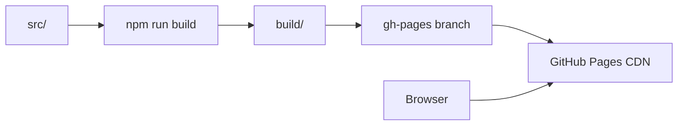

# GitHub Pages

::: tip Статус: проверено по коду
SPA на CRA + gh-pages. Отдельно от VitePress docs.
:::

## URL и basename

`package.json`:

```json
"homepage": "https://iscander-b10.github.io/tyres_discs"
```

`ROUTER_BASENAME` = `PUBLIC_URL` без trailing slash → `/tyres_discs`.

React Router: `BrowserRouter basename={ROUTER_BASENAME}`.

## Deploy pipeline

```bash
npm run deploy
```

| Шаг | Действие |
| --- | --- |
| `predeploy` | `npm run build` |
| | copy `build/index.html` → `build/404.html` (SPA fallback) |
| | write `build/.nojekyll` |
| `deploy` | `gh-pages -d build` |

## SPA fallback

GitHub Pages отдаёт `404.html` на неизвестные пути. Копия `index.html` позволяет client-side routing работать при прямом открытии `/tyres_discs/tyres`.

## Отличие от документации

| | Приложение | Docs |
| --- | --- | --- |
| Tool | CRA | VitePress |
| Deploy | `npm run deploy` → gh-pages | локально / отдельный hosting |
| URL | `/tyres_discs` | не на GitHub Pages repo |

## Production env

Build-time `REACT_APP_*` должны быть заданы **до** `npm run build` на машине CI или локально. Секреты upstream — в env, не в repo.

## Диаграмма



## Связанные страницы

- [Сборка](/01-getting-started/dev-production-deploy)
- [ADR: GitHub Pages](/adr/004-github-pages-spa)
- [Конфигурация](/01-getting-started/configuration)
